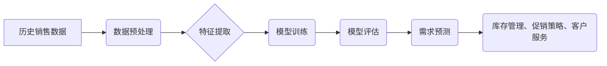

> 需求预测、电商平台、机器学习、深度学习、时间序列分析、推荐系统

## 1. 背景介绍

随着电商平台的蓬勃发展，商品需求预测已成为电商平台运营的核心环节之一。准确的预测能够帮助电商平台优化库存管理、制定合理的促销策略、提高客户满意度，最终提升整体盈利能力。传统的需求预测方法主要依赖于历史销售数据和专家经验，但随着数据量的激增和需求模式的复杂化，传统的预测方法逐渐难以满足电商平台的需求。

近年来，人工智能（AI）技术在各个领域取得了突破性进展，特别是机器学习和深度学习算法在数据分析和预测方面展现出强大的潜力。AI技术为电商平台需求预测提供了新的思路和方法，能够更准确、更有效地预测商品需求。

## 2. 核心概念与联系

**2.1 需求预测概述**

需求预测是指根据历史数据、市场趋势和外部因素等信息，预测未来一段时间内商品的需求量。需求预测是电商平台运营的重要环节，能够帮助平台优化库存管理、制定合理的促销策略、提高客户满意度，最终提升整体盈利能力。

**2.2 AI技术在需求预测中的应用**

AI技术，特别是机器学习和深度学习算法，能够从海量数据中提取特征，建立预测模型，从而实现对商品需求的准确预测。

**2.3 核心概念与联系**

* **机器学习:** 一种人工智能技术，通过算法学习数据中的模式，并根据学习到的模式对新数据进行预测。
* **深度学习:** 一种机器学习的子集，使用多层神经网络来模拟人类大脑的学习过程，能够处理更复杂的数据和任务。
* **时间序列分析:** 一种统计方法，用于分析时间序列数据，例如销售数据、天气数据等，并预测未来趋势。
* **推荐系统:** 一种基于用户行为和商品特征的系统，能够推荐用户可能感兴趣的商品。

**2.4 架构图**



## 3. 核心算法原理 & 具体操作步骤

**3.1 算法原理概述**

在电商平台需求预测中，常用的算法包括：

* **线性回归:** 一种简单易懂的回归算法，用于预测连续变量。
* **支持向量机 (SVM):** 一种分类算法，可以用于预测离散变量，例如商品是否会售罄。
* **决策树:** 一种树形结构的算法，可以用于分类和回归任务。
* **随机森林:** 一种集成学习算法，通过多个决策树的投票来进行预测。
* **神经网络:** 一种深度学习算法，能够处理更复杂的数据和任务。

**3.2 算法步骤详解**

以线性回归为例，其步骤如下：

1. **数据收集:** 收集历史销售数据，包括商品ID、日期、销售量等信息。
2. **数据预处理:** 对数据进行清洗、转换和特征工程，例如处理缺失值、归一化数据、提取特征等。
3. **模型训练:** 使用训练数据训练线性回归模型，找到最佳的模型参数。
4. **模型评估:** 使用测试数据评估模型的性能，例如使用均方误差 (MSE) 或 R-squared 来衡量模型的准确性。
5. **需求预测:** 使用训练好的模型对未来一段时间内的商品需求进行预测。

**3.3 算法优缺点**

* **线性回归:** 优点：简单易懂，计算速度快。缺点：假设数据服从线性关系，对非线性关系的预测能力较弱。
* **支持向量机 (SVM):** 优点：能够处理高维数据，对非线性关系的预测能力较强。缺点：训练时间较长，参数选择较复杂。
* **决策树:** 优点：易于理解和解释，能够处理分类和回归任务。缺点：容易过拟合，预测结果可能不稳定。
* **随机森林:** 优点：能够提高模型的准确性，减少过拟合。缺点：训练时间较长，解释性较差。
* **神经网络:** 优点：能够处理更复杂的数据和任务，预测能力较强。缺点：训练时间较长，参数选择较复杂，解释性较差。

**3.4 算法应用领域**

* **电商平台:** 商品需求预测、库存管理、促销策略制定。
* **金融行业:** 贷款风险评估、信用评分、投资预测。
* **医疗行业:** 疾病诊断、患者风险预测、药物研发。
* **制造业:** 产品需求预测、生产计划优化、库存管理。

## 4. 数学模型和公式 & 详细讲解 & 举例说明

**4.1 数学模型构建**

线性回归模型的数学表达式为：

$$
y = \beta_0 + \beta_1x_1 + \beta_2x_2 + ... + \beta_nx_n + \epsilon
$$

其中：

* $y$ 是预测变量，例如商品需求量。
* $x_1, x_2, ..., x_n$ 是自变量，例如商品价格、时间、季节等。
* $\beta_0, \beta_1, ..., \beta_n$ 是模型参数，需要通过训练数据进行估计。
* $\epsilon$ 是误差项，代表预测值与实际值的偏差。

**4.2 公式推导过程**

线性回归模型的目标是找到最佳的模型参数，使得预测值与实际值之间的误差最小。常用的误差函数是均方误差 (MSE)，其表达式为：

$$
MSE = \frac{1}{n} \sum_{i=1}^{n} (y_i - \hat{y}_i)^2
$$

其中：

* $n$ 是样本数量。
* $y_i$ 是第 $i$ 个样本的实际值。
* $\hat{y}_i$ 是第 $i$ 个样本的预测值。

通过最小化 MSE，可以得到最佳的模型参数。

**4.3 案例分析与讲解**

假设我们想要预测某商品在未来一周的需求量。我们可以收集该商品过去一周的销售数据，以及其他相关因素，例如价格、时间、季节等。然后，我们可以使用线性回归模型对这些数据进行训练，得到最佳的模型参数。最后，我们可以使用训练好的模型对未来一周的需求量进行预测。

## 5. 项目实践：代码实例和详细解释说明

**5.1 开发环境搭建**

* Python 3.x
* Jupyter Notebook
* pandas
* scikit-learn

**5.2 源代码详细实现**

```python
import pandas as pd
from sklearn.linear_model import LinearRegression
from sklearn.model_selection import train_test_split

# 加载数据
data = pd.read_csv('sales_data.csv')

# 数据预处理
# ...

# 特征选择
X = data[['price', 'time', 'season']]
y = data['demand']

# 数据分割
X_train, X_test, y_train, y_test = train_test_split(X, y, test_size=0.2, random_state=42)

# 模型训练
model = LinearRegression()
model.fit(X_train, y_train)

# 模型评估
y_pred = model.predict(X_test)
# ...

# 需求预测
# ...
```

**5.3 代码解读与分析**

* 数据加载和预处理：使用 pandas 库加载数据，并进行必要的预处理，例如处理缺失值、归一化数据等。
* 特征选择：选择与商品需求相关的特征，例如价格、时间、季节等。
* 数据分割：将数据分为训练集和测试集，用于模型训练和评估。
* 模型训练：使用 LinearRegression 模型对训练数据进行训练，得到最佳的模型参数。
* 模型评估：使用测试数据评估模型的性能，例如使用均方误差 (MSE) 或 R-squared 来衡量模型的准确性。
* 需求预测：使用训练好的模型对未来一段时间内的商品需求进行预测。

**5.4 运行结果展示**

* 模型评估结果，例如 MSE 和 R-squared 值。
* 预测结果，例如未来一周的商品需求量预测值。

## 6. 实际应用场景

**6.1 库存管理**

* 通过对商品需求的准确预测，电商平台可以优化库存管理，避免库存积压或缺货。
* 例如，如果预测某个商品的需求量会大幅增加，平台可以提前增加库存，以满足客户需求。

**6.2 促销策略制定**

* 预测商品需求可以帮助电商平台制定更有效的促销策略。
* 例如，平台可以根据预测结果，选择在需求量高的时期进行促销活动，以提高销售额。

**6.3 客户服务**

* 预测商品需求可以帮助电商平台更好地了解客户需求，提供更个性化的服务。
* 例如，平台可以根据预测结果，向客户推荐他们可能感兴趣的商品。

**6.4 未来应用展望**

* **个性化需求预测:** 基于用户的购买历史、浏览记录等信息，对用户的需求进行个性化预测。
* **多因素融合预测:** 将更多因素，例如天气、节日、社会热点等，融合到需求预测模型中，提高预测精度。
* **实时需求预测:** 利用实时数据流，实现对商品需求的实时预测，帮助平台快速响应市场变化。

## 7. 工具和资源推荐

**7.1 学习资源推荐**

* **书籍:**
    * 《Python机器学习》
    * 《深度学习》
* **在线课程:**
    * Coursera: 机器学习
    * edX: 深度学习
* **博客和网站:**
    * Towards Data Science
    * Machine Learning Mastery

**7.2 开发工具推荐**

* **Python:** 
    * pandas
    * scikit-learn
    * TensorFlow
    * PyTorch
* **Jupyter Notebook:** 用于代码编写和可视化。

**7.3 相关论文推荐**

* **《基于深度学习的电商平台商品需求预测》**
* **《时间序列分析在电商平台需求预测中的应用》**

## 8. 总结：未来发展趋势与挑战

**8.1 研究成果总结**

AI技术在电商平台需求预测领域取得了显著进展，能够提高预测精度，帮助平台优化运营。

**8.2 未来发展趋势**

* **模型精度提升:** 研究更先进的算法和模型，提高预测精度。
* **数据融合:** 将更多数据类型融合到预测模型中，例如用户行为数据、市场趋势数据等。
* **个性化预测:** 基于用户的个性化需求，进行更精准的预测。

**8.3 面临的挑战**

* **数据质量:** 预测模型的精度依赖于数据质量，需要不断提高数据采集、清洗和处理的效率。
* **模型解释性:** 深度学习模型的解释性较差，需要研究更易于理解的模型。
* **实时性:** 需要开发更快速的预测模型，能够实时响应市场变化。

**8.4 研究展望**

未来，AI技术在电商平台需求预测领域将继续发挥重要作用，并不断推动电商平台的智能化发展。


## 9. 附录：常见问题与解答

* **Q1: 如何选择合适的预测模型？**

* **A1:** 选择合适的预测模型需要根据具体的数据特点和需求进行选择。例如，如果数据服从线性关系，可以使用线性回归模型；如果数据具有非线性关系，可以使用支持向量机或神经网络模型。

* **Q2: 如何评估预测模型的性能？**

* **A2:** 可以使用均方误差 (MSE)、R-squared 等指标来评估预测模型的性能。

* **Q3: 如何处理缺失数据？**

* **A3:** 可以使用多种方法处理缺失数据，例如平均值填充、线性插值等。

* **Q4: 如何提高预测模型的精度？**

* **A4:** 可以尝试使用更先进的算法和