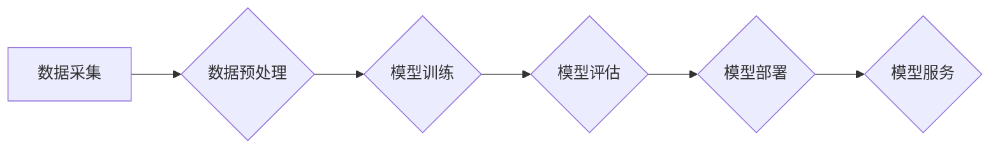

> AI大模型、创业、挑战、机遇、技术趋势、商业模式、伦理问题

## 1. 背景介绍

近年来，人工智能（AI）技术突飞猛进，特别是大模型的出现，为各行各业带来了前所未有的机遇。大模型是指参数规模庞大、训练数据海量的人工智能模型，具备强大的泛化能力和学习能力，能够在自然语言处理、计算机视觉、语音识别等领域取得突破性进展。

随着大模型技术的成熟，越来越多的创业者看到了其中的商机，涌入AI大模型创业领域。然而，创业之路并非一帆风顺，AI大模型创业也面临着诸多挑战。

## 2. 核心概念与联系

**2.1 AI大模型概述**

AI大模型是指参数规模庞大、训练数据海量的人工智能模型，其核心特点包括：

* **规模化：** 大模型拥有数亿甚至数十亿个参数，远超传统机器学习模型。
* **泛化能力强：** 由于训练数据量大，大模型能够更好地泛化到未知数据，表现出更强的学习能力。
* **多任务学习：** 大模型可以同时学习多个任务，例如文本生成、图像识别、语音合成等。

**2.2 核心技术架构**

大模型的训练和应用通常基于以下核心技术架构：



**2.3 关键技术与联系**

* **深度学习：** 大模型的核心技术是深度学习，通过多层神经网络结构，模拟人类大脑的学习机制。
* **Transformer：** Transformer是一种新型的神经网络架构，能够有效处理序列数据，是近年来大模型发展的重要推动力量。
* **分布式训练：** 由于大模型参数规模庞大，需要采用分布式训练技术，将模型参数和数据分布到多个计算节点上进行并行训练。

## 3. 核心算法原理 & 具体操作步骤

**3.1 算法原理概述**

大模型的训练主要基于深度学习算法，例如Transformer模型。Transformer模型的核心思想是利用注意力机制，能够捕捉序列数据中的长距离依赖关系，从而提高模型的理解和生成能力。

**3.2 算法步骤详解**

1. **数据预处理：** 将原始数据进行清洗、格式化、编码等操作，使其能够被模型理解。
2. **模型构建：** 根据任务需求，选择合适的深度学习模型架构，例如Transformer模型。
3. **模型训练：** 使用训练数据，通过反向传播算法，调整模型参数，使模型能够准确地预测或生成目标输出。
4. **模型评估：** 使用测试数据，评估模型的性能，例如准确率、召回率、F1-score等。
5. **模型部署：** 将训练好的模型部署到生产环境中，用于实际应用。

**3.3 算法优缺点**

* **优点：** 泛化能力强、学习能力强、多任务学习能力强。
* **缺点：** 训练成本高、数据依赖性强、解释性差。

**3.4 算法应用领域**

* 自然语言处理：文本生成、机器翻译、问答系统、情感分析等。
* 计算机视觉：图像识别、目标检测、图像分割等。
* 语音识别：语音转文本、语音合成等。

## 4. 数学模型和公式 & 详细讲解 & 举例说明

**4.1 数学模型构建**

大模型的训练过程可以看作是一个优化问题，目标是找到最优的参数，使得模型的预测或生成结果与真实值之间的误差最小。

**4.2 公式推导过程**

常用的损失函数包括均方误差（MSE）、交叉熵损失（Cross-Entropy Loss）等。

* **均方误差（MSE）：**

$$MSE = \frac{1}{N} \sum_{i=1}^{N} (y_i - \hat{y}_i)^2$$

其中，$y_i$为真实值，$\hat{y}_i$为模型预测值，$N$为样本数量。

* **交叉熵损失（Cross-Entropy Loss）：**

$$Cross-Entropy Loss = -\sum_{i=1}^{N} y_i \log(\hat{y}_i)$$

其中，$y_i$为真实值，$\hat{y}_i$为模型预测值。

**4.3 案例分析与讲解**

例如，在文本生成任务中，可以使用交叉熵损失函数来评估模型的生成结果与真实文本之间的差异。

## 5. 项目实践：代码实例和详细解释说明

**5.1 开发环境搭建**

* 操作系统：Linux
* Python版本：3.7+
* 深度学习框架：TensorFlow或PyTorch

**5.2 源代码详细实现**

```python
import tensorflow as tf

# 定义模型结构
model = tf.keras.Sequential([
    tf.keras.layers.Embedding(input_dim=vocab_size, output_dim=embedding_dim),
    tf.keras.layers.LSTM(units=hidden_size),
    tf.keras.layers.Dense(units=vocab_size, activation='softmax')
])

# 编译模型
model.compile(optimizer='adam', loss='sparse_categorical_crossentropy', metrics=['accuracy'])

# 训练模型
model.fit(x_train, y_train, epochs=10)

# 评估模型
loss, accuracy = model.evaluate(x_test, y_test)
print('Loss:', loss)
print('Accuracy:', accuracy)
```

**5.3 代码解读与分析**

* **Embedding层：** 将单词映射到低维向量空间。
* **LSTM层：** 用于处理序列数据，捕捉文本中的长距离依赖关系。
* **Dense层：** 全连接层，用于预测下一个单词。
* **softmax激活函数：** 将预测结果转换为概率分布。

**5.4 运行结果展示**

训练完成后，可以将模型应用于文本生成任务，例如生成诗歌、小说等。

## 6. 实际应用场景

**6.1 自然语言处理**

* **机器翻译：** 将一种语言翻译成另一种语言。
* **问答系统：** 能够理解用户的问题，并给出准确的答案。
* **文本摘要：** 自动生成文本的简短摘要。

**6.2 计算机视觉**

* **图像识别：** 将图像分类到不同的类别。
* **目标检测：** 在图像中识别和定位目标物体。
* **图像分割：** 将图像分割成不同的区域。

**6.3 语音识别**

* **语音转文本：** 将语音转换为文本。
* **语音合成：** 将文本转换为语音。

**6.4 未来应用展望**

* **个性化教育：** 根据学生的学习情况，提供个性化的学习内容和辅导。
* **医疗诊断：** 辅助医生进行疾病诊断和治疗方案制定。
* **自动驾驶：** 帮助车辆理解周围环境，并做出安全驾驶决策。

## 7. 工具和资源推荐

**7.1 学习资源推荐**

* **书籍：**
    * 《深度学习》
    * 《自然语言处理》
* **在线课程：**
    * Coursera
    * edX
    * fast.ai

**7.2 开发工具推荐**

* **深度学习框架：** TensorFlow、PyTorch
* **编程语言：** Python
* **云计算平台：** AWS、Google Cloud、Azure

**7.3 相关论文推荐**

* **Transformer：** Attention Is All You Need
* **BERT：** BERT: Pre-training of Deep Bidirectional Transformers for Language Understanding

## 8. 总结：未来发展趋势与挑战

**8.1 研究成果总结**

近年来，AI大模型取得了显著进展，在多个领域展现出强大的应用潜力。

**8.2 未来发展趋势**

* **模型规模进一步扩大：** 随着计算能力的提升，模型参数规模将继续扩大，模型性能将进一步提升。
* **多模态学习：** 将文本、图像、音频等多种模态数据融合在一起，构建更强大的多模态模型。
* **可解释性增强：** 研究如何提高AI模型的解释性，使其决策过程更加透明可理解。

**8.3 面临的挑战**

* **数据安全和隐私保护：** 大模型的训练需要海量数据，如何保证数据安全和隐私保护是一个重要挑战。
* **算法偏见：** 大模型可能存在算法偏见，导致不公平的结果，需要采取措施 mitigate 偏见。
* **伦理问题：** AI大模型的应用可能引发伦理问题，例如自动决策、工作替代等，需要进行深入探讨和规范。

**8.4 研究展望**

未来，AI大模型研究将继续朝着更强大、更安全、更可解释的方向发展，为人类社会带来更多福祉。

## 9. 附录：常见问题与解答

**9.1 如何选择合适的AI大模型？**

选择合适的AI大模型需要根据具体的应用场景和需求进行考虑，例如模型规模、性能、适用领域等。

**9.2 如何训练自己的AI大模型？**

训练自己的AI大模型需要具备一定的技术基础，包括深度学习、数据处理、模型训练等方面的知识。

**9.3 如何解决AI大模型的偏见问题？**

可以采用以下方法来解决AI大模型的偏见问题：

* 使用更加公平的数据集进行训练。
* 在模型训练过程中加入公平性约束。
* 对模型的输出进行评估和修正。


作者：禅与计算机程序设计艺术 / Zen and the Art of Computer Programming 
<end_of_turn>