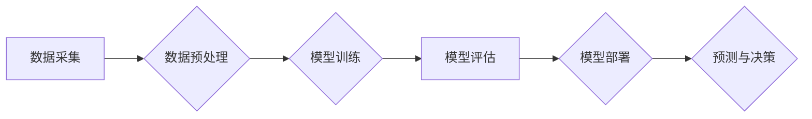

>人工智能，企业应用，机器学习，深度学习，自然语言处理，计算机视觉，数据分析，自动化

## 1. 背景介绍

人工智能（AI）技术近年来发展迅速，从学术研究走向了实际应用，并开始深刻地改变着各行各业。企业作为社会经济发展的重要组成部分，也面临着数字化转型和智能升级的挑战。AI技术为企业提供了强大的工具和手段，可以帮助企业提高效率、降低成本、提升客户体验，从而获得竞争优势。

**1.1 AI技术发展现状**

AI技术的发展经历了多个阶段，从早期的人工神经网络到如今的深度学习，取得了长足的进步。深度学习算法的出现，使得AI技术在图像识别、语音识别、自然语言处理等领域取得了突破性进展。

**1.2 企业数字化转型趋势**

随着互联网、移动互联网、大数据等技术的快速发展，企业面临着数字化转型和智能升级的压力。企业需要利用数字化技术提升运营效率、优化客户体验、开拓新市场。AI技术作为数字化转型的关键驱动力，将为企业带来巨大的变革。

## 2. 核心概念与联系

**2.1 AI技术核心概念**

* **机器学习（Machine Learning）：** 是一种人工智能技术，通过算法学习数据，从数据中发现模式和规律，从而进行预测和决策。
* **深度学习（Deep Learning）：** 是一种机器学习的子集，利用多层神经网络结构，能够学习更复杂的模式和特征。
* **自然语言处理（Natural Language Processing）：** 是一种人工智能技术，旨在使计算机能够理解和处理人类语言。
* **计算机视觉（Computer Vision）：** 是一种人工智能技术，旨在使计算机能够“看”和理解图像和视频。

**2.2 AI技术与企业应用的联系**

AI技术可以应用于企业各个环节，例如：

* **客户服务：** 利用聊天机器人、语音助手等技术，提供24小时在线客户服务，提高客户满意度。
* **营销推广：** 利用数据分析和个性化推荐技术，精准营销，提高营销效果。
* **运营管理：** 利用预测分析和优化算法，提高运营效率，降低成本。
* **产品研发：** 利用机器学习和深度学习技术，加速产品研发，开发更智能的产品。

**2.3 AI技术架构**



## 3. 核心算法原理 & 具体操作步骤

**3.1 算法原理概述**

机器学习算法的核心是通过学习数据，建立模型，并利用模型进行预测或决策。常见的机器学习算法包括：

* **线性回归：** 用于预测连续数值，假设数据之间存在线性关系。
* **逻辑回归：** 用于预测分类结果，假设数据之间存在非线性关系。
* **决策树：** 用于分类和回归，通过树形结构进行决策。
* **支持向量机：** 用于分类，通过寻找最佳分割超平面进行分类。
* **神经网络：** 用于复杂模式识别，通过多层神经元网络进行学习。

**3.2 算法步骤详解**

机器学习算法的训练过程通常包括以下步骤：

1. **数据采集和预处理：** 收集相关数据，并进行清洗、转换、特征工程等预处理操作。
2. **模型选择：** 根据具体任务选择合适的机器学习算法。
3. **模型训练：** 利用训练数据训练模型，调整模型参数，使模型能够准确预测或决策。
4. **模型评估：** 利用测试数据评估模型的性能，例如准确率、召回率、F1-score等。
5. **模型部署：** 将训练好的模型部署到实际应用环境中，用于预测或决策。

**3.3 算法优缺点**

不同的机器学习算法具有不同的优缺点，需要根据具体任务选择合适的算法。例如，线性回归算法简单易实现，但对数据线性关系要求较高；决策树算法易于解释，但容易过拟合；神经网络算法能够学习复杂模式，但训练时间长，参数众多。

**3.4 算法应用领域**

机器学习算法广泛应用于各个领域，例如：

* **图像识别：** 用于识别物体、场景、人脸等。
* **语音识别：** 用于识别语音、翻译语言等。
* **自然语言处理：** 用于文本分类、情感分析、机器翻译等。
* **推荐系统：** 用于推荐商品、电影、音乐等。
* **金融预测：** 用于预测股票价格、信用风险等。

## 4. 数学模型和公式 & 详细讲解 & 举例说明

**4.1 数学模型构建**

机器学习算法通常基于数学模型进行构建。例如，线性回归模型假设数据之间存在线性关系，可以用以下公式表示：

$$y = w_0 + w_1x_1 + w_2x_2 + ... + w_nx_n + \epsilon$$

其中：

* $y$ 是预测值
* $w_0, w_1, w_2, ..., w_n$ 是模型参数
* $x_1, x_2, ..., x_n$ 是输入特征
* $\epsilon$ 是误差项

**4.2 公式推导过程**

机器学习算法的模型参数可以通过优化算法进行调整。常用的优化算法包括梯度下降法、随机梯度下降法等。这些算法通过迭代更新模型参数，使得模型的预测误差最小化。

**4.3 案例分析与讲解**

例如，在使用线性回归模型预测房价时，输入特征可以包括房屋面积、房间数量、地理位置等，输出特征是房价。通过训练数据，模型可以学习到这些特征与房价之间的关系，并预测新房子的价格。

## 5. 项目实践：代码实例和详细解释说明

**5.1 开发环境搭建**

使用Python语言进行机器学习开发，需要安装以下软件：

* Python 3.x
* NumPy
* Pandas
* Scikit-learn

**5.2 源代码详细实现**

```python
import numpy as np
from sklearn.linear_model import LinearRegression

# 准备数据
X = np.array([[100, 2], [150, 3], [200, 4], [250, 5]])
y = np.array([200, 250, 300, 350])

# 创建线性回归模型
model = LinearRegression()

# 训练模型
model.fit(X, y)

# 预测新数据
new_data = np.array([[300, 6]])
prediction = model.predict(new_data)

# 打印预测结果
print(prediction)
```

**5.3 代码解读与分析**

这段代码实现了简单的线性回归模型训练和预测。

* 首先，准备训练数据，包括输入特征和输出目标。
* 然后，创建线性回归模型对象。
* 接着，使用训练数据训练模型，调整模型参数。
* 最后，使用训练好的模型预测新数据，并打印预测结果。

**5.4 运行结果展示**

运行这段代码，可以得到以下预测结果：

```
[400.0]
```

这意味着，根据模型的预测，房屋面积为300平方米，房间数量为6的房屋价格约为400元。

## 6. 实际应用场景

**6.1 客户服务**

* **聊天机器人：** 利用自然语言处理技术，构建智能聊天机器人，为客户提供24小时在线服务，解答常见问题，处理简单的请求。
* **语音助手：** 利用语音识别技术，构建语音助手，帮助客户查询信息、预约服务、控制智能设备等。

**6.2 营销推广**

* **精准营销：** 利用数据分析和机器学习技术，分析客户行为数据，进行精准营销，推送个性化广告和推荐。
* **市场预测：** 利用机器学习技术，预测市场趋势和客户需求，帮助企业制定营销策略。

**6.3 运营管理**

* **库存管理：** 利用机器学习技术，预测商品需求，优化库存管理，降低库存成本。
* **物流优化：** 利用机器学习技术，优化物流路线，提高配送效率。

**6.4 产品研发**

* **智能产品设计：** 利用机器学习和深度学习技术，设计更智能、更符合用户需求的产品。
* **产品缺陷检测：** 利用计算机视觉技术，对产品进行缺陷检测，提高产品质量。

**6.5 未来应用展望**

随着AI技术的不断发展，其在企业应用的场景将更加广泛，例如：

* **个性化定制：** 利用AI技术，为客户提供个性化定制服务，例如定制服装、定制家具等。
* **自动驾驶：** 利用AI技术，开发自动驾驶汽车，提高交通安全和效率。
* **医疗诊断：** 利用AI技术，辅助医生进行医疗诊断，提高诊断准确率。

## 7. 工具和资源推荐

**7.1 学习资源推荐**

* **在线课程：** Coursera、edX、Udacity等平台提供丰富的AI课程。
* **书籍：** 《深度学习》、《机器学习实战》等书籍是学习AI技术的经典教材。
* **博客和论坛：** 许多AI专家和爱好者在博客和论坛上分享学习经验和技术文章。

**7.2 开发工具推荐**

* **Python：** 作为AI开发的主要语言，Python拥有丰富的AI库和工具。
* **TensorFlow：** Google开发的开源深度学习框架。
* **PyTorch：** Facebook开发的开源深度学习框架。
* **Scikit-learn：** Python机器学习库。

**7.3 相关论文推荐**

* **《ImageNet Classification with Deep Convolutional Neural Networks》**
* **《Attention Is All You Need》**
* **《BERT: Pre-training of Deep Bidirectional Transformers for Language Understanding》**

## 8. 总结：未来发展趋势与挑战

**8.1 研究成果总结**

近年来，AI技术取得了长足的进步，在图像识别、语音识别、自然语言处理等领域取得了突破性进展。企业利用AI技术，可以提高效率、降低成本、提升客户体验，从而获得竞争优势。

**8.2 未来发展趋势**

* **模型更加强大：** AI模型将更加强大，能够学习更复杂的数据，解决更复杂的问题。
* **应用更加广泛：** AI技术将应用于更多领域，例如医疗、教育、金融等。
* **边缘计算：** AI计算将更加靠近数据源，实现更实时、更高效的处理。

**8.3 面临的挑战**

* **数据安全和隐私保护：** AI技术依赖大量数据，如何保障数据安全和隐私保护是一个重要挑战。
* **算法可解释性：** 许多AI算法是黑箱模型，难以解释其决策过程，这可能会导致信任问题。
* **伦理问题：** AI技术的发展引发了一些伦理问题，例如算法偏见、工作岗位替代等，需要社会共同探讨和解决。

**8.4 研究展望**

未来，AI技术将继续发展，为企业和社会带来更多机遇。我们需要加强对AI技术的研发和应用，同时也要关注AI技术的伦理和社会影响，确保AI技术能够安全、可持续地发展。

## 9. 附录：常见问题与解答

**9.1 如何选择合适的机器学习算法？**

选择合适的机器学习算法需要根据具体任务和数据特点进行选择。例如，对于分类任务，可以考虑逻辑回归、支持向量机、决策树等算法；对于回归任务，可以考虑线性回归、支持向量回归等算法。

**9.2 如何处理不完整的数据？**

处理不完整的数据可以使用多种方法，例如：

* **删除缺失值：** 如果缺失值较少，可以删除包含缺失值的样本。
* **填充缺失值：** 可以使用均值、中位数、众数等方法填充缺失值。
* **使用缺失值指示器：** 将缺失值作为新的特征，例如使用一个指示变量表示是否缺失该特征的值。

**9.3 如何评估机器学习