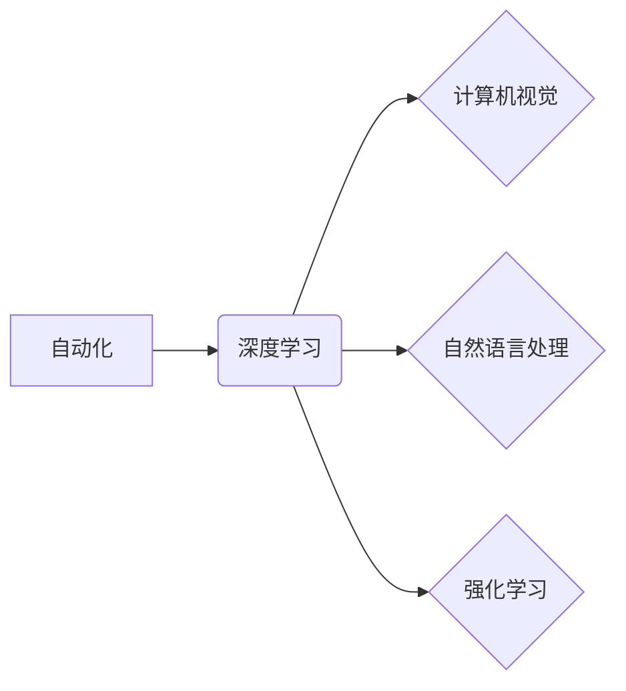

> 自动化、深度学习、计算机视觉、自然语言处理、强化学习、人工智能、模型训练

## 1. 背景介绍

在当今科技飞速发展的时代，自动化已成为各行各业的热门话题。从制造业的自动化生产线到金融行业的自动化交易系统，自动化正在改变着我们的生活方式和工作模式。而人工智能（AI）作为自动化技术的核心驱动力，正在以惊人的速度发展，并不断突破新的领域。

Andrej Karpathy，一位享誉全球的深度学习专家，在人工智能领域做出了卓越的贡献。他曾担任特斯拉自动驾驶团队的负责人，并在OpenAI担任研究科学家。他的研究成果和技术洞察力对推动人工智能的发展产生了深远的影响。

本文将从Andrej Karpathy的视角出发，探讨自动化在深度学习、计算机视觉、自然语言处理和强化学习等领域的应用，并分析其背后的核心概念、算法原理和未来发展趋势。

## 2. 核心概念与联系

自动化在人工智能领域的核心概念是将复杂的决策和任务自动化，从而提高效率、降低成本和减少人为错误。深度学习作为人工智能的重要分支，通过构建多层神经网络来模拟人类大脑的学习过程，能够从海量数据中提取特征和模式，从而实现对复杂问题的自动解决。

**核心概念关系图:**



## 3. 核心算法原理 & 具体操作步骤

### 3.1  算法原理概述

深度学习的核心算法是反向传播算法（Backpropagation）。该算法通过不断调整神经网络的权重和偏置，使网络的输出与实际目标值之间的误差最小化。

### 3.2  算法步骤详解

1. **前向传播:** 将输入数据通过神经网络传递，计算每个神经元的输出值。
2. **误差计算:** 计算网络输出值与实际目标值之间的误差。
3. **反向传播:** 将误差信号反向传播到网络的各个层，计算每个神经元的梯度。
4. **权重更新:** 根据梯度信息，更新神经网络的权重和偏置。
5. **重复步骤1-4:** 重复上述步骤，直到误差达到预设阈值。

### 3.3  算法优缺点

**优点:**

* 能够学习复杂的非线性关系。
* 具有强大的泛化能力，能够应用于不同的任务和领域。

**缺点:**

* 需要大量的训练数据。
* 训练过程耗时且计算资源消耗大。
* 模型解释性较差，难以理解模型的决策过程。

### 3.4  算法应用领域

深度学习算法广泛应用于计算机视觉、自然语言处理、语音识别、机器翻译、推荐系统等领域。

## 4. 数学模型和公式 & 详细讲解 & 举例说明

### 4.1  数学模型构建

深度学习模型通常由多层神经网络组成，每个神经元接收来自上一层的输入信号，并通过激活函数进行处理，输出到下一层。

**神经网络模型:**

$$
y = f(W x + b)
$$

其中：

* $y$：输出值
* $x$：输入值
* $W$：权重矩阵
* $b$：偏置向量
* $f$：激活函数

### 4.2  公式推导过程

反向传播算法的核心是计算每个神经元的梯度，并根据梯度更新权重和偏置。梯度计算公式如下：

$$
\frac{\partial L}{\partial W} = \frac{\partial L}{\partial y} \cdot \frac{\partial y}{\partial W}
$$

其中：

* $L$：损失函数
* $\frac{\partial L}{\partial y}$：损失函数对输出值的导数
* $\frac{\partial y}{\partial W}$：输出值对权重的导数

### 4.3  案例分析与讲解

假设我们训练一个简单的线性回归模型，目标是预测房价。输入特征包括房屋面积和房间数量，输出是房价。

我们可以使用反向传播算法训练模型，并通过损失函数（例如均方误差）来评估模型的性能。通过不断调整权重和偏置，模型能够学习到房屋面积和房间数量与房价之间的关系，从而实现对房价的预测。

## 5. 项目实践：代码实例和详细解释说明

### 5.1  开发环境搭建

为了实现深度学习项目，我们需要搭建相应的开发环境。常用的开发环境包括：

* **Python:** 深度学习的编程语言
* **TensorFlow/PyTorch:** 深度学习框架
* **GPU:** 加速深度学习训练的硬件

### 5.2  源代码详细实现

以下是一个使用TensorFlow实现简单的线性回归模型的代码示例：

```python
import tensorflow as tf

# 定义模型
model = tf.keras.Sequential([
    tf.keras.layers.Dense(units=1, input_shape=[2])
])

# 定义损失函数和优化器
model.compile(loss='mse', optimizer='sgd')

# 训练模型
model.fit(x_train, y_train, epochs=100)

# 预测房价
predictions = model.predict(x_test)
```

### 5.3  代码解读与分析

* `tf.keras.Sequential`: 创建一个顺序模型，即层级连接的模型。
* `tf.keras.layers.Dense`: 定义一个全连接层，每个神经元都连接到上一层的每个神经元。
* `loss='mse'`: 使用均方误差作为损失函数。
* `optimizer='sgd'`: 使用随机梯度下降作为优化器。
* `model.fit`: 训练模型，输入训练数据和训练轮数。
* `model.predict`: 使用训练好的模型预测房价。

### 5.4  运行结果展示

训练完成后，我们可以评估模型的性能，例如使用测试集的均方误差来衡量模型的预测精度。

## 6. 实际应用场景

### 6.1  计算机视觉

* **图像识别:** 自动识别图像中的物体、场景和人物。
* **目标跟踪:** 跟踪图像或视频中的特定物体。
* **图像分割:** 将图像分割成不同的区域，例如识别图像中的前景和背景。

### 6.2  自然语言处理

* **机器翻译:** 将文本从一种语言翻译成另一种语言。
* **文本摘要:** 自动生成文本的简短摘要。
* **情感分析:** 分析文本中的情感倾向，例如判断文本是积极的、消极的还是中性的。

### 6.3  强化学习

* **游戏AI:** 训练人工智能代理在游戏中取得高分。
* **机器人控制:** 训练机器人完成复杂的任务，例如导航、抓取和排序。
* **推荐系统:** 根据用户的历史行为推荐相关的商品或服务。

### 6.4  未来应用展望

随着人工智能技术的不断发展，自动化将在更多领域得到应用，例如医疗诊断、金融风险管理、交通管理等。

## 7. 工具和资源推荐

### 7.1  学习资源推荐

* **课程:** Coursera、edX、Udacity等平台提供深度学习相关的在线课程。
* **书籍:** 《深度学习》、《动手学深度学习》等书籍对深度学习原理和应用进行了深入讲解。
* **博客:** Andrej Karpathy的博客、OpenAI的博客等网站提供了最新的研究成果和技术洞察力。

### 7.2  开发工具推荐

* **TensorFlow:** Google开发的开源深度学习框架。
* **PyTorch:** Facebook开发的开源深度学习框架。
* **Keras:** TensorFlow的高级API，简化了深度学习模型的构建和训练。

### 7.3  相关论文推荐

* **ImageNet Classification with Deep Convolutional Neural Networks**
* **Attention Is All You Need**
* **Deep Reinforcement Learning**

## 8. 总结：未来发展趋势与挑战

### 8.1  研究成果总结

Andrej Karpathy的研究成果对深度学习的发展做出了重要贡献，例如他在计算机视觉领域的工作推动了图像识别和目标跟踪技术的进步。

### 8.2  未来发展趋势

* **模型规模和效率:** 研究更大型、更高效的深度学习模型，以提高模型的性能和泛化能力。
* **数据增强和合成:** 开发新的数据增强和合成技术，以解决数据稀缺问题。
* **可解释性:** 研究深度学习模型的决策过程，提高模型的可解释性和透明度。

### 8.3  面临的挑战

* **数据隐私和安全:** 深度学习模型的训练需要大量数据，如何保护数据隐私和安全是一个重要的挑战。
* **算法偏见:** 深度学习模型可能存在算法偏见，导致模型在某些群体上表现不佳。
* **伦理问题:** 深度学习技术的应用可能引发伦理问题，例如自动驾驶车辆的决策问题。

### 8.4  研究展望

未来，人工智能研究将继续朝着更智能、更安全、更可解释的方向发展。


## 9. 附录：常见问题与解答

**Q1: 深度学习模型需要多少数据才能训练？**

**A1:** 深度学习模型需要大量的训练数据，通常需要数百万甚至数十亿个样本才能达到良好的性能。

**Q2: 如何评估深度学习模型的性能？**

**A2:** 深度学习模型的性能可以通过各种指标来评估，例如准确率、召回率、F1-score等。

**Q3: 如何解决深度学习模型的过拟合问题？**

**A3:** 可以通过正则化、数据增强、Dropout等技术来解决深度学习模型的过拟合问题。


作者：禅与计算机程序设计艺术 / Zen and the Art of Computer Programming 
<end_of_turn>