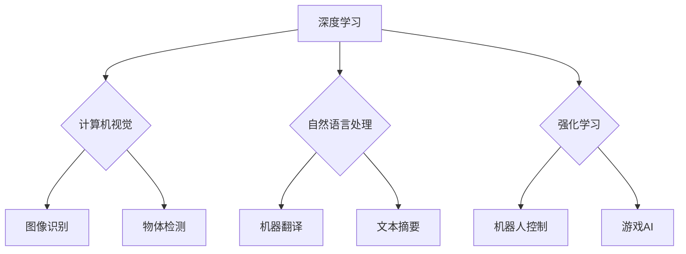

> 人工智能，深度学习，计算机视觉，自然语言处理，强化学习，伦理问题，未来趋势

## 1. 背景介绍

人工智能（AI）作为一项前沿科技，近年来发展迅速，取得了令人瞩目的成就。从语音识别到图像识别，从自动驾驶到医疗诊断，AI技术正在深刻地改变着我们的生活。其中，深度学习作为AI的重要分支，凭借其强大的学习能力和泛化能力，在各个领域展现出巨大的潜力。

Andrej Karpathy是一位享誉世界的AI专家，他在深度学习领域做出了杰出的贡献。他曾担任特斯拉自动驾驶团队的负责人，并领导了OpenAI的图像识别项目。他的研究成果和技术洞察力对AI的发展产生了深远的影响。

## 2. 核心概念与联系

**2.1 深度学习**

深度学习是一种基于多层神经网络的机器学习方法。它能够从海量数据中学习复杂的特征和模式，从而实现对图像、文本、语音等多种数据的理解和处理。

**2.2 计算机视觉**

计算机视觉是人工智能的一个重要分支，旨在让计算机能够“看”和理解图像和视频。深度学习在计算机视觉领域取得了突破性的进展，例如图像识别、物体检测、图像分割等。

**2.3 自然语言处理**

自然语言处理（NLP）是人工智能的另一个重要分支，旨在让计算机能够理解和处理人类语言。深度学习在NLP领域也取得了显著的成果，例如机器翻译、文本摘要、情感分析等。

**2.4 强化学习**

强化学习是一种基于奖励机制的机器学习方法。它通过让智能体在环境中进行交互，并根据其行为获得奖励或惩罚，从而学习最优的策略。强化学习在机器人控制、游戏AI等领域具有广泛的应用前景。

**2.5 伦理问题**

随着AI技术的快速发展，其伦理问题也日益受到关注。例如，AI算法的偏见、数据隐私保护、AI的责任归属等问题都需要认真思考和解决。

**Mermaid 流程图**



## 3. 核心算法原理 & 具体操作步骤

### 3.1 算法原理概述

深度学习算法的核心是多层神经网络。神经网络由多个层组成，每层包含多个神经元。每个神经元接收来自上一层的输入信号，并对其进行处理，然后将处理后的信号传递给下一层的输入。通过多层神经网络的叠加，可以学习到越来越复杂的特征和模式。

### 3.2 算法步骤详解

1. **数据预处理:** 将原始数据转换为深度学习算法可以理解的格式。例如，图像数据需要转换为像素值矩阵，文本数据需要转换为词向量。

2. **网络结构设计:** 根据具体任务选择合适的网络结构。常见的网络结构包括卷积神经网络（CNN）、循环神经网络（RNN）和Transformer等。

3. **参数初始化:** 为网络中的每个参数赋予初始值。

4. **前向传播:** 将输入数据通过网络传递，计算输出结果。

5. **反向传播:** 计算输出结果与真实值的误差，并根据误差调整网络参数。

6. **优化算法:** 使用优化算法，例如梯度下降法，更新网络参数。

7. **模型评估:** 使用测试数据评估模型的性能。

8. **模型调优:** 根据评估结果调整网络结构、参数或训练方法，以提高模型性能。

### 3.3 算法优缺点

**优点:**

* 学习能力强，能够从海量数据中学习到复杂的特征和模式。
* 泛化能力强，能够应用于不同的任务和领域。
* 自动特征提取，无需人工特征工程。

**缺点:**

* 训练数据量大，需要大量的计算资源。
* 训练时间长，可能需要数天甚至数周。
* 模型解释性差，难以理解模型的决策过程。

### 3.4 算法应用领域

深度学习算法已广泛应用于各个领域，例如：

* 计算机视觉：图像识别、物体检测、图像分割、人脸识别等。
* 自然语言处理：机器翻译、文本摘要、情感分析、聊天机器人等。
* 语音识别：语音转文本、语音助手等。
* 自动驾驶：车辆感知、路径规划、决策控制等。
* 医疗诊断：疾病预测、图像分析、药物研发等。

## 4. 数学模型和公式 & 详细讲解 & 举例说明

### 4.1 数学模型构建

深度学习算法的核心是多层神经网络，其数学模型可以表示为一系列的线性变换和非线性激活函数。

**线性变换:**

$$
y = Wx + b
$$

其中，$x$ 是输入向量，$W$ 是权重矩阵，$b$ 是偏置向量，$y$ 是输出向量。

**非线性激活函数:**

常用的激活函数包括ReLU、Sigmoid和Tanh等。

$$
f(x) = \begin{cases}
x & \text{if } x > 0 \\
0 & \text{otherwise}
\end{cases}
$$

**神经网络层:**

神经网络由多个层组成，每一层包含多个神经元。每个神经元接收来自上一层的输出作为输入，并对其进行线性变换和非线性激活函数处理，然后将处理后的结果传递给下一层。

### 4.2 公式推导过程

深度学习算法的训练过程是通过反向传播算法来实现的。反向传播算法的核心是计算误差梯度，并根据梯度更新网络参数。

**损失函数:**

$$
L(y, \hat{y})
$$

其中，$y$ 是真实值，$\hat{y}$ 是预测值。

**梯度下降法:**

$$
\theta = \theta - \alpha \nabla L(\theta)
$$

其中，$\theta$ 是网络参数，$\alpha$ 是学习率，$\nabla L(\theta)$ 是损失函数对参数的梯度。

### 4.3 案例分析与讲解

**图像识别:**

在图像识别任务中，深度学习算法可以学习到图像特征，并将其映射到相应的类别。例如，卷积神经网络（CNN）可以学习到图像的边缘、纹理和形状等特征，从而实现对图像的分类。

**机器翻译:**

在机器翻译任务中，深度学习算法可以学习到语言之间的映射关系，从而实现对文本的翻译。例如，Transformer模型可以学习到句子之间的语义关系，从而实现更准确的机器翻译。

## 5. 项目实践：代码实例和详细解释说明

### 5.1 开发环境搭建

* 操作系统：Ubuntu 20.04
* Python 版本：3.8
* 深度学习框架：TensorFlow 2.0

### 5.2 源代码详细实现

```python
import tensorflow as tf

# 定义模型结构
model = tf.keras.models.Sequential([
    tf.keras.layers.Conv2D(32, (3, 3), activation='relu', input_shape=(28, 28, 1)),
    tf.keras.layers.MaxPooling2D((2, 2)),
    tf.keras.layers.Conv2D(64, (3, 3), activation='relu'),
    tf.keras.layers.MaxPooling2D((2, 2)),
    tf.keras.layers.Flatten(),
    tf.keras.layers.Dense(10, activation='softmax')
])

# 编译模型
model.compile(optimizer='adam',
              loss='sparse_categorical_crossentropy',
              metrics=['accuracy'])

# 加载数据集
(x_train, y_train), (x_test, y_test) = tf.keras.datasets.mnist.load_data()

# 数据预处理
x_train = x_train.astype('float32') / 255.0
x_test = x_test.astype('float32') / 255.0
x_train = x_train.reshape((x_train.shape[0], 28, 28, 1))
x_test = x_test.reshape((x_test.shape[0], 28, 28, 1))

# 训练模型
model.fit(x_train, y_train, epochs=5)

# 评估模型
loss, accuracy = model.evaluate(x_test, y_test)
print('Test loss:', loss)
print('Test accuracy:', accuracy)
```

### 5.3 代码解读与分析

这段代码实现了使用TensorFlow框架训练一个简单的图像分类模型。

* 首先，定义了模型结构，包括卷积层、池化层和全连接层。
* 然后，编译了模型，指定了优化器、损失函数和评价指标。
* 接着，加载了MNIST数据集，并对数据进行了预处理。
* 最后，训练了模型，并评估了模型的性能。

### 5.4 运行结果展示

训练完成后，模型可以用来预测新的图像的类别。

## 6. 实际应用场景

### 6.1 医疗诊断

深度学习算法可以用于辅助医生进行疾病诊断。例如，可以训练一个模型来识别肺部肿瘤、皮肤癌等疾病。

### 6.2 自动驾驶

深度学习算法是自动驾驶汽车的关键技术之一。例如，可以训练一个模型来识别道路上的障碍物、交通信号灯等。

### 6.3 金融风险管理

深度学习算法可以用于识别金融风险。例如，可以训练一个模型来预测股票价格波动、识别欺诈交易等。

### 6.4 未来应用展望

随着深度学习技术的不断发展，其应用场景将更加广泛。例如，可以用于个性化教育、精准医疗、智能家居等领域。

## 7. 工具和资源推荐

### 7.1 学习资源推荐

* **书籍:**
    * 深度学习 (Deep Learning) - Ian Goodfellow, Yoshua Bengio, Aaron Courville
    * 构建深度学习模型 (Hands-On Machine Learning with Scikit-Learn, Keras & TensorFlow) - Aurélien Géron
* **在线课程:**
    * 深度学习 Specialization - Andrew Ng (Coursera)
    * fast.ai - Practical Deep Learning for Coders
* **博客和网站:**
    * Andrej Karpathy's Blog: https://karpathy.github.io/
    * OpenAI Blog: https://openai.com/blog/

### 7.2 开发工具推荐

* **深度学习框架:** TensorFlow, PyTorch, Keras
* **编程语言:** Python
* **数据处理工具:** Pandas, NumPy

### 7.3 相关论文推荐

* **ImageNet Classification with Deep Convolutional Neural Networks** - Alex Krizhevsky, Ilya Sutskever, Geoffrey E. Hinton
* **Attention Is All You Need** - Ashish Vaswani, Noam Shazeer, Niki Parmar, Jakob Uszkoreit, Llion Jones, Aidan N Gomez, Łukasz Kaiser, Illia Polosukhin
* **Generative Adversarial Networks** - Ian Goodfellow, Jean Pouget-Abadie, Mehdi Mirza, Bing Xu, David Warde-Farley, Sherjil Ozair, Aaron Courville, Yoshua Bengio

## 8. 总结：未来发展趋势与挑战

### 8.1 研究成果总结

近年来，深度学习取得了令人瞩目的成果，在计算机视觉、自然语言处理、语音识别等领域取得了突破性的进展。

### 8.2 未来发展趋势

* **模型规模和复杂度提升:** 未来深度学习模型将更加大规模、更加复杂，能够学习到更丰富的特征和模式。
* **跨模态学习:** 未来深度学习模型将能够处理多种模态的数据，例如图像、文本、音频等，实现跨模态的理解和交互。
