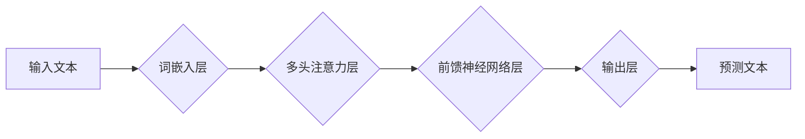

>  人工智能、大语言模型、ChatGPT、训练方法、应用场景、未来发展

## 1. 背景介绍

近年来，人工智能（AI）技术取得了飞速发展，特别是大语言模型（LLM）的出现，彻底改变了人们与计算机交互的方式。ChatGPT作为其中最具代表性的模型，凭借其强大的文本生成能力和自然流畅的对话体验，迅速走红全球，引发了广泛的关注和讨论。

ChatGPT的成功并非偶然，它背后蕴含着诸多技术创新和商业策略的巧妙结合。本文将深入探讨ChatGPT的快速成功之路，分析其核心概念、算法原理、训练方法、应用场景以及未来发展趋势，希望能为读者提供更深入的理解和启发。

## 2. 核心概念与联系

ChatGPT属于Transformer模型家族，其核心思想是利用注意力机制来捕捉文本序列中的长距离依赖关系。

**Mermaid 流程图：**

**核心概念解释：**

* **词嵌入层:** 将文本中的每个单词映射到一个低维向量空间，使得语义相近的单词拥有相似的向量表示。
* **多头注意力层:**  能够同时关注文本序列中的多个位置，并学习不同位置之间的关系，从而捕捉长距离依赖关系。
* **前馈神经网络层:** 对注意力机制输出的特征进行进一步的处理和提取。
* **输出层:**  根据输入文本和隐藏状态，预测下一个单词。

## 3. 核心算法原理 & 具体操作步骤

### 3.1  算法原理概述

ChatGPT的训练基于监督学习和自回归语言模型的原理。

* **监督学习:** 使用预先标注好的文本数据，训练模型预测下一个单词。
* **自回归语言模型:** 模型预测下一个单词时，只依赖于之前已经生成的单词序列，而不是整个文本序列。

### 3.2  算法步骤详解

1. **数据预处理:** 将原始文本数据进行清洗、分词、标记等预处理操作，使其适合模型训练。
2. **词嵌入:** 将文本中的每个单词映射到一个低维向量空间。
3. **模型训练:** 使用监督学习算法，训练模型预测下一个单词。
4. **模型评估:** 使用测试集评估模型的性能，例如困惑度（perplexity）。
5. **模型调优:** 根据评估结果，调整模型参数，例如学习率、批处理大小等，以提高模型性能。

### 3.3  算法优缺点

**优点:**

* 能够生成流畅、自然的文本。
* 能够理解和响应用户的自然语言输入。
* 能够进行多种文本任务，例如文本生成、翻译、摘要等。

**缺点:**

* 训练数据量大，计算资源消耗高。
* 容易受到训练数据中的偏差影响。
* 缺乏常识和世界知识，难以应对一些复杂的任务。

### 3.4  算法应用领域

ChatGPT在多个领域都有广泛的应用，例如：

* **聊天机器人:**  构建更智能、更自然的聊天机器人。
* **文本生成:**  自动生成新闻稿、广告文案、诗歌等文本。
* **机器翻译:**  实现更高效、更准确的机器翻译。
* **教育:**  提供个性化的学习辅导和智能答疑。

## 4. 数学模型和公式 & 详细讲解 & 举例说明

### 4.1  数学模型构建

ChatGPT的核心数学模型是Transformer，其主要由以下几个模块组成：

* **词嵌入层:** 使用词向量表示每个单词，例如Word2Vec或GloVe。
* **多头注意力层:** 计算每个单词与其他单词之间的注意力权重，并将其加权求和，得到每个单词的上下文表示。
* **前馈神经网络层:** 对注意力机制输出的特征进行进一步的处理和提取。
* **输出层:** 使用softmax函数将隐藏状态映射到词汇表上的概率分布，预测下一个单词。

### 4.2  公式推导过程

**注意力机制公式:**

$$
Attention(Q, K, V) = softmax(\frac{QK^T}{\sqrt{d_k}})V
$$

其中：

* $Q$：查询矩阵
* $K$：键矩阵
* $V$：值矩阵
* $d_k$：键向量的维度
* $softmax$：softmax函数

**前馈神经网络层公式:**

$$
FFN(x) = \sigma(W_1x + b_1)W_2 + b_2
$$

其中：

* $x$：输入向量
* $W_1$、$W_2$：权重矩阵
* $b_1$、$b_2$：偏置项
* $\sigma$：激活函数

### 4.3  案例分析与讲解

假设我们有一个句子“我爱学习编程”，我们需要预测下一个单词。

1. 将句子中的每个单词映射到词向量空间。
2. 使用多头注意力层计算每个单词与其他单词之间的注意力权重。
3. 将注意力权重加权求和，得到每个单词的上下文表示。
4. 将上下文表示输入到前馈神经网络层，进行进一步处理。
5. 使用输出层预测下一个单词的概率分布。

## 5. 项目实践：代码实例和详细解释说明

### 5.1  开发环境搭建

ChatGPT的开发环境通常包括以下软件：

* Python 3.x
* PyTorch 或 TensorFlow
* CUDA 和 cuDNN

### 5.2  源代码详细实现

ChatGPT的源代码主要开源在HuggingFace平台，开发者可以根据自己的需求进行修改和训练。

### 5.3  代码解读与分析

ChatGPT的代码主要包含以下几个部分：

* 数据加载和预处理模块
* 模型定义模块
* 训练和评估模块
* 模型保存和加载模块

### 5.4  运行结果展示

训练好的ChatGPT模型可以用于生成文本、回答问题、翻译语言等任务。

## 6. 实际应用场景

ChatGPT在多个领域都有广泛的应用场景，例如：

### 6.1  聊天机器人

ChatGPT可以构建更智能、更自然的聊天机器人，例如客服机器人、陪伴机器人等。

### 6.2  文本生成

ChatGPT可以自动生成各种类型的文本，例如新闻稿、广告文案、诗歌、小说等。

### 6.3  机器翻译

ChatGPT可以实现更高效、更准确的机器翻译，例如将中文翻译成英文。

### 6.4  未来应用展望

ChatGPT的未来应用前景广阔，例如：

* **个性化教育:** 提供个性化的学习辅导和智能答疑。
* **医疗辅助:** 辅助医生诊断疾病、制定治疗方案。
* **法律服务:** 辅助律师进行法律研究、撰写法律文件。

## 7. 工具和资源推荐

### 7.1  学习资源推荐

* **书籍:**
    * 《深度学习》
    * 《自然语言处理》
* **在线课程:**
    * Coursera
    * edX
* **博客和论坛:**
    * HuggingFace
    * TensorFlow Blog

### 7.2  开发工具推荐

* **Python:** 
* **PyTorch:** 
* **TensorFlow:** 
* **HuggingFace Transformers:** 

### 7.3  相关论文推荐

* **Attention Is All You Need:** https://arxiv.org/abs/1706.03762
* **BERT: Pre-training of Deep Bidirectional Transformers for Language Understanding:** https://arxiv.org/abs/1810.04805

## 8. 总结：未来发展趋势与挑战

### 8.1  研究成果总结

ChatGPT的成功标志着大语言模型在自然语言处理领域的巨大进步，其强大的文本生成能力和自然流畅的对话体验，为人工智能的未来发展指明了方向。

### 8.2  未来发展趋势

* **模型规模和能力的提升:** 未来，大语言模型的规模和能力将会进一步提升，能够处理更复杂的任务，并具备更强的理解和推理能力。
* **多模态学习:** 大语言模型将与其他模态数据，例如图像、音频、视频等进行融合，实现多模态理解和生成。
* **个性化定制:** 大语言模型将更加个性化，能够根据用户的需求和偏好进行定制，提供更精准的服务。

### 8.3  面临的挑战

* **数据安全和隐私保护:** 大语言模型的训练需要大量数据，如何保证数据安全和隐私保护是一个重要的挑战。
* **模型可解释性和信任度:** 大语言模型的决策过程往往难以理解，如何提高模型的可解释性和信任度是一个关键问题。
* **伦理和社会影响:** 大语言模型的应用可能会带来一些伦理和社会问题，例如信息操纵、偏见放大等，需要引起足够的重视和讨论。

### 8.4  研究展望

未来，大语言模型的研究将继续深入，探索其更深层次的潜力，并解决其面临的挑战，为人类社会带来更多福祉。

## 9. 附录：常见问题与解答

**常见问题:**

* ChatGPT的训练数据是什么？
* ChatGPT的性能如何？
* 如何使用ChatGPT？

**解答:**

* ChatGPT的训练数据包括大量的文本数据，例如书籍、文章、代码等。
* ChatGPT的性能在多个自然语言处理任务上都表现出色，例如文本生成、机器翻译、问答等。
* 使用ChatGPT需要先下载并安装相关的软件，然后根据官方文档进行配置和使用。

作者：禅与计算机程序设计艺术 / Zen and the Art of Computer Programming 
<end_of_turn>