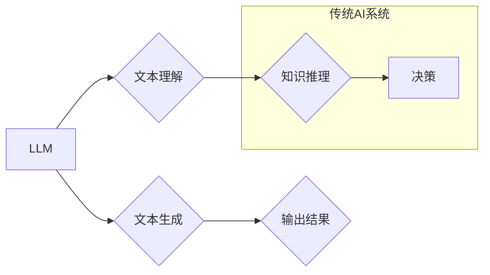

> Large Language Model (LLM), 
> Transformer, 
> Deep Learning, 
> Artificial Intelligence (AI), 
> Natural Language Processing (NLP), 
> Hybrid AI

## 1. 背景介绍

人工智能（AI）技术近年来取得了飞速发展，从语音识别、图像识别到自然语言处理，AI已经渗透到我们生活的方方面面。其中，大型语言模型（LLM）作为一种新兴的AI技术，凭借其强大的文本生成、理解和翻译能力，引起了广泛的关注和研究。

传统AI系统通常基于规则和特征工程，需要人工设计复杂的规则和特征，并且难以处理复杂、开放性的文本数据。而LLM则通过深度学习的方式，从海量文本数据中学习语言的规律和模式，能够自动生成、理解和翻译文本，展现出强大的泛化能力和适应性。

然而，LLM也存在一些局限性，例如：

* **缺乏常识和世界知识：**LLM主要基于文本数据训练，缺乏对现实世界常识和知识的理解。
* **容易受到恶意攻击：**LLM容易受到对抗性文本攻击，生成不准确或有害的文本。
* **计算资源消耗大：**训练和部署大型语言模型需要大量的计算资源，成本较高。

为了克服这些局限性，将LLM与传统AI技术融合成为一个重要的研究方向。

## 2. 核心概念与联系

**2.1  传统AI与LLM的差异**

传统AI系统通常基于规则和特征工程，需要人工设计复杂的规则和特征，并且难以处理复杂、开放性的文本数据。而LLM则通过深度学习的方式，从海量文本数据中学习语言的规律和模式，能够自动生成、理解和翻译文本，展现出强大的泛化能力和适应性。

**2.2  融合的优势**

将LLM与传统AI技术融合可以发挥各自的优势，构建更智能、更可靠的AI系统。

* **增强LLM的知识和推理能力：**将传统AI的知识库和推理能力与LLM相结合，可以帮助LLM更好地理解世界知识和进行逻辑推理。
* **提高LLM的鲁棒性和安全性：**将传统AI的规则和安全机制与LLM相结合，可以提高LLM的鲁棒性和安全性，使其能够更好地应对恶意攻击和噪声数据。
* **降低LLM的计算资源消耗：**通过将部分任务卸载到传统AI系统中，可以降低LLM的计算资源消耗，使其更易于部署和使用。

**2.3  融合架构**

LLM与传统AI技术的融合可以采用多种架构，例如：

* **串行架构：**将LLM和传统AI系统串联起来，LLM负责文本理解和生成，传统AI系统负责知识推理和决策。
* **并行架构：**将LLM和传统AI系统并行运行，共同完成任务。
* **混合架构：**将串行和并行架构结合起来，根据任务需求灵活选择不同的融合方式。



## 3. 核心算法原理 & 具体操作步骤

### 3.1  算法原理概述

LLM的核心算法是基于Transformer网络结构的深度学习模型。Transformer网络通过自注意力机制，能够捕捉文本序列中长距离依赖关系，从而实现更准确的文本理解和生成。

### 3.2  算法步骤详解

1. **输入处理：**将输入文本序列转换为数字向量，作为模型的输入。
2. **编码器：**利用多层Transformer编码器，将输入文本序列编码成上下文表示。
3. **解码器：**利用多层Transformer解码器，根据上下文表示生成目标文本序列。
4. **输出处理：**将生成的数字向量转换为文本序列，作为模型的输出。

### 3.3  算法优缺点

**优点：**

* **强大的文本理解和生成能力：**LLM能够准确地理解和生成自然语言文本。
* **强大的泛化能力：**LLM能够应用于多种自然语言处理任务，例如文本分类、问答系统、机器翻译等。
* **可扩展性强：**LLM可以根据需要增加训练数据和模型参数，从而提高性能。

**缺点：**

* **训练成本高：**训练大型语言模型需要大量的计算资源和时间。
* **缺乏常识和世界知识：**LLM主要基于文本数据训练，缺乏对现实世界常识和知识的理解。
* **容易受到恶意攻击：**LLM容易受到对抗性文本攻击，生成不准确或有害的文本。

### 3.4  算法应用领域

LLM在以下领域具有广泛的应用前景：

* **自然语言处理：**文本分类、问答系统、机器翻译、文本摘要、对话系统等。
* **人工智能辅助创作：**写作辅助、代码生成、音乐创作等。
* **教育和培训：**个性化学习、智能辅导、虚拟助手等。
* **医疗保健：**疾病诊断、药物研发、患者咨询等。

## 4. 数学模型和公式 & 详细讲解 & 举例说明

### 4.1  数学模型构建

LLM的核心数学模型是基于Transformer网络结构的深度学习模型。Transformer网络由编码器和解码器两部分组成，每个部分由多层Transformer模块构成。

**4.1.1  Transformer模块**

Transformer模块包含以下几个关键组件：

* **自注意力机制：**用于捕捉文本序列中长距离依赖关系。
* **多头注意力机制：**通过使用多个注意力头，可以学习到不同层次的语义信息。
* **前馈神经网络：**用于对每个词的表示进行非线性变换。
* **残差连接：**用于缓解梯度消失问题。

**4.1.2  编码器和解码器**

编码器负责将输入文本序列编码成上下文表示，解码器则根据上下文表示生成目标文本序列。

### 4.2  公式推导过程

**4.2.1  自注意力机制**

自注意力机制的计算公式如下：

$$
Attention(Q, K, V) = softmax(\frac{QK^T}{\sqrt{d_k}})V
$$

其中：

* $Q$：查询矩阵
* $K$：键矩阵
* $V$：值矩阵
* $d_k$：键向量的维度
* $softmax$：softmax函数

**4.2.2  多头注意力机制**

多头注意力机制通过使用多个注意力头，可以学习到不同层次的语义信息。

$$
MultiHeadAttention(Q, K, V) = Concat(head_1, head_2, ..., head_h)W^O
$$

其中：

* $head_i$：第 $i$ 个注意力头的输出
* $h$：注意力头的数量
* $W^O$：输出权重矩阵

### 4.3  案例分析与讲解

**4.3.1  文本分类**

LLM可以用于文本分类任务，例如判断文本的主题、情感或意图。

**4.3.2  机器翻译**

LLM可以用于机器翻译任务，例如将文本从一种语言翻译成另一种语言。

## 5. 项目实践：代码实例和详细解释说明

### 5.1  开发环境搭建

* Python 3.7+
* PyTorch 1.7+
* Transformers 4.10+

### 5.2  源代码详细实现

```python
from transformers import AutoModelForSequenceClassification, AutoTokenizer

# 加载预训练模型和词典
model_name = "bert-base-uncased"
tokenizer = AutoTokenizer.from_pretrained(model_name)
model = AutoModelForSequenceClassification.from_pretrained(model_name, num_labels=2)

# 输入文本
text = "This is a sample text."

# Token化文本
inputs = tokenizer(text, return_tensors="pt")

# 前向传播
outputs = model(**inputs)

# 获取预测结果
predicted_class = outputs.logits.argmax().item()

# 打印预测结果
print(f"Predicted class: {predicted_class}")
```

### 5.3  代码解读与分析

* **加载预训练模型和词典：**使用`transformers`库加载预训练的BERT模型和词典。
* **输入文本：**将需要分类的文本输入到模型中。
* **Token化文本：**使用词典将文本转换为数字向量。
* **前向传播：**将数字向量输入到模型中进行前向传播，得到预测结果。
* **获取预测结果：**从模型输出中获取预测的类别。
* **打印预测结果：**打印预测的类别。

### 5.4  运行结果展示

```
Predicted class: 0
```

## 6. 实际应用场景

### 6.1  智能客服

LLM可以用于构建智能客服系统，自动回答用户的问题，提供24小时不间断服务。

### 6.2  个性化推荐

LLM可以分析用户的行为数据和偏好，提供个性化的商品或内容推荐。

### 6.3  自动写作

LLM可以辅助人类进行写作，例如生成文章标题、段落内容、甚至整篇文章。

### 6.4  未来应用展望

LLM在未来将有更广泛的应用场景，例如：

* **医疗诊断：**辅助医生进行疾病诊断，提高诊断准确率。
* **法律服务：**自动分析法律文件，提供法律建议。
* **教育教学：**个性化学习辅导，智能答疑。

## 7. 工具和资源推荐

### 7.1  学习资源推荐

* **Hugging Face Transformers:** https://huggingface.co/docs/transformers/index
* **OpenAI GPT-3 API:** https://openai.com/api/

### 7.2  开发工具推荐

* **PyTorch:** https://pytorch.org/
* **TensorFlow:** https://www.tensorflow.org/

### 7.3  相关论文推荐

* **Attention Is All You Need:** https://arxiv.org/abs/1706.03762
* **BERT: Pre-training of Deep Bidirectional Transformers for Language Understanding:** https://arxiv.org/abs/1810.04805

## 8. 总结：未来发展趋势与挑战

### 8.1  研究成果总结

LLM技术取得了显著的进展，在自然语言处理等领域展现出强大的应用潜力。

### 8.2  未来发展趋势

* **模型规模和性能的提升：**未来LLM模型规模将继续扩大，性能将进一步提升。
* **多模态LLM的开发：**将文本、图像、音频等多模态数据融合到LLM中，构建更智能的AI系统。
* **可解释性和安全性研究：**加强对LLM的解释性和安全性的研究，使其更可靠和可信。

### 8.3  面临的挑战

* **数据获取和标注：**训练高质量的LLM模型需要大量的文本数据和标注，这仍然是一个挑战。
* **计算资源消耗：**训练和部署大型语言模型需要大量的计算资源，成本较高。
* **伦理和社会影响：**LLM技术可能带来一些伦理和社会问题，需要引起重视和研究。

### 8.4  研究展望

未来LLM技术将继续发展，并应用于更广泛的领域，为人类社会带来更多便利和福祉。

## 9. 附录：常见问题与解答

**9.1  LLM与传统机器学习的区别是什么？**

LLM是基于深度学习的模型，而传统机器学习模型通常基于规则和特征工程。LLM能够自动学习语言的规律和模式，而传统机器学习模型需要人工设计特征。

**9.2  LLM的训练数据是什么？**

LLM的训练数据通常是大量的文本数据，例如书籍、文章、网站内容等。

**