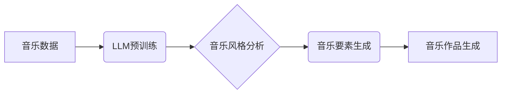

> Large Language Model (LLM), 音乐创作, AI作曲, 音乐生成, 算法原理, 数学模型, 项目实践, 应用场景

## 1. 背景介绍

音乐作为一种跨越文化和语言的艺术形式，一直以来都深深地影响着人类的生活。随着人工智能技术的飞速发展，特别是大型语言模型 (LLM) 的出现，智能音乐创作领域迎来了前所未有的机遇。LLM 凭借其强大的文本理解和生成能力，能够学习和理解音乐的结构、节奏、旋律等元素，并生成具有创意和情感的音乐作品。

传统的音乐创作主要依赖于人类的灵感和技巧，而智能音乐创作则利用算法和数据来辅助或替代人类的创作过程。这不仅可以降低创作门槛，让更多人参与到音乐创作中，还可以探索新的音乐风格和可能性。

## 2. 核心概念与联系

**2.1  LLM 简介**

大型语言模型 (LLM) 是一种基于深度学习的强大人工智能模型，能够理解和生成人类语言。它们通过训练海量文本数据，学习语言的语法、语义和上下文关系，从而具备强大的文本生成、翻译、摘要、问答等能力。

**2.2  音乐创作与 LLM 的联系**

音乐创作本质上也是一种信息生成和表达的过程，它涉及到旋律、节奏、和声、音色等多方面的元素。LLM 可以通过学习音乐数据，理解这些元素之间的关系，并生成符合音乐规律的新音乐。

**2.3  LLM 在音乐创作中的应用**

LLM 在音乐创作中的应用可以分为以下几个方面：

* **音乐生成:** 利用 LLM 生成完整的音乐作品，包括旋律、节奏、和声等。
* **音乐风格迁移:** 将一首音乐作品的风格转化为另一种风格。
* **音乐伴奏生成:** 根据旋律或歌词生成相应的伴奏音乐。
* **音乐创意辅助:** 为人类作曲家提供灵感和创意，帮助他们突破创作瓶颈。

**2.4  LLM 音乐创作架构**



## 3. 核心算法原理 & 具体操作步骤

**3.1  算法原理概述**

LLM 在音乐创作中的核心算法主要基于以下几个方面：

* **序列到序列模型:** 将音乐序列（例如音符、节奏）视为输入和输出，训练模型学习音乐的结构和规律。
* **变分自编码器 (VAE):** 将音乐数据编码成低维表示，并通过解码器生成新的音乐序列。
* **生成对抗网络 (GAN):** 使用两个网络对抗训练，其中一个网络生成音乐，另一个网络判别音乐的真实性，从而生成更逼真的音乐。

**3.2  算法步骤详解**

1. **数据收集和预处理:** 收集大量音乐数据，并进行预处理，例如标注音符、节奏等信息。
2. **模型训练:** 使用选定的算法训练 LLM 模型，例如使用序列到序列模型训练音乐生成模型。
3. **音乐风格分析:** 利用训练好的模型分析音乐风格，提取音乐特征，例如节奏、旋律、和声等。
4. **音乐要素生成:** 根据音乐风格和用户需求，生成相应的音乐要素，例如音符、节奏、和声等。
5. **音乐作品生成:** 将生成的音乐要素组合成完整的音乐作品。

**3.3  算法优缺点**

* **优点:**

    * 可以生成具有创意和情感的音乐作品。
    * 可以探索新的音乐风格和可能性。
    * 可以降低音乐创作的门槛，让更多人参与到音乐创作中。

* **缺点:**

    * 训练数据对模型性能有很大影响，需要大量高质量的音乐数据。
    * 生成的音乐作品可能缺乏情感和个性。
    * 算法的复杂性可能导致模型训练和部署成本较高。

**3.4  算法应用领域**

* **音乐创作辅助工具:** 为人类作曲家提供灵感和创意，帮助他们突破创作瓶颈。
* **游戏音乐生成:** 为游戏生成不同的音乐风格，增强游戏体验。
* **影视音乐创作:** 为电影、电视剧等影视作品生成背景音乐。
* **个性化音乐推荐:** 根据用户的音乐偏好，生成个性化的音乐作品。

## 4. 数学模型和公式 & 详细讲解 & 举例说明

**4.1  数学模型构建**

在 LLMs 中，音乐通常被表示为一系列音符或音符序列。我们可以使用以下数学模型来表示音乐：

* **音符序列:**  $M = (m_1, m_2, ..., m_n)$，其中 $m_i$ 表示第 $i$ 个音符。
* **音符特征:**  每个音符可以被表示为一系列特征，例如音高、音长、力度等。我们可以使用向量 $v_i$ 来表示第 $i$ 个音符的特征。

**4.2  公式推导过程**

LLMs 通常使用概率模型来生成音乐序列。例如，我们可以使用条件概率分布 $P(m_{i+1} | m_1, m_2, ..., m_i)$ 来表示下一个音符的生成概率，其中 $m_1, m_2, ..., m_i$ 是前 $i$ 个音符。

这个概率分布可以根据训练数据学习，例如使用最大似然估计方法。

**4.3  案例分析与讲解**

假设我们有一个训练数据，包含了大量的音乐序列。我们可以使用 LLMs 来学习这些音乐序列的概率分布，并根据这个分布生成新的音乐序列。

例如，我们可以训练一个 LLMs 来生成古典音乐，并根据用户的输入，例如音乐风格、速度、情绪等，生成不同的古典音乐作品。

## 5. 项目实践：代码实例和详细解释说明

**5.1  开发环境搭建**

* **操作系统:** Linux/macOS
* **编程语言:** Python
* **深度学习框架:** TensorFlow/PyTorch
* **音乐数据处理库:** Librosa/Mido

**5.2  源代码详细实现**

```python
# 使用 TensorFlow 构建音乐生成模型
import tensorflow as tf

# 定义模型结构
model = tf.keras.Sequential([
    tf.keras.layers.Embedding(input_dim=vocab_size, output_dim=embedding_dim),
    tf.keras.layers.LSTM(units=lstm_units),
    tf.keras.layers.Dense(units=vocab_size, activation='softmax')
])

# 编译模型
model.compile(optimizer='adam', loss='sparse_categorical_crossentropy', metrics=['accuracy'])

# 训练模型
model.fit(x_train, y_train, epochs=epochs)

# 生成音乐
seed_sequence = [start_token]
for _ in range(generate_length):
    predictions = model.predict(tf.expand_dims(seed_sequence, 0))
    predicted_index = tf.argmax(predictions[0]).numpy()
    seed_sequence.append(predicted_index)
```

**5.3  代码解读与分析**

* **Embedding 层:** 将音符转换为稠密的向量表示。
* **LSTM 层:** 学习音乐序列的上下文关系。
* **Dense 层:** 将 LSTM 输出转换为每个音符的概率分布。
* **训练过程:** 使用训练数据训练模型，学习音乐的概率分布。
* **生成过程:** 根据训练好的模型，从一个种子序列开始，逐步生成新的音符序列。

**5.4  运行结果展示**

运行代码后，可以生成一段新的音乐序列，并将其保存为音频文件。

## 6. 实际应用场景

**6.1  音乐创作辅助工具**

LLMs 可以作为音乐创作辅助工具，帮助作曲家生成旋律、和声、节奏等音乐要素，并提供创意灵感。

**6.2  游戏音乐生成**

LLMs 可以根据游戏场景、人物、剧情等信息，生成不同的游戏音乐风格，增强游戏体验。

**6.3  影视音乐创作**

LLMs 可以根据影视作品的主题、氛围、节奏等信息，生成相应的背景音乐，提升影视作品的艺术效果。

**6.4  未来应用展望**

* **个性化音乐创作:** 根据用户的音乐偏好，生成个性化的音乐作品。
* **跨语言音乐创作:** 突破语言障碍，实现跨语言的音乐创作和交流。
* **音乐治疗:** 利用音乐的疗愈效果，开发基于 LLMs 的音乐治疗系统。

## 7. 工具和资源推荐

**7.1  学习资源推荐**

* **书籍:**
    * "Deep Learning" by Ian Goodfellow, Yoshua Bengio, and Aaron Courville
    * "Speech and Language Processing" by Daniel Jurafsky and James H. Martin
* **在线课程:**
    * Coursera: Deep Learning Specialization
    * Udacity: Artificial Intelligence Nanodegree

**7.2  开发工具推荐**

* **深度学习框架:** TensorFlow, PyTorch
* **音乐数据处理库:** Librosa, Mido
* **音乐合成器:** MuseScore, Ableton Live

**7.3  相关论文推荐**

* "Music Transformer: A Novel Sequence-to-Sequence Model for Music Generation"
* "WaveNet: A Generative Model for Raw Audio"
* "Generative Adversarial Networks for Music Generation"

## 8. 总结：未来发展趋势与挑战

**8.1  研究成果总结**

LLMs 在音乐创作领域取得了显著的进展，能够生成具有创意和情感的音乐作品，并应用于多个领域，例如音乐创作辅助、游戏音乐生成、影视音乐创作等。

**8.2  未来发展趋势**

* **更逼真的音乐生成:** 提高 LLMs 的音乐生成质量，使其生成的音乐更加逼真、情感丰富。
* **更个性化的音乐创作:** 基于用户的音乐偏好，生成更加个性化的音乐作品。
* **跨语言音乐创作:** 突破语言障碍，实现跨语言的音乐创作和交流。

**8.3  面临的挑战**

* **数据质量:** LLMs 的性能依赖于训练数据的质量，需要收集和标注大量高质量的音乐数据。
* **算法复杂性:** LLMs 的算法复杂度较高，训练和部署成本较高。
* **音乐情感表达:** LLMs 难以完全理解和表达音乐的情感，需要进一步研究音乐情感表达的机制。

**8.4  研究展望**

未来，LLMs 在音乐创作领域将继续发展，并与其他人工智能技术融合，例如计算机视觉、自然语言处理等，实现更智能、更具创意的音乐创作。


## 9. 附录：常见问题与解答

**9.1  LLMs 能否完全替代人类作曲家？**

LLMs 可以辅助人类作曲家，但目前还无法完全替代人类作曲家。人类作曲家拥有丰富的音乐知识、情感表达能力和创造力，而 LLMs 则更擅长学习和模仿已有的音乐模式。

**9.2  LLMs 生成的音乐是否具有版权？**

LLMs 生成的音乐的版权问题尚无定论，需要进一步探讨和规范。

**9.3  LLMs 如何学习音乐的风格？**

LLMs 通过学习大量的音乐数据，并分析音乐的特征，例如节奏、旋律、和声等，来学习不同的音乐风格。

**9.4  如何评估 LLMs 的音乐生成质量？**

评估 LLMs 的音乐生成质量可以采用多种方法，例如人类评价、客观指标评估等。

**9.5  LLMs 在音乐创作领域有哪些伦理问题？**

LLMs 在音乐创作领域存在一些伦理问题，例如版权问题、原创性问题、音乐风格的单一化等，需要引起重视和探讨。


作者：禅与计算机程序设计艺术 / Zen and the Art of Computer Programming 
<end_of_turn>