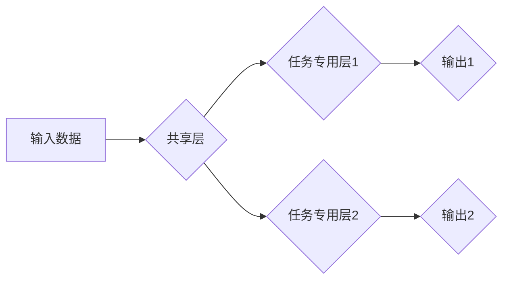

> Large Language Model (LLM), Multi-Task Learning (MTL), Transfer Learning, Few-Shot Learning, Fine-Tuning, Performance Boosting, Generalization Ability

## 1. 背景介绍

近年来，大型语言模型 (Large Language Model, LLM) 在自然语言处理 (NLP) 领域取得了显著的成就。这些模型通过训练海量文本数据，学习了语言的复杂模式和结构，能够执行各种任务，例如文本生成、翻译、问答和代码生成。然而，传统的单任务训练方式存在一些局限性：

* **数据效率低:** 每个任务都需要大量的特定领域数据进行训练，这在数据稀缺的情况下难以实现。
* **模型泛化能力有限:** 模型在训练数据之外的场景下表现可能较差，缺乏对不同任务的适应能力。

为了克服这些问题，多任务学习 (Multi-Task Learning, MTL) 成为了一种有效的训练范式。MTL 旨在训练一个模型来执行多个相关任务，通过共享知识和参数，提高模型的泛化能力和数据效率。

## 2. 核心概念与联系

**2.1 多任务学习 (MTL)**

MTL 是一种机器学习范式，旨在训练一个模型来执行多个相关任务。通过共享底层特征表示和参数，MTL 可以提高模型的泛化能力和数据效率。

**2.2 转移学习 (Transfer Learning)**

转移学习是一种利用预训练模型知识进行下游任务训练的方法。预训练模型通常在大型数据集上进行训练，学习了通用的语言表示。转移学习可以将预训练模型应用于特定任务，减少下游任务所需的训练数据和时间。

**2.3 少样本学习 (Few-Shot Learning)**

少样本学习是指在少量训练数据的情况下，训练模型进行新任务学习的能力。MTL 可以通过共享知识和参数，提高模型在少样本学习场景下的性能。

**2.4 模型架构**

MTL 模型通常由以下部分组成：

* **共享层:** 用于提取通用特征表示，所有任务共享此层。
* **任务专用层:** 用于每个特定任务的分类或回归，根据任务类型而异。

**2.5 Mermaid 流程图**



## 3. 核心算法原理 & 具体操作步骤

**3.1 算法原理概述**

MTL 的核心思想是通过共享底层特征表示和参数，使模型能够学习到多个任务之间的相关性。在训练过程中，模型会同时学习多个任务，并通过正则化项来防止过拟合。

**3.2 算法步骤详解**

1. **数据预处理:** 将多个任务的数据进行预处理，例如文本分词、词向量化等。
2. **模型初始化:** 初始化模型参数，包括共享层和任务专用层。
3. **前向传播:** 将输入数据输入模型，计算每个任务的输出。
4. **损失函数计算:** 计算每个任务的损失函数值，并将其加权求和。
5. **反向传播:** 使用梯度下降算法更新模型参数，以最小化损失函数值。
6. **模型评估:** 在验证集上评估模型性能，并根据性能调整超参数。

**3.3 算法优缺点**

**优点:**

* **提高数据效率:** 通过共享知识，MTL 可以利用多个任务的数据进行训练，提高数据利用率。
* **增强泛化能力:** MTL 可以学习到多个任务之间的相关性，提高模型在未知任务上的泛化能力。
* **减少训练时间:** MTL 可以利用预训练模型的知识，减少下游任务的训练时间。

**缺点:**

* **任务相关性:** MTL 的效果依赖于任务之间的相关性。如果任务之间不相关，MTL 的效果可能不如单任务学习。
* **模型复杂度:** MTL 模型通常比单任务学习模型更复杂，需要更多的计算资源。
* **任务冲突:** 如果任务之间存在冲突，MTL 可能导致模型性能下降。

**3.4 算法应用领域**

MTL 在许多领域都有广泛的应用，例如：

* **自然语言处理:** 文本分类、情感分析、机器翻译、问答系统等。
* **计算机视觉:** 图像分类、目标检测、图像分割等。
* **语音识别:** 语音识别、语音合成等。
* **推荐系统:** 商品推荐、用户画像等。

## 4. 数学模型和公式 & 详细讲解 & 举例说明

**4.1 数学模型构建**

假设我们有 M 个任务，每个任务都有其对应的损失函数 L_i(θ)。MTL 的目标是找到一个模型参数 θ，能够最小化所有任务的损失函数的加权平均值：

$$
L(\theta) = \sum_{i=1}^{M} \lambda_i L_i(\theta)
$$

其中，λ_i 是每个任务的权重，用于平衡不同任务的重要性。

**4.2 公式推导过程**

MTL 的训练过程可以使用梯度下降算法进行优化。对于每个任务 i，计算梯度：

$$
\nabla_{\theta} L_i(\theta)
$$

然后，更新模型参数 θ：

$$
\theta = \theta - \eta \sum_{i=1}^{M} \lambda_i \nabla_{\theta} L_i(\theta)
$$

其中，η 是学习率。

**4.3 案例分析与讲解**

例如，我们训练一个 MTL 模型来执行文本分类和情感分析两个任务。我们可以将文本分类任务的损失函数设置为交叉熵损失，情感分析任务的损失函数设置为均方误差损失。在训练过程中，我们可以根据任务的重要性调整权重 λ_i。

## 5. 项目实践：代码实例和详细解释说明

**5.1 开发环境搭建**

* Python 3.7+
* TensorFlow 2.0+
* PyTorch 1.0+

**5.2 源代码详细实现**

```python
import tensorflow as tf

# 定义模型架构
class MultiTaskModel(tf.keras.Model):
    def __init__(self, num_classes1, num_classes2):
        super(MultiTaskModel, self).__init__()
        self.shared_layer = tf.keras.layers.Dense(128, activation='relu')
        self.task1_layer = tf.keras.layers.Dense(num_classes1, activation='softmax')
        self.task2_layer = tf.keras.layers.Dense(num_classes2, activation='sigmoid')

    def call(self, inputs):
        x = self.shared_layer(inputs)
        output1 = self.task1_layer(x)
        output2 = self.task2_layer(x)
        return output1, output2

# 实例化模型
model = MultiTaskModel(num_classes1=2, num_classes2=1)

# 定义损失函数和优化器
loss_fn = tf.keras.losses.CategoricalCrossentropy()
optimizer = tf.keras.optimizers.Adam(learning_rate=0.001)

# 训练模型
for epoch in range(10):
    for batch in dataset:
        with tf.GradientTape() as tape:
            output1, output2 = model(batch['inputs'])
            loss1 = loss_fn(batch['labels1'], output1)
            loss2 = tf.keras.losses.BinaryCrossentropy()(batch['labels2'], output2)
            total_loss = loss1 + loss2
        gradients = tape.gradient(total_loss, model.trainable_variables)
        optimizer.apply_gradients(zip(gradients, model.trainable_variables))

# 评估模型
# ...
```

**5.3 代码解读与分析**

* 模型架构: 模型由共享层和两个任务专用层组成。共享层用于提取通用特征表示，任务专用层用于每个特定任务的分类或回归。
* 损失函数: 使用交叉熵损失函数和二元交叉熵损失函数分别对文本分类和情感分析任务进行训练。
* 优化器: 使用 Adam 优化器进行模型训练。

**5.4 运行结果展示**

* 模型训练过程中的损失函数值变化曲线。
* 模型在验证集上的准确率和 F1 值等指标。

## 6. 实际应用场景

**6.1 自然语言处理**

* **多任务文本分类:** 将文本分类任务与情感分析、主题分类等任务结合起来，提高模型的泛化能力。
* **机器翻译:** 将机器翻译任务与文本摘要、问答系统等任务结合起来，提高模型的翻译质量和效率。

**6.2 计算机视觉**

* **图像分类与目标检测:** 将图像分类任务与目标检测、图像分割等任务结合起来，提高模型的识别精度和效率。
* **视频分析:** 将视频分析任务与动作识别、场景理解等任务结合起来，提高模型的视频理解能力。

**6.3 其他领域**

* **推荐系统:** 将商品推荐任务与用户画像、个性化服务等任务结合起来，提高模型的推荐准确率和用户体验。
* **医疗诊断:** 将疾病诊断任务与病症分析、药物推荐等任务结合起来，提高模型的诊断准确率和医疗效率。

**6.4 未来应用展望**

随着大规模预训练模型的不断发展，MTL 将在更多领域得到应用，例如：

* **跨模态学习:** 将文本、图像、音频等不同模态的数据结合起来，提高模型的理解能力和泛化能力。
* **个性化学习:** 根据用户的需求和偏好，定制个性化的模型和服务。
* **自动机器学习:** 自动设计和优化 MTL 模型，提高模型的性能和效率。

## 7. 工具和资源推荐

**7.1 学习资源推荐**

* **书籍:**
    * Deep Learning by Ian Goodfellow, Yoshua Bengio, and Aaron Courville
    * Hands-On Machine Learning with Scikit-Learn, Keras & TensorFlow by Aurélien Géron
* **论文:**
    * Multi-Task Learning by Richard S. Sutton and Andrew G. Barto
    * Transfer Learning by Yoshua Bengio, Jean-François Dauphin, and Aaron Courville
* **在线课程:**
    * Stanford CS231n: Convolutional Neural Networks for Visual Recognition
    * DeepLearning.AI Specialization by Andrew Ng

**7.2 开发工具推荐**

* **TensorFlow:** https://www.tensorflow.org/
* **PyTorch:** https://pytorch.org/
* **Keras:** https://keras.io/

**7.3 相关论文推荐**

* **Multi-Task Learning with Deep Neural Networks** by Caruana, R. (1997)
* **Learning Transferable Features with Deep Neural Networks** by Pan, S. J., & Yang, Q. (2010)
* **Multi-Task Learning with Shared Representations** by Ruder, S. (2017)

## 8. 总结：未来发展趋势与挑战

**8.1 研究成果总结**

MTL 在 NLP、计算机视觉等领域取得了显著的成果，提高了模型的泛化能力和数据效率。

**8.2 未来发展趋势**

* **跨模态 MTL:** 将不同模态的数据结合起来，提高模型的理解能力和泛化能力。
* **个性化 MTL:** 根据用户的需求和偏好，定制个性化的模型和服务。
* **自动 MTL:** 自动设计和优化 MTL 模型，提高模型的性能和效率。

**8.3 面临的挑战**

* **任务相关性:** MTL 的效果依赖于任务之间的相关性。如何有效地选择相关任务仍然是一个挑战。
* **模型复杂度:** MTL 模型通常比单任务学习模型更复杂，需要更多的计算资源。
* **数据稀缺:** 在某些领域，数据稀缺仍然是一个挑战。

**8.4 研究展望**

未来，MTL 将继续是一个重要的研究方向，需要进一步探索如何提高 MTL 的效率、泛化能力和鲁棒性。


## 9. 附录：常见问题与解答

**9.1 如何选择合适的 MTL 任务？**

选择合适的 MTL 任务需要考虑任务之间的