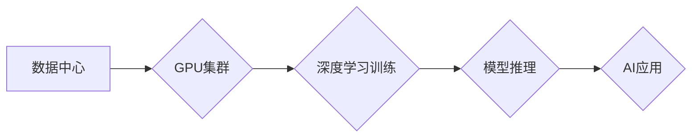

> NVIDIA, GPU, CUDA, 深度学习, 算力, AI, 硬件加速

## 1. 背景介绍

在当今数据爆炸和人工智能（AI）蓬勃发展的时代，强大的算力成为推动科技进步的关键驱动力。传统CPU架构在处理海量数据和复杂计算任务时面临着瓶颈，而NVIDIA的GPU（图形处理单元）凭借其并行计算能力和高性能，成为AI和高性能计算（HPC）领域的明星。

NVIDIA作为全球领先的GPU芯片设计公司，其产品和技术在数据中心、云计算、游戏、汽车等多个领域发挥着至关重要的作用。本文将深入探讨NVIDIA的算力支持，分析其核心概念、算法原理、项目实践以及未来发展趋势。

## 2. 核心概念与联系

**2.1 GPU架构与并行计算**

传统CPU采用串行处理模式，一次只能处理一个指令，而GPU则采用 massively parallel processing（MPP）架构，拥有数千个小型处理单元（CUDA cores），可以同时处理大量数据。这种并行计算能力使得GPU在处理海量数据和复杂计算任务时具有显著优势。

**2.2 CUDA平台与编程模型**

NVIDIA开发了CUDA（Compute Unified Device Architecture）平台，为开发者提供了一套完整的编程模型和工具，方便他们利用GPU进行通用计算。CUDA编程模型基于线程和块的概念，开发者可以将任务分解成多个线程，并将其分配到不同的GPU内核中执行。

**2.3 深度学习与GPU加速**

深度学习算法依赖于大量的计算量，GPU的并行计算能力使其成为深度学习训练和推理的理想平台。NVIDIA推出了专门针对深度学习的GPU架构和软件库，例如Tensor Core和cuDNN，进一步提升了深度学习的性能。

**2.4 算力需求与资源分配**

随着AI应用的不断发展，对算力的需求也在不断增长。NVIDIA提供了一系列GPU产品和解决方案，满足不同规模和应用场景的算力需求。

**Mermaid 流程图**



## 3. 核心算法原理 & 具体操作步骤

**3.1 算法原理概述**

深度学习算法的核心是神经网络，它由多个层级的神经元组成，每个神经元接收输入信号，进行计算并输出信号。通过训练神经网络，使其能够学习数据中的模式和关系，从而实现预测、分类、识别等任务。

**3.2 算法步骤详解**

1. **数据预处理:** 将原始数据转换为深度学习模型可以理解的格式，例如归一化、编码等。
2. **模型构建:** 根据任务需求选择合适的深度学习模型架构，例如卷积神经网络（CNN）、循环神经网络（RNN）等。
3. **模型训练:** 使用训练数据训练模型，调整模型参数，使其能够准确地预测或分类数据。
4. **模型评估:** 使用测试数据评估模型的性能，例如准确率、召回率等。
5. **模型部署:** 将训练好的模型部署到实际应用场景中，例如云平台、边缘设备等。

**3.3 算法优缺点**

**优点:**

* 能够学习复杂数据模式，实现高精度预测。
* 具有泛化能力，能够应用于不同领域的任务。

**缺点:**

* 训练数据量大，训练时间长。
* 模型参数众多，需要大量的计算资源。
* 缺乏可解释性，难以理解模型的决策过程。

**3.4 算法应用领域**

* **图像识别:** 人脸识别、物体检测、图像分类等。
* **自然语言处理:** 文本分类、机器翻译、语音识别等。
* **推荐系统:** 商品推荐、内容推荐等。
* **医疗诊断:** 病理图像分析、疾病预测等。

## 4. 数学模型和公式 & 详细讲解 & 举例说明

**4.1 数学模型构建**

深度学习模型的核心是神经网络，其数学模型可以表示为一系列的线性变换和非线性激活函数。

**4.2 公式推导过程**

* **线性变换:**

$$
y = Wx + b
$$

其中，$x$ 是输入向量，$W$ 是权重矩阵，$b$ 是偏置向量，$y$ 是线性变换后的输出向量。

* **非线性激活函数:**

$$
f(y) = \sigma(y)
$$

其中，$\sigma$ 是非线性激活函数，例如ReLU、Sigmoid等。

**4.3 案例分析与讲解**

假设我们有一个简单的线性回归模型，用于预测房价。输入特征包括房屋面积、房间数量等，输出是房价。

* **线性变换:**

$$
y = Wx + b
$$

其中，$x$ 是房屋面积和房间数量的向量，$W$ 是权重矩阵，$b$ 是偏置项。

* **非线性激活函数:**

$$
f(y) = y
$$

在这个例子中，我们没有使用非线性激活函数，因为线性回归模型本身就是线性模型。

## 5. 项目实践：代码实例和详细解释说明

**5.1 开发环境搭建**

* 安装CUDA Toolkit和cuDNN库。
* 安装深度学习框架，例如TensorFlow、PyTorch等。

**5.2 源代码详细实现**

```python
import tensorflow as tf

# 定义模型
model = tf.keras.models.Sequential([
    tf.keras.layers.Dense(64, activation='relu', input_shape=(2,)),
    tf.keras.layers.Dense(1)
])

# 编译模型
model.compile(optimizer='adam', loss='mse')

# 训练模型
model.fit(x_train, y_train, epochs=10)

# 评估模型
loss = model.evaluate(x_test, y_test)
```

**5.3 代码解读与分析**

* 使用TensorFlow框架定义一个简单的线性回归模型。
* 模型包含两层全连接层，第一层有64个神经元，使用ReLU激活函数，输入维度为2。
* 第二层只有一个神经元，输出房价。
* 使用Adam优化器和均方误差损失函数训练模型。
* 训练10个epoch后，使用测试数据评估模型性能。

**5.4 运行结果展示**

训练完成后，可以查看模型的损失值和预测结果，评估模型的性能。

## 6. 实际应用场景

**6.1 数据中心**

NVIDIA GPU在数据中心广泛应用于高性能计算、机器学习训练、数据分析等领域。

**6.2 云计算**

云服务提供商利用NVIDIA GPU构建高性能计算平台，为用户提供AI和HPC服务。

**6.3 游戏**

NVIDIA GPU是游戏行业的主流显卡，为玩家提供逼真的游戏体验。

**6.4 汽车**

NVIDIA DRIVE平台基于GPU架构，为自动驾驶汽车提供强大的计算能力。

**6.5 未来应用展望**

随着AI技术的不断发展，NVIDIA GPU将在更多领域发挥重要作用，例如医疗诊断、金融风险管理、科学研究等。

## 7. 工具和资源推荐

**7.1 学习资源推荐**

* NVIDIA CUDA官网：https://developer.nvidia.com/cuda-zone
* TensorFlow官网：https://www.tensorflow.org/
* PyTorch官网：https://pytorch.org/

**7.2 开发工具推荐**

* NVIDIA CUDA Toolkit
* NVIDIA cuDNN
* TensorFlow
* PyTorch

**7.3 相关论文推荐**

* Alex Krizhevsky, Ilya Sutskever, Geoffrey E. Hinton. ImageNet Classification with Deep Convolutional Neural Networks. NIPS, 2012.

## 8. 总结：未来发展趋势与挑战

**8.1 研究成果总结**

NVIDIA的GPU算力支持为AI和HPC领域的发展做出了巨大贡献，推动了深度学习算法的进步和应用范围的扩展。

**8.2 未来发展趋势**

* **更高效的GPU架构:** NVIDIA将继续开发更高效、更高性能的GPU架构，例如HBM内存、Tensor Core等。
* **更强大的软件生态:** NVIDIA将继续完善CUDA平台和深度学习框架，提供更丰富的工具和资源。
* **更广泛的应用场景:** NVIDIA GPU将在更多领域发挥作用，例如医疗、金融、科学研究等。

**8.3 面临的挑战**

* **算力需求增长:** AI应用的不断发展，对算力的需求将持续增长，需要不断提升GPU性能和效率。
* **能源消耗:** GPU计算消耗大量能源，需要开发更节能的计算方法和硬件。
* **人才短缺:** AI和HPC领域需要大量高素质人才，人才短缺是制约发展的瓶颈。

**8.4 研究展望**

未来，NVIDIA将继续致力于开发更强大的GPU算力支持，推动AI和HPC技术的进步，为人类社会创造更多价值。

## 9. 附录：常见问题与解答

**9.1 如何选择合适的GPU？**

选择合适的GPU需要根据具体的应用场景和预算进行考虑。

**9.2 如何安装CUDA Toolkit和cuDNN库？**

NVIDIA官网提供详细的安装指南。

**9.3 如何使用TensorFlow或PyTorch框架开发深度学习模型？**

框架官网提供丰富的文档和教程。


作者：禅与计算机程序设计艺术 / Zen and the Art of Computer Programming 
<end_of_turn>