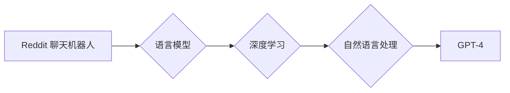

> OpenAI, GPT, 语言模型, 深度学习, 自然语言处理, 聊天机器人, 算法原理, 项目实践

## 1. 背景介绍

OpenAI 是一家致力于确保人工智能造福全人类的非营利人工智能研究公司。自其成立以来，OpenAI 就一直致力于开发和推广安全、可靠、有益于人类的 AI 技术。

OpenAI 的早期项目从一个简单的 Reddit 聊天机器人开始，逐渐发展成为如今强大的语言模型 GPT-4。这个演进过程展现了 OpenAI 在人工智能领域不断探索和创新的精神，以及其技术实力的不断提升。

## 2. 核心概念与联系

### 2.1 语言模型

语言模型是能够理解和生成人类语言的 AI 系统。它通过学习大量的文本数据，掌握语言的语法、语义和上下文关系，从而能够预测下一个词语、生成文本、翻译语言、回答问题等。

### 2.2 深度学习

深度学习是机器学习的一种，它利用多层神经网络来模拟人类大脑的学习过程。深度学习算法能够从海量数据中自动提取特征，学习复杂的模式，从而实现更精准的预测和更强大的功能。

### 2.3 自然语言处理

自然语言处理 (NLP) 是人工智能的一个分支，它致力于使计算机能够理解、处理和生成人类语言。NLP 技术广泛应用于搜索引擎、机器翻译、语音识别、聊天机器人等领域。

**核心概念与联系流程图:**



## 3. 核心算法原理 & 具体操作步骤

### 3.1 算法原理概述

GPT (Generative Pre-trained Transformer) 是一种基于 Transformer 架构的语言模型。Transformer 架构能够有效地处理长距离依赖关系，从而提升语言模型的理解和生成能力。

GPT 模型通过预训练的方式学习语言的表示和关系。预训练阶段，模型会大量学习文本数据，学习语言的语法、语义和上下文关系。在微调阶段，模型会根据特定任务的数据进行训练，例如文本生成、机器翻译、问答等。

### 3.2 算法步骤详解

1. **数据预处理:** 将文本数据进行清洗、分词、标记等预处理操作，使其能够被模型理解。
2. **模型训练:** 使用深度学习算法训练 GPT 模型，学习语言的表示和关系。
3. **模型评估:** 使用测试数据评估模型的性能，例如准确率、流畅度等。
4. **模型微调:** 根据任务需求，对预训练的模型进行微调，使其能够更好地完成特定任务。

### 3.3 算法优缺点

**优点:**

* 强大的文本生成能力
* 能够处理长距离依赖关系
* 预训练模型可以用于多种任务

**缺点:**

* 训练成本高
* 可能存在偏差和错误
* 需要大量的数据进行训练

### 3.4 算法应用领域

* 文本生成: 写作、诗歌创作、代码生成
* 机器翻译: 将一种语言翻译成另一种语言
* 问答系统: 回答用户的问题
* 对话系统: 与用户进行自然语言对话
* 文本摘要: 生成文本的简短摘要

## 4. 数学模型和公式 & 详细讲解 & 举例说明

### 4.1 数学模型构建

GPT 模型的核心是 Transformer 架构，它使用注意力机制来处理文本序列中的长距离依赖关系。

**注意力机制:**

注意力机制允许模型关注输入序列中与当前任务相关的部分，从而提高模型的理解能力。

**公式:**

```latex
Attention(Q, K, V) = softmax(Q K^T / \sqrt{d_k}) V
```

其中:

* Q: 查询矩阵
* K: 键矩阵
* V: 值矩阵
* $d_k$: 键向量的维度

**举例说明:**

假设我们有一个句子 "The cat sat on the mat"，我们想要预测下一个词语。注意力机制会将查询向量与所有词语的键向量进行比较，并计算出每个词语的重要性权重。然后，模型会根据这些权重，将每个词语的值向量加权求和，得到最终的上下文向量。

### 4.2 公式推导过程

注意力机制的公式推导过程比较复杂，涉及到线性变换、矩阵乘法、softmax 函数等操作。

### 4.3 案例分析与讲解

可以通过分析 GPT 模型在不同任务上的表现，例如文本生成、机器翻译、问答等，来更好地理解注意力机制的作用。

## 5. 项目实践：代码实例和详细解释说明

### 5.1 开发环境搭建

* Python 3.7+
* PyTorch 1.7+
* CUDA 10.2+

### 5.2 源代码详细实现

```python
# 导入必要的库
import torch
import torch.nn as nn

# 定义 Transformer 层
class Transformer(nn.Module):
    def __init__(self, d_model, nhead, num_encoder_layers, num_decoder_layers):
        super(Transformer, self).__init__()
        self.encoder = nn.TransformerEncoder(nn.TransformerEncoderLayer(d_model, nhead), num_encoder_layers)
        self.decoder = nn.TransformerDecoder(nn.TransformerDecoderLayer(d_model, nhead), num_decoder_layers)

    def forward(self, src, tgt, src_mask, tgt_mask):
        # Encoder
        encoder_output = self.encoder(src, src_mask)
        # Decoder
        decoder_output = self.decoder(tgt, encoder_output, tgt_mask)
        return decoder_output

# 定义 GPT 模型
class GPT(nn.Module):
    def __init__(self, vocab_size, d_model, nhead, num_encoder_layers, num_decoder_layers):
        super(GPT, self).__init__()
        self.embedding = nn.Embedding(vocab_size, d_model)
        self.transformer = Transformer(d_model, nhead, num_encoder_layers, num_decoder_layers)
        self.linear = nn.Linear(d_model, vocab_size)

    def forward(self, x):
        # Embedding
        x = self.embedding(x)
        # Transformer
        x = self.transformer(x, x, None, None)
        # Linear
        x = self.linear(x)
        return x

# 实例化 GPT 模型
model = GPT(vocab_size=10000, d_model=512, nhead=8, num_encoder_layers=6, num_decoder_layers=6)
```

### 5.3 代码解读与分析

* **Embedding 层:** 将输入的词语转换为向量表示。
* **Transformer 层:** 处理文本序列中的长距离依赖关系。
* **Linear 层:** 将 Transformer 输出的向量表示转换为预测概率分布。

### 5.4 运行结果展示

可以通过将预训练的 GPT 模型应用于文本生成任务，例如生成诗歌、故事等，来展示模型的性能。

## 6. 实际应用场景

### 6.1 文本生成

GPT 模型可以用于生成各种类型的文本，例如：

* **小说、诗歌、剧本:** GPT 模型可以根据给定的主题或关键词生成创意的文本内容。
* **新闻报道、文章:** GPT 模型可以根据新闻事件或主题生成新闻报道或文章。
* **代码生成:** GPT 模型可以根据自然语言描述生成代码。

### 6.2 机器翻译

GPT 模型可以用于将一种语言翻译成另一种语言。

### 6.3 问答系统

GPT 模型可以用于构建问答系统，回答用户的各种问题。

### 6.4 对话系统

GPT 模型可以用于构建对话系统，与用户进行自然语言对话。

### 6.5 其他应用场景

* 文本摘要
* 情感分析
* 语音识别
* 机器人交互

## 7. 工具和资源推荐

### 7.1 学习资源推荐

* **书籍:**
    * "Deep Learning" by Ian Goodfellow, Yoshua Bengio, and Aaron Courville
    * "Speech and Language Processing" by Daniel Jurafsky and James H. Martin
* **在线课程:**
    * Coursera: "Deep Learning Specialization" by Andrew Ng
    * Stanford CS224N: "Natural Language Processing with Deep Learning"

### 7.2 开发工具推荐

* **PyTorch:** 深度学习框架
* **TensorFlow:** 深度学习框架
* **Hugging Face Transformers:** 预训练 Transformer 模型库

### 7.3 相关论文推荐

* "Attention Is All You Need" by Vaswani et al. (2017)
* "BERT: Pre-training of Deep Bidirectional Transformers for Language Understanding" by Devlin et al. (2018)
* "GPT-3: Language Models are Few-Shot Learners" by Brown et al. (2020)

## 8. 总结：未来发展趋势与挑战

### 8.1 研究成果总结

OpenAI 的早期项目从 Reddit 聊天机器人到 GPT-4，展现了人工智能领域不断进步的趋势。

GPT 模型的成功证明了深度学习在自然语言处理领域的巨大潜力，并为未来的 AI 应用提供了新的方向。

### 8.2 未来发展趋势

* **模型规模更大:** 未来 GPT 模型的规模将会进一步扩大，从而提升其理解和生成能力。
* **多模态学习:** 未来 GPT 模型将能够处理多种模态数据，例如文本、图像、音频等。
* **更强的可解释性:** 未来 GPT 模型的决策过程将更加透明，更容易被人类理解。

### 8.3 面临的挑战

* **数据偏见:** GPT 模型的训练数据可能存在偏见，导致模型输出结果存在偏差。
* **安全风险:** GPT 模型可能被用于生成虚假信息、进行恶意攻击等。
* **伦理问题:** GPT 模型的应用可能引发一些伦理问题，例如隐私保护、责任归属等。

### 8.4 研究展望

未来研究将重点关注解决 GPT 模型面临的挑战，并探索其在更多领域的应用。

## 9. 附录：常见问题与解答

* **GPT 模型是如何训练的？**

GPT 模型通过预训练和微调的方式进行训练。预训练阶段，模型会学习大量的文本数据，学习语言的表示和关系。微调阶段，模型会根据特定任务的数据进行训练，使其能够更好地完成特定任务。

* **GPT 模型的输出结果如何评估？**

GPT 模型的输出结果可以通过多种指标进行评估，例如准确率、流畅度、多样性等。

* **GPT 模型的应用场景有哪些？**

GPT 模型的应用场景非常广泛，例如文本生成、机器翻译、问答系统、对话系统等。

作者：禅与计算机程序设计艺术 / Zen and the Art of Computer Programming


<end_of_turn>