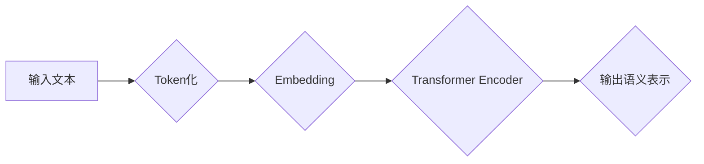

> Transformer, BERT, 自然语言处理, 深度学习, 预训练模型, 文本理解

## 1. 背景介绍

自然语言处理 (NLP) 领域近年来取得了飞速发展，深度学习技术的应用推动了 NLP 领域的新突破。其中，Transformer 架构的出现，彻底改变了 NLP 的发展方向，并催生了一系列强大的预训练语言模型，例如 BERT、GPT 等。

BERT (Bidirectional Encoder Representations from Transformers) 是 Google AI 团队于 2018 年提出的一个基于 Transformer 架构的预训练语言模型。BERT 凭借其强大的文本理解能力，在各种 NLP 任务中取得了优异的成绩，例如文本分类、问答系统、情感分析等。

## 2. 核心概念与联系

BERT 的核心概念是利用 Transformer 架构的注意力机制和双向编码，学习语言的上下文语义表示。

**Transformer 架构**

Transformer 架构是一种新型的神经网络架构，它摒弃了传统的循环神经网络 (RNN) 的顺序处理方式，采用并行处理的方式，能够有效地处理长序列数据。Transformer 架构的核心组件是注意力机制和多头注意力机制。

**注意力机制**

注意力机制能够学习到输入序列中不同词的重要性，并赋予它们不同的权重，从而更好地理解上下文语义。

**双向编码**

BERT 使用双向编码的方式，即不仅考虑了当前词的前文信息，也考虑了后文信息，从而能够更全面地理解词语的语义。

**BERT 的工作原理**

BERT 的工作原理可以概括为以下几个步骤：

1. **预训练:** BERT 在大量的文本数据上进行预训练，学习到语言的上下文语义表示。
2. **微调:** 将预训练好的 BERT 模型微调到具体的 NLP 任务上。
3. **预测:** 使用微调后的 BERT 模型对输入文本进行预测。

**Mermaid 流程图**



## 3. 核心算法原理 & 具体操作步骤

### 3.1  算法原理概述

BERT 的核心算法是 Transformer 架构，它通过多层编码器和注意力机制来学习语言的上下文语义表示。

**Transformer Encoder**

Transformer Encoder 由多个编码器层组成，每个编码器层包含以下组件：

* **多头注意力机制:** 用于学习输入序列中不同词之间的关系。
* **前馈神经网络:** 用于对每个词的表示进行非线性变换。
* **残差连接:** 用于缓解梯度消失问题。

**注意力机制**

注意力机制的核心思想是学习到输入序列中不同词的重要性，并赋予它们不同的权重。

**多头注意力机制**

多头注意力机制是多个注意力机制的并行组合，能够学习到不同类型的语义关系。

### 3.2  算法步骤详解

BERT 的训练过程可以概括为以下步骤：

1. **数据预处理:** 将文本数据进行 token 化、词嵌入等预处理操作。
2. **模型训练:** 使用预训练好的 BERT 模型，在大量的文本数据上进行训练，学习到语言的上下文语义表示。
3. **模型微调:** 将预训练好的 BERT 模型微调到具体的 NLP 任务上。
4. **模型评估:** 使用微调后的 BERT 模型对测试数据进行预测，并评估模型的性能。

### 3.3  算法优缺点

**优点:**

* 强大的文本理解能力
* 能够处理长序列数据
* 预训练模型可以用于多种 NLP 任务

**缺点:**

* 计算资源消耗大
* 训练时间长

### 3.4  算法应用领域

BERT 在以下领域具有广泛的应用:

* 文本分类
* 问答系统
* 情感分析
* 机器翻译
* 文本摘要

## 4. 数学模型和公式 & 详细讲解 & 举例说明

### 4.1  数学模型构建

BERT 的数学模型主要基于 Transformer 架构，其核心组件是多头注意力机制和前馈神经网络。

**多头注意力机制**

多头注意力机制的数学公式如下:

$$
Attention(Q, K, V) = softmax(\frac{QK^T}{\sqrt{d_k}})V
$$

其中:

* $Q$ 是查询矩阵
* $K$ 是键矩阵
* $V$ 是值矩阵
* $d_k$ 是键向量的维度

**前馈神经网络**

前馈神经网络是一个多层感知机，其数学公式如下:

$$
f(x) = \sigma(W_2 \sigma(W_1 x + b_1) + b_2)
$$

其中:

* $x$ 是输入向量
* $W_1$ 和 $W_2$ 是权重矩阵
* $b_1$ 和 $b_2$ 是偏置向量
* $\sigma$ 是激活函数

### 4.2  公式推导过程

多头注意力机制的公式推导过程可以参考 Transformer 原文论文。

### 4.3  案例分析与讲解

假设我们有一个句子 "The cat sat on the mat"，我们使用多头注意力机制来学习每个词之间的关系。

在计算注意力权重时，每个词的查询向量 $Q$、键向量 $K$ 和值向量 $V$ 会被计算出来。然后，通过计算 $QK^T$ 和 softmax 函数，得到每个词对其他词的注意力权重。

通过注意力权重，我们可以得到每个词的上下文语义表示，例如，"cat" 的上下文语义表示会受到 "The"、"sat" 和 "on" 的影响。

## 5. 项目实践：代码实例和详细解释说明

### 5.1  开发环境搭建

BERT 的开发环境搭建需要以下软件:

* Python 3.6+
* TensorFlow 或 PyTorch
* CUDA 和 cuDNN (可选)

### 5.2  源代码详细实现

BERT 的源代码可以从 Hugging Face 库中获取:

```python
from transformers import BertTokenizer, BertModel

# 初始化 tokenizer 和模型
tokenizer = BertTokenizer.from_pretrained('bert-base-uncased')
model = BertModel.from_pretrained('bert-base-uncased')

# 对文本进行 token 化
input_text = "This is a sample text."
input_ids = tokenizer.encode(input_text, add_special_tokens=True)

# 使用模型进行前向传播
outputs = model(input_ids)

# 获取模型输出
last_hidden_states = outputs.last_hidden_state
```

### 5.3  代码解读与分析

* `BertTokenizer` 用于将文本转换为 token，并生成对应的 token ID。
* `BertModel` 是 BERT 模型的实现，它包含 Transformer Encoder 和注意力机制。
* `model(input_ids)` 进行前向传播，得到模型输出。
* `last_hidden_state` 是每个词的上下文语义表示。

### 5.4  运行结果展示

运行上述代码后，会得到每个词的上下文语义表示，这些表示可以用于后续的 NLP 任务。

## 6. 实际应用场景

BERT 在以下实际应用场景中取得了成功:

* **搜索引擎:** BERT 可以用于理解用户搜索意图，并返回更相关的搜索结果。
* **聊天机器人:** BERT 可以用于训练更智能的聊天机器人，能够更好地理解用户对话内容。
* **文本摘要:** BERT 可以用于自动生成文本摘要，提取文本的关键信息。

### 6.4  未来应用展望

BERT 的未来应用前景广阔，例如:

* **多语言理解:** 将 BERT 扩展到多语言领域，实现跨语言的文本理解。
* **知识图谱构建:** 利用 BERT 学习文本中的知识关系，构建知识图谱。
* **代码生成:** 利用 BERT 学习代码的语法和语义，实现代码生成。

## 7. 工具和资源推荐

### 7.1  学习资源推荐

* **BERT 原文论文:** https://arxiv.org/abs/1810.04805
* **Hugging Face BERT 库:** https://huggingface.co/transformers/
* **TensorFlow BERT 实现:** https://github.com/tensorflow/models/tree/master/official/nlp/bert

### 7.2  开发工具推荐

* **Jupyter Notebook:** 用于代码编写和实验
* **VS Code:** 用于代码编写和调试

### 7.3  相关论文推荐

* **GPT:** https://arxiv.org/abs/1810.04805
* **XLNet:** https://arxiv.org/abs/1906.08237
* **RoBERTa:** https://arxiv.org/abs/1907.11692

## 8. 总结：未来发展趋势与挑战

### 8.1  研究成果总结

BERT 的出现标志着 NLP 领域取得了新的突破，它为文本理解任务提供了强大的工具。

### 8.2  未来发展趋势

未来，BERT 的发展趋势包括:

* **模型规模的扩大:** 训练更大的 BERT 模型，提升其文本理解能力。
* **模型的泛化能力增强:** 使 BERT 模型能够更好地适应不同的 NLP 任务和领域。
* **模型的效率提升:** 降低 BERT 模型的计算资源消耗和训练时间。

### 8.3  面临的挑战

BERT 仍然面临一些挑战，例如:

* **数据标注成本高:** BERT 的训练需要大量的标注数据，数据标注成本较高。
* **模型解释性差:** BERT 的内部机制复杂，难以解释其决策过程。
* **公平性问题:** BERT 模型可能存在偏见，需要进行公平性评估和改进。

### 8.4  研究展望

未来，研究者将继续探索 BERT 的应用潜力，并解决其面临的挑战，推动 NLP 领域的发展。

## 9. 附录：常见问题与解答

**Q1: BERT 的训练需要多少数据？**

A1: BERT 的训练需要大量的文本数据，通常需要数十亿个词。

**Q2: BERT 的训练时间有多长？**

A2: BERT 的训练时间取决于模型规模和训练数据量，通常需要数周甚至数月。

**Q3: BERT 可以用于哪些 NLP 任务？**

A3: BERT 可以用于多种 NLP 任务，例如文本分类、问答系统、情感分析等。

作者：禅与计算机程序设计艺术 / Zen and the Art of Computer Programming


<end_of_turn>