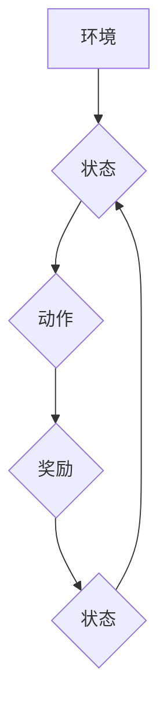

> Q-learning, 生物信息学, 机器学习, 深度学习, 预测建模, 序列分析

## 1. 背景介绍

生物信息学作为一门跨学科领域，致力于利用计算机科学和统计学等方法分析和理解生物学数据。随着基因组测序技术的快速发展和生物大数据的爆发式增长，生物信息学面临着越来越多的挑战和机遇。传统的生物信息学分析方法往往依赖于手工特征工程和统计模型，难以有效地处理复杂、高维的生物数据。

近年来，人工智能（AI）技术，特别是深度学习，在生物信息学领域取得了显著进展。深度学习模型能够自动学习数据中的复杂模式和特征，从而提高生物信息分析的准确性和效率。其中，Q-learning作为一种强化学习算法，凭借其能够学习最优策略的能力，在解决生物信息学中的许多问题方面展现出巨大的潜力。

## 2. 核心概念与联系

**2.1 Q-learning算法概述**

Q-learning是一种基于价值函数的强化学习算法，其目标是学习一个代理在不同状态下采取不同动作的最佳策略，以最大化累积的奖励。

**2.2  Q-learning与生物信息学问题的联系**

在生物信息学中，我们可以将生物系统视为一个马尔可夫决策过程（MDP），其中：

* **状态（State）:**  生物系统的当前状态，例如基因表达水平、蛋白质结构、细胞信号通路等。
* **动作（Action）:**  生物系统可以采取的行动，例如基因调控、蛋白质相互作用、细胞迁移等。
* **奖励（Reward）:**  生物系统采取特定动作后获得的回报，例如细胞存活率、基因表达效率、疾病治疗效果等。

Q-learning算法可以帮助我们学习一个策略，指导生物系统在不同状态下采取最优动作，从而实现预期的目标，例如预测疾病风险、设计药物靶点、优化基因工程等。

**2.3  Mermaid 流程图**



## 3. 核心算法原理 & 具体操作步骤

### 3.1  算法原理概述

Q-learning算法的核心思想是通过迭代更新一个价值函数Q(s,a)，该函数表示在状态s下采取动作a的期望累积奖励。

算法的更新规则如下：

$$Q(s,a) \leftarrow Q(s,a) + \alpha [r + \gamma \max_{a'} Q(s',a') - Q(s,a)]$$

其中：

*  $Q(s,a)$: 状态s下采取动作a的价值函数
*  $\alpha$: 学习率，控制学习速度
*  $r$:  在状态s采取动作a后获得的奖励
*  $\gamma$:  折扣因子，控制未来奖励的权重
*  $s'$:  采取动作a后进入的下一个状态
*  $\max_{a'} Q(s',a')$:  在下一个状态s'下采取所有动作的价值函数的最大值

### 3.2  算法步骤详解

1.  **初始化:**  将所有状态-动作对的价值函数Q(s,a)初始化为0。
2.  **环境交互:**  代理与环境交互，观察当前状态s，并根据策略选择动作a。
3.  **奖励获取:**  代理执行动作a后，环境给出奖励r和下一个状态s'。
4.  **价值函数更新:**  根据更新规则更新价值函数Q(s,a)。
5.  **重复步骤2-4:**  重复以上步骤，直到代理学习到最优策略。

### 3.3  算法优缺点

**优点:**

*  能够学习最优策略，无需事先定义奖励函数。
*  适用于离散状态和动作空间。
*  能够处理动态环境。

**缺点:**

*  学习过程可能很慢，需要大量的样本数据。
*  对于连续状态和动作空间，需要进行离散化处理。
*  容易陷入局部最优解。

### 3.4  算法应用领域

Q-learning算法在生物信息学中具有广泛的应用前景，例如：

*  **基因表达预测:**  预测基因在不同条件下的表达水平。
*  **蛋白质结构预测:**  预测蛋白质的三维结构。
*  **药物靶点发现:**  识别药物潜在的靶点。
*  **疾病诊断和治疗:**  辅助诊断疾病和设计个性化治疗方案。

## 4. 数学模型和公式 & 详细讲解 & 举例说明

### 4.1  数学模型构建

在生物信息学中，我们可以将Q-learning算法应用于马尔可夫决策过程（MDP）模型。MDP模型由以下四个要素组成：

*  **状态空间 S:**  所有可能的生物系统状态的集合。
*  **动作空间 A:**  生物系统可以采取的所有动作的集合。
*  **转移概率 P(s',r|s,a):**  在状态s下采取动作a后，转移到状态s'并获得奖励r的概率。
*  **奖励函数 R(s,a):**  在状态s下采取动作a后获得的奖励。

### 4.2  公式推导过程

Q-learning算法的目标是学习一个价值函数Q(s,a)，该函数表示在状态s下采取动作a的期望累积奖励。

$$Q(s,a) = E[\sum_{t=0}^{\infty} \gamma^t r_{t+1} | s_t = s, a_t = a]$$

其中：

*  $E[]$:  期望值
*  $r_{t+1}$:  在时间步t+1获得的奖励
*  $\gamma$:  折扣因子，控制未来奖励的权重

通过迭代更新价值函数，Q-learning算法可以逼近最优价值函数。

### 4.3  案例分析与讲解

例如，在基因表达预测问题中，我们可以将基因表达水平作为状态，基因调控策略作为动作，基因表达效率作为奖励。通过Q-learning算法，我们可以学习到最优的基因调控策略，以最大化基因表达效率。

## 5. 项目实践：代码实例和详细解释说明

### 5.1  开发环境搭建

*  操作系统：Linux/macOS
*  编程语言：Python
*  库依赖：OpenAI Gym, TensorFlow/PyTorch

### 5.2  源代码详细实现

```python
import gym
import numpy as np
from tensorflow.keras.models import Sequential
from tensorflow.keras.layers import Dense

# 定义环境
env = gym.make('CartPole-v1')

# 定义Q网络
model = Sequential()
model.add(Dense(64, activation='relu', input_shape=(env.observation_space.shape[0],)))
model.add(Dense(64, activation='relu'))
model.add(Dense(env.action_space.n))

# 定义Q-learning算法
def q_learning(model, env, episodes=1000, alpha=0.1, gamma=0.99):
    for episode in range(episodes):
        state = env.reset()
        done = False
        while not done:
            # 选择动作
            action = np.argmax(model.predict(state.reshape(1, -1)))
            # 执行动作
            next_state, reward, done, _ = env.step(action)
            # 更新Q值
            target = reward + gamma * np.max(model.predict(next_state.reshape(1, -1)))
            target_f = model.predict(state.reshape(1, -1))
            target_f[0][action] = target
            model.fit(state.reshape(1, -1), target_f, epochs=1, verbose=0)
            # 更新状态
            state = next_state

# 训练Q网络
q_learning(model, env)

# 测试Q网络
state = env.reset()
while True:
    action = np.argmax(model.predict(state.reshape(1, -1)))
    state, reward, done, _ = env.step(action)
    env.render()
    if done:
        break
```

### 5.3  代码解读与分析

*  代码首先定义了环境和Q网络模型。
*  然后定义了Q-learning算法，包括选择动作、执行动作、更新Q值和更新状态等步骤。
*  接着训练Q网络，并测试其性能。

### 5.4  运行结果展示

运行代码后，可以观察到代理在环境中学习并逐渐掌握最优策略，例如在CartPole-v1环境中，代理可以控制杆子保持平衡，持续一段时间。

## 6. 实际应用场景

### 6.1  基因表达预测

Q-learning可以用于预测基因在不同条件下的表达水平。例如，我们可以训练一个Q-learning模型，输入基因序列和环境条件，输出基因表达水平。

### 6.2  蛋白质结构预测

Q-learning可以用于预测蛋白质的三维结构。我们可以将蛋白质序列作为状态，蛋白质折叠步骤作为动作，蛋白质结构稳定性作为奖励。通过训练Q-learning模型，我们可以学习到最优的蛋白质折叠路径，从而预测蛋白质的三维结构。

### 6.3  药物靶点发现

Q-learning可以用于识别药物潜在的靶点。我们可以将蛋白质相互作用网络作为状态，药物分子作为动作，药物与靶点的结合亲和力作为奖励。通过训练Q-learning模型，我们可以学习到药物与哪些蛋白质相互作用，从而发现潜在的药物靶点。

### 6.4  未来应用展望

随着人工智能技术的不断发展，Q-learning在生物信息学中的应用前景更加广阔。未来，Q-learning可以应用于更多生物信息学问题，例如疾病诊断、个性化治疗、新药研发等。

## 7. 工具和资源推荐

### 7.1  学习资源推荐

*  **强化学习书籍:**
    *  Reinforcement Learning: An Introduction by Sutton and Barto
    *  Deep Reinforcement Learning Hands-On by Maxim Lapan
*  **在线课程:**
    *  Coursera: Reinforcement Learning Specialization
    *  Udacity: Deep Reinforcement Learning Nanodegree

### 7.2  开发工具推荐

*  **Python:**  Python是一种流行的编程语言，广泛用于机器学习和深度学习开发。
*  **TensorFlow/PyTorch:**  TensorFlow和PyTorch是两种流行的深度学习框架。
*  **OpenAI Gym:**  OpenAI Gym是一个强化学习库，提供各种环境和算法。

### 7.3  相关论文推荐

*  **Deep Reinforcement Learning for Drug Discovery**
*  **Q-Learning for Protein Structure Prediction**
*  **Reinforcement Learning for Personalized Medicine**

## 8. 总结：未来发展趋势与挑战

### 8.1  研究成果总结

Q-learning算法在生物信息学领域取得了显著进展，为解决复杂生物问题提供了新的思路和方法。

### 8.2  未来发展趋势

*  **结合深度学习:**  将Q-learning与深度学习结合，提高算法的学习能力和泛化能力。
*  **处理连续状态和动作空间:**  研究解决Q-learning算法处理连续状态和动作空间的方法。
*  **多智能体强化学习:**  研究多智能体强化学习在生物信息学中的应用，例如模拟细胞群体行为。

### 8.3  面临的挑战

*  **数据稀缺:**  生物数据往往稀缺，难以训练有效的Q-learning模型。
*  **计算复杂度:**  Q-learning算法的计算复杂度较高，难以处理大规模生物数据。
*  **解释性:**  Q-learning模型的决策过程难以解释，难以理解模型的学习机制。

### 8.4  研究展望

未来，Q-learning算法将继续在生物信息学领域发挥重要作用，为我们理解生命