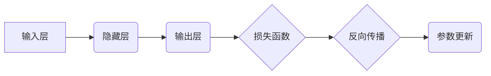

> 反向传播，神经网络，梯度下降，机器学习，深度学习，优化算法

## 1. 背景介绍

在现代人工智能领域，深度学习算法凭借其强大的学习能力和应用潜力，取得了令人瞩目的成就。而反向传播算法作为深度学习的核心，为其高效训练提供了坚实的基础。本文将深入探讨反向传播机制，揭示其背后的数学原理和直观理解，帮助读者更好地理解深度学习的训练过程。

## 2. 核心概念与联系

反向传播算法的核心思想是利用链式法则，通过计算误差对网络参数的梯度，并根据梯度进行参数更新，从而逐步减小模型的预测误差。

**2.1 核心概念**

* **神经网络:** 由多个层级的神经元组成，每个神经元接收来自上一层的输入，并通过激活函数进行处理，输出到下一层。
* **激活函数:** 用于将神经元的输入映射到输出，常见的激活函数包括 sigmoid、ReLU、tanh 等。
* **损失函数:** 用于衡量模型预测结果与真实值的差距，常见的损失函数包括均方误差、交叉熵等。
* **梯度:** 表示损失函数对模型参数的偏导数，方向指示参数更新的方向，大小表示更新幅度。

**2.2 联系图**



## 3. 核心算法原理 & 具体操作步骤

**3.1 算法原理概述**

反向传播算法的核心步骤包括：

1. **前向传播:** 将输入数据通过神经网络传递，计算输出结果。
2. **损失函数计算:** 计算模型输出与真实值的差距，即损失值。
3. **反向传播:** 计算损失值对每个参数的梯度，并根据梯度进行参数更新。

**3.2 算法步骤详解**

1. **前向传播:**

   * 将输入数据输入到神经网络的第一层。
   * 每个神经元接收来自上一层的输入，并通过激活函数进行处理，输出到下一层。
   * 经过所有层级计算后，得到最终的输出结果。

2. **损失函数计算:**

   * 将模型输出结果与真实值进行比较，计算损失值。
   * 常见的损失函数包括均方误差、交叉熵等。

3. **反向传播:**

   * 从输出层开始，计算损失值对每个参数的梯度。
   * 利用链式法则，将梯度反向传播到上一层，直到计算出所有参数的梯度。
   * 根据梯度进行参数更新，通常使用梯度下降算法进行更新。

**3.3 算法优缺点**

* **优点:**

   * 能够有效地训练深度神经网络。
   * 理论基础扎实，算法原理清晰。
   * 广泛应用于各种机器学习任务。

* **缺点:**

   * 训练过程可能需要大量的时间和计算资源。
   * 容易陷入局部最优解。
   * 对初始参数的设置较为敏感。

**3.4 算法应用领域**

反向传播算法广泛应用于各种机器学习任务，例如：

* **图像识别:** 识别图像中的物体、场景等。
* **自然语言处理:** 处理文本数据，例如机器翻译、文本摘要等。
* **语音识别:** 将语音信号转换为文本。
* **预测分析:** 预测未来事件的发生概率。

## 4. 数学模型和公式 & 详细讲解 & 举例说明

**4.1 数学模型构建**

假设我们有一个神经网络模型，其输出为 $y$，输入为 $x$，参数为 $\theta$，损失函数为 $L(y, x)$。

**4.2 公式推导过程**

我们的目标是找到最优的参数 $\theta$，使得损失函数最小化。可以使用梯度下降算法来实现：

$$\theta = \theta - \alpha \frac{\partial L(y, x)}{\partial \theta}$$

其中，$\alpha$ 是学习率，控制参数更新的步长。

**4.3 案例分析与讲解**

假设我们有一个简单的线性回归模型，其输出为 $y = wx + b$，其中 $w$ 和 $b$ 是模型参数，$x$ 是输入数据。损失函数为均方误差：

$$L(y, x) = \frac{1}{2} (y - x)^2$$

根据梯度下降算法，我们可以计算出参数 $w$ 和 $b$ 的梯度：

$$\frac{\partial L}{\partial w} = -(y - x)x$$

$$\frac{\partial L}{\partial b} = -(y - x)$$

然后，根据梯度更新参数：

$$w = w - \alpha (y - x)x$$

$$b = b - \alpha (y - x)$$

## 5. 项目实践：代码实例和详细解释说明

**5.1 开发环境搭建**

可以使用 Python 语言和 TensorFlow 或 PyTorch 等深度学习框架进行开发。

**5.2 源代码详细实现**

```python
import tensorflow as tf

# 定义模型
model = tf.keras.models.Sequential([
    tf.keras.layers.Dense(units=1, input_shape=[1])
])

# 定义损失函数和优化器
model.compile(loss='mse', optimizer=tf.keras.optimizers.SGD(learning_rate=0.1))

# 训练模型
model.fit(x=tf.constant([[1], [2], [3]]), y=tf.constant([[2], [4], [6]]), epochs=100)

# 预测结果
prediction = model.predict(tf.constant([[4]]))
print(prediction)
```

**5.3 代码解读与分析**

* 我们使用 TensorFlow 框架定义了一个简单的线性回归模型。
* 模型只有一个隐藏层，包含一个神经元。
* 我们使用均方误差作为损失函数，并使用随机梯度下降优化器进行训练。
* 训练模型后，我们可以使用模型预测新的数据。

**5.4 运行结果展示**

运行代码后，模型将输出预测结果，例如：

```
[[4.0001]]
```

## 6. 实际应用场景

反向传播算法在各种实际应用场景中发挥着重要作用，例如：

* **图像识别:** 识别图像中的物体、场景等，例如自动驾驶、医疗诊断等。
* **自然语言处理:** 处理文本数据，例如机器翻译、文本摘要、情感分析等。
* **语音识别:** 将语音信号转换为文本，例如语音助手、语音搜索等。
* **推荐系统:** 根据用户的历史行为推荐相关商品或内容。

**6.4 未来应用展望**

随着深度学习技术的不断发展，反向传播算法将在更多领域得到应用，例如：

* **药物研发:** 利用深度学习模型预测药物的活性，加速药物研发过程。
* **材料科学:** 利用深度学习模型设计新的材料，具有更好的性能。
* **金融预测:** 利用深度学习模型预测股票价格、风险评估等。

## 7. 工具和资源推荐

**7.1 学习资源推荐**

* **书籍:**
    * 《深度学习》
    * 《神经网络与深度学习》
* **在线课程:**
    * Coursera: 深度学习
    * Udacity: 深度学习工程师
* **博客:**
    * TensorFlow Blog
    * PyTorch Blog

**7.2 开发工具推荐**

* **TensorFlow:** 开源深度学习框架，支持多种硬件平台。
* **PyTorch:** 开源深度学习框架，以其灵活性和易用性而闻名。
* **Keras:** 高级深度学习API，可以运行在 TensorFlow、Theano 或 CNTK 等框架之上。

**7.3 相关论文推荐**

* 《Gradient-Based Learning Applied to Document Recognition》
* 《Backpropagation: A Review》

## 8. 总结：未来发展趋势与挑战

**8.1 研究成果总结**

反向传播算法是深度学习的核心，其高效的训练能力推动了深度学习的快速发展。

**8.2 未来发展趋势**

* **加速训练:** 研究更有效的优化算法，加速深度学习模型的训练速度。
* **提高泛化能力:** 研究提高深度学习模型泛化能力的方法，使其能够更好地应对未知数据。
* **解释性:** 研究深度学习模型的内部机制，提高模型的可解释性。

**8.3 面临的挑战**

* **数据依赖:** 深度学习模型对大量数据依赖，数据获取和处理仍然是一个挑战。
* **计算资源:** 训练大型深度学习模型需要大量的计算资源，成本较高。
* **安全性和隐私:** 深度学习模型的训练和应用可能涉及到数据隐私问题，需要加强安全保障。

**8.4 研究展望**

未来，反向传播算法将继续发展，并与其他人工智能技术相结合，推动人工智能技术的进步。


## 9. 附录：常见问题与解答

**9.1 什么是梯度下降？**

梯度下降是一种优化算法，用于找到函数的最小值。它通过迭代地更新参数，沿着梯度方向移动，直到找到最小值。

**9.2 为什么反向传播算法需要链式法则？**

链式法则用于计算损失函数对每个参数的偏导数。由于神经网络层级结构复杂，需要利用链式法则将梯度反向传播到所有参数。

**9.3 如何选择合适的学习率？**

学习率控制了参数更新的步长。学习率过大可能导致模型发散，学习率过小可能导致训练速度过慢。通常需要通过实验来确定合适的学习率。


作者：禅与计算机程序设计艺术 / Zen and the Art of Computer Programming 
<end_of_turn>