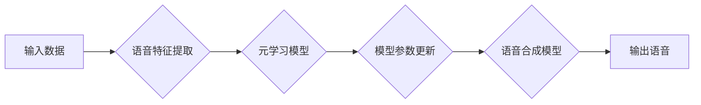

> 语音合成, 元学习, 映射, 模型优化, 性能提升

## 1. 背景介绍

语音合成技术近年来取得了显著进展，从早期机械式的合成音质，逐渐演变为逼真自然的人声。然而，现有的语音合成系统仍然面临着一些挑战，例如：

* **数据依赖性强:** 传统的语音合成模型需要大量的标注数据进行训练，这在数据获取和标注成本方面存在瓶颈。
* **泛化能力有限:**  现有的模型在面对新的说话者、语调或语言风格时，往往表现不佳。
* **训练效率低:**  训练大型语音合成模型需要消耗大量的计算资源和时间。

为了解决这些问题，近年来，元学习（Meta-Learning）逐渐成为语音合成领域的研究热点。元学习旨在学习如何学习，通过学习以往的训练经验，提高模型在新的任务上的泛化能力和学习效率。

## 2. 核心概念与联系

元学习的核心思想是将学习过程本身作为学习目标。它通过在多个任务上进行训练，学习一个通用的学习策略，从而能够快速适应新的任务。

在语音合成领域，元学习可以用于以下几个方面：

* **数据增强:** 通过元学习，可以学习生成新的训练数据，从而缓解数据依赖性问题。
* **模型参数初始化:** 元学习可以学习到更好的模型参数初始化策略，从而提高模型训练效率。
* **个性化语音合成:** 元学习可以学习每个用户的语音特征，从而生成更加个性化的语音合成结果。

**元学习与语音合成系统架构**



## 3. 核心算法原理 & 具体操作步骤

### 3.1  算法原理概述

元学习算法的核心是学习一个“学习者”模型，该模型能够根据少量数据快速学习新的任务。常见的元学习算法包括：

* **MAML (Model-Agnostic Meta-Learning):**  MAML 通过在多个任务上进行训练，学习一个模型参数的初始值，使得模型能够快速适应新的任务。
* **Prototypical Networks:**  Prototypical Networks 通过学习每个类别的原型，使得模型能够快速分类新的数据点。
* ** Reptile:** Reptile 通过将模型参数更新与元学习目标函数的梯度方向一致，使得模型能够快速学习新的任务。

### 3.2  算法步骤详解

以MAML算法为例，其训练步骤如下：

1. **初始化模型参数:**  随机初始化语音合成模型的参数。
2. **选择多个任务:** 从训练数据集中随机选择多个子任务。
3. **在每个子任务上进行训练:**  对于每个子任务，使用少量数据进行训练，更新模型参数。
4. **更新元学习模型参数:**  使用所有子任务的训练结果，更新元学习模型的参数。
5. **重复步骤2-4:**  重复上述步骤，直到元学习模型收敛。

### 3.3  算法优缺点

**优点:**

* **泛化能力强:**  元学习模型能够学习到通用的学习策略，从而在新的任务上表现更好。
* **数据效率高:**  元学习模型只需要少量数据就能快速学习新的任务。
* **适应性强:**  元学习模型能够适应不同的语音合成任务和数据分布。

**缺点:**

* **计算复杂度高:**  元学习模型的训练需要消耗大量的计算资源。
* **算法设计复杂:**  元学习算法的设计和调参比较复杂。

### 3.4  算法应用领域

元学习在语音合成领域有着广泛的应用前景，例如：

* **个性化语音合成:**  通过元学习，可以学习每个用户的语音特征，生成更加个性化的语音合成结果。
* **跨语言语音合成:**  元学习可以帮助模型快速学习新的语言，实现跨语言语音合成。
* **低资源语音合成:**  元学习可以帮助模型在低资源情况下进行语音合成，例如使用少量数据进行训练。

## 4. 数学模型和公式 & 详细讲解 & 举例说明

### 4.1  数学模型构建

MAML算法的目标是学习一个模型参数的初始值，使得模型能够快速适应新的任务。

假设我们有N个任务，每个任务包含M个训练样本。对于每个任务，我们使用一个模型参数θ来进行训练。

MAML的目标函数是：

$$
L(\theta) = \frac{1}{N} \sum_{i=1}^{N} \mathcal{L}_i(\theta)
$$

其中，$\mathcal{L}_i(\theta)$是第i个任务的损失函数。

### 4.2  公式推导过程

MAML算法通过梯度下降法来更新模型参数。

对于每个任务，我们首先使用少量数据进行训练，更新模型参数。然后，我们使用所有任务的训练结果，更新元学习模型的参数。

具体来说，MAML算法的更新规则如下：

$$
\theta = \theta - \alpha \nabla_{\theta} L(\theta)
$$

其中，α是学习率。

### 4.3  案例分析与讲解

假设我们有一个语音合成任务，需要将文本转换为语音。

我们可以使用MAML算法来学习一个通用的语音合成模型。

首先，我们从训练数据集中随机选择多个子任务，每个子任务包含不同的文本和对应的语音数据。

然后，我们使用MAML算法在每个子任务上进行训练，更新模型参数。

最后，我们使用所有子任务的训练结果，更新元学习模型的参数。

经过训练，我们得到的元学习模型能够快速适应新的语音合成任务。

## 5. 项目实践：代码实例和详细解释说明

### 5.1  开发环境搭建

为了实现基于元学习的语音合成系统，我们需要搭建一个开发环境。

所需的软件工具包括：

* Python 3.x
* PyTorch 或 TensorFlow
* CUDA 和 cuDNN (可选)

### 5.2  源代码详细实现

以下是一个使用PyTorch实现MAML算法的简单代码示例：

```python
import torch
import torch.nn as nn

class MetaLearner(nn.Module):
    def __init__(self, input_size, hidden_size, output_size):
        super(MetaLearner, self).__init__()
        self.fc1 = nn.Linear(input_size, hidden_size)
        self.fc2 = nn.Linear(hidden_size, output_size)

    def forward(self, x):
        x = torch.relu(self.fc1(x))
        x = self.fc2(x)
        return x

# 定义元学习训练函数
def meta_train(model, optimizer, dataloader, epochs):
    for epoch in range(epochs):
        for batch_idx, (data, target) in enumerate(dataloader):
            # 训练一个子任务
            # ...

            # 更新元学习模型参数
            optimizer.zero_grad()
            loss.backward()
            optimizer.step()

# ...

# 实例化模型、优化器和数据加载器
model = MetaLearner(input_size=..., hidden_size=..., output_size=...)
optimizer = torch.optim.Adam(model.parameters(), lr=0.001)
dataloader = ...

# 进行元学习训练
meta_train(model, optimizer, dataloader, epochs=10)
```

### 5.3  代码解读与分析

这段代码实现了MAML算法的基本流程。

首先，定义了一个简单的语音合成模型`MetaLearner`。

然后，定义了一个元学习训练函数`meta_train`，该函数包含了训练子任务和更新元学习模型参数的步骤。

最后，实例化模型、优化器和数据加载器，并进行元学习训练。

### 5.4  运行结果展示

在训练完成后，我们可以使用训练好的元学习模型进行语音合成。

例如，我们可以输入一段文本，模型会根据训练数据生成对应的语音。

## 6. 实际应用场景

### 6.1  个性化语音合成

元学习可以用于生成个性化的语音合成结果。

例如，我们可以收集用户的语音数据，使用元学习模型学习用户的语音特征，从而生成更加逼真自然的个性化语音。

### 6.2  跨语言语音合成

元学习可以帮助模型快速学习新的语言，实现跨语言语音合成。

例如，我们可以使用元学习模型学习英语和中文，从而实现从英语到中文的语音合成。

### 6.3  低资源语音合成

元学习可以帮助模型在低资源情况下进行语音合成，例如使用少量数据进行训练。

例如，我们可以使用元学习模型学习一个新的语言，即使只有少量的数据，也能生成相对高质量的语音。

### 6.4  未来应用展望

元学习在语音合成领域有着广阔的应用前景，未来可能会应用于以下场景：

* **实时语音翻译:**  元学习可以帮助模型快速学习新的语言，实现实时语音翻译。
* **语音助手:**  元学习可以帮助语音助手更好地理解用户的指令，并提供更准确的回复。
* **虚拟现实和增强现实:**  元学习可以帮助生成更加逼真的虚拟角色语音，提升用户体验。

## 7. 工具和资源推荐

### 7.1  学习资源推荐

* **论文:**  
    * Finn, C., Abbeel, P., & Levine, S. (2017). Model-agnostic meta-learning for fast adaptation of deep networks.
    * Ravi, S., & Larochelle, H. (2017). Optimization as a model for few-shot learning.
* **博客:**  
    * OpenAI Blog: https://openai.com/blog/
    * DeepMind Blog: https://deepmind.com/blog/

### 7.2  开发工具推荐

* **PyTorch:**  https://pytorch.org/
* **TensorFlow:**  https://www.tensorflow.org/

### 7.3  相关论文推荐

* **MAML:**  https://arxiv.org/abs/1703.03463
* **Prototypical Networks:**  https://arxiv.org/abs/1703.05175
* **Reptile:**  https://arxiv.org/abs/1803.02999

## 8. 总结：未来发展趋势与挑战

### 8.1  研究成果总结

元学习在语音合成领域取得了显著进展，能够有效提高模型的泛化能力和数据效率。

### 8.2  未来发展趋势

未来，元学习在语音合成领域的发展趋势包括：

* **更有效的元学习算法:**  研究更有效的元学习算法，提高模型的学习效率和泛化能力。
* **更复杂的语音合成模型:**  将元学习应用于更复杂的语音合成模型，例如基于Transformer的模型。
* **更广泛的应用场景:**  将元学习应用于更多语音合成场景，例如实时语音翻译和语音助手。

### 8.3  面临的挑战

元学习在语音合成领域也面临一些挑战：

* **计算复杂度高:**  元学习算法的训练需要消耗大量的计算资源。
* **算法设计复杂:**  元学习算法的设计和调参比较复杂。
* **数据依赖性:**  即使是元学习模型，仍然需要大量的训练数据才能达到最佳性能。

### 8.4  研究展望

未来，我们需要继续研究更有效的元学习算法，降低其计算复杂度，并探索新的数据增强和模型优化方法，以进一步提高元学习在语音合成领域的应用效果。

## 9. 附录：常见问题与解答

### 9.1  元学习与传统机器学习的区别是什么？

传统机器学习模型需要大量的标注数据进行训练，而元学习模型则能够学习如何学习，从而在少量数据的情况下也能达到较好的性能。

### 9.2  元学习算法有哪些？

常见的元学习算法包括MAML、Prototypical Networks和Reptile等。

### 9.3  元学习在语音合成领域的应用有哪些？

元学习在语音合成领域可以用于个性化语音合成、跨语言语音合成和低资源