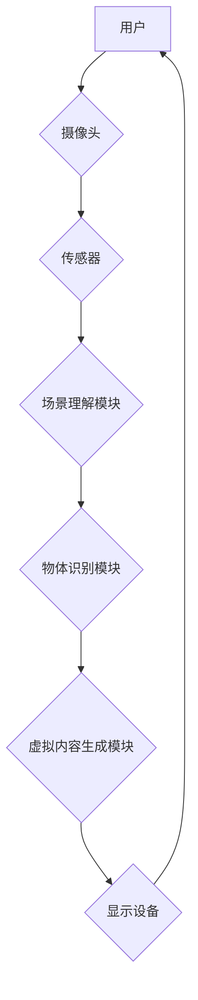

> 增强现实(AR)、人工智能(AI)、计算机视觉、深度学习、场景理解、物体识别、映射技术、交互体验

## 1. 背景介绍

增强现实(AR)技术正在迅速发展，它将虚拟信息叠加到现实世界中，为用户提供一种全新的交互体验。随着人工智能(AI)技术的进步，AR技术获得了更强大的驱动力，AI算法能够更好地理解和交互于现实世界，从而赋予AR更丰富的功能和更智能的体验。

传统的AR系统主要依赖于预先定义的场景和规则，其交互体验相对单一。而AI驱动的AR系统则能够通过学习和理解现实世界，动态生成虚拟内容，并根据用户的行为和意图进行智能交互。这使得AR技术能够应用于更广泛的领域，例如游戏、教育、医疗、零售等。

## 2. 核心概念与联系

**2.1 增强现实(AR)**

增强现实(AR)是一种叠加虚拟信息到现实世界中的技术，它通过摄像头、传感器等设备捕捉现实场景，并利用计算机图形学技术将虚拟内容渲染到现实世界中，从而为用户提供一种增强现实的体验。

**2.2 人工智能(AI)**

人工智能(AI)是指模拟人类智能的计算机系统，它能够学习、推理、决策等，并能够根据学习到的知识和经验进行智能交互。

**2.3 AI驱动的AR**

AI驱动的AR是指利用人工智能技术增强增强现实体验的技术。AI算法能够帮助AR系统更好地理解和交互于现实世界，例如：

* **场景理解:** AI算法能够分析现实场景，识别物体、人物、环境等，并构建场景模型。
* **物体识别:** AI算法能够识别现实世界中的物体，并将其与虚拟内容进行关联。
* **行为预测:** AI算法能够预测用户的行为，并根据预测结果动态生成虚拟内容。
* **个性化体验:** AI算法能够根据用户的喜好和需求，提供个性化的AR体验。

**2.4 架构图**



## 3. 核心算法原理 & 具体操作步骤

**3.1 算法原理概述**

AI驱动的AR系统主要依赖于以下核心算法：

* **深度学习:** 深度学习算法能够从大量数据中学习特征，并用于场景理解、物体识别等任务。
* **计算机视觉:** 计算机视觉算法能够处理图像和视频数据，用于场景分析、物体检测等任务。
* **自然语言处理:** 自然语言处理算法能够理解和处理人类语言，用于用户与AR系统的交互。

**3.2 算法步骤详解**

1. **数据采集:** 使用摄像头和传感器采集现实场景的数据。
2. **数据预处理:** 对采集到的数据进行预处理，例如图像增强、特征提取等。
3. **场景理解:** 使用深度学习算法对场景进行理解，识别物体、人物、环境等。
4. **物体识别:** 使用计算机视觉算法识别现实世界中的物体，并将其与虚拟内容进行关联。
5. **虚拟内容生成:** 根据场景理解和物体识别结果，生成虚拟内容，并将其叠加到现实世界中。
6. **交互反馈:** 用户与虚拟内容进行交互，系统根据用户的行为进行反馈，例如调整虚拟内容的位置、大小、颜色等。

**3.3 算法优缺点**

**优点:**

* **智能交互:** AI算法能够理解和响应用户的意图，提供更智能的交互体验。
* **个性化体验:** AI算法能够根据用户的喜好和需求，提供个性化的AR体验。
* **动态生成:** AI算法能够根据场景变化动态生成虚拟内容，提供更丰富的体验。

**缺点:**

* **数据依赖:** AI算法需要大量数据进行训练，数据质量直接影响算法性能。
* **计算资源:** AI算法的计算量较大，需要强大的计算资源支持。
* **伦理问题:** AI驱动的AR系统可能存在伦理问题，例如隐私泄露、信息操控等。

**3.4 算法应用领域**

* **游戏:** 提供更沉浸式的游戏体验，例如AR游戏、虚拟角色互动等。
* **教育:** 提供更直观的学习体验，例如虚拟实验室、3D模型展示等。
* **医疗:** 提供更精准的诊断和治疗方案，例如虚拟手术模拟、病灶定位等。
* **零售:** 提供更便捷的购物体验，例如虚拟试衣、产品展示等。

## 4. 数学模型和公式 & 详细讲解 & 举例说明

**4.1 数学模型构建**

在AI驱动的AR系统中，常用的数学模型包括：

* **场景表示模型:** 用于表示现实场景的几何结构、材质属性等信息。常用的模型包括点云、三角网格等。
* **物体识别模型:** 用于识别现实世界中的物体，常用的模型包括卷积神经网络(CNN)、循环神经网络(RNN)等。
* **虚拟内容生成模型:** 用于生成虚拟内容，常用的模型包括3D建模软件、图形渲染引擎等。

**4.2 公式推导过程**

例如，在物体识别任务中，可以使用CNN模型进行物体分类。CNN模型的输出是一个概率分布，表示物体属于不同类别 的概率。

假设输入图像为I，输出概率分布为P(C|I)，其中C表示物体类别。则可以使用交叉熵损失函数来训练CNN模型：

$$
L = - \sum_{c \in C} y_c \log P(c|I)
$$

其中，$y_c$表示真实类别标签，$P(c|I)$表示模型预测的类别概率。

**4.3 案例分析与讲解**

例如，在AR游戏应用中，可以使用物体识别模型识别现实世界中的物体，并将其与虚拟角色进行交互。例如，用户可以通过AR游戏与虚拟宠物进行互动，虚拟宠物会根据用户的动作做出相应的反应。

## 5. 项目实践：代码实例和详细解释说明

**5.1 开发环境搭建**

* 操作系统: Ubuntu 20.04
* Python 版本: 3.8
* 深度学习框架: TensorFlow 2.0
* 计算机视觉库: OpenCV

**5.2 源代码详细实现**

```python
import tensorflow as tf
from tensorflow.keras.models import Sequential
from tensorflow.keras.layers import Conv2D, MaxPooling2D, Flatten, Dense

# 定义物体识别模型
model = Sequential()
model.add(Conv2D(32, (3, 3), activation='relu', input_shape=(224, 224, 3)))
model.add(MaxPooling2D((2, 2)))
model.add(Conv2D(64, (3, 3), activation='relu'))
model.add(MaxPooling2D((2, 2)))
model.add(Flatten())
model.add(Dense(10, activation='softmax'))

# 编译模型
model.compile(optimizer='adam',
              loss='categorical_crossentropy',
              metrics=['accuracy'])

# 训练模型
model.fit(train_data, train_labels, epochs=10)

# 预测结果
predictions = model.predict(test_data)
```

**5.3 代码解读与分析**

* 代码首先定义了一个简单的CNN模型，用于物体识别。
* 模型包含多个卷积层和池化层，用于提取图像特征。
* 最后添加一个全连接层，用于分类。
* 模型使用Adam优化器、交叉熵损失函数和准确率作为评估指标进行训练。

**5.4 运行结果展示**

训练完成后，模型能够识别不同类型的物体，并输出相应的类别概率。

## 6. 实际应用场景

**6.1 游戏**

* AR游戏：例如Pokemon GO，用户可以通过手机摄像头捕捉到现实世界中的虚拟精灵，并与之互动。
* 虚拟角色互动：用户可以与虚拟角色进行对话、游戏等互动，体验更沉浸式的游戏体验。

**6.2 教育**

* 虚拟实验室：学生可以在虚拟实验室中进行实验操作，体验真实的实验过程。
* 3D模型展示：学生可以查看3D模型的内部结构，更好地理解物体结构。

**6.3 医疗**

* 虚拟手术模拟：医生可以通过虚拟手术模拟器进行手术练习，提高手术技能。
* 病灶定位：医生可以使用AR技术在患者体内定位病灶，进行更精准的治疗。

**6.4 未来应用展望**

* 更智能的交互体验：AI算法能够更好地理解用户的意图，提供更自然、更智能的交互体验。
* 更丰富的虚拟内容：AI算法能够根据场景变化动态生成虚拟内容，提供更丰富的体验。
* 更广泛的应用领域：AI驱动的AR技术将应用于更多领域，例如工业、制造、设计等。

## 7. 工具和资源推荐

**7.1 学习资源推荐**

* **书籍:**
    * 深度学习
    * 人工智能
    * 增强现实技术
* **在线课程:**
    * Coursera
    * edX
    * Udacity

**7.2 开发工具推荐**

* **AR开发平台:**
    * ARKit (iOS)
    * ARCore (Android)
    * Unity
    * Unreal Engine
* **深度学习框架:**
    * TensorFlow
    * PyTorch
    * Keras

**7.3 相关论文推荐**

* **物体识别:**
    * AlexNet
    * VGGNet
    * ResNet
* **场景理解:**
    * PointNet
    * Mask R-CNN
    * YOLO

## 8. 总结：未来发展趋势与挑战

**8.1 研究成果总结**

AI驱动的AR技术取得了显著的进展，在场景理解、物体识别、虚拟内容生成等方面取得了突破。

**8.2 未来发展趋势**

* 更智能的交互体验：AI算法将更加智能，能够更好地理解用户的意图，提供更自然、更智能的交互体验。
* 更丰富的虚拟内容：AI算法将能够生成更逼真的虚拟内容，提供更丰富的体验。
* 更广泛的应用领域：AI驱动的AR技术将应用于更多领域，例如工业、制造、设计等。

**8.3 面临的挑战**

* 数据依赖：AI算法需要大量数据进行训练，数据质量直接影响算法性能。
* 计算资源：AI算法的计算量较大，需要强大的计算资源支持。
* 伦理问题：AI驱动的AR系统可能存在伦理问题，例如隐私泄露、信息操控等。

**8.4 研究展望**

未来研究将重点关注以下方面：

* 提高AI算法的泛化能力，使其能够适应不同的场景和数据。
* 开发更轻量级的AI算法，使其能够在移动设备上运行。
* 研究AI驱动的AR系统的伦理问题，并制定相应的规范和标准。

## 9. 附录：常见问题与解答

**9.1 如何搭建AI驱动的AR开发环境？**

参考5.1节中的开发环境搭建步骤。

**9.2 如何训练AI模型？**

参考5.2节中的代码实现，并根据实际需求调整模型结构和训练参数。

**9.3 AI驱动的AR系统有哪些伦理问题？**

AI驱动的AR系统可能存在隐私泄露、信息操控、虚假信息传播等伦理问题。

**9.4 未来AI驱动的AR技术发展方向？**

未来AI驱动的AR技术将更加智能、更加丰富、更加广泛地应用于各个领域。

作者：禅与计算机程序设计艺术 / Zen and the Art of Computer Programming


<end_of_turn>