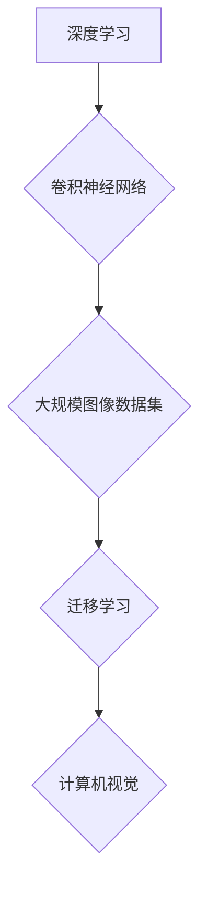

> 深度学习，图像识别，卷积神经网络，大规模数据集，迁移学习，计算机视觉

## 1. 背景介绍

在当今数据爆炸的时代，图像数据已成为信息的重要载体。从医疗诊断到自动驾驶，从人脸识别到艺术创作，图像处理技术在各个领域发挥着越来越重要的作用。深度学习作为机器学习领域的一项重要突破，为图像处理带来了革命性的改变。

传统的图像处理方法依赖于人工设计的特征提取算法，而深度学习则通过多层神经网络自动学习图像特征，从而实现更准确、更鲁棒的图像识别和理解。

大规模图像数据集是深度学习模型训练和优化的关键。这些数据集包含大量的标记图像，为模型提供丰富的学习样本，帮助模型学习更复杂的图像模式和语义。

## 2. 核心概念与联系

**2.1 深度学习**

深度学习是一种机器学习的子领域，它利用多层人工神经网络来模拟人类大脑的学习过程。深度学习模型能够自动从数据中学习特征，无需人工特征工程。

**2.2 卷积神经网络 (CNN)**

卷积神经网络 (CNN) 是一种专门用于处理图像数据的深度学习模型。CNN 利用卷积操作和池化操作来提取图像特征，并通过全连接层进行分类或识别。

**2.3 大规模图像数据集**

大规模图像数据集是指包含大量标记图像的数据集。这些数据集通常由公开的数据库或专门收集的图像组成。

**2.4 迁移学习**

迁移学习是一种利用预训练模型进行新任务学习的技术。通过在大型数据集上预训练模型，可以获得强大的特征提取能力，然后将预训练模型迁移到新的任务中，只需少量的数据即可达到良好的性能。

**2.5 计算机视觉**

计算机视觉是人工智能的一个分支，它致力于使计算机能够“看”和理解图像。计算机视觉技术广泛应用于图像识别、物体检测、图像分割、场景理解等领域。

**2.6 Mermaid 流程图**



## 3. 核心算法原理 & 具体操作步骤

### 3.1 算法原理概述

深度学习模型，特别是卷积神经网络 (CNN)，通过多层神经网络结构来学习图像特征。

* **卷积层:** 卷积层使用卷积核 (filter) 对图像进行卷积操作，提取图像局部特征。
* **池化层:** 池化层对卷积层的输出进行降维操作，减少计算量并提高模型鲁棒性。
* **全连接层:** 全连接层将池化层的输出连接起来，进行分类或识别。

### 3.2 算法步骤详解

1. **数据预处理:** 将图像数据预处理，例如调整大小、归一化等。
2. **模型构建:** 设计 CNN 模型结构，包括卷积层、池化层和全连接层。
3. **模型训练:** 使用大规模图像数据集训练模型，调整模型参数以最小化损失函数。
4. **模型评估:** 使用测试数据集评估模型性能，例如准确率、召回率等。
5. **模型部署:** 将训练好的模型部署到实际应用场景中。

### 3.3 算法优缺点

**优点:**

* **自动特征提取:** CNN 可以自动学习图像特征，无需人工设计。
* **高准确率:** CNN 在图像识别任务中取得了state-of-the-art的性能。
* **鲁棒性:** CNN 对图像噪声和变形具有较强的鲁棒性。

**缺点:**

* **计算量大:** 训练 CNN 模型需要大量的计算资源。
* **数据依赖:** CNN 模型的性能依赖于训练数据的质量和数量。
* **可解释性差:** CNN 模型的决策过程难以解释。

### 3.4 算法应用领域

* **图像识别:** 人脸识别、物体检测、场景理解等。
* **医疗诊断:** 病灶检测、疾病诊断等。
* **自动驾驶:** 车辆识别、道路场景理解等。
* **安防监控:** 人员跟踪、异常行为检测等。

## 4. 数学模型和公式 & 详细讲解 & 举例说明

### 4.1 数学模型构建

CNN 模型的数学模型主要包括卷积操作、池化操作和激活函数。

**4.1.1 卷积操作:**

卷积操作使用卷积核 (filter) 对图像进行滑动计算，提取图像局部特征。卷积核是一个小的矩阵，其元素代表着图像像素之间的权重。卷积操作的数学公式如下：

$$
y_{i,j} = \sum_{m=0}^{M-1} \sum_{n=0}^{N-1} x_{i+m,j+n} * w_{m,n}
$$

其中：

* $y_{i,j}$ 是卷积输出的像素值。
* $x_{i+m,j+n}$ 是输入图像的像素值。
* $w_{m,n}$ 是卷积核的权重。
* $M$ 和 $N$ 是卷积核的大小。

**4.1.2 池化操作:**

池化操作对卷积层的输出进行降维操作，减少计算量并提高模型鲁棒性。常见的池化操作包括最大池化和平均池化。

**4.1.3 激活函数:**

激活函数用于引入非线性，使模型能够学习更复杂的特征。常见的激活函数包括ReLU、Sigmoid和Tanh。

### 4.2 公式推导过程

卷积操作的公式推导过程可以参考相关机器学习教材或论文。

### 4.3 案例分析与讲解

例如，在图像分类任务中，CNN 模型可以学习到不同物体特征，并将其映射到不同的类别。

## 5. 项目实践：代码实例和详细解释说明

### 5.1 开发环境搭建

使用 Python 语言和深度学习框架 TensorFlow 或 PyTorch 进行开发。

### 5.2 源代码详细实现

```python
import tensorflow as tf

# 定义 CNN 模型
model = tf.keras.models.Sequential([
    tf.keras.layers.Conv2D(32, (3, 3), activation='relu', input_shape=(28, 28, 1)),
    tf.keras.layers.MaxPooling2D((2, 2)),
    tf.keras.layers.Conv2D(64, (3, 3), activation='relu'),
    tf.keras.layers.MaxPooling2D((2, 2)),
    tf.keras.layers.Flatten(),
    tf.keras.layers.Dense(10, activation='softmax')
])

# 编译模型
model.compile(optimizer='adam',
              loss='sparse_categorical_crossentropy',
              metrics=['accuracy'])

# 训练模型
model.fit(x_train, y_train, epochs=10)

# 评估模型
loss, accuracy = model.evaluate(x_test, y_test)
print('Test loss:', loss)
print('Test accuracy:', accuracy)
```

### 5.3 代码解读与分析

* **定义 CNN 模型:** 使用 TensorFlow 的 Keras API 定义 CNN 模型结构。
* **编译模型:** 使用 Adam 优化器、交叉熵损失函数和准确率指标编译模型。
* **训练模型:** 使用训练数据训练模型，设置训练轮数为 10。
* **评估模型:** 使用测试数据评估模型性能，打印测试损失和准确率。

### 5.4 运行结果展示

训练完成后，可以查看模型的训练和测试损失以及准确率曲线，评估模型的性能。

## 6. 实际应用场景

### 6.1 医疗诊断

CNN 可以用于分析医学图像，例如 X 光片、CT 扫描和 MRI 图像，辅助医生诊断疾病。

### 6.2 自动驾驶

CNN 可以用于识别道路场景、车辆和行人，帮助自动驾驶汽车进行决策。

### 6.3 人脸识别

CNN 可以用于识别人脸，用于身份验证、安全监控和人脸搜索等应用。

### 6.4 未来应用展望

随着大规模图像数据集的不断积累和深度学习技术的不断发展，CNN 在未来将有更广泛的应用场景，例如：

* **智能家居:** 使用 CNN 分析家庭场景图像，实现智能家居设备的控制和自动化。
* **个性化推荐:** 使用 CNN 分析用户画像和消费行为，提供个性化商品推荐。
* **艺术创作:** 使用 CNN 生成艺术作品，例如绘画、音乐和诗歌。

## 7. 工具和资源推荐

### 7.1 学习资源推荐

* **书籍:**
    * 深度学习 (Deep Learning) - Ian Goodfellow, Yoshua Bengio, Aaron Courville
    * 构建深度学习模型 (Hands-On Machine Learning with Scikit-Learn, Keras & TensorFlow) - Aurélien Géron
* **在线课程:**
    * 深度学习 Specialization - Andrew Ng (Coursera)
    * fast.ai - Practical Deep Learning for Coders

### 7.2 开发工具推荐

* **深度学习框架:** TensorFlow, PyTorch, Keras
* **图像处理库:** OpenCV, Pillow

### 7.3 相关论文推荐

* AlexNet: ImageNet Classification with Deep Convolutional Neural Networks (Krizhevsky et al., 2012)
* VGGNet: Very Deep Convolutional Networks for Large-Scale Image Recognition (Simonyan & Zisserman, 2014)
* ResNet: Deep Residual Learning for Image Recognition (He et al., 2015)

## 8. 总结：未来发展趋势与挑战

### 8.1 研究成果总结

深度学习在图像处理领域取得了显著的成果，特别是 CNN 在图像识别、物体检测和场景理解等任务中取得了state-of-the-art的性能。

### 8.2 未来发展趋势

* **模型更深更广:** 研究更深层次和更广阔的 CNN 模型，提高模型的表达能力和泛化能力。
* **数据更丰富更多样:** 收集和构建更丰富、更多样化的图像数据集，提高模型的鲁棒性和泛化能力。
* **模型解释性更强:** 研究更易于解释的 CNN 模型，提高模型的可信度和可解释性。
* **边缘计算:** 将深度学习模型部署到边缘设备上，实现实时图像处理和分析。

### 8.3 面临的挑战

* **计算资源:** 训练大型 CNN 模型需要大量的计算资源，这对于资源有限的机构或个人来说是一个挑战。
* **数据标注:** 大规模图像数据集的标注工作非常耗时和费力，这限制了深度学习模型的训练和应用。
* **模型可解释性:** 深度学习模型的决策过程难以解释，这对于一些安全关键的应用来说是一个挑战。

### 8.4 研究展望

未来，深度学习在图像处理领域将继续取得突破性进展，为我们带来更多创新应用。


## 9. 附录：常见问题与解答

**Q1: 如何选择合适的 CNN 模型架构？**

**A1:** 选择合适的 CNN 模型架构取决于具体的应用场景和数据集。对于图像分类任务，可以考虑使用 AlexNet、VGGNet 或 ResNet 等经典模型架构。

**Q2: 如何处理图像数据？**

**A2:** 图像数据需要进行预处理，例如调整大小、归一化等，以提高模型的训练效率和性能。

**Q3: 如何评估 CNN 模型的性能？**

**A3:** 可以使用准确率、召回率、F1-score 等指标评估 CNN 模型的性能。

**Q4: 如何提高 CNN 模型的性能？**

**A4:** 可以尝试使用更大的数据集、更深的模型架构、更优的优化算法等方法提高 CNN 模型的性能。


作者：禅与计算机程序设计艺术 / Zen and the Art of Computer Programming 
<end_of_turn>