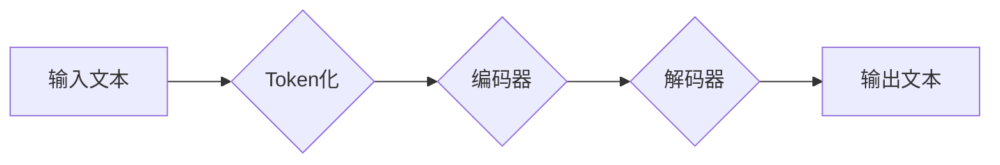

> ChatGPT, 语言模型, 大模型, 训练数据, 算力, 知识图谱, 产业应用, 核心技术, 创新驱动

## 1. 背景介绍

ChatGPT的横空出世，如同人工智能领域的一颗耀眼星辰，其强大的文本生成能力和广泛的应用场景，引发了全球范围内对人工智能的热议。作为一款由OpenAI开发的开源大型语言模型，ChatGPT能够理解和生成人类语言，并完成各种复杂的任务，例如：

* **文本生成:** 写作故事、诗歌、文章、代码等。
* **对话系统:** 与用户进行自然流畅的对话，提供信息和服务。
* **翻译:** 将文本从一种语言翻译成另一种语言。
* **总结:** 提取文本的关键信息，生成摘要。
* **问答:** 回答用户提出的问题，提供相关信息。

ChatGPT的成功，标志着人工智能技术迈向了新的里程碑，也为中国带来了新的机遇和挑战。

## 2. 核心概念与联系

ChatGPT的核心是基于Transformer架构的深度学习模型，它能够学习和理解语言的复杂结构和语义关系。

**Mermaid 流程图:**



**核心概念:**

* **Transformer:**  一种新型的神经网络架构，能够有效地处理序列数据，例如文本。
* **编码器-解码器:**  Transformer模型通常由编码器和解码器两部分组成，编码器负责将输入文本编码成向量表示，解码器则根据编码后的向量生成输出文本。
* **注意力机制:**  Transformer模型中使用注意力机制，能够学习到文本中不同词语之间的关系，从而更好地理解文本的语义。

**联系:**

ChatGPT的强大功能来自于其核心概念的巧妙结合。Transformer架构的强大处理能力，编码器-解码器的结构设计，以及注意力机制的应用，共同使得ChatGPT能够理解和生成人类语言。

## 3. 核心算法原理 & 具体操作步骤

### 3.1  算法原理概述

ChatGPT的核心算法是基于Transformer架构的深度学习模型，其训练目标是最大化预测下一个词语的概率。

**具体步骤:**

1. **数据预处理:** 将文本数据进行清洗、分词、标记等预处理操作。
2. **模型训练:** 使用训练数据训练Transformer模型，通过反向传播算法不断调整模型参数，使其能够更好地预测下一个词语。
3. **模型评估:** 使用测试数据评估模型的性能，例如准确率、困惑度等。
4. **模型部署:** 将训练好的模型部署到服务器上，供用户使用。

### 3.2  算法步骤详解

1. **Token化:** 将输入文本分割成一个个独立的词语或子词，称为Token。
2. **编码:** 将Token转化为向量表示，每个Token对应一个向量，向量维度通常较高。
3. **注意力机制:**  模型使用注意力机制计算每个Token之间的关系，并根据关系权重调整每个Token的向量表示。
4. **解码:**  解码器根据编码后的向量序列，逐个预测下一个词语的概率分布。
5. **输出:**  根据概率分布选择最可能的词语，并将其添加到输出文本中。

### 3.3  算法优缺点

**优点:**

* **强大的文本生成能力:**  能够生成流畅、自然的文本。
* **广泛的应用场景:**  可用于对话系统、文本摘要、机器翻译等多个领域。
* **可训练性强:**  可以通过调整模型参数和训练数据，提高模型性能。

**缺点:**

* **训练成本高:**  需要大量的计算资源和训练数据。
* **存在偏差和错误:**  模型的输出可能存在偏差和错误，需要进行后续的校正和改进。
* **缺乏真实世界知识:**  模型的知识主要来自于训练数据，缺乏对真实世界事件和知识的理解。

### 3.4  算法应用领域

ChatGPT的应用领域非常广泛，包括：

* **客服机器人:**  提供24小时在线客服服务，解答用户疑问。
* **内容创作:**  辅助作家、记者等撰写文章、故事、剧本等。
* **教育辅助:**  帮助学生学习、答疑解惑。
* **科研辅助:**  协助科研人员进行文献综述、数据分析等工作。

## 4. 数学模型和公式 & 详细讲解 & 举例说明

### 4.1  数学模型构建

ChatGPT的核心数学模型是基于Transformer架构的深度学习模型，其主要包含以下几个部分:

* **编码器:**  用于将输入文本序列编码成固定长度的向量表示。
* **解码器:**  用于根据编码后的向量序列生成输出文本序列。
* **注意力机制:**  用于计算每个词语之间的关系，并根据关系权重调整词语的向量表示。

### 4.2  公式推导过程

Transformer模型的训练目标是最大化预测下一个词语的概率。

**公式:**

$$
P(y_t|x_1, x_2, ..., x_{t-1})
$$

其中:

* $y_t$ 是第t个词语。
* $x_1, x_2, ..., x_{t-1}$ 是输入文本序列的前t-1个词语。

**推导过程:**

1. 将输入文本序列编码成向量表示。
2. 使用注意力机制计算每个词语之间的关系。
3. 根据注意力权重调整词语的向量表示。
4. 将编码后的向量序列输入解码器。
5. 解码器根据向量序列预测下一个词语的概率分布。
6. 选择概率最高的词语作为输出。

### 4.3  案例分析与讲解

**案例:**

输入文本: "今天天气真好"

**分析:**

模型会将输入文本序列编码成向量表示，并使用注意力机制计算每个词语之间的关系。例如，"今天"和"天气"之间存在语义关联，模型会赋予它们更高的注意力权重。解码器根据编码后的向量序列，预测下一个词语可能是"适合"、"出去玩"等。

## 5. 项目实践：代码实例和详细解释说明

### 5.1  开发环境搭建

ChatGPT的开发环境需要具备以下条件:

* **硬件:**  强大的GPU加速器，例如NVIDIA Tesla V100。
* **软件:**  Python编程语言、深度学习框架TensorFlow或PyTorch、必要的库和工具。

### 5.2  源代码详细实现

ChatGPT的源代码开源，可以在GitHub上找到。

**代码示例:**

```python
# 使用TensorFlow训练ChatGPT模型
import tensorflow as tf

# 定义模型结构
model = tf.keras.Sequential([
    # ...
])

# 编译模型
model.compile(optimizer='adam', loss='categorical_crossentropy', metrics=['accuracy'])

# 训练模型
model.fit(train_data, train_labels, epochs=10)
```

### 5.3  代码解读与分析

代码示例展示了使用TensorFlow训练ChatGPT模型的基本步骤。

* **定义模型结构:**  根据Transformer架构设计模型结构，包括编码器、解码器和注意力机制。
* **编译模型:**  选择优化器、损失函数和评价指标。
* **训练模型:**  使用训练数据训练模型，并记录训练过程中的损失值和准确率。

### 5.4  运行结果展示

训练完成后，可以使用测试数据评估模型的性能。

**结果展示:**

* **准确率:**  模型在测试数据上的准确率。
* **困惑度:**  模型预测下一个词语的困惑度，越低表示模型预测能力越强。

## 6. 实际应用场景

ChatGPT在多个领域都有着广泛的应用场景:

### 6.1  客服机器人

ChatGPT可以被用于构建智能客服机器人，能够24小时在线解答用户疑问，提高客户服务效率。

### 6.2  内容创作

ChatGPT可以辅助作家、记者等撰写文章、故事、剧本等，提高创作效率和质量。

### 6.3  教育辅助

ChatGPT可以帮助学生学习、答疑解惑，提供个性化的学习辅导。

### 6.4  未来应用展望

ChatGPT的未来应用前景广阔，例如:

* **个性化推荐:**  根据用户的兴趣爱好，推荐个性化的内容和服务。
* **虚拟助手:**  成为用户的虚拟助手，帮助他们完成各种任务。
* **跨语言沟通:**  打破语言障碍，实现跨语言的沟通和交流。

## 7. 工具和资源推荐

### 7.1  学习资源推荐

* **书籍:**  《深度学习》、《自然语言处理》
* **在线课程:**  Coursera、edX、Udacity等平台上的深度学习和自然语言处理课程。
* **开源项目:**  HuggingFace、GitHub等平台上的开源语言模型项目。

### 7.2  开发工具推荐

* **深度学习框架:**  TensorFlow、PyTorch
* **编程语言:**  Python
* **云计算平台:**  AWS、Google Cloud、Azure

### 7.3  相关论文推荐

* **Attention Is All You Need:**  Transformer模型的奠基论文。
* **BERT: Pre-training of Deep Bidirectional Transformers for Language Understanding:**  BERT模型的论文。
* **GPT-3: Language Models are Few-Shot Learners:**  GPT-3模型的论文。

## 8. 总结：未来发展趋势与挑战

### 8.1  研究成果总结

ChatGPT的成功，标志着人工智能技术在自然语言处理领域取得了重大突破。

### 8.2  未来发展趋势

ChatGPT的未来发展趋势包括:

* **模型规模更大:**  训练更大的模型，提升模型性能。
* **多模态理解:**  融合文本、图像、音频等多模态数据，实现更全面的理解。
* **个性化定制:**  根据用户的需求，定制个性化的模型和应用。

### 8.3  面临的挑战

ChatGPT的发展也面临着一些挑战:

* **数据安全:**  模型训练需要大量数据，如何保证数据安全和隐私保护是一个重要问题。
* **算法偏见:**  模型的输出可能存在偏见，需要进行算法调优和数据清洗。
* **伦理问题:**  ChatGPT的应用可能引发一些伦理问题，例如信息操纵、虚假信息传播等，需要进行伦理规范和监管。

### 8.4  研究展望

未来，我们需要继续加强对ChatGPT等模型的研究，探索其更广泛的应用场景，并解决其面临的挑战，推动人工智能技术向更安全、更可靠、更普惠的方向发展。

## 9. 附录：常见问题与解答

**常见问题:**

* **ChatGPT的训练数据是什么？**
* **ChatGPT的模型参数有多少？**
* **如何使用ChatGPT进行文本生成？**
* **ChatGPT的开源代码在哪里可以找到？**

**解答:**

* **ChatGPT的训练数据包括大量的文本数据，例如书籍、文章、代码等。**
* **ChatGPT的模型参数数量非常庞大，通常在数十亿甚至数百亿级别。**
* **可以使用ChatGPT的API进行文本生成，也可以下载开源代码进行本地部署。**
* **ChatGPT的开源代码可以在GitHub上找到。**


作者：禅与计算机程序设计艺术 / Zen and the Art of Computer Programming 
<end_of_turn>