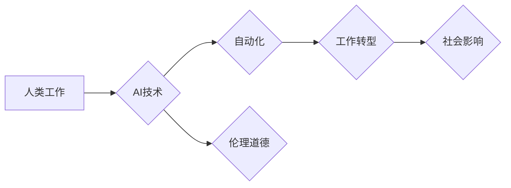

> 人工智能，自动化，工作转型，道德伦理，社会影响，未来趋势

## 1. 背景介绍

随着人工智能（AI）技术的飞速发展，我们正处于一个前所未有的时代。AI正在深刻地改变着我们的生活，从我们使用的智能手机到我们依赖的医疗诊断系统，AI无处不在。然而，AI的进步也引发了许多关于未来工作和道德伦理的担忧。

传统上，人类的工作主要集中在需要创造性思维、解决复杂问题和进行情感交流等领域。然而，随着AI技术的不断发展，许多重复性、规则性工作将被自动化取代。这将导致大量工作岗位消失，并对社会经济结构产生重大影响。

同时，AI的决策过程也引发了人们对道德伦理的担忧。例如，如果AI系统用于招聘、贷款或司法判决，其潜在的偏见和歧视性将带来哪些后果？如何确保AI系统能够以负责任和透明的方式运行？

## 2. 核心概念与联系

**2.1 人工智能（AI）**

人工智能是指模拟人类智能行为的计算机系统。AI系统能够学习、推理、解决问题和进行决策，就像人类一样。

**2.2 自动化**

自动化是指使用技术来代替人工完成重复性或规则性任务。AI技术可以推动自动化进程，使工作流程更加高效和精准。

**2.3 工作转型**

工作转型是指随着技术进步和社会发展，工作内容、技能需求和职业结构发生变化的过程。AI将加速工作转型的步伐，带来新的工作机会和挑战。

**2.4 伦理道德**

伦理道德是指关于什么是对的和什么是错的，以及如何应该行为的规范和准则。在AI时代，我们需要认真思考AI技术的伦理道德问题，确保其发展和应用符合人类的价值观和利益。

**2.5 社会影响**

AI技术的进步将对社会产生深远的影响，包括就业市场、经济结构、社会关系和文化价值观等方面。我们需要积极应对这些影响，确保AI技术能够造福人类社会。

**Mermaid 流程图**



## 3. 核心算法原理 & 具体操作步骤

### 3.1  算法原理概述

深度学习是人工智能领域的重要分支，其核心算法是多层神经网络。深度学习算法能够从海量数据中学习复杂的模式和特征，从而实现图像识别、语音识别、自然语言处理等任务。

### 3.2  算法步骤详解

1. **数据预处理:** 将原始数据进行清洗、转换和格式化，使其适合深度学习算法的训练。
2. **网络结构设计:** 根据具体任务需求，设计多层神经网络的结构，包括神经元数量、连接方式和激活函数等。
3. **参数初始化:** 为神经网络中的参数进行随机初始化。
4. **前向传播:** 将输入数据通过神经网络层层传递，最终得到输出结果。
5. **反向传播:** 计算输出结果与真实值的误差，并根据误差反向调整神经网络的参数。
6. **梯度下降:** 使用梯度下降算法优化神经网络的参数，使其能够更好地拟合训练数据。
7. **模型评估:** 使用测试数据评估模型的性能，并根据评估结果进行模型调优。

### 3.3  算法优缺点

**优点:**

* 能够学习复杂的模式和特征。
* 性能优于传统机器学习算法。
* 应用范围广泛。

**缺点:**

* 需要海量数据进行训练。
* 计算资源消耗大。
* 训练过程复杂。
* 可解释性差。

### 3.4  算法应用领域

* **图像识别:** 人脸识别、物体检测、图像分类。
* **语音识别:** 语音转文本、语音助手。
* **自然语言处理:** 机器翻译、文本摘要、情感分析。
* **推荐系统:** 商品推荐、内容推荐。
* **医疗诊断:** 疾病预测、影像分析。

## 4. 数学模型和公式 & 详细讲解 & 举例说明

### 4.1  数学模型构建

深度学习算法的核心是多层神经网络，其数学模型可以表示为：

$$
y = f(W^L x^L + b^L)
$$

其中：

* $y$ 是输出结果。
* $x^L$ 是第 $L$ 层的输入。
* $W^L$ 是第 $L$ 层的权重矩阵。
* $b^L$ 是第 $L$ 层的偏置向量。
* $f$ 是激活函数。

### 4.2  公式推导过程

深度学习算法的训练过程是通过反向传播算法来优化神经网络的参数。反向传播算法的核心思想是：

1. 计算输出结果与真实值的误差。
2. 根据误差反向传播，计算各层神经元的梯度。
3. 使用梯度下降算法更新神经网络的参数。

### 4.3  案例分析与讲解

例如，在图像识别任务中，深度学习算法可以学习图像特征，并将其映射到不同的类别。训练过程中，算法会不断调整权重和偏置，使其能够更好地将图像特征与类别进行匹配。

## 5. 项目实践：代码实例和详细解释说明

### 5.1  开发环境搭建

* Python 3.x
* TensorFlow 或 PyTorch 深度学习框架
* Jupyter Notebook 或 VS Code 代码编辑器

### 5.2  源代码详细实现

```python
import tensorflow as tf

# 定义神经网络模型
model = tf.keras.models.Sequential([
    tf.keras.layers.Conv2D(32, (3, 3), activation='relu', input_shape=(28, 28, 1)),
    tf.keras.layers.MaxPooling2D((2, 2)),
    tf.keras.layers.Conv2D(64, (3, 3), activation='relu'),
    tf.keras.layers.MaxPooling2D((2, 2)),
    tf.keras.layers.Flatten(),
    tf.keras.layers.Dense(10, activation='softmax')
])

# 编译模型
model.compile(optimizer='adam',
              loss='sparse_categorical_crossentropy',
              metrics=['accuracy'])

# 训练模型
model.fit(x_train, y_train, epochs=5)

# 评估模型
loss, accuracy = model.evaluate(x_test, y_test)
print('Test loss:', loss)
print('Test accuracy:', accuracy)
```

### 5.3  代码解读与分析

这段代码定义了一个简单的卷积神经网络模型，用于手写数字识别任务。

* `tf.keras.models.Sequential` 创建了一个顺序模型，其中层级依次连接。
* `tf.keras.layers.Conv2D` 定义了一个卷积层，用于提取图像特征。
* `tf.keras.layers.MaxPooling2D` 定义了一个最大池化层，用于降低特征图的尺寸。
* `tf.keras.layers.Flatten` 将多维特征图转换为一维向量。
* `tf.keras.layers.Dense` 定义了一个全连接层，用于分类。
* `model.compile` 编译模型，指定优化器、损失函数和评估指标。
* `model.fit` 训练模型，使用训练数据进行迭代训练。
* `model.evaluate` 评估模型，使用测试数据计算损失和准确率。

### 5.4  运行结果展示

训练完成后，模型可以用于识别新的手写数字。

## 6. 实际应用场景

### 6.1  医疗诊断

AI可以辅助医生进行疾病诊断，例如分析医学影像、预测患者风险、辅助制定治疗方案。

### 6.2  金融服务

AI可以用于欺诈检测、风险评估、客户服务自动化等领域，提高金融服务的效率和安全性。

### 6.3  制造业

AI可以用于工业自动化、质量控制、预测性维护等领域，提高生产效率和降低成本。

### 6.4  未来应用展望

随着AI技术的不断发展，其应用场景将更加广泛，例如：

* **个性化教育:** AI可以根据学生的学习情况提供个性化的学习方案。
* **智能交通:** AI可以用于自动驾驶、交通流量优化等领域，提高交通效率和安全性。
* **环境保护:** AI可以用于监测环境污染、预测自然灾害等领域，保护环境和人类安全。

## 7. 工具和资源推荐

### 7.1  学习资源推荐

* **在线课程:** Coursera、edX、Udacity 等平台提供丰富的AI课程。
* **书籍:** 《深度学习》、《人工智能：一种现代方法》等书籍。
* **博客和论坛:** AI相关的博客和论坛可以获取最新的技术资讯和交流经验。

### 7.2  开发工具推荐

* **TensorFlow:** Google开发的开源深度学习框架。
* **PyTorch:** Facebook开发的开源深度学习框架。
* **Keras:** TensorFlow的深度学习API，易于使用。

### 7.3  相关论文推荐

* **《ImageNet Classification with Deep Convolutional Neural Networks》**
* **《Attention Is All You Need》**
* **《BERT: Pre-training of Deep Bidirectional Transformers for Language Understanding》**

## 8. 总结：未来发展趋势与挑战

### 8.1  研究成果总结

近年来，AI技术取得了长足的进步，在图像识别、语音识别、自然语言处理等领域取得了突破性进展。

### 8.2  未来发展趋势

* **模型规模和复杂度提升:** 未来AI模型将更加庞大，包含更多参数和层级，从而学习更复杂的模式和特征。
* **跨模态学习:** AI将能够处理多种数据类型，例如文本、图像、音频和视频，实现跨模态的理解和交互。
* **边缘计算:** AI将更加靠近数据源，在边缘设备上进行计算，降低延迟和提高效率。
* **可解释性增强:** 研究人员将致力于提高AI模型的可解释性，使其决策过程更加透明和可理解。

### 8.3  面临的挑战

* **数据隐私和安全:** AI训练需要大量数据，如何保护数据隐私和安全是一个重要挑战。
* **算法偏见和歧视:** AI算法可能存在偏见和歧视，需要采取措施确保其公平性和公正性。
* **伦理道德问题:** AI技术的应用引发了许多伦理道德问题，需要社会各界共同探讨和解决。

### 8.4  研究展望

未来，AI研究将继续朝着更智能、更安全、更可解释的方向发展。我们需要加强基础研究，探索新的算法和模型，并制定相应的政策和规范，确保AI技术能够造福人类社会。

## 9. 附录：常见问题与解答

**Q1: AI会取代人类工作吗？**

A1: AI可能会改变一些工作内容和技能需求，但不会完全取代人类工作。AI更擅长于重复性、规则性工作，而人类擅长于需要创造性思维、解决复杂问题和进行情感交流的工作。

**Q2: 如何应对AI带来的工作转型挑战？**

A2: 需要加强职业技能培训，学习新的技术和知识，适应未来工作环境的变化。

**Q3: 如何确保AI技术的伦理道德使用？**

A3: 需要制定相应的政策和规范，加强监管和监督，并鼓励社会各界参与讨论和监督。


作者：禅与计算机程序设计艺术 / Zen and the Art of Computer Programming 
<end_of_turn>