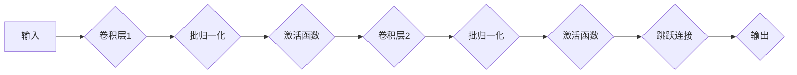

> ResNet, 深度学习, 计算机视觉, 迁移学习, 微调, 程序设计, Python, TensorFlow

## 1. 背景介绍

深度学习近年来取得了令人瞩目的成就，尤其是在计算机视觉领域。卷积神经网络（CNN）作为深度学习的基石，在图像分类、目标检测、图像分割等任务中表现出色。ResNet（Residual Network）作为一种新型的 CNN 架构，通过引入残差连接，有效解决了深度网络训练中的梯度消失问题，使得网络可以训练到更深层次，从而获得更高的准确率。

本篇文章将从零开始，深入讲解 ResNet 的基础原理和程序设计基础，并通过代码实例和实际应用场景，帮助读者理解 ResNet 的工作机制，并掌握其开发和微调的技巧。

## 2. 核心概念与联系

ResNet 的核心思想是通过残差连接，使得网络能够学习更深层的特征表示。

**2.1 ResNet 架构**

ResNet 的基本单元是残差块（Residual Block），它由两层卷积层和一个跳跃连接组成。跳跃连接直接将输入特征映射到输出特征映射，使得网络能够学习残差信息，而不是直接学习原始特征映射。

**2.2 残差连接的作用**

残差连接的引入，使得网络能够学习到更深层的特征表示，并有效解决了梯度消失问题。

* **梯度消失问题:** 随着网络层数的增加，梯度会逐渐消失，导致网络难以训练。
* **残差连接的解决:** 残差连接将输入特征映射直接传递到输出特征映射，使得梯度能够直接传递到更深层的网络，从而解决梯度消失问题。

**2.3 ResNet 架构图**



## 3. 核心算法原理 & 具体操作步骤

### 3.1  算法原理概述

ResNet 的核心算法是残差块，它通过引入跳跃连接，使得网络能够学习到更深层的特征表示，并有效解决了梯度消失问题。

### 3.2  算法步骤详解

1. **输入数据:** 将图像数据输入到 ResNet 网络中。
2. **卷积层:** 使用卷积层提取图像特征。
3. **批归一化:** 对卷积层的输出进行批归一化，以提高训练的稳定性。
4. **激活函数:** 使用激活函数，例如 ReLU，引入非线性，使得网络能够学习更复杂的特征表示。
5. **跳跃连接:** 将输入特征映射直接传递到输出特征映射，使得梯度能够直接传递到更深层的网络。
6. **输出结果:** 将最终的特征映射输出，用于后续的分类、检测或分割任务。

### 3.3  算法优缺点

**优点:**

* **解决梯度消失问题:** 残差连接使得梯度能够直接传递到更深层的网络，有效解决了梯度消失问题。
* **训练更深层的网络:** ResNet 可以训练到更深层次，从而获得更高的准确率。
* **迁移学习:** ResNet 的预训练模型可以用于迁移学习，在其他任务上取得良好的性能。

**缺点:**

* **计算量大:** ResNet 的网络结构比较复杂，计算量较大。
* **参数量大:** ResNet 的参数量比较大，需要大量的存储空间和计算资源。

### 3.4  算法应用领域

ResNet 在计算机视觉领域广泛应用，例如：

* **图像分类:** ResNet 在 ImageNet 等大型图像分类数据集上取得了state-of-the-art的性能。
* **目标检测:** ResNet 可以用于目标检测，例如 YOLOv3 和 Faster R-CNN。
* **图像分割:** ResNet 可以用于图像分割，例如 U-Net 和 DeepLab。

## 4. 数学模型和公式 & 详细讲解 & 举例说明

### 4.1  数学模型构建

ResNet 的数学模型可以表示为一个多层卷积神经网络，其中每个残差块可以表示为一个函数：

$$
F(x) = H(x) + x
$$

其中：

* $x$ 是输入特征映射。
* $H(x)$ 是残差块的输出特征映射。

### 4.2  公式推导过程

残差块的输出特征映射 $H(x)$ 可以表示为：

$$
H(x) = \sigma(W_2 \cdot \sigma(W_1 \cdot x + b_1) + b_2)
$$

其中：

* $W_1$ 和 $W_2$ 是卷积核。
* $b_1$ 和 $b_2$ 是偏置项。
* $\sigma$ 是激活函数，例如 ReLU。

### 4.3  案例分析与讲解

假设输入特征映射的大小为 $H \times W \times C$，其中 $H$ 和 $W$ 分别是高度和宽度，$C$ 是通道数。

* **卷积层1:** $W_1$ 的大小为 $3 \times 3 \times C \times F$，其中 $F$ 是输出通道数。卷积层1的输出大小为 $H \times W \times F$。
* **批归一化:** 对卷积层1的输出进行批归一化。
* **激活函数:** 使用 ReLU 激活函数。
* **卷积层2:** $W_2$ 的大小为 $3 \times 3 \times F \times F$。卷积层2的输出大小为 $H \times W \times F$。
* **批归一化:** 对卷积层2的输出进行批归一化。
* **激活函数:** 使用 ReLU 激活函数。
* **跳跃连接:** 将输入特征映射 $x$ 直接传递到输出特征映射 $F(x)$。

## 5. 项目实践：代码实例和详细解释说明

### 5.1  开发环境搭建

* **操作系统:** Ubuntu 18.04
* **Python 版本:** 3.6
* **深度学习框架:** TensorFlow 2.0

### 5.2  源代码详细实现

```python
import tensorflow as tf

def residual_block(input_tensor, filters):
    """
    定义残差块
    """
    x = tf.keras.layers.Conv2D(filters, kernel_size=3, padding='same')(input_tensor)
    x = tf.keras.layers.BatchNormalization()(x)
    x = tf.keras.layers.ReLU()(x)
    x = tf.keras.layers.Conv2D(filters, kernel_size=3, padding='same')(x)
    x = tf.keras.layers.BatchNormalization()(x)
    x = tf.keras.layers.add([x, input_tensor])
    return x

def resnet_model(input_shape, num_classes):
    """
    定义 ResNet 模型
    """
    inputs = tf.keras.Input(shape=input_shape)
    x = tf.keras.layers.Conv2D(64, kernel_size=7, strides=2, padding='same')(inputs)
    x = tf.keras.layers.BatchNormalization()(x)
    x = tf.keras.layers.ReLU()(x)
    x = tf.keras.layers.MaxPooling2D(pool_size=3, strides=2)(x)

    # 添加多个残差块
    for i in range(10):
        x = residual_block(x, 64)

    # 全连接层
    x = tf.keras.layers.GlobalAveragePooling2D()(x)
    outputs = tf.keras.layers.Dense(num_classes, activation='softmax')(x)

    return tf.keras.Model(inputs=inputs, outputs=outputs)

# 构建模型
model = resnet_model(input_shape=(224, 224, 3), num_classes=10)

# 打印模型结构
model.summary()
```

### 5.3  代码解读与分析

* **residual_block() 函数:** 定义了 ResNet 的残差块，包含两层卷积层、批归一化层和 ReLU 激活函数。
* **resnet_model() 函数:** 定义了 ResNet 模型，包含卷积层、池化层、残差块和全连接层。
* **模型构建:** 使用 `resnet_model()` 函数构建 ResNet 模型，并设置输入形状和输出类别数。
* **模型结构打印:** 使用 `model.summary()` 函数打印模型结构。

### 5.4  运行结果展示

运行代码后，会打印出 ResNet 模型的结构信息，包括层数、参数数量和输出形状。

## 6. 实际应用场景

ResNet 在计算机视觉领域广泛应用，例如：

### 6.1  图像分类

ResNet 在 ImageNet 等大型图像分类数据集上取得了state-of-the-art的性能。

### 6.2  目标检测

ResNet 可以用于目标检测，例如 YOLOv3 和 Faster R-CNN。

### 6.3  图像分割

ResNet 可以用于图像分割，例如 U-Net 和 DeepLab。

### 6.4  未来应用展望

ResNet 的应用前景广阔，未来可能在以下领域得到更广泛的应用：

* **医疗图像分析:** ResNet 可以用于医学图像的诊断和分析，例如肿瘤检测和疾病分类。
* **自动驾驶:** ResNet 可以用于自动驾驶系统的目标检测和场景理解。
* **机器人视觉:** ResNet 可以用于机器人视觉系统的目标识别和导航。

## 7. 工具和资源推荐

### 7.1  学习资源推荐

* **书籍:**
    * Deep Learning by Ian Goodfellow, Yoshua Bengio, and Aaron Courville
    * Deep Learning with Python by Francois Chollet
* **在线课程:**
    * Coursera: Deep Learning Specialization by Andrew Ng
    * Udacity: Deep Learning Nanodegree

### 7.2  开发工具推荐

* **深度学习框架:** TensorFlow, PyTorch
* **图像处理库:** OpenCV

### 7.3  相关论文推荐

* **ResNet:** Deep Residual Learning for Image Recognition by Kaiming He et al.
* **ResNet-50:** Residual Networks for Image Classification by Kaiming He et al.

## 8. 总结：未来发展趋势与挑战

### 8.1  研究成果总结

ResNet 的提出，为深度学习的发展做出了重要贡献，使得网络能够训练到更深层次，从而获得更高的准确率。

### 8.2  未来发展趋势

* **更深的网络:** 研究更深的 ResNet 架构，进一步提高准确率。
* **更有效的训练方法:** 研究更有效的训练方法，例如自监督学习和迁移学习，提高训练效率。
* **新的应用场景:** 将 ResNet 应用到更多新的领域，例如医疗图像分析和自动驾驶。

### 8.3  面临的挑战

* **计算资源:** 训练更深的 ResNet 模型需要大量的计算资源。
* **数据标注:** 训练深度学习模型需要大量的标注数据，数据标注成本较高。
* **可解释性:** 深度学习模型的决策过程难以解释，缺乏可解释性。

### 8.4  研究展望

未来，ResNet 将继续朝着更深、更有效、更可解释的方向发展，并在更多领域发挥重要作用。

## 9. 附录：常见问题与解答

### 9.1  Q1: ResNet 的优势是什么？

**A1:** ResNet 的优势在于：

* **解决梯度消失问题:** 残差连接使得梯度能够直接传递到更深层的网络，有效解决了梯度消失问题。
* **训练更深层的网络:** ResNet 可以训练到更深层次，从而获得更高的准确率。
* **迁移学习:** ResNet 的预训练模型可以用于