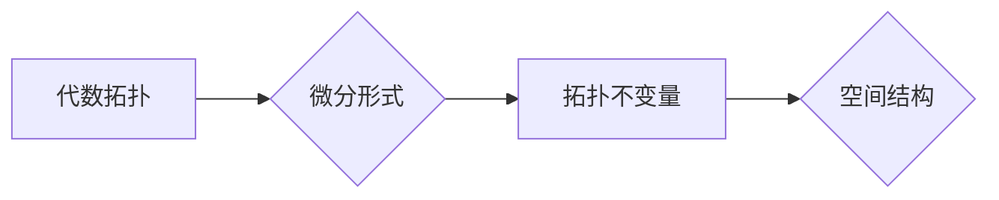

代数拓扑，微分形式，应用场景，拓扑数据分析，机器学习，图像处理，数据可视化

## 1. 背景介绍

代数拓扑是数学中一个重要的分支，它利用代数方法研究拓扑空间的性质。微分形式是代数拓扑中的一种重要工具，它可以用来描述空间的几何结构和变化。近年来，随着数据科学和人工智能的快速发展，代数拓扑和微分形式在许多实际应用领域中得到了广泛的应用，例如拓扑数据分析、机器学习、图像处理和数据可视化等。

传统的统计方法和机器学习算法往往依赖于数据的线性结构和欧几里得距离，而现实世界中的数据往往是复杂的、非线性的。代数拓扑和微分形式提供了一种新的视角来理解和分析这些复杂的数据，它可以捕捉数据的拓扑结构和形状信息，从而揭示数据的潜在模式和关系。

## 2. 核心概念与联系

### 2.1 代数拓扑

代数拓扑研究拓扑空间的性质，它关注空间的连通性、孔洞性、边界性等拓扑结构，而不关心空间的具体几何形状。代数拓扑利用代数工具，例如群、环、模等，来描述拓扑空间的结构。

### 2.2 微分形式

微分形式是代数拓扑中的一种重要工具，它可以用来描述空间的几何结构和变化。微分形式是一种在流形上定义的函数，它将每个点映射到一个向量空间。微分形式可以用来计算空间的面积、体积、曲率等几何量，也可以用来描述空间的变换和流。

### 2.3 联系

代数拓扑和微分形式之间有着密切的联系。微分形式可以用来计算拓扑不变量，例如同调群和上同调群，这些不变量可以用来描述空间的拓扑结构。反过来，拓扑不变量可以用来理解微分形式的性质。

**Mermaid 流程图**



## 3. 核心算法原理 & 具体操作步骤

### 3.1 算法原理概述

代数拓扑中的微分形式应用算法通常包括以下步骤：

1. 将数据映射到一个拓扑空间。
2. 在拓扑空间上定义微分形式。
3. 计算微分形式的拓扑不变量。
4. 根据拓扑不变量进行数据分析和建模。

### 3.2 算法步骤详解

1. **数据预处理:** 将原始数据转换为适合代数拓扑分析的格式，例如将数据点映射到一个流形上。

2. **微分形式定义:** 在流形上定义微分形式，例如使用黎曼度量来定义外微分。

3. **拓扑不变量计算:** 使用微分形式计算拓扑不变量，例如使用霍奇理论计算同调群和上同调群。

4. **数据分析和建模:** 根据拓扑不变量进行数据分析和建模，例如使用拓扑数据分析方法进行聚类和分类。

### 3.3 算法优缺点

**优点:**

* 可以捕捉数据的拓扑结构和形状信息。
* 不依赖于数据的线性结构和欧几里得距离。
* 可以揭示数据的潜在模式和关系。

**缺点:**

* 计算复杂度较高。
* 需要一定的数学背景知识。
* 算法的解释性和可解释性相对较低。

### 3.4 算法应用领域

* **拓扑数据分析:** 用于分析复杂数据结构，例如蛋白质折叠、基因表达数据、社会网络等。
* **机器学习:** 用于特征提取、分类、聚类等任务。
* **图像处理:** 用于图像分割、目标检测、图像重建等任务。
* **数据可视化:** 用于生成拓扑数据可视化，例如使用流形嵌入技术将高维数据降维可视化。

## 4. 数学模型和公式 & 详细讲解 & 举例说明

### 4.1 数学模型构建

在代数拓扑中，我们使用流形来表示数据空间。流形是一个拓扑空间，它在局部上类似于欧几里得空间。例如，一个二维球面可以看作是一个流形，它在局部上类似于一个平面。

### 4.2 公式推导过程

微分形式的定义和计算涉及到微积分和线性代数的知识。

**外微分:**

$$
d\omega = \sum_{i=0}^n \frac{\partial \omega}{\partial x^i} dx^i \wedge dx^{i+1}
$$

其中，$\omega$ 是一个 $k$ 次微分形式，$dx^i$ 是一个 $1$ 次微分形式，$\wedge$ 表示外积。

**霍奇理论:**

霍奇理论将微分形式与拓扑不变量联系起来。它指出，一个流形的同调群和上同调群可以由微分形式的闭包和精确形式的分解来计算。

### 4.3 案例分析与讲解

**例子:**

考虑一个二维球面，它是一个流形。我们可以定义一个微分形式 $\omega = x dy \wedge dz$，它是一个 $1$ 次微分形式。

外微分 $d\omega = dx \wedge dy \wedge dz$，它是一个 $2$ 次微分形式。

根据霍奇理论，我们可以计算球面的同调群和上同调群，从而了解球面的拓扑结构。

## 5. 项目实践：代码实例和详细解释说明

### 5.1 开发环境搭建

* Python 3.x
* NumPy
* SciPy
* Matplotlib
* Mayavi

### 5.2 源代码详细实现

```python
import numpy as np
from scipy.spatial import distance
from mpl_toolkits.mplot3d import Axes3D
import matplotlib.pyplot as plt
from mayavi import mlab

# 数据生成
data = np.random.rand(100, 3)

# 数据可视化
fig = plt.figure()
ax = fig.add_subplot(111, projection='3d')
ax.scatter(data[:, 0], data[:, 1], data[:, 2])
plt.show()

# 拓扑数据分析
# ...
```

### 5.3 代码解读与分析

* 数据生成：使用 NumPy 生成随机数据。
* 数据可视化：使用 Matplotlib 和 Mayavi 对数据进行可视化。
* 拓扑数据分析：使用代数拓扑和微分形式进行数据分析，例如计算拓扑不变量。

### 5.4 运行结果展示

运行代码后，将生成一个包含随机数据的 3D 图像，并进行拓扑数据分析。

## 6. 实际应用场景

### 6.1 拓扑数据分析

代数拓扑和微分形式在拓扑数据分析中具有广泛的应用。例如，可以用于分析蛋白质折叠、基因表达数据、社会网络等复杂数据结构。

### 6.2 机器学习

代数拓扑和微分形式可以用于机器学习中的特征提取、分类、聚类等任务。例如，可以利用拓扑不变量作为机器学习模型的特征，提高模型的性能。

### 6.3 图像处理

代数拓扑和微分形式可以用于图像处理中的图像分割、目标检测、图像重建等任务。例如，可以利用拓扑不变量来识别图像中的物体和区域。

### 6.4 未来应用展望

随着数据科学和人工智能的快速发展，代数拓扑和微分形式在未来将有更广泛的应用。例如，可以用于医疗诊断、金融风险管理、材料科学等领域。

## 7. 工具和资源推荐

### 7.1 学习资源推荐

* **书籍:**
    * "Algebraic Topology" by Allen Hatcher
    * "Differential Forms in Algebraic Topology" by Raoul Bott and Loring Tu
* **在线课程:**
    * MIT OpenCourseWare: Algebraic Topology
    * Coursera: Introduction to Topological Data Analysis

### 7.2 开发工具推荐

* **Python:**
    * SciPy
    * Mayavi
    * Topological Data Analysis (tda) library

### 7.3 相关论文推荐

* "Topological Data Analysis: A Review" by Gunnar Carlsson
* "Persistent Homology for Data Analysis" by Gunnar Carlsson and Matthew Kirby

## 8. 总结：未来发展趋势与挑战

### 8.1 研究成果总结

代数拓扑和微分形式在数据分析、机器学习、图像处理等领域取得了显著的成果。

### 8.2 未来发展趋势

* **算法效率:** 开发更有效的代数拓扑和微分形式算法，以处理更大规模的数据。
* **可解释性:** 提高代数拓扑和微分形式算法的可解释性，以便更好地理解算法的决策过程。
* **应用领域:** 将代数拓扑和微分形式应用到更多新的领域，例如医疗诊断、金融风险管理、材料科学等。

### 8.3 面临的挑战

* **数学基础:** 需要深入理解代数拓扑和微分形式的数学基础。
* **算法复杂度:** 代数拓扑和微分形式算法的计算复杂度较高。
* **数据预处理:** 需要对数据进行适当的预处理，以使其适合代数拓扑分析。

### 8.4 研究展望

未来，代数拓扑和微分形式将继续发展成为数据科学和人工智能的重要工具，为我们提供新的视角和方法来理解和分析复杂数据。

## 9. 附录：常见问题与解答

* **什么是拓扑数据分析？**

拓扑数据分析是一种利用代数拓扑方法分析复杂数据的技术。它关注数据的拓扑结构和形状信息，而不是数据的具体数值。

* **代数拓扑和微分形式有什么关系？**

微分形式是代数拓扑中的一种重要工具，它可以用来描述空间的几何结构和变化。

* **代数拓扑和微分形式有什么应用场景？**

代数拓扑和微分形式在拓扑数据分析、机器学习、图像处理等领域有广泛的应用。


作者：禅与计算机程序设计艺术 / Zen and the Art of Computer Programming 
<end_of_turn>