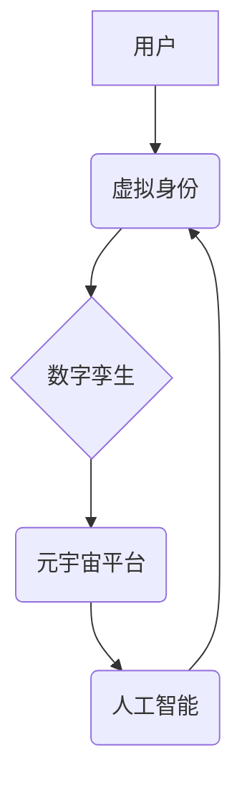

> 元宇宙、身份认同、虚拟现实、增强现实、区块链、数字孪生、人工智能、隐私保护

## 1. 背景介绍

元宇宙概念近年来备受关注，它被描绘成一个由虚拟现实 (VR)、增强现实 (AR) 和互联网连接的沉浸式数字世界。在这个虚拟世界中，人们可以创建虚拟形象，参与各种活动，并与他人互动。然而，元宇宙的出现也引发了关于身份认同的深刻思考。

传统社会中，我们的身份认同主要建立在现实世界中的经历、关系和社会角色之上。但在元宇宙中，虚拟身份将与现实身份交织在一起，形成一个新的身份认同体系。虚拟形象可以自由定制，人们可以尝试不同的角色和身份，探索不同的自我。这为我们提供了无限的可能性，但也带来了新的挑战。

## 2. 核心概念与联系

**2.1 核心概念**

* **元宇宙 (Metaverse):** 一个由虚拟现实、增强现实和互联网连接的沉浸式数字世界，用户可以在其中创建虚拟形象，与他人互动，并参与各种活动。
* **身份认同 (Identity):** 指个体对自身认知和定位，包括个人特征、社会角色、价值观和信念等。
* **虚拟身份 (Virtual Identity):** 在元宇宙中创建的虚拟形象，可以与现实身份相对应，也可以完全独立于现实身份。
* **数字孪生 (Digital Twin):**  一个虚拟的、与现实世界物体或系统相对应的数字模型，可以实时反映现实世界的状态和变化。

**2.2 核心概念联系**

元宇宙中的身份认同是一个复杂而多维的概念，涉及到虚拟身份、数字孪生、人工智能等多个核心概念。

* **虚拟身份与数字孪生:** 虚拟身份可以基于数字孪生技术创建，例如，一个用户的虚拟形象可以基于其现实世界的身体特征、行为模式和社交关系构建。
* **人工智能与身份认同:** 人工智能可以帮助元宇宙平台更好地理解用户的虚拟身份，并提供更个性化的服务。例如，AI可以根据用户的虚拟行为和喜好，推荐相关的活动和内容。

**2.3  核心概念架构**



## 3. 核心算法原理 & 具体操作步骤

**3.1 算法原理概述**

元宇宙中的身份认同涉及到多种算法，例如：

* **人脸识别算法:** 用于识别用户的真实身份，并将其映射到虚拟身份。
* **行为分析算法:** 用于分析用户的虚拟行为，并构建其虚拟身份的特征。
* **个性化推荐算法:** 用于根据用户的虚拟身份和行为，推荐相关的活动和内容。

**3.2 算法步骤详解**

以人脸识别算法为例，其具体操作步骤如下：

1. **数据采集:** 收集用户的真实身份图像数据。
2. **特征提取:** 使用深度学习算法提取用户的特征，例如面部轮廓、眼睛、鼻子等。
3. **模型训练:** 使用训练数据训练人脸识别模型，使其能够将用户的特征与其身份信息匹配。
4. **身份验证:** 当用户登录元宇宙平台时，系统会使用人脸识别算法识别用户的身份。

**3.3 算法优缺点**

* **优点:** 提高身份验证的安全性，防止虚假身份的冒充。
* **缺点:** 存在隐私泄露风险，需要采取措施保护用户的个人信息。

**3.4 算法应用领域**

* **元宇宙平台:** 用于身份验证、权限控制和个性化服务。
* **金融领域:** 用于身份认证、欺诈检测和风险管理。
* **医疗领域:** 用于患者身份识别、病历管理和远程医疗。

## 4. 数学模型和公式 & 详细讲解 & 举例说明

**4.1 数学模型构建**

我们可以使用一个简单的数学模型来表示虚拟身份的形成过程：

$$
V = f(R, C, A)
$$

其中：

* $V$ 表示虚拟身份
* $R$ 表示用户的现实身份信息
* $C$ 表示用户的虚拟身份定制选项
* $A$ 表示用户的虚拟行为和互动

**4.2 公式推导过程**

该公式表明，虚拟身份的形成是一个由现实身份、虚拟定制选项和虚拟行为共同作用的结果。

* $R$ 提供了虚拟身份的基础框架，例如用户的性别、年龄、兴趣爱好等。
* $C$ 允许用户对虚拟身份进行个性化定制，例如选择虚拟形象的外貌、服装、性格等。
* $A$ 会随着用户的虚拟行为和互动而不断演变，例如用户的虚拟行为模式、社交关系、成就等。

**4.3 案例分析与讲解**

例如，一个用户的现实身份信息可能包括性别为男性、年龄为25岁、兴趣爱好是游戏和音乐。用户可以选择一个虚拟形象的外貌为帅气型男，服装为潮流风格，性格为幽默风趣。随着用户在元宇宙中玩游戏、与朋友互动、完成任务等行为，其虚拟身份会逐渐形成一个独特的个性，例如成为一名游戏高手、音乐制作人或社交达人。

## 5. 项目实践：代码实例和详细解释说明

**5.1 开发环境搭建**

* 操作系统: Ubuntu 20.04
* 编程语言: Python 3.8
* 开发工具: PyCharm

**5.2 源代码详细实现**

```python
# 人脸识别示例代码

import face_recognition

# 加载用户真实身份图像
image = face_recognition.load_image_file("user_image.jpg")

# 提取用户特征
face_encoding = face_recognition.face_encodings(image)[0]

# 加载用户虚拟身份图像
virtual_image = face_recognition.load_image_file("virtual_image.jpg")

# 提取虚拟身份特征
virtual_encoding = face_recognition.face_encodings(virtual_image)[0]

# 计算特征相似度
similarity = face_recognition.compare_faces([virtual_encoding], face_encoding)

# 判断是否匹配
if similarity[0]:
    print("身份匹配成功!")
else:
    print("身份匹配失败!")
```

**5.3 代码解读与分析**

该代码示例使用 `face_recognition` 库实现人脸识别功能。

1. 加载用户真实身份图像和虚拟身份图像。
2. 使用 `face_encodings` 函数提取用户的特征。
3. 使用 `compare_faces` 函数计算特征相似度。
4. 根据相似度判断是否匹配。

**5.4 运行结果展示**

如果用户真实身份图像与虚拟身份图像匹配，则输出 "身份匹配成功!"。否则，输出 "身份匹配失败!"。

## 6. 实际应用场景

**6.1 元宇宙游戏**

在元宇宙游戏中，玩家可以创建虚拟形象，并通过游戏中的行为和互动来塑造其虚拟身份。

**6.2 元宇宙社交平台**

在元宇宙社交平台，用户可以创建虚拟形象，并与其他用户进行交流和互动。

**6.3 元宇宙教育平台**

在元宇宙教育平台，用户可以创建虚拟形象，并参与虚拟课堂、实验室等学习活动。

**6.4 未来应用展望**

元宇宙中的身份认同将越来越重要，它将影响到我们的工作、生活、社交和娱乐等各个方面。

## 7. 工具和资源推荐

**7.1 学习资源推荐**

* **书籍:** 《元宇宙：虚拟世界与现实的融合》
* **网站:** Metaverse Standards Forum

**7.2 开发工具推荐**

* **Unity:** 游戏引擎
* **Unreal Engine:** 游戏引擎
* **Blender:** 3D建模软件

**7.3 相关论文推荐**

* **The Metaverse: A New Paradigm for Human Interaction**
* **Identity in the Metaverse: Challenges and Opportunities**

## 8. 总结：未来发展趋势与挑战

**8.1 研究成果总结**

元宇宙中的身份认同是一个新兴的研究领域，已经取得了一些重要的成果。例如，人脸识别、行为分析和个性化推荐算法等技术已经应用于元宇宙平台，为用户提供了更沉浸式的体验。

**8.2 未来发展趋势**

* **更逼真的虚拟身份:** 未来，虚拟身份将更加逼真，能够更好地反映用户的真实特征和个性。
* **更丰富的虚拟交互:** 未来，用户将能够在元宇宙中进行更丰富的虚拟交互，例如虚拟会议、虚拟演出、虚拟旅行等。
* **更安全的身份保护:** 未来，元宇宙平台将更加重视身份保护，采用更先进的技术来防止身份盗窃和隐私泄露。

**8.3 面临的挑战**

* **隐私保护:** 元宇宙平台收集和使用用户的个人信息，需要采取措施保护用户的隐私。
* **伦理问题:** 元宇宙中的虚拟身份可能会引发伦理问题，例如虚拟身份的真实性、虚拟身份的权利和义务等。
* **技术挑战:** 元宇宙平台的技术发展还面临着许多挑战，例如虚拟现实技术的进步、网络安全技术的提升等。

**8.4 研究展望**

未来，我们需要继续研究元宇宙中的身份认同问题，探索如何构建一个安全、公平、可持续的元宇宙社会。


## 9. 附录：常见问题与解答

**9.1 如何保护我的虚拟身份安全？**

* 使用强密码保护你的元宇宙账户。
* 不要轻易透露你的个人信息。
* 注意网络安全，避免点击可疑链接。

**9.2 我的虚拟身份和现实身份有什么区别？**

虚拟身份是你在元宇宙中创建的虚拟形象，可以与现实身份相对应，也可以完全独立于现实身份。

**9.3 元宇宙中的身份认同会对现实社会产生什么影响？**

元宇宙中的身份认同可能会影响到我们的工作、生活、社交和娱乐等各个方面。


作者：禅与计算机程序设计艺术 / Zen and the Art of Computer Programming 


<end_of_turn>