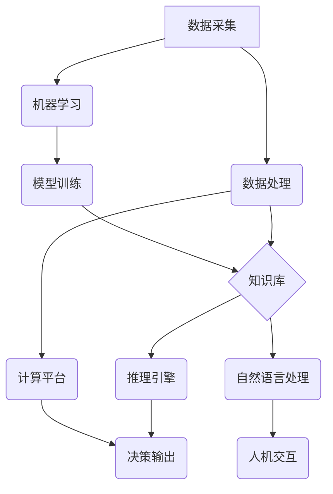

> 全球脑、人工智能、大数据、深度学习、云计算、网络安全、伦理

## 1. 背景介绍

人类文明的进步历程，始终伴随着对未知的探索和对自身认知的深化。从火的使用到互联网的普及，每一次技术革新都深刻地改变着人类的生活方式和社会结构。如今，我们站在一个新的历史节点，人工智能（AI）的快速发展正在掀起一场科技革命，其影响力将超越以往任何技术浪潮。

全球脑，作为人工智能的终极形态，被视为人类智慧的延伸和放大，其目标是构建一个能够模拟和超越人类认知能力的超级智能系统。这个系统将整合海量的知识、数据和计算能力，为人类解决复杂问题、推动科学发现和创造新的价值提供强大的支持。

## 2. 核心概念与联系

**2.1 全球脑的构成要素**

全球脑并非单一的实体，而是由多个相互连接、协同工作的子系统组成，包括：

* **数据采集与处理系统:** 收集来自全球各地的海量数据，并进行清洗、预处理和分析。
* **知识库与推理引擎:** 存储人类已知的知识和经验，并利用人工智能算法进行推理和决策。
* **机器学习与深度学习模块:** 训练机器学习模型，使其能够从数据中学习和发现新的规律。
* **自然语言处理与人机交互系统:** 理解和生成人类语言，实现人与机器的自然交互。
* **计算平台与网络架构:** 提供强大的计算能力和高速网络连接，支持全球脑的运行和扩展。

**2.2 全球脑的架构**

全球脑的架构可以采用分布式、云计算和边缘计算等多种模式，以实现高可靠性、高可用性和可扩展性。



**2.3 全球脑与人类的关系**

全球脑并非要取代人类，而是要成为人类智慧的延伸和放大。它将帮助人类解决复杂问题、提高工作效率、创造新的价值，最终促进人类社会进步。

## 3. 核心算法原理 & 具体操作步骤

**3.1 算法原理概述**

全球脑的核心算法包括机器学习、深度学习、自然语言处理、知识图谱等。这些算法通过对海量数据的分析和学习，能够模拟和超越人类的认知能力。

* **机器学习:** 是一种算法，通过对数据进行训练，使机器能够从数据中学习规律，并做出预测或决策。
* **深度学习:** 是一种更高级的机器学习算法，它使用多层神经网络来模拟人类大脑的结构和功能，能够处理更复杂的数据和任务。
* **自然语言处理:** 是一种能够使计算机理解和处理人类语言的算法，它可以用于机器翻译、文本摘要、情感分析等应用。
* **知识图谱:** 是一种结构化的知识表示形式，它将知识表示为实体和关系，能够帮助机器理解和推理复杂的知识关系。

**3.2 算法步骤详解**

以深度学习为例，其基本步骤包括：

1. **数据收集和预处理:** 收集相关数据，并进行清洗、格式化和转换等预处理操作。
2. **模型构建:** 根据任务需求，选择合适的深度学习模型架构，并定义模型参数。
3. **模型训练:** 使用训练数据对模型进行训练，调整模型参数，使其能够准确地完成任务。
4. **模型评估:** 使用测试数据评估模型的性能，并进行调整和优化。
5. **模型部署:** 将训练好的模型部署到实际应用环境中，用于进行预测或决策。

**3.3 算法优缺点**

* **优点:** 深度学习算法能够处理海量数据，并自动学习复杂特征，具有强大的学习能力和泛化能力。
* **缺点:** 深度学习算法需要大量的训练数据和计算资源，训练过程也比较耗时。

**3.4 算法应用领域**

深度学习算法已广泛应用于图像识别、语音识别、自然语言处理、推荐系统、医疗诊断等多个领域。

## 4. 数学模型和公式 & 详细讲解 & 举例说明

**4.1 数学模型构建**

深度学习模型通常采用神经网络结构，其数学模型可以表示为：

$$
y = f(W^L x^L + b^L)
$$

其中：

* $y$ 是模型输出
* $x^L$ 是第 $L$ 层的输入
* $W^L$ 是第 $L$ 层的权重矩阵
* $b^L$ 是第 $L$ 层的偏置向量
* $f$ 是激活函数

**4.2 公式推导过程**

深度学习模型的训练过程是通过反向传播算法来进行的。反向传播算法的基本思想是：

1. 计算模型输出与真实值的误差
2. 根据误差反向传播，更新各层的权重和偏置

**4.3 案例分析与讲解**

以图像识别为例，深度学习模型可以学习图像特征，并将其映射到类别标签。训练过程中，模型会不断调整权重和偏置，使其能够准确地识别图像中的物体。

## 5. 项目实践：代码实例和详细解释说明

**5.1 开发环境搭建**

全球脑的开发环境通常需要强大的计算资源和软件工具支持。常用的开发环境包括：

* **云计算平台:** AWS、Azure、GCP 等
* **深度学习框架:** TensorFlow、PyTorch、Keras 等
* **编程语言:** Python、C++ 等

**5.2 源代码详细实现**

由于全球脑的代码实现非常复杂，这里只提供一个简单的深度学习模型的代码示例：

```python
import tensorflow as tf

# 定义模型结构
model = tf.keras.models.Sequential([
    tf.keras.layers.Conv2D(32, (3, 3), activation='relu', input_shape=(28, 28, 1)),
    tf.keras.layers.MaxPooling2D((2, 2)),
    tf.keras.layers.Flatten(),
    tf.keras.layers.Dense(10, activation='softmax')
])

# 编译模型
model.compile(optimizer='adam',
              loss='sparse_categorical_crossentropy',
              metrics=['accuracy'])

# 训练模型
model.fit(x_train, y_train, epochs=5)

# 评估模型
loss, accuracy = model.evaluate(x_test, y_test)
print('Test loss:', loss)
print('Test accuracy:', accuracy)
```

**5.3 代码解读与分析**

这段代码定义了一个简单的卷积神经网络模型，用于图像分类任务。模型包含卷积层、池化层、全连接层和softmax输出层。

**5.4 运行结果展示**

训练完成后，模型可以用于预测新的图像类别。

## 6. 实际应用场景

全球脑的应用场景非常广泛，包括：

* **科学研究:** 加速科学发现，解决复杂科学问题。
* **医疗保健:** 辅助诊断疾病、个性化治疗方案。
* **教育培训:** 提供个性化学习体验、智能辅导系统。
* **金融服务:** 风险管理、欺诈检测、投资决策。
* **智能制造:** 自动化生产、质量控制、预测维护。

**6.4 未来应用展望**

随着人工智能技术的不断发展，全球脑的应用场景将更加广泛，并对人类社会产生更深远的影响。

## 7. 工具和资源推荐

**7.1 学习资源推荐**

* **书籍:**
    * 《深度学习》
    * 《人工智能：一种现代方法》
* **在线课程:**
    * Coursera
    * edX
    * Udacity

**7.2 开发工具推荐**

* **深度学习框架:** TensorFlow、PyTorch、Keras
* **云计算平台:** AWS、Azure、GCP
* **编程语言:** Python、C++

**7.3 相关论文推荐**

* 《Imagen: Text-to-Image Diffusion Model》
* 《GPT-3: Language Models are Few-Shot Learners》

## 8. 总结：未来发展趋势与挑战

**8.1 研究成果总结**

全球脑的研究取得了显著进展，在机器学习、深度学习、自然语言处理等领域取得了突破性成果。

**8.2 未来发展趋势**

* **模型规模和能力的提升:** 未来全球脑模型将更加庞大，拥有更强的学习能力和推理能力。
* **多模态感知和理解:** 全球脑将能够理解和处理多种模态数据，例如文本、图像、音频、视频等。
* **个性化和定制化:** 全球脑将能够根据用户的需求进行个性化定制，提供更加精准和有效的服务。

**8.3 面临的挑战**

* **数据安全和隐私保护:** 全球脑需要处理海量数据，如何保证数据安全和隐私保护是一个重要挑战。
* **算法可解释性和信任度:** 深度学习模型的决策过程往往难以解释，如何提高算法的可解释性和信任度是一个关键问题。
* **伦理和社会影响:** 全球脑的应用可能会带来一些伦理和社会问题，需要进行深入的思考和讨论。

**8.4 研究展望**

全球脑的研究是一个充满挑战和机遇的领域，未来将会有更多的研究成果涌现，为人类社会带来更多福祉。

## 9. 附录：常见问题与解答

**9.1 如何参与全球脑的开发？**

全球脑的开发是一个开放的项目，欢迎所有感兴趣的人参与。您可以通过以下方式参与：

* 贡献代码
* 提供数据
* 分享想法

**9.2 全球脑会取代人类吗？**

全球脑并非要取代人类，而是要成为人类智慧的延伸和放大。它将帮助人类解决复杂问题、提高工作效率、创造新的价值，最终促进人类社会进步。

**9.3 全球脑的安全性如何保证？**

全球脑的安全性是一个非常重要的问题，开发团队正在积极研究和解决这个问题。

作者：禅与计算机程序设计艺术 / Zen and the Art of Computer Programming


<end_of_turn>