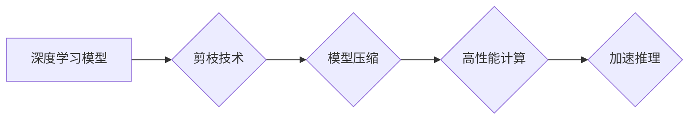

> 剪枝技术，高性能计算，深度学习，模型压缩，加速推理

## 1. 背景介绍

随着深度学习技术的蓬勃发展，其在图像识别、自然语言处理、语音识别等领域取得了令人瞩目的成就。然而，深度学习模型的规模庞大，训练和推理过程都极其耗时和耗能，这严重制约了其在实际应用中的推广。因此，如何高效地训练和推理深度学习模型成为了一个亟待解决的关键问题。

剪枝技术作为一种模型压缩方法，通过移除模型中冗余或不重要的参数，从而减小模型规模，加速推理速度，同时尽量保持模型性能。近年来，剪枝技术在深度学习领域得到了广泛的研究和应用，并取得了显著的成果。

## 2. 核心概念与联系

**2.1 剪枝技术概述**

剪枝技术是指在深度学习模型训练过程中，通过移除模型中不重要的参数或连接，从而减小模型规模，提高模型的效率。剪枝技术可以分为两种主要类型：

* **结构剪枝 (Structural Pruning)**：移除模型中一些连接，例如神经元之间的连接，从而改变模型的结构。
* **权重剪枝 (Weight Pruning)**：移除模型中一些权重，例如神经元的权值，从而减少模型的参数数量。

**2.2 剪枝技术与高性能计算的关系**

高性能计算 (HPC) 旨在通过并行计算和高性能硬件，解决复杂科学计算问题。深度学习模型的训练和推理过程通常需要大量的计算资源，因此，剪枝技术可以有效地提高深度学习模型在HPC环境下的效率。

**2.3 剪枝技术与深度学习的关系**

深度学习模型通常具有大量的参数，这导致模型的训练和推理过程非常耗时和耗能。剪枝技术可以有效地减小模型规模，从而加速训练和推理速度，提高深度学习模型的效率。

**2.4 剪枝技术与模型压缩的关系**

模型压缩是指通过各种技术手段，减小深度学习模型的规模，同时尽量保持模型性能。剪枝技术是模型压缩的一种重要方法，它可以有效地减小模型参数数量，从而降低模型的存储空间和计算成本。

**Mermaid 流程图**



## 3. 核心算法原理 & 具体操作步骤

**3.1 算法原理概述**

剪枝算法的基本原理是通过分析模型中参数的重要性，移除不重要的参数或连接，从而减小模型规模。常用的剪枝算法包括：

* **逐层剪枝 (Layer-wise Pruning)**：逐层移除模型中不重要的参数，例如移除激活函数输出值小于某个阈值的连接。
* **整体剪枝 (Global Pruning)**：根据所有参数的重要性，移除模型中不重要的参数，例如移除权重绝对值小于某个阈值的连接。
* **动态剪枝 (Dynamic Pruning)**：在推理过程中动态地移除不重要的参数，例如移除在当前输入下不重要的连接。

**3.2 算法步骤详解**

1. **训练模型**: 首先，需要训练一个完整的深度学习模型。
2. **计算参数重要性**: 使用一些方法计算模型中每个参数的重要性，例如使用梯度下降算法的梯度值、激活函数的输出值等。
3. **移除不重要参数**: 根据参数重要性，移除模型中不重要的参数，例如移除参数重要性低于某个阈值的连接。
4. **重新训练模型**: 移除参数后，需要重新训练模型，以恢复模型性能。

**3.3 算法优缺点**

**优点**:

* 可以有效地减小模型规模，加速推理速度。
* 相对简单易实现。

**缺点**:

* 可能会导致模型性能下降。
* 需要重新训练模型，增加训练时间和成本。

**3.4 算法应用领域**

剪枝技术广泛应用于各种深度学习领域，例如：

* **图像识别**: 压缩图像识别模型，降低推理成本。
* **自然语言处理**: 压缩自然语言处理模型，提高推理速度。
* **语音识别**: 压缩语音识别模型，降低设备资源占用。

## 4. 数学模型和公式 & 详细讲解 & 举例说明

**4.1 数学模型构建**

假设一个深度学习模型包含 $N$ 个参数，每个参数的重要性可以用一个权重 $w_i$ 表示，其中 $i = 1, 2, ..., N$。剪枝的目标是找到一个子集 $S$，其中包含模型中最重要的参数，并移除子集 $S$ 外的参数。

可以定义一个目标函数 $F(S)$ 来衡量模型在子集 $S$ 中的参数上的性能，例如：

$$F(S) = \text{accuracy}(S)$$

其中 $\text{accuracy}(S)$ 表示模型在子集 $S$ 中的参数上的准确率。

**4.2 公式推导过程**

剪枝算法的目标是找到一个子集 $S$，使得目标函数 $F(S)$ 最大化。可以使用贪婪算法或动态规划算法来解决这个问题。

**4.3 案例分析与讲解**

例如，可以使用梯度下降算法的梯度值来衡量参数的重要性。参数梯度值越大，表示该参数对模型输出的影响越大，因此该参数越重要。可以设置一个阈值，移除梯度值低于该阈值的连接。

## 5. 项目实践：代码实例和详细解释说明

**5.1 开发环境搭建**

* 操作系统：Ubuntu 20.04
* Python 版本：3.8
* 深度学习框架：TensorFlow 2.0

**5.2 源代码详细实现**

```python
import tensorflow as tf

# 定义一个简单的卷积神经网络模型
model = tf.keras.models.Sequential([
    tf.keras.layers.Conv2D(32, (3, 3), activation='relu', input_shape=(28, 28, 1)),
    tf.keras.layers.MaxPooling2D((2, 2)),
    tf.keras.layers.Flatten(),
    tf.keras.layers.Dense(10, activation='softmax')
])

# 训练模型
model.compile(optimizer='adam',
              loss='sparse_categorical_crossentropy',
              metrics=['accuracy'])
model.fit(x_train, y_train, epochs=10)

# 计算模型参数的重要性
weights = model.get_weights()
gradients = tf.gradients(model.output, weights)

# 移除参数重要性低于阈值的连接
threshold = 0.1
for i, weight in enumerate(weights):
    if tf.reduce_mean(tf.abs(gradients[i])) < threshold:
        weight = tf.zeros_like(weight)

# 更新模型参数
model.set_weights(weights)

# 重新训练模型
model.compile(optimizer='adam',
              loss='sparse_categorical_crossentropy',
              metrics=['accuracy'])
model.fit(x_train, y_train, epochs=10)
```

**5.3 代码解读与分析**

* 首先，定义一个简单的卷积神经网络模型。
* 训练模型，并计算模型参数的重要性。
* 设置一个阈值，移除参数重要性低于该阈值的连接。
* 更新模型参数，并重新训练模型。

**5.4 运行结果展示**

通过运行代码，可以观察到剪枝后的模型在训练和推理过程中的性能变化。

## 6. 实际应用场景

**6.1 嵌入式设备**

嵌入式设备通常具有有限的计算资源和存储空间，剪枝技术可以有效地压缩深度学习模型，使其能够在嵌入式设备上运行。例如，可以将剪枝后的图像识别模型部署在智能手机、智能手表等设备上，实现实时图像识别功能。

**6.2 边缘计算**

边缘计算是指将计算任务从云端转移到靠近数据源的边缘设备上，剪枝技术可以帮助在边缘设备上部署更小的深度学习模型，从而降低网络延迟和数据传输成本。例如，可以将剪枝后的语音识别模型部署在智能音箱上，实现离线语音识别功能。

**6.3 医疗诊断**

剪枝技术可以用于压缩医疗图像分析模型，使其能够在医疗设备上运行，从而提高医疗诊断的效率和准确性。例如，可以将剪枝后的X光片分析模型部署在医院的放射科，实现自动检测肺结核等疾病。

**6.4 未来应用展望**

随着深度学习技术的不断发展，剪枝技术将在更多领域得到应用，例如：

* **自动驾驶**: 压缩自动驾驶模型，降低计算成本，提高实时性。
* **机器人控制**: 压缩机器人控制模型，提高机器人响应速度和控制精度。
* **个性化推荐**: 压缩个性化推荐模型，提高推荐准确性和效率。

## 7. 工具和资源推荐

**7.1 学习资源推荐**

* **论文**:
    * "Pruning Filters for Efficient ConvNets"
    * "Learning Efficient Convolutional Networks through Network Slimming"
    * "Deep Compression: Compressing Deep Neural Networks with Pruning, Trained Quantization and Huffman Coding"
* **博客**:
    * https://towardsdatascience.com/model-pruning-techniques-for-deep-learning-a-comprehensive-guide-a3999999999a
    * https://blog.paperspace.com/model-pruning-for-deep-learning/

**7.2 开发工具推荐**

* **TensorFlow**: https://www.tensorflow.org/
* **PyTorch**: https://pytorch.org/

**7.3 相关论文推荐**

* "Pruning Filters for Efficient ConvNets"
* "Learning Efficient Convolutional Networks through Network Slimming"
* "Deep Compression: Compressing Deep Neural Networks with Pruning, Trained Quantization and Huffman Coding"

## 8. 总结：未来发展趋势与挑战

**8.1 研究成果总结**

剪枝技术在深度学习模型压缩方面取得了显著的成果，有效地减小了模型规模，加速了推理速度，同时尽量保持模型性能。

**8.2 未来发展趋势**

* **自动化剪枝**: 自动化剪枝算法可以自动选择最佳的剪枝策略，提高剪枝效率。
* **动态剪枝**: 动态剪枝算法可以根据输入数据动态地移除不重要的参数，进一步提高模型的效率。
* **联合剪枝**: 联合剪枝算法可以同时进行结构剪枝和权重剪枝，进一步减小模型规模。

**8.3 面临的挑战**

* **剪枝后的模型性能**: 剪枝可能会导致模型性能下降，需要找到一种有效的剪枝策略，尽量保持模型性能。
* **剪枝算法的复杂性**: 一些剪枝算法比较复杂，需要大量的计算资源和时间。
* **剪枝算法的可解释性**: 一些剪枝算法的决策过程难以解释，需要提高剪枝算法的可解释性。

**8.4 研究展望**

未来，剪枝技术将继续发展，并应用于更多领域。研究者将继续探索新的剪枝算法，提高剪枝效率和准确性，并解决剪枝技术面临的挑战。

## 9. 附录：常见问题与解答

**9.1 什么是剪枝技术？**

剪枝技术是一种模型压缩方法，通过移除模型中冗余或不重要的参数，从而减小模型规模，加速推理速度，同时尽量保持模型性能。

**9.2 剪枝技术的优点是什么？**

* 可以有效地减小模型规模，加速推理速度。
* 相对简单易实现。

**9.3 剪枝技术的缺点是什么？**

* 可能会导致模型性能下降。
* 需要重新训练模型，增加训练时间和成本。

**9.4 剪枝技术有哪些应用场景？**

剪枝技术广泛应用于各种深度学习领域，例如：

* **图像识别**: 压缩图像识别模型，降低推理成本。
* **自然语言处理**: 压缩自然语言处理模型，提高推理速度。
* **语音识别**: 压缩语音识别模型，降低设备资源占用。


作者：禅与计算机程序