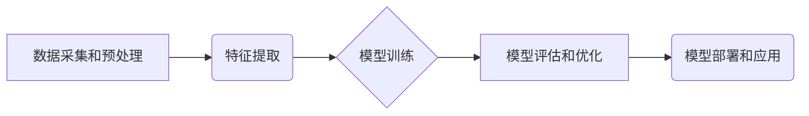

> 医疗大模型，疾病诊断，治疗方案，深度学习，自然语言处理，计算机视觉，医疗人工智能

## 1. 背景介绍

医疗领域正处于数字化转型和智能化升级的关键时期。随着大数据、人工智能等技术的快速发展，医疗大模型应运而生，成为医疗领域的新兴热点。医疗大模型是指利用深度学习等人工智能技术，在海量医疗数据上进行训练，能够完成疾病诊断、治疗方案推荐、药物研发等复杂任务的智能模型。

传统医疗诊断和治疗模式存在着诸多局限性，例如：

* **诊断效率低:** 医生需要花费大量时间和精力进行病历阅读、检查结果分析等工作，诊断效率低下。
* **诊断准确率有限:** 人为因素、经验不足等问题可能导致诊断结果的误差。
* **个性化治疗缺乏:** 现有的治疗方案往往缺乏针对性，难以满足不同患者的个性化需求。

医疗大模型的出现，为解决这些问题提供了新的思路和方法。通过学习海量医疗数据，医疗大模型能够：

* **提高诊断效率:** 自动化病历分析、检查结果解读等工作，大幅提升诊断效率。
* **提升诊断准确率:** 基于数据驱动，降低人为因素的影响，提高诊断准确率。
* **实现个性化治疗:** 根据患者的个体特征，提供个性化的治疗方案建议。

## 2. 核心概念与联系

医疗大模型的核心概念包括：

* **深度学习:** 是一种机器学习算法，能够学习数据中的复杂特征，并进行预测或分类。
* **自然语言处理 (NLP):** 用于处理和理解人类语言的计算机技术，可以用于分析病历、医学文献等文本数据。
* **计算机视觉 (CV):** 用于处理和理解图像数据的计算机技术，可以用于分析医学影像数据，例如X光片、CT扫描等。
* **医疗数据:** 包括病历、检查结果、影像数据、基因数据等各种类型的数据。

医疗大模型的架构通常由以下几个部分组成：

* **数据采集和预处理:** 收集和清洗医疗数据，并将其转换为模型可理解的格式。
* **特征提取:** 从医疗数据中提取有用的特征，例如症状、检查结果、病史等。
* **模型训练:** 使用深度学习算法，在训练数据上训练模型，使其能够完成疾病诊断、治疗方案推荐等任务。
* **模型评估和优化:** 对模型的性能进行评估，并根据评估结果进行模型优化。
* **模型部署和应用:** 将训练好的模型部署到实际应用场景中，例如医院、诊所等。



## 3. 核心算法原理 & 具体操作步骤

### 3.1  算法原理概述

医疗大模型的核心算法主要包括深度学习算法，例如卷积神经网络 (CNN)、循环神经网络 (RNN) 和 Transformer 等。

* **卷积神经网络 (CNN):** 擅长处理图像数据，可以用于分析医学影像数据，例如X光片、CT扫描等。
* **循环神经网络 (RNN):** 擅长处理序列数据，可以用于分析病历、医学文献等文本数据。
* **Transformer:** 是一种新型的深度学习模型，能够处理长序列数据，并具有强大的文本理解能力。

### 3.2  算法步骤详解

1. **数据收集和预处理:** 收集来自医院、诊所、科研机构等各种来源的医疗数据，并进行清洗、格式化等预处理工作。
2. **特征提取:** 使用预训练模型或手工设计特征提取器，从医疗数据中提取有用的特征，例如症状、检查结果、病史等。
3. **模型训练:** 选择合适的深度学习算法，并使用训练数据对模型进行训练。训练过程中，模型会不断调整参数，以最小化预测误差。
4. **模型评估和优化:** 使用测试数据对模型的性能进行评估，并根据评估结果进行模型优化，例如调整模型结构、学习率等参数。
5. **模型部署和应用:** 将训练好的模型部署到实际应用场景中，例如医院、诊所等，用于疾病诊断、治疗方案推荐等任务。

### 3.3  算法优缺点

**优点:**

* **高准确率:** 基于海量数据训练，能够实现高准确率的疾病诊断和治疗方案推荐。
* **自动化程度高:** 可以自动化完成许多医疗工作，例如病历分析、检查结果解读等，提高工作效率。
* **个性化程度高:** 可以根据患者的个体特征，提供个性化的治疗方案建议。

**缺点:**

* **数据依赖性强:** 医疗大模型的性能取决于训练数据的质量和数量。
* **解释性差:** 深度学习模型的决策过程往往难以解释，这可能导致医生难以信任模型的诊断结果。
* **伦理风险:** 医疗大模型的应用可能带来一些伦理风险，例如数据隐私泄露、算法偏见等问题。

### 3.4  算法应用领域

医疗大模型的应用领域非常广泛，包括：

* **疾病诊断:** 辅助医生诊断各种疾病，例如癌症、心血管疾病、神经系统疾病等。
* **治疗方案推荐:** 根据患者的个体特征，推荐个性化的治疗方案。
* **药物研发:** 辅助药物研发，例如预测药物的疗效和安全性。
* **医疗影像分析:** 分析医学影像数据，例如X光片、CT扫描等，辅助医生进行诊断和治疗。
* **患者管理:** 辅助医生进行患者管理，例如预测患者的风险、提醒医生进行随访等。

## 4. 数学模型和公式 & 详细讲解 & 举例说明

### 4.1  数学模型构建

医疗大模型通常采用深度学习算法，其数学模型主要基于神经网络。神经网络由多个层组成，每一层包含多个神经元。神经元之间通过连接进行信息传递，每个连接都有一个权重。

神经网络的训练过程就是通过调整权重，使模型的输出与实际值尽可能接近的过程。

### 4.2  公式推导过程

深度学习算法的训练过程通常使用梯度下降法。梯度下降法的核心思想是通过不断调整权重，使模型的损失函数最小化。

损失函数 $L$ 是衡量模型预测结果与实际值的误差的函数。梯度下降法的更新公式如下：

$$
\theta = \theta - \alpha \nabla L(\theta)
$$

其中：

* $\theta$ 是模型的权重向量。
* $\alpha$ 是学习率，控制着权重更新的步长。
* $\nabla L(\theta)$ 是损失函数 $L$ 对权重 $\theta$ 的梯度。

### 4.3  案例分析与讲解

例如，在疾病诊断任务中，我们可以使用 CNN 模型来分析患者的医学影像数据，并预测患者是否患有某种疾病。

训练 CNN 模型时，我们需要准备大量的医学影像数据，并将其标记为患病或未患病。然后，我们将这些数据用于训练 CNN 模型，使其能够学习医学影像数据中的特征，并预测患者是否患有某种疾病。

## 5. 项目实践：代码实例和详细解释说明

### 5.1  开发环境搭建

为了开发医疗大模型，我们需要搭建一个合适的开发环境。

* **操作系统:** Linux 或 macOS
* **编程语言:** Python
* **深度学习框架:** TensorFlow 或 PyTorch
* **其他工具:** Git、Jupyter Notebook 等

### 5.2  源代码详细实现

以下是一个使用 TensorFlow 框架实现疾病诊断的简单代码示例：

```python
import tensorflow as tf

# 定义模型结构
model = tf.keras.models.Sequential([
    tf.keras.layers.Conv2D(32, (3, 3), activation='relu', input_shape=(224, 224, 3)),
    tf.keras.layers.MaxPooling2D((2, 2)),
    tf.keras.layers.Conv2D(64, (3, 3), activation='relu'),
    tf.keras.layers.MaxPooling2D((2, 2)),
    tf.keras.layers.Flatten(),
    tf.keras.layers.Dense(10, activation='softmax')
])

# 编译模型
model.compile(optimizer='adam',
              loss='sparse_categorical_crossentropy',
              metrics=['accuracy'])

# 训练模型
model.fit(x_train, y_train, epochs=10)

# 评估模型
loss, accuracy = model.evaluate(x_test, y_test)
print('Loss:', loss)
print('Accuracy:', accuracy)
```

### 5.3  代码解读与分析

这段代码定义了一个简单的 CNN 模型，用于疾病诊断。

* `tf.keras.models.Sequential` 创建了一个顺序模型，即层级结构。
* `tf.keras.layers.Conv2D` 定义了一个卷积层，用于提取图像特征。
* `tf.keras.layers.MaxPooling2D` 定义了一个最大池化层，用于降低特征图的维度。
* `tf.keras.layers.Flatten` 将多维特征图转换为一维向量。
* `tf.keras.layers.Dense` 定义了一个全连接层，用于分类。
* `model.compile` 编译模型，指定优化器、损失函数和评价指标。
* `model.fit` 训练模型，使用训练数据进行训练。
* `model.evaluate` 评估模型，使用测试数据评估模型的性能。

### 5.4  运行结果展示

训练完成后，我们可以使用测试数据评估模型的性能。

评估结果通常包括损失函数值和准确率。

## 6. 实际应用场景

医疗大模型已经开始在一些实际应用场景中得到应用，例如：

* **疾病诊断辅助:** 辅助医生诊断各种疾病，例如癌症、心血管疾病、神经系统疾病等。
* **个性化治疗方案推荐:** 根据患者的个体特征，推荐个性化的治疗方案。
* **药物研发辅助:** 辅助药物研发，例如预测药物的疗效和安全性。
* **医疗影像分析:** 分析医学影像数据，例如X光片、CT扫描等，辅助医生进行诊断和治疗。

### 6.4  未来应用展望

未来，医疗大模型的应用场景将会更加广泛，例如：

* **远程医疗:** 帮助医生远程诊断和治疗患者。
* **疾病预防:** 预测患者患病风险，并提供相应的预防措施。
* **健康管理:** 为患者提供个性化的健康管理建议。

## 7. 工具和资源推荐

### 7.1  学习资源推荐

* **书籍:**
    * 深度学习
    * 医疗人工智能
* **在线课程:**
    * Coursera
    * edX
    * Udacity
* **博客和论坛:**
    * TensorFlow Blog
    * PyTorch Blog
    * Kaggle

### 7.2  开发工具推荐

* **深度学习框架:** TensorFlow, PyTorch
* **数据处理工具:** Pandas, NumPy
* **可视化工具:** Matplotlib, Seaborn

### 7.3  相关论文推荐

* **Attention Is All You Need**
* **BERT: Pre-training of Deep Bidirectional Transformers for Language Understanding**
* **ImageNet Classification with Deep Convolutional Neural Networks**

## 8. 总结：未来发展趋势与挑战

### 8.1  研究成果总结

医疗大模型在疾病诊断、治疗方案推荐、药物研发等领域取得了显著成果，为医疗行业带来了新的机遇。

### 8.2  未来发展趋势

未来，医疗大模型的发展趋势包括：

* **模型规模和能力的提升:** 随着计算能力的提升，医疗大模型的规模和能力将会进一步提升。
* **多模态融合:** 将不同类型的数据，例如文本、图像、音频等融合在一起，构建更全面的医疗模型。
* **解释性增强:** 提高医疗大模型的解释性，使医生能够更好地理解模型的决策过程。
* **个性化医疗:** 为每个患者提供个性化的医疗服务。

### 8.3  面临的