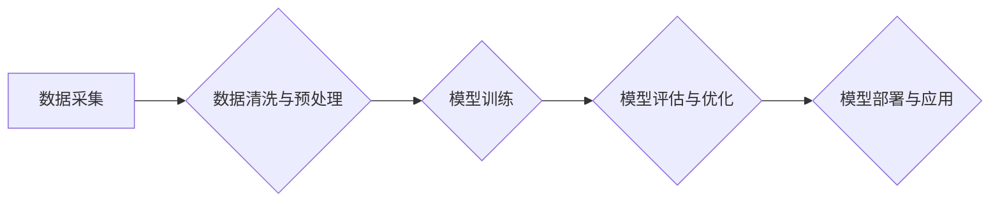

>人工智能、生产力、核心竞争力、算法优化、数据驱动、自动化、机器学习、深度学习

## 1. 背景介绍

在当今数字化时代，科技创新正以惊人的速度发展，人工智能（AI）作为科技发展的重要驱动力，正在深刻地改变着生产方式和生活方式。AI技术的应用，不仅能够提高生产效率，还能创造新的价值，推动经济社会发展。然而，如何将AI技术真正转化为生产力，提升企业核心竞争力，是摆在我们面前的重大课题。

传统生产力主要依靠人力、物力、资本等要素，而新质生产力则强调以数据为基础，以算法为核心，以智能化为特征。AI技术的应用，为实现新质生产力提供了强大的技术支撑。

## 2. 核心概念与联系

**2.1 新质生产力**

新质生产力是指以数据为基础，以算法为核心，以智能化为特征，能够大幅度提高生产效率、降低生产成本、创造新的价值的生产力。

**2.2 核心竞争力**

核心竞争力是指企业在市场竞争中能够持续保持优势的独特能力，是企业长期发展的关键驱动力。

**2.3 AI技术与新质生产力**

AI技术能够通过学习和分析海量数据，自动识别模式、预测趋势，并做出智能决策，从而实现生产过程的自动化、智能化，大幅提升生产效率和产品质量。

**2.4 AI技术与核心竞争力**

AI技术能够帮助企业实现以下方面的核心竞争力提升：

* **产品创新:** AI能够帮助企业快速分析市场需求，识别新的产品机会，并加速产品研发周期。
* **运营效率:** AI能够帮助企业优化生产流程、降低运营成本，提高资源利用率。
* **客户体验:** AI能够帮助企业提供个性化服务，提升客户满意度。
* **市场洞察:** AI能够帮助企业分析市场数据，洞察市场趋势，制定更精准的营销策略。

**2.5 AI技术应用场景**

AI技术应用场景广泛，涵盖制造业、金融业、零售业、医疗保健业等多个领域。

**Mermaid 流程图**



## 3. 核心算法原理 & 具体操作步骤

**3.1 算法原理概述**

深度学习算法是一种基于人工神经网络的机器学习算法，能够自动学习数据中的复杂特征，并进行预测或分类。深度学习算法的核心是多层神经网络，通过层层叠加的网络结构，能够学习到数据中的抽象特征，从而实现更精准的预测或分类。

**3.2 算法步骤详解**

1. **数据准备:** 收集和清洗数据，并将其转换为深度学习算法可以理解的格式。
2. **模型构建:** 选择合适的深度学习模型架构，并设置模型参数。
3. **模型训练:** 使用训练数据训练模型，调整模型参数，使模型能够准确地预测或分类数据。
4. **模型评估:** 使用测试数据评估模型的性能，并进行模型优化。
5. **模型部署:** 将训练好的模型部署到实际应用场景中，用于预测或分类新的数据。

**3.3 算法优缺点**

**优点:**

* 能够学习到数据中的复杂特征，实现更精准的预测或分类。
* 能够处理海量数据，并自动提取特征，降低人工特征工程的成本。

**缺点:**

* 需要大量的训练数据，否则模型性能会下降。
* 训练过程耗时较长，需要强大的计算资源。
* 模型解释性较差，难以理解模型的决策过程。

**3.4 算法应用领域**

深度学习算法应用领域广泛，包括：

* **图像识别:** 人脸识别、物体检测、图像分类等。
* **自然语言处理:** 文本分类、机器翻译、语音识别等。
* **推荐系统:** 商品推荐、内容推荐等。
* **医疗诊断:** 疾病诊断、影像分析等。

## 4. 数学模型和公式 & 详细讲解 & 举例说明

**4.1 数学模型构建**

深度学习模型通常采用多层神经网络结构，每个神经元接收多个输入信号，并通过激活函数进行处理，输出一个信号。神经网络的输出结果是多个神经元的输出值，这些输出值可以用于预测或分类数据。

**4.2 公式推导过程**

深度学习模型的训练过程是通过反向传播算法来实现的。反向传播算法的核心思想是通过计算误差，并反向传播误差梯度，更新模型参数，从而使模型的预测结果越来越准确。

**4.3 案例分析与讲解**

假设我们有一个图像分类任务，目标是将图像分类为猫或狗。我们可以使用深度学习模型来实现这个任务。

* **输入数据:** 图像数据
* **模型结构:** 多层卷积神经网络
* **输出结果:** 猫或狗的类别

训练过程中，模型会学习到图像特征，并根据这些特征预测图像的类别。

**数学公式:**

* **激活函数:** $f(x) = \frac{1}{1 + e^{-x}}$
* **损失函数:** $L = \sum_{i=1}^{N} \left( y_i - \hat{y}_i \right)^2$
* **梯度下降算法:** $\theta = \theta - \alpha \nabla L(\theta)$

其中:

* $f(x)$ 是激活函数
* $L$ 是损失函数
* $\theta$ 是模型参数
* $\alpha$ 是学习率
* $\nabla L(\theta)$ 是损失函数对模型参数的梯度

## 5. 项目实践：代码实例和详细解释说明

**5.1 开发环境搭建**

* 操作系统: Ubuntu 20.04
* Python 版本: 3.8
* 深度学习框架: TensorFlow 2.0

**5.2 源代码详细实现**

```python
import tensorflow as tf

# 定义模型结构
model = tf.keras.models.Sequential([
    tf.keras.layers.Conv2D(32, (3, 3), activation='relu', input_shape=(28, 28, 1)),
    tf.keras.layers.MaxPooling2D((2, 2)),
    tf.keras.layers.Conv2D(64, (3, 3), activation='relu'),
    tf.keras.layers.MaxPooling2D((2, 2)),
    tf.keras.layers.Flatten(),
    tf.keras.layers.Dense(10, activation='softmax')
])

# 编译模型
model.compile(optimizer='adam',
              loss='sparse_categorical_crossentropy',
              metrics=['accuracy'])

# 加载数据集
(x_train, y_train), (x_test, y_test) = tf.keras.datasets.mnist.load_data()

# 数据预处理
x_train = x_train.astype('float32') / 255.0
x_test = x_test.astype('float32') / 255.0
x_train = x_train.reshape((x_train.shape[0], 28, 28, 1))
x_test = x_test.reshape((x_test.shape[0], 28, 28, 1))

# 训练模型
model.fit(x_train, y_train, epochs=5)

# 评估模型
loss, accuracy = model.evaluate(x_test, y_test)
print('Test loss:', loss)
print('Test accuracy:', accuracy)
```

**5.3 代码解读与分析**

* 代码首先定义了模型结构，使用卷积神经网络进行图像分类。
* 然后编译模型，设置优化器、损失函数和评价指标。
* 加载MNIST数据集，并进行数据预处理。
* 训练模型，并评估模型性能。

**5.4 运行结果展示**

训练完成后，模型能够准确地识别MNIST数据集中的手写数字。

## 6. 实际应用场景

**6.1 制造业**

* **智能制造:** AI可以帮助制造企业实现自动化生产、预测性维护、质量控制等，提高生产效率和产品质量。
* **供应链管理:** AI可以帮助制造企业优化供应链，提高物流效率和降低成本。

**6.2 金融业**

* **风险管理:** AI可以帮助金融机构识别和评估风险，降低金融风险。
* **欺诈检测:** AI可以帮助金融机构识别和预防欺诈行为。
* **个性化金融服务:** AI可以帮助金融机构提供个性化的金融服务，例如理财建议、贷款审批等。

**6.3 零售业**

* **个性化推荐:** AI可以帮助零售企业根据用户的购买历史和偏好，推荐个性化的商品。
* **库存管理:** AI可以帮助零售企业优化库存管理，降低库存成本。
* **客户服务:** AI可以帮助零售企业提供智能化的客户服务，例如在线聊天机器人。

**6.4 医疗保健业**

* **疾病诊断:** AI可以帮助医生诊断疾病，提高诊断准确率。
* **药物研发:** AI可以帮助加速药物研发，降低研发成本。
* **个性化医疗:** AI可以帮助提供个性化的医疗方案，例如个性化的治疗方案、健康管理方案等。

**6.5 未来应用展望**

AI技术的应用场景还在不断扩展，未来将应用于更多领域，例如教育、交通、能源等。AI技术将深刻地改变我们的生活方式，创造新的价值。

## 7. 工具和资源推荐

**7.1 学习资源推荐**

* **在线课程:** Coursera、edX、Udacity等平台提供丰富的AI课程。
* **书籍:** 《深度学习》、《机器学习》、《人工智能》等书籍。
* **开源项目:** TensorFlow、PyTorch、Keras等开源项目。

**7.2 开发工具推荐**

* **Python:** 深度学习开发的主要编程语言。
* **TensorFlow:** 深度学习框架。
* **PyTorch:** 深度学习框架。
* **Keras:** 深度学习框架。

**7.3 相关论文推荐**

* **《ImageNet Classification with Deep Convolutional Neural Networks》**
* **《Attention Is All You Need》**
* **《BERT: Pre-training of Deep Bidirectional Transformers for Language Understanding》**

## 8. 总结：未来发展趋势与挑战

**8.1 研究成果总结**

近年来，AI技术取得了长足的进步，在图像识别、自然语言处理、语音识别等领域取得了突破性进展。

**8.2 未来发展趋势**

* **模型规模化:** 模型规模将继续扩大，模型能力将进一步提升。
* **算法创新:** 新的AI算法将不断涌现，例如强化学习、联邦学习等。
* **跨模态学习:** AI模型将能够处理多种模态数据，例如文本、图像、音频等。
* **边缘计算:** AI模型将部署到边缘设备，实现更快速的响应和更低的延迟。

**8.3 面临的挑战**

* **数据安全:** AI模型训练需要大量数据，数据安全问题需要得到重视。
* **算法可解释性:** AI模型的决策过程难以理解，需要提高算法的可解释性。
* **伦理问题:** AI技术应用需要考虑伦理问题，例如算法偏见、隐私保护等。

**8.4 研究展望**

未来，AI技术将继续发展，并应用于更多领域，为人类社会带来更多福祉。我们需要加强AI技术研究，解决AI技术面临的挑战，并确保AI技术安全、可控、可持续发展。

## 9. 附录：常见问题与解答

**9.1 如何选择合适的深度学习模型？**

选择合适的深度学习模型需要根据具体任务和数据特点进行选择。

**9.2 如何训练深度学习模型？**

训练深度学习模型需要准备数据、定义模型结构、编译模型、训练模型、评估模型等步骤。

**9.3 如何解决深度学习模型的过拟合问题？**

过拟合问题可以通过正则化