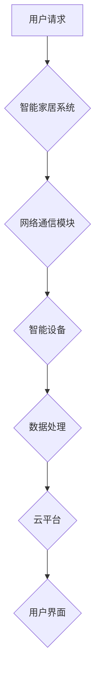

> 智能家居, Java, 安全性, 网络通信, 数据加密, 权限控制, 物联网

## 1. 背景介绍

智能家居已成为现代生活的重要组成部分，它通过网络连接各种智能设备，实现对家居环境的自动化控制和远程管理。然而，随着智能家居系统的复杂性和网络连接的增加，其安全性也面临着越来越多的挑战。数据泄露、设备被黑客控制、隐私侵犯等问题日益突出，威胁着用户的数据安全和财产安全。

Java作为一种成熟、稳定、安全的编程语言，在智能家居领域具有广泛的应用。其强大的安全性特性、丰富的第三方库和庞大的开发者社区，为构建安全可靠的智能家居系统提供了坚实的基础。

## 2. 核心概念与联系

### 2.1 智能家居系统架构

智能家居系统通常由以下几个核心组件组成：

* **智能设备:** 包括各种传感器、执行器、控制单元等，负责感知环境、执行指令和收集数据。
* **网络通信模块:** 负责智能设备之间的通信和数据传输，通常采用Wi-Fi、蓝牙、Zigbee等无线通信协议。
* **云平台:** 提供数据存储、处理、分析和远程控制等服务，连接智能设备和用户。
* **用户界面:** 提供用户与智能家居系统交互的界面，例如手机APP、平板电脑、语音助手等。

### 2.2 Java在智能家居中的应用

Java在智能家居系统中扮演着重要的角色，主要应用于以下方面：

* **设备驱动程序开发:** Java可以开发各种智能设备的驱动程序，实现设备与系统之间的通信和控制。
* **应用程序开发:** Java可以开发智能家居系统的应用程序，例如控制灯光、调节温度、远程监控等。
* **云平台开发:** Java可以开发智能家居系统的云平台，提供数据存储、处理、分析和远程控制等服务。

### 2.3 Java安全性特性

Java拥有强大的安全性特性，包括：

* **虚拟机沙盒机制:** Java代码运行在虚拟机中，隔离了与系统内核和其他应用程序的直接交互，防止恶意代码攻击系统。
* **访问控制机制:** Java提供了严格的访问控制机制，可以控制代码对资源的访问权限，防止未授权访问。
* **加密算法支持:** Java支持多种加密算法，可以对数据进行加密和解密，保护数据安全。

### 2.4  Mermaid 流程图



## 3. 核心算法原理 & 具体操作步骤

### 3.1  算法原理概述

在智能家居系统中，为了保证安全性，需要采用多种算法和技术来保护用户数据和设备安全。常见的算法包括：

* **数据加密算法:** 用于对用户数据进行加密，防止未授权访问。常见的加密算法包括AES、DES、RSA等。
* **身份验证算法:** 用于验证用户的身份，防止伪造和冒充。常见的身份验证算法包括密码验证、生物识别验证、多因素身份验证等。
* **权限控制算法:** 用于控制用户对系统资源的访问权限，防止越权操作。常见的权限控制算法包括角色权限控制、属性基准控制等。

### 3.2  算法步骤详解

以数据加密算法为例，其具体操作步骤如下：

1. **密钥生成:** 系统生成一个随机的密钥，用于加密和解密数据。
2. **数据加密:** 将用户数据与密钥进行加密操作，生成加密后的数据。
3. **数据传输:** 将加密后的数据传输到云平台或其他目标系统。
4. **数据解密:** 目标系统使用相同的密钥对加密数据进行解密，恢复原始数据。

### 3.3  算法优缺点

不同的算法具有不同的优缺点，需要根据实际应用场景选择合适的算法。例如，AES算法安全性高，但计算量较大；DES算法计算量小，但安全性较低。

### 3.4  算法应用领域

数据加密算法、身份验证算法和权限控制算法广泛应用于智能家居系统，例如：

* **用户数据加密:** 保护用户的个人信息、设备配置等敏感数据。
* **设备身份验证:** 验证智能设备的身份，防止伪造和冒充。
* **权限控制:** 控制用户对智能设备和系统功能的访问权限。

## 4. 数学模型和公式 & 详细讲解 & 举例说明

### 4.1  数学模型构建

在智能家居系统中，可以使用数学模型来描述系统行为和安全特性。例如，可以使用概率论来分析系统安全漏洞的风险，可以使用博弈论来分析用户和攻击者的博弈关系。

### 4.2  公式推导过程

例如，可以使用贝叶斯定理来计算系统安全漏洞的风险概率。

$$P(漏洞|攻击) = \frac{P(攻击|漏洞) * P(漏洞)}{P(攻击)}$$

其中：

* $P(漏洞|攻击)$: 给定攻击事件发生的情况下，系统存在漏洞的概率。
* $P(攻击|漏洞)$: 给定系统存在漏洞的情况下，攻击事件发生的概率。
* $P(漏洞)$: 系统存在漏洞的概率。
* $P(攻击)$: 攻击事件发生的概率。

### 4.3  案例分析与讲解

例如，假设系统存在一个漏洞，攻击者利用该漏洞可以窃取用户数据。如果攻击者利用该漏洞的成功率为80%，系统存在漏洞的概率为10%，攻击事件发生的概率为1%，那么，根据贝叶斯定理，我们可以计算出给定攻击事件发生的情况下，系统存在漏洞的概率为：

$$P(漏洞|攻击) = \frac{0.8 * 0.1}{0.01} = 80\%$$

## 5. 项目实践：代码实例和详细解释说明

### 5.1  开发环境搭建

* **操作系统:** Windows、macOS、Linux
* **JDK:** Java Development Kit 11 或更高版本
* **IDE:** Eclipse、IntelliJ IDEA、NetBeans等

### 5.2  源代码详细实现

```java
// 数据加密示例代码
import javax.crypto.Cipher;
import javax.crypto.KeyGenerator;
import javax.crypto.SecretKey;
import javax.crypto.spec.SecretKeySpec;
import java.security.NoSuchAlgorithmException;
import java.security.SecureRandom;

public class DataEncryption {

    public static void main(String[] args) throws Exception {
        // 生成密钥
        SecretKey key = generateKey();

        // 加密数据
        String plaintext = "This is a secret message.";
        String ciphertext = encrypt(plaintext, key);
        System.out.println("Ciphertext: " + ciphertext);

        // 解密数据
        String decryptedText = decrypt(ciphertext, key);
        System.out.println("Decrypted text: " + decryptedText);
    }

    private static SecretKey generateKey() throws NoSuchAlgorithmException {
        KeyGenerator keyGen = KeyGenerator.getInstance("AES");
        keyGen.init(128, new SecureRandom());
        return keyGen.generateKey();
    }

    private static String encrypt(String plaintext, SecretKey key) throws Exception {
        Cipher cipher = Cipher.getInstance("AES");
        cipher.init(Cipher.ENCRYPT_MODE, key);
        byte[] encryptedBytes = cipher.doFinal(plaintext.getBytes());
        return new String(encryptedBytes);
    }

    private static String decrypt(String ciphertext, SecretKey key) throws Exception {
        Cipher cipher = Cipher.getInstance("AES");
        cipher.init(Cipher.DECRYPT_MODE, key);
        byte[] decryptedBytes = cipher.doFinal(ciphertext.getBytes());
        return new String(decryptedBytes);
    }
}
```

### 5.3  代码解读与分析

* **密钥生成:** 使用`KeyGenerator`生成一个AES密钥，密钥长度为128位。
* **数据加密:** 使用`Cipher`对象进行加密操作，将明文数据转换为密文数据。
* **数据解密:** 使用相同的密钥进行解密操作，将密文数据转换为明文数据。

### 5.4  运行结果展示

运行代码后，会输出加密后的密文和解密后的明文。

## 6. 实际应用场景

### 6.1 智能家居设备安全

* **设备身份验证:** 使用身份验证算法验证智能设备的身份，防止伪造和冒充。
* **数据加密:** 对智能设备的数据进行加密，防止未授权访问。
* **远程控制安全:** 使用多因素身份验证来保护远程控制功能的安全。

### 6.2 用户数据安全

* **用户数据加密:** 对用户的个人信息、设备配置等敏感数据进行加密，防止泄露。
* **权限控制:** 使用权限控制算法控制用户对系统资源的访问权限，防止越权操作。
* **多因素身份验证:** 使用多因素身份验证来保护用户账户的安全。

### 6.3 系统安全

* **入侵检测:** 使用入侵检测系统来监控系统活动，检测恶意攻击。
* **漏洞修复:** 及时修复系统漏洞，防止攻击者利用漏洞进行攻击。
* **安全更新:** 定期更新系统软件，修复安全漏洞。

### 6.4  未来应用展望

随着智能家居技术的不断发展，安全性将成为越来越重要的关注点。未来，Java在智能家居安全领域将发挥更加重要的作用，例如：

* **人工智能安全:** 使用人工智能技术来检测和防御新的安全威胁。
* **区块链安全:** 使用区块链技术来保障数据安全和隐私保护。
* **边缘计算安全:** 使用边缘计算技术来提高智能家居系统的安全性。

## 7. 工具和资源推荐

### 7.1  学习资源推荐

* **Java官方文档:** https://docs.oracle.com/javase/tutorial/
* **Spring Boot官方文档:** https://spring.io/projects/spring-boot
* **Java安全最佳实践指南:** https://owasp.org/www-project-java-security-cheat-sheet/

### 7.2  开发工具推荐

* **Eclipse:** https://www.eclipse.org/
* **IntelliJ IDEA:** https://www.jetbrains.com/idea/
* **NetBeans:** https://netbeans.apache.org/

### 7.3  相关论文推荐

* **Java Card Security Architecture:** https://www.researchgate.net/publication/228587587_Java_Card_Security_Architecture
* **Secure Software Development for Java:** https://www.springer.com/gp/book/9783642178777

## 8. 总结：未来发展趋势与挑战

### 8.1  研究成果总结

本文介绍了Java在智能家居安全领域的作用，并探讨了数据加密、身份验证和权限控制等关键算法。通过代码实例和实际应用场景，展示了Java在智能家居安全中的应用实践。

### 8.2  未来发展趋势

未来，智能家居安全将朝着以下方向发展：

* **人工智能安全:** 使用人工智能技术来检测和防御新的安全威胁。
* **区块链安全:** 使用区块链技术来保障数据安全和隐私保护。
* **边缘计算安全:** 使用边缘计算技术来提高智能家居系统的安全性。

### 8.3  面临的挑战

智能家居安全也面临着一些挑战：

* **复杂性:** 智能家居系统越来越复杂，安全漏洞也越来越多。
* **互操作性:** 不同厂商的智能设备之间互操作性差，导致安全管理难度增加。
* **用户意识:** 用户对智能家居安全的意识不足，容易成为攻击目标。

### 8.4  研究展望

未来，需要进一步研究和开发新的安全技术和解决方案，以应对智能家居安全面临的挑战。

## 9. 附录：常见问题与解答

### 9.1  常见问题

* **如何选择合适的加密算法？**

选择合适的加密算法需要根据实际应用场景和安全需求进行考虑。

* **如何保护用户数据隐私？**

可以使用数据