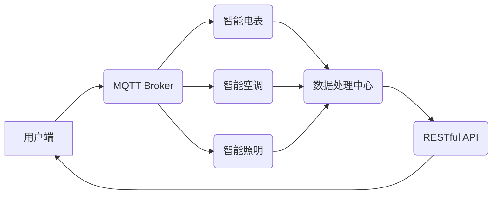

> MQTT, RESTful API, 家用能源管理系统, 物联网, 智能家居, 数据可视化, 系统优化

## 1. 背景介绍

随着智能家居技术的快速发展，家用能源管理系统 (Home Energy Management System, HEMs) 越来越受到人们的关注。HEMs能够实时监测家庭用电情况，分析能源消耗模式，并提供个性化节能建议，帮助用户降低能源成本，提高生活品质。传统的HEMs系统通常采用中心化架构，存在数据传输效率低、系统可靠性差等问题。

近年来，物联网 (Internet of Things, IoT) 技术的兴起为HEMs的优化提供了新的思路。MQTT协议作为一种轻量级、低功耗的物联网通信协议，能够有效解决传统HEMs系统面临的挑战。同时，RESTful API作为一种轻量级、灵活的Web服务接口规范，能够方便地实现HEMs系统与其他应用程序的集成。

本文将探讨基于MQTT协议和RESTful API的家用能源管理系统优化方案，旨在提高系统性能、可靠性和用户体验。

## 2. 核心概念与联系

### 2.1 MQTT协议

MQTT (Message Queuing Telemetry Transport) 是一种轻量级、低功耗的机器对机器 (M2M) 通信协议，专门设计用于物联网应用场景。它采用发布/订阅模型，允许设备之间进行异步通信，无需建立持续的连接。MQTT协议具有以下特点：

* 轻量级：协议本身非常简洁，占用资源少，适合资源受限的设备。
* 低功耗：MQTT协议采用断开连接的通信模式，能够有效降低设备的功耗。
* 可靠性：MQTT协议提供消息确认机制，确保消息的可靠传输。
* 灵活：MQTT协议支持多种传输方式，包括TCP/IP、UDP和WebSockets。

### 2.2 RESTful API

RESTful API (Representational State Transfer Application Programming Interface) 是一种基于HTTP协议的Web服务接口规范，采用资源定位和状态转移的方式进行数据交互。RESTful API具有以下特点：

* 轻量级：RESTful API基于HTTP协议，无需额外的协议栈，降低了开发和维护成本。
* 灵活：RESTful API支持多种数据格式，例如JSON和XML，能够与多种应用程序集成。
* 可扩展性：RESTful API采用资源定位的方式，能够方便地扩展系统功能。
* 易于理解：RESTful API的接口设计遵循一定的规范，易于理解和使用。

### 2.3 系统架构

基于MQTT协议和RESTful API的家用能源管理系统架构如图所示：



**系统架构说明：**

* 用户端：用户可以通过手机应用程序或网页界面与HEMs系统交互。
* MQTT Broker：作为消息中间件，负责协调设备之间的通信。
* 智能电表、智能空调、智能照明等设备：通过MQTT协议与MQTT Broker进行数据交互。
* 数据处理中心：负责接收设备数据，进行分析和处理。
* RESTful API：提供数据访问接口，方便用户端和第三方应用程序访问HEMs系统数据。

## 3. 核心算法原理 & 具体操作步骤

### 3.1  算法原理概述

本系统采用基于机器学习的能源消耗预测算法，通过分析历史能源消耗数据，预测未来能源消耗情况。该算法利用时间序列分析和回归模型，建立能源消耗与时间、温度、湿度等因素之间的关系模型。

### 3.2  算法步骤详解

1. **数据收集:** 收集历史能源消耗数据、天气数据、设备使用情况等相关数据。
2. **数据预处理:** 对收集到的数据进行清洗、转换和特征工程，例如处理缺失值、归一化数据、提取特征等。
3. **模型训练:** 利用机器学习算法，例如ARIMA模型、LSTM模型等，对预处理后的数据进行训练，建立能源消耗预测模型。
4. **模型评估:** 使用测试数据对训练好的模型进行评估，评估模型的预测精度。
5. **模型部署:** 将训练好的模型部署到数据处理中心，用于实时预测能源消耗情况。

### 3.3  算法优缺点

**优点:**

* 预测精度高：基于机器学习的算法能够学习数据中的复杂模式，提高预测精度。
* 可扩展性强：算法能够适应不同类型的能源消耗数据和预测需求。
* 自适应性强：算法能够根据历史数据和实时环境变化，动态调整预测模型。

**缺点:**

* 数据依赖性强：算法的预测精度依赖于历史数据的质量和数量。
* 计算复杂度高：训练机器学习模型需要大量的计算资源。

### 3.4  算法应用领域

本系统中的能源消耗预测算法可以应用于以下领域：

* 家庭能源管理：预测家庭能源消耗，提供个性化节能建议。
* 电力公司需求预测：预测电力需求，优化电力调度和资源配置。
* 工业能源管理：预测工业设备能源消耗，提高能源利用效率。

## 4. 数学模型和公式 & 详细讲解 & 举例说明

### 4.1  数学模型构建

本系统采用ARIMA模型进行能源消耗预测。ARIMA模型是一种时间序列分析模型，可以捕捉时间序列中的趋势、季节性和随机波动。ARIMA模型的数学表达式如下：

$$
\phi(B) (1-B)^d y_t = \theta(B) \epsilon_t
$$

其中：

* $y_t$ 表示时间t的能源消耗值。
* $B$ 是后向差分算子，$B^k y_t = y_{t-k}$。
* $\phi(B)$ 和 $\theta(B)$ 分别是自回归 (AR) 和移动平均 (MA) 项的多项式，分别表示时间序列自身的滞后项和误差项的影响。
* $d$ 是积分阶数，表示时间序列中需要进行的差分次数。
* $\epsilon_t$ 是白噪声误差项。

### 4.2  公式推导过程

ARIMA模型的具体参数 (p, d, q) 需要通过模型识别和参数估计来确定。常用的模型识别方法包括ACF图和PACF图分析。参数估计可以使用最大似然估计法或最小二乘法。

### 4.3  案例分析与讲解

假设我们有一个家庭用电数据的历史记录，需要预测未来一周的用电量。我们可以使用ARIMA模型进行预测。首先，我们需要对数据进行分析，确定ARIMA模型的参数 (p, d, q)。然后，我们可以使用训练好的模型对未来一周的用电量进行预测。

## 5. 项目实践：代码实例和详细解释说明

### 5.1  开发环境搭建

本项目使用Python语言进行开发，所需的开发环境包括：

* Python 3.x
* MQTT库 (paho-mqtt)
* RESTful API框架 (Flask)
* 数据可视化库 (Matplotlib)

### 5.2  源代码详细实现

```python
# MQTT Broker连接
import paho.mqtt.client as mqtt

client = mqtt.Client()
client.connect("mqtt_broker_address", 1883, 60)

# 数据接收函数
def on_message(client, userdata, message):
    # 解析消息内容
    data = message.payload.decode("utf-8")
    # 处理数据
    # ...

client.on_message = on_message
client.loop_forever()

# RESTful API接口
from flask import Flask, jsonify

app = Flask(__name__)

@app.route('/energy_consumption', methods=['GET'])
def get_energy_consumption():
    # 获取预测数据
    # ...
    return jsonify({'energy_consumption': prediction})

if __name__ == '__main__':
    app.run(debug=True)
```

### 5.3  代码解读与分析

* MQTT部分：代码使用paho-mqtt库连接到MQTT Broker，并订阅相关主题，接收设备数据。
* RESTful API部分：代码使用Flask框架构建RESTful API接口，提供能源消耗预测数据。

### 5.4  运行结果展示

运行上述代码后，HEMs系统能够实时接收设备数据，并通过ARIMA模型进行能源消耗预测。用户可以通过RESTful API接口获取预测数据，并进行数据可视化和分析。

## 6. 实际应用场景

### 6.1  智能家居场景

HEMs系统可以集成到智能家居系统中，实现智能控制和自动化管理。例如，根据用户习惯和能源价格波动，自动调节空调温度、照明亮度等，实现节能减排。

### 6.2  楼宇能源管理场景

HEMs系统可以应用于楼宇能源管理，实时监测楼宇用电情况，分析能源消耗模式，并提供优化建议。例如，根据楼宇 occupancy情况，智能控制电梯、照明等设备，提高能源利用效率。

### 6.3  电网优化场景

HEMs系统可以与电网系统集成，实现分布式能源管理和需求响应。例如，根据电网负荷情况，引导用户调整用电时间，平滑电网负荷曲线，提高电网稳定性。

### 6.4  未来应用展望

随着物联网技术的不断发展，HEMs系统将朝着更加智能化、个性化、可扩展的方向发展。未来，HEMs系统将能够实现以下功能：

* 更精准的能源消耗预测：利用人工智能和机器学习技术，提高能源消耗预测精度。
* 更智能的能源管理：根据用户需求和环境变化，智能控制设备，实现个性化能源管理。
* 更广泛的应用场景：HEMs系统将应用于更多领域，例如交通、工业、农业等。

## 7. 工具和资源推荐

### 7.1  学习资源推荐

* MQTT协议官方文档：https://mqtt.org/
* RESTful API规范：https://restfulapi.net/
* 机器学习算法教程：https://www.coursera.org/learn/machine-learning

### 7.2  开发工具推荐

* Python编程语言：https://www.python.org/
* MQTT库 (paho-mqtt)：https://pypi.org/project/paho-mqtt/
* RESTful API框架 (Flask)：https://flask.palletsprojects.com/en/2.2.x/

### 7.3  相关论文推荐

* **A Survey on Home Energy Management Systems**
* **MQTT-Based Smart Home Energy Management System**
* **Energy Consumption Prediction Using ARIMA Model**

## 8. 总结：未来发展趋势与挑战

### 8.1  研究成果总结

本文探讨了基于MQTT协议和RESTful API的家用能源管理系统优化方案，并详细介绍了核心算法原理、代码实现和实际应用场景。该方案能够提高系统性能、可靠性和用户体验，为智能家居和能源管理领域的发展提供新的思路。

### 8.2  未来发展趋势

未来，HEMs系统将朝着更加智能化、个性化、可扩展的方向发展。

* **人工智能技术应用:** 利用人工智能和机器学习技术，实现更精准的能源消耗预测、更智能的能源管理和更个性化的用户体验。
* **边缘计算技术应用:** 将部分计算任务下沉到边缘设备，降低网络延迟，提高系统实时性。
* **区块链技术应用:** 利用区块链技术实现能源交易和数据安全，促进能源市场化发展。

### 8.3  面临的挑战

HEMs系统的开发和应用还面临一些挑战：

* **数据安全和隐私保护:** HEMs系统需要处理大量用户敏感数据，需要采取有效的安全措施保障数据安全和隐私。
* **系统可靠性和稳定性:** HEMs系统需要保证高可靠性和稳定性，才能满足用户的安全需求。
* **标准化和互操作性:** 目前，HEMs系统的标准化和互操作性还存在不足，需要加强行业标准