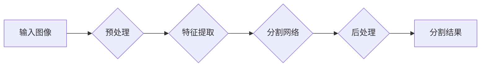

> 深度学习，医学图像分割，卷积神经网络，U-Net，医学影像分析，计算机视觉

## 1. 背景介绍

医学图像分割是医学影像分析领域的核心技术之一，它指的是从医学图像中分离出感兴趣的器官、组织或病灶，并将其分割成独立的区域。医学图像分割在临床诊断、治疗方案制定、疾病监测等方面发挥着至关重要的作用。

传统的医学图像分割方法主要依赖于手工特征提取和规则匹配，但这些方法往往受限于人工经验和图像复杂性，难以实现准确、高效的分割。随着深度学习技术的快速发展，基于深度学习的医学图像分割方法逐渐成为研究热点，并取得了显著的成果。

## 2. 核心概念与联系

深度学习是一种机器学习的子领域，它利用多层神经网络来学习数据中的复杂特征。卷积神经网络（CNN）是深度学习中应用最广泛的网络结构之一，它能够有效地提取图像中的空间特征。

**医学图像分割流程图**



## 3. 核心算法原理 & 具体操作步骤

### 3.1  算法原理概述

U-Net是一种专门针对医学图像分割设计的卷积神经网络架构。它由两个部分组成：

* **编码器（Encoder）：**负责提取图像的全局特征。
* **解码器（Decoder）：**负责根据编码器提取的特征进行像素级别的分割。

U-Net的结构类似于一个“U”形，编码器和解码器之间通过跳跃连接（Skip Connections）进行信息传递，使得网络能够学习到不同尺度的特征，从而提高分割精度。

### 3.2  算法步骤详解

1. **数据预处理：** 将医学图像预处理，例如归一化、增强等，以提高网络训练的效率和精度。
2. **网络训练：** 使用训练数据训练U-Net网络，通过反向传播算法更新网络参数，使得网络能够学习到有效的分割特征。
3. **分割预测：** 将训练好的网络应用于新的医学图像，进行分割预测。

### 3.3  算法优缺点

**优点：**

* 精度高：U-Net能够学习到复杂的图像特征，实现高精度的分割。
* 训练效率高：跳跃连接能够有效地缓解梯度消失问题，提高训练效率。
* 数据需求低：U-Net能够在相对较小的训练数据上取得良好的性能。

**缺点：**

* 计算量大：U-Net的结构比较复杂，训练和预测过程需要较大的计算资源。
* 泛化能力有限：U-Net的性能可能受限于训练数据的分布，泛化能力有限。

### 3.4  算法应用领域

U-Net在医学图像分割领域有着广泛的应用，例如：

* **肿瘤分割：** 从医学图像中分割出肿瘤区域，用于肿瘤诊断、治疗方案制定等。
* **器官分割：** 从医学图像中分割出器官区域，用于器官移植、手术规划等。
* **血管分割：** 从医学图像中分割出血管区域，用于血管疾病诊断、血管造影等。

## 4. 数学模型和公式 & 详细讲解 & 举例说明

### 4.1  数学模型构建

U-Net的数学模型基于卷积神经网络，其核心是卷积层、池化层和全连接层。

* **卷积层：** 用于提取图像的特征，通过卷积核对图像进行滑动计算，生成特征图。
* **池化层：** 用于降低图像尺寸，并提取图像的局部特征，常用的池化方法有最大池化和平均池化。
* **全连接层：** 用于将特征图转换为输出结果，例如分割类别概率。

### 4.2  公式推导过程

U-Net的损失函数通常采用交叉熵损失函数，用于衡量预测结果与真实标签之间的差异。

$$
Loss = -\sum_{i=1}^{N} y_i \log(\hat{y}_i)
$$

其中：

* $N$ 是图像中像素的数量。
* $y_i$ 是真实标签。
* $\hat{y}_i$ 是预测概率。

### 4.3  案例分析与讲解

假设我们有一个医学图像，包含肿瘤和正常组织两种类别。U-Net的输出是一个包含两个类别的概率图，每个像素点对应一个类别概率。

例如，如果一个像素点的预测概率为肿瘤类别为0.8，正常组织类别为0.2，则该像素点被预测为肿瘤区域。

## 5. 项目实践：代码实例和详细解释说明

### 5.1  开发环境搭建

* 操作系统：Windows/Linux/macOS
* Python版本：3.6+
* 深度学习框架：TensorFlow/PyTorch
* 其他依赖库：NumPy、OpenCV、scikit-learn等

### 5.2  源代码详细实现

```python
# 使用TensorFlow实现U-Net网络

import tensorflow as tf

def unet(input_shape):
    inputs = tf.keras.Input(shape=input_shape)

    # 编码器部分
    conv1 = tf.keras.layers.Conv2D(64, 3, activation='relu', padding='same')(inputs)
    conv1 = tf.keras.layers.Conv2D(64, 3, activation='relu', padding='same')(conv1)
    pool1 = tf.keras.layers.MaxPooling2D(pool_size=(2, 2))(conv1)

    conv2 = tf.keras.layers.Conv2D(128, 3, activation='relu', padding='same')(pool1)
    conv2 = tf.keras.layers.Conv2D(128, 3, activation='relu', padding='same')(conv2)
    pool2 = tf.keras.layers.MaxPooling2D(pool_size=(2, 2))(conv2)

    conv3 = tf.keras.layers.Conv2D(256, 3, activation='relu', padding='same')(pool2)
    conv3 = tf.keras.layers.Conv2D(256, 3, activation='relu', padding='same')(conv3)
    pool3 = tf.keras.layers.MaxPooling2D(pool_size=(2, 2))(conv3)

    # 解码器部分
    up4 = tf.keras.layers.Conv2DTranspose(128, 2, strides=(2, 2), padding='same')(pool3)
    merge4 = tf.keras.layers.concatenate([up4, conv2], axis=3)
    conv4 = tf.keras.layers.Conv2D(128, 3, activation='relu', padding='same')(merge4)
    conv4 = tf.keras.layers.Conv2D(128, 3, activation='relu', padding='same')(conv4)

    up5 = tf.keras.layers.Conv2DTranspose(64, 2, strides=(2, 2), padding='same')(conv4)
    merge5 = tf.keras.layers.concatenate([up5, conv1], axis=3)
    conv5 = tf.keras.layers.Conv2D(64, 3, activation='relu', padding='same')(merge5)
    conv5 = tf.keras.layers.Conv2D(64, 3, activation='relu', padding='same')(conv5)

    outputs = tf.keras.layers.Conv2D(1, 1, activation='sigmoid')(conv5)

    model = tf.keras.Model(inputs=inputs, outputs=outputs)
    return model
```

### 5.3  代码解读与分析

* **unet函数：** 定义了U-Net网络的结构。
* **编码器部分：** 使用多个卷积层和池化层提取图像的特征。
* **解码器部分：** 使用转置卷积层和concatenate操作恢复图像尺寸，并与编码器特征进行融合。
* **输出层：** 使用一个卷积层生成分割结果，输出每个像素点的类别概率。

### 5.4  运行结果展示

训练好的U-Net网络可以应用于新的医学图像进行分割预测，并生成分割结果图。

## 6. 实际应用场景

### 6.1  肿瘤分割

U-Net在肿瘤分割领域取得了显著的成果，可以用于辅助医生诊断肿瘤类型、大小、位置等信息，并为肿瘤治疗方案制定提供参考。

### 6.2  器官分割

U-Net可以用于分割各种器官，例如心脏、肺、肝脏等，用于器官移植、手术规划、疾病监测等。

### 6.3  血管分割

U-Net可以用于分割血管，用于血管疾病诊断、血管造影等。

### 6.4  未来应用展望

随着深度学习技术的不断发展，U-Net在医学图像分割领域将有更广泛的应用前景，例如：

* **多模态图像分割：** 将来自不同模态的医学图像融合，提高分割精度。
* **实时分割：** 实现实时医学图像分割，用于手术导航、远程诊断等。
* **个性化分割：** 根据患者的个体差异，进行个性化的分割模型训练。

## 7. 工具和资源推荐

### 7.1  学习资源推荐

* **书籍：**
    * Deep Learning for Medical Image Analysis
    * Medical Image Computing and Computer-Assisted Intervention
* **在线课程：**
    * Coursera: Deep Learning Specialization
    * Udacity: Deep Learning Nanodegree

### 7.2  开发工具推荐

* **深度学习框架：** TensorFlow, PyTorch
* **图像处理库：** OpenCV
* **数据可视化工具：** Matplotlib, Seaborn

### 7.3  相关论文推荐

* U-Net: Convolutional Networks for Biomedical Image Segmentation
* 3D U-Net: Learning Dense Volumetric Segmentation from Sparse Annotation

## 8. 总结：未来发展趋势与挑战

### 8.1  研究成果总结

基于深度学习的医学图像分割取得了显著的成果，例如U-Net网络在多个医学图像分割任务上取得了state-of-the-art的性能。

### 8.2  未来发展趋势

* **多模态图像分割：** 将来自不同模态的医学图像融合，提高分割精度。
* **实时分割：** 实现实时医学图像分割，用于手术导航、远程诊断等。
* **个性化分割：** 根据患者的个体差异，进行个性化的分割模型训练。
* **迁移学习：** 利用预训练模型，减少训练数据需求，提高模型泛化能力。

### 8.3  面临的挑战

* **数据标注：** 医学图像标注工作耗时费力，需要大量专业人员参与。
* **模型解释性：** 深度学习模型的决策过程难以解释，这对于临床应用存在挑战。
* **模型鲁棒性：** 深度学习模型对噪声和图像变化敏感，需要提高模型鲁棒性。

### 8.4  研究展望

未来，医学图像分割领域将继续朝着更准确、更智能、更可解释的方向发展。

## 9. 附录：常见问题与解答

* **Q：U-Net网络的训练需要多少数据？**

* **A：** U-Net能够在相对较小的训练数据上取得良好的性能，但具体数据量取决于图像分辨率、分割任务复杂度等因素。

* **Q：U-Net网络的计算量很大，如何降低计算成本？**

* **A：** 可以使用更小的网络结构、降低图像分辨率、使用GPU加速等方法降低计算成本。

* **Q：U-Net网络的分割结果如何评估？**

* **A：** 常用的评估指标包括准确率、召回率、F1-score等。

作者：禅与计算机程序设计艺术 / Zen and the Art of Computer Programming


<end_of_turn>