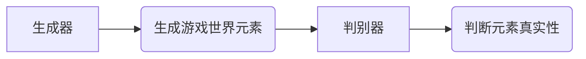

> 生成对抗网络(GAN)，游戏世界，风格化生成，图像生成，深度学习

## 1. 背景介绍

游戏行业近年来蓬勃发展，玩家对游戏体验的追求也越来越高。游戏世界的美观程度和沉浸感直接影响着玩家的游戏体验。传统的游戏世界构建方式往往依赖于人工设计和制作，耗时费力，且难以实现个性化定制。

近年来，深度学习技术取得了长足进步，特别是生成对抗网络（GAN）的出现，为游戏世界风格化生成提供了新的可能性。GAN是一种基于生成模型和判别模型的对抗训练框架，能够学习数据分布，并生成逼真的新数据。

## 2. 核心概念与联系

### 2.1 生成对抗网络 (GAN)

GAN由两个神经网络组成：生成器 (Generator) 和判别器 (Discriminator)。

* **生成器 (Generator):** 负责生成新的数据样本，例如游戏场景图像、角色模型等。
* **判别器 (Discriminator):** 负责判断数据样本是真实数据还是由生成器生成的伪造数据。

GAN通过对抗训练的方式，生成器不断尝试生成逼真的数据样本，而判别器则不断学习识别真实和伪造数据的区别。两者在不断博弈中，最终生成器能够生成与真实数据相似的样本。

### 2.2 游戏世界风格化生成

游戏世界风格化生成是指根据特定的风格或主题，生成符合该风格的游戏世界元素，例如：

* **艺术风格:**  卡通风格、写实风格、抽象风格等。
* **主题风格:**  科幻风格、奇幻风格、历史风格等。

### 2.3 核心架构



## 3. 核心算法原理 & 具体操作步骤

### 3.1 算法原理概述

GAN 的核心原理是通过对抗训练来实现数据生成。生成器和判别器相互竞争，生成器试图生成逼真的数据样本，而判别器试图识别真实和伪造数据。

训练过程如下：

1. 生成器随机生成数据样本。
2. 将生成器生成的样本和真实样本输入判别器。
3. 判别器输出每个样本的真实性概率。
4. 根据判别器的输出，更新生成器的参数，使其生成更逼真的样本。
5. 更新判别器的参数，使其更准确地识别真实和伪造样本。

### 3.2 算法步骤详解

1. **初始化:** 初始化生成器和判别器的参数。
2. **训练判别器:** 使用真实样本和生成器生成的伪造样本训练判别器。
3. **训练生成器:** 使用判别器对生成器生成的样本进行评估，并根据评估结果更新生成器的参数。
4. **重复步骤2和3:** 直到生成器生成的样本能够欺骗判别器，即生成器能够生成逼真的样本。

### 3.3 算法优缺点

**优点:**

* 可以生成逼真的数据样本。
* 能够学习数据分布，并生成多样化的样本。

**缺点:**

* 训练过程比较复杂，容易陷入局部最优。
* 训练需要大量的样本数据。

### 3.4 算法应用领域

* **图像生成:** 生成逼真的图像，例如人脸、风景、物体等。
* **视频生成:** 生成逼真的视频，例如电影片段、动画等。
* **音频生成:** 生成逼真的音频，例如音乐、语音等。
* **文本生成:** 生成逼真的文本，例如小说、诗歌等。

## 4. 数学模型和公式 & 详细讲解 & 举例说明

### 4.1 数学模型构建

GAN 的数学模型主要包括生成器和判别器的损失函数。

* **生成器损失函数:**  生成器希望生成能够欺骗判别器的样本，因此其损失函数是判别器对生成样本的真实性概率的负值。

$$
L_G(G, D) = -E_{z \sim p_z(z)}[log(D(G(z)))]
$$

* **判别器损失函数:** 判别器希望能够准确地识别真实样本和生成样本，因此其损失函数是真实样本和生成样本的真实性概率的均值。

$$
L_D(D, G) = -E_{x \sim p_{data}(x)}[log(D(x))] - E_{z \sim p_z(z)}[log(1 - D(G(z)))]
$$

其中：

* $G$ 是生成器
* $D$ 是判别器
* $z$ 是随机噪声
* $p_z(z)$ 是噪声的分布
* $p_{data}(x)$ 是真实样本的分布

### 4.2 公式推导过程

生成器和判别器的损失函数的推导过程基于最大似然估计 (MLE) 和最小化风险 (ERM) 的思想。

* **生成器损失函数:** 生成器希望最大化判别器对生成样本的真实性概率，即最大化 $log(D(G(z)))$。
* **判别器损失函数:** 判别器希望最小化真实样本和生成样本的真实性概率的均值，即最小化 $E_{x \sim p_{data}(x)}[log(D(x))] + E_{z \sim p_z(z)}[log(1 - D(G(z)))]$.

### 4.3 案例分析与讲解

假设我们使用 GAN 生成游戏角色的图像。

* **真实样本:** 游戏角色的真实图像数据。
* **生成器:** 学习生成新的游戏角色图像。
* **判别器:** 判断图像是否为真实角色图像。

训练过程中，生成器不断生成新的角色图像，判别器则判断这些图像是否真实。生成器通过判别器的反馈不断调整参数，生成更逼真的角色图像。最终，生成器能够生成与真实角色图像相似的图像。

## 5. 项目实践：代码实例和详细解释说明

### 5.1 开发环境搭建

* **操作系统:** Ubuntu 20.04
* **编程语言:** Python 3.8
* **深度学习框架:** TensorFlow 2.0
* **其他依赖:** NumPy, Matplotlib

### 5.2 源代码详细实现

```python
import tensorflow as tf

# 定义生成器网络
def generator(z):
    # ... 生成器网络结构 ...

# 定义判别器网络
def discriminator(x):
    # ... 判别器网络结构 ...

# 定义损失函数
def loss_function(real_output, fake_output):
    # ... 损失函数计算 ...

# 定义优化器
optimizer = tf.keras.optimizers.Adam(learning_rate=0.0002)

# 训练循环
for epoch in range(num_epochs):
    for batch in dataset:
        # ... 训练生成器和判别器 ...

# 保存生成模型
generator.save("generator_model.h5")
```

### 5.3 代码解读与分析

* **生成器网络:** 生成器网络负责从随机噪声向量生成游戏世界元素。
* **判别器网络:** 判别器网络负责判断游戏世界元素是否为真实数据。
* **损失函数:** 损失函数用于衡量生成器和判别器的性能。
* **优化器:** 优化器用于更新生成器和判别器的参数。

### 5.4 运行结果展示

训练完成后，可以使用生成器生成新的游戏世界元素，并将其与真实数据进行比较。

## 6. 实际应用场景

### 6.1 游戏场景生成

* 生成游戏场景的背景图像、建筑物、地形等。
* 根据游戏主题生成不同的场景风格，例如科幻场景、奇幻场景等。

### 6.2 角色模型生成

* 生成游戏角色的模型，包括人物外形、服装、武器等。
* 根据游戏角色的设定生成不同的角色模型，例如英雄、反派、NPC等。

### 6.3 道具生成

* 生成游戏道具的模型，例如武器、装备、道具等。
* 根据游戏道具的属性生成不同的道具模型，例如攻击力高、防御力强的武器等。

### 6.4 未来应用展望

* **个性化游戏体验:** 根据玩家的喜好生成个性化的游戏世界元素，例如玩家喜欢的角色模型、场景风格等。
* **游戏内容丰富:** 通过自动生成游戏世界元素，丰富游戏内容，例如生成新的任务、场景、道具等。
* **降低游戏开发成本:** 通过自动生成游戏世界元素，降低游戏开发成本和时间。

## 7. 工具和资源推荐

### 7.1 学习资源推荐

* **书籍:**
    * 《深度学习》
    * 《生成对抗网络》
* **在线课程:**
    * Coursera: 深度学习
    * Udacity: 生成对抗网络

### 7.2 开发工具推荐

* **深度学习框架:** TensorFlow, PyTorch
* **图像处理库:** OpenCV, Pillow
* **游戏引擎:** Unity, Unreal Engine

### 7.3 相关论文推荐

* **Generative Adversarial Networks**
* **Improved Techniques for Training GANs**
* **StyleGAN2-ADA: Adapting StyleGAN2 for High-Resolution Image Synthesis**

## 8. 总结：未来发展趋势与挑战

### 8.1 研究成果总结

基于生成对抗网络的游戏世界风格化生成技术取得了显著进展，能够生成逼真的游戏世界元素，为游戏开发提供了新的可能性。

### 8.2 未来发展趋势

* **更高质量的图像生成:** 研究更先进的 GAN 架构，提高生成图像的质量和多样性。
* **更细粒度的风格控制:** 研究更精细的风格控制方法，能够根据玩家的喜好生成个性化的游戏世界元素。
* **多模态生成:** 研究将文本、音频等多模态信息与图像生成结合，生成更丰富的游戏世界元素。

### 8.3 面临的挑战

* **训练稳定性:** GAN 的训练过程比较复杂，容易陷入局部最优，需要进一步研究提高训练稳定性。
* **数据依赖性:** GAN 的性能依赖于训练数据的质量和数量，需要收集更多高质量的游戏世界数据。
* **伦理问题:** 生成对抗网络能够生成逼真的图像，可能存在被用于生成虚假信息或进行恶意攻击的风险，需要关注伦理问题。

### 8.4 研究展望

未来，我们将继续研究基于生成对抗网络的游戏世界风格化生成技术，探索更先进的算法、更细粒度的风格控制方法，以及多模态生成技术，为游戏开发提供更强大的工具和更丰富的体验。

## 9. 附录：常见问题与解答

* **Q: GAN 的训练过程为什么容易陷入局部最优？**

* **A:** GAN 的训练过程是一个博弈过程，生成器和判别器相互竞争。由于两者之间的博弈关系比较复杂，容易陷入局部最优，无法达到全局最优解。

* **Q: 如何提高 GAN 的训练稳定性？**

* **A:** 提高 GAN 的训练稳定性可以通过以下方法：
    * 使用更先进的 GAN 架构，例如 WGAN、StyleGAN 等。
    * 使用更好的训练策略，例如梯度惩罚、标签平滑等。
    * 使用更大的数据集和更强的计算资源。

* **Q: GAN 的应用领域有哪些？**

* **A:** GAN 的应用领域非常广泛，包括图像生成、视频生成、音频生成、文本生成等。

* **Q: 如何学习 GAN 的相关知识？**

* **A:** 可以阅读相关书籍、在线课程、论文等学习 GAN 的相关知识。

作者：禅与计算机程序设计艺术 / Zen and the Art of Computer Programming


<end_of_turn>