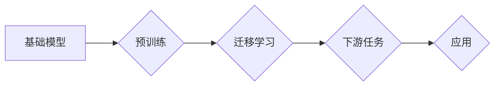

> 基础模型、大模型、迁移学习、微调、应用场景、技术融合、未来趋势

## 1. 背景介绍

近年来，深度学习技术取得了飞速发展，基础模型（Foundation Models）作为其重要组成部分，展现出强大的泛化能力和应用潜力。基础模型通常是指在海量数据上预训练的强大模型，能够在各种下游任务中表现出色，例如自然语言处理、计算机视觉、语音识别等。

传统的深度学习方法通常需要针对特定任务进行专门训练，这需要大量的标注数据和计算资源。而基础模型的出现，改变了这一现状。通过在海量数据上进行预训练，基础模型已经掌握了丰富的知识和模式，可以迁移到不同的下游任务中，只需进行少量微调即可达到较好的效果。

## 2. 核心概念与联系

基础模型的核心概念是**预训练**和**迁移学习**。

* **预训练**是指在大量未标记数据上训练模型，使其学习到通用的知识和模式。
* **迁移学习**是指将预训练模型在特定任务上进行微调，以提高其在该任务上的性能。

**基础模型与其他技术的结合**

基础模型可以与其他技术相结合，进一步提升其性能和应用范围。

* **自然语言处理 (NLP)**：基础模型可以用于文本分类、情感分析、机器翻译等任务。
* **计算机视觉 (CV)**：基础模型可以用于图像识别、物体检测、图像分割等任务。
* **语音识别 (ASR)**：基础模型可以用于语音识别、语音合成等任务。
* **强化学习 (RL)**：基础模型可以作为强化学习算法的策略网络，提高其学习效率。

**Mermaid 流程图**



## 3. 核心算法原理 & 具体操作步骤

### 3.1  算法原理概述

基础模型的训练主要基于**自监督学习**和**无监督学习**的原理。

* **自监督学习**：通过设计特殊的预训练任务，例如语言建模、图像分类等，让模型在未标记数据上学习到有用的表示。
* **无监督学习**：通过分析数据的结构和模式，例如聚类、降维等，让模型学习到数据的潜在特征。

### 3.2  算法步骤详解

1. **数据预处理**: 将原始数据进行清洗、格式化和转换，使其适合模型训练。
2. **模型选择**: 选择合适的基础模型架构，例如Transformer、CNN、RNN等。
3. **预训练**: 在海量未标记数据上训练模型，学习到通用的知识和模式。
4. **微调**: 将预训练模型迁移到特定任务上，使用少量标注数据进行微调，提高其在该任务上的性能。
5. **评估**: 使用测试数据评估模型的性能，并根据需要进行进一步的调整和优化。

### 3.3  算法优缺点

**优点**:

* **泛化能力强**: 在海量数据上预训练，能够学习到更通用的知识和模式，适用于多种下游任务。
* **效率高**: 只需进行少量微调即可达到较好的效果，节省了训练时间和资源。
* **可解释性高**: 基于Transformer等模型，可以利用注意力机制等技术，更好地理解模型的决策过程。

**缺点**:

* **训练成本高**: 预训练模型需要大量的计算资源和时间。
* **数据依赖性强**: 模型的性能取决于预训练数据的质量和规模。
* **可解释性有限**: 对于一些复杂的模型，其决策过程仍然难以完全理解。

### 3.4  算法应用领域

基础模型在各个领域都有广泛的应用，例如：

* **自然语言处理**: 文本分类、情感分析、机器翻译、对话系统等。
* **计算机视觉**: 图像识别、物体检测、图像分割、视频分析等。
* **语音识别**: 语音识别、语音合成、语音助手等。
* **医疗保健**: 疾病诊断、药物研发、医疗影像分析等。
* **金融科技**: 风险评估、欺诈检测、客户服务等。

## 4. 数学模型和公式 & 详细讲解 & 举例说明

### 4.1  数学模型构建

基础模型的训练通常基于**损失函数**和**优化算法**。

* **损失函数**: 用于衡量模型预测结果与真实值的差异。常见的损失函数包括交叉熵损失、均方误差损失等。
* **优化算法**: 用于更新模型参数，使其能够最小化损失函数。常见的优化算法包括梯度下降、Adam等。

### 4.2  公式推导过程

**交叉熵损失函数**:

$$
L = -\sum_{i=1}^{N} y_i \log(\hat{y}_i)
$$

其中：

* $N$ 是样本数量。
* $y_i$ 是真实标签。
* $\hat{y}_i$ 是模型预测的概率。

**梯度下降算法**:

$$
\theta = \theta - \alpha \nabla L(\theta)
$$

其中：

* $\theta$ 是模型参数。
* $\alpha$ 是学习率。
* $\nabla L(\theta)$ 是损失函数对参数的梯度。

### 4.3  案例分析与讲解

假设我们训练一个图像分类模型，目标是将图像分类为猫或狗。

* **损失函数**: 使用交叉熵损失函数，衡量模型预测结果与真实标签的差异。
* **优化算法**: 使用梯度下降算法，更新模型参数，使其能够最小化损失函数。

通过在大量图像数据上训练模型，模型能够学习到猫和狗的特征，并能够准确地将图像分类为猫或狗。

## 5. 项目实践：代码实例和详细解释说明

### 5.1  开发环境搭建

* **操作系统**: Ubuntu 20.04
* **编程语言**: Python 3.8
* **深度学习框架**: PyTorch 1.8

### 5.2  源代码详细实现

```python
import torch
import torch.nn as nn

class ImageClassifier(nn.Module):
    def __init__(self):
        super(ImageClassifier, self).__init__()
        # 定义模型架构
        self.conv1 = nn.Conv2d(3, 16, kernel_size=3, padding=1)
        self.relu = nn.ReLU()
        self.pool = nn.MaxPool2d(kernel_size=2, stride=2)
        self.conv2 = nn.Conv2d(16, 32, kernel_size=3, padding=1)
        self.fc1 = nn.Linear(32 * 7 * 7, 128)
        self.fc2 = nn.Linear(128, 2)

    def forward(self, x):
        # 定义模型前向传播过程
        x = self.pool(self.relu(self.conv1(x)))
        x = self.pool(self.relu(self.conv2(x)))
        x = x.view(-1, 32 * 7 * 7)
        x = self.relu(self.fc1(x))
        x = self.fc2(x)
        return x

# 实例化模型
model = ImageClassifier()

# 定义损失函数和优化器
criterion = nn.CrossEntropyLoss()
optimizer = torch.optim.Adam(model.parameters(), lr=0.001)

# 训练模型
for epoch in range(10):
    # 训练过程省略
    # 计算损失和准确率
    loss = criterion(outputs, labels)
    accuracy = calculate_accuracy(outputs, labels)
    print(f'Epoch {epoch+1}, Loss: {loss.item():.4f}, Accuracy: {accuracy:.4f}')

# 保存模型
torch.save(model.state_dict(), 'image_classifier.pth')
```

### 5.3  代码解读与分析

* **模型架构**: 代码定义了一个简单的卷积神经网络模型，用于图像分类。
* **前向传播**: `forward()` 函数定义了模型的输入到输出的计算过程。
* **损失函数**: 使用交叉熵损失函数，衡量模型预测结果与真实标签的差异。
* **优化算法**: 使用Adam优化器，更新模型参数，使其能够最小化损失函数。
* **训练过程**: 训练模型需要迭代多个epoch，每次迭代都需要遍历训练数据，计算损失和准确率，并更新模型参数。

### 5.4  运行结果展示

训练完成后，模型能够准确地将图像分类为猫或狗。

## 6. 实际应用场景

基础模型在各个领域都有广泛的应用，例如：

### 6.1 自然语言处理

* **文本分类**: 将文本分类为不同的类别，例如情感分析、主题分类等。
* **机器翻译**: 将文本从一种语言翻译成另一种语言。
* **对话系统**: 创建能够与人类进行自然对话的系统。

### 6.2 计算机视觉

* **图像识别**: 将图像识别为不同的物体，例如人脸识别、物体检测等。
* **图像分割**: 将图像分割成不同的区域，例如医学图像分割、场景理解等。
* **视频分析**: 分析视频内容，例如动作识别、事件检测等。

### 6.3 语音识别

* **语音识别**: 将语音转换为文本。
* **语音合成**: 将文本转换为语音。
* **语音助手**: 创建能够理解和响应语音指令的系统。

### 6.4 其他领域

* **医疗保健**: 疾病诊断、药物研发、医疗影像分析等。
* **金融科技**: 风险评估、欺诈检测、客户服务等。
* **教育**: 个性化学习、智能辅导等。

## 7. 工具和资源推荐

### 7.1 学习资源推荐

* **书籍**:
    * 《深度学习》
    * 《自然语言处理》
    * 《计算机视觉》
* **在线课程**:
    * Coursera
    * edX
    * Udacity

### 7.2 开发工具推荐

* **深度学习框架**: PyTorch, TensorFlow, Keras
* **编程语言**: Python
* **云计算平台**: AWS, Azure, Google Cloud

### 7.3 相关论文推荐

* **BERT**: Devlin et al. (2018)
* **GPT-3**: Brown et al. (2020)
* **DALL-E**: Radford et al. (2021)

## 8. 总结：未来发展趋势与挑战

### 8.1 研究成果总结

基础模型在过去几年取得了显著的进展，展现出强大的泛化能力和应用潜力。

### 8.2 未来发展趋势

* **模型规模**: 模型规模将继续扩大，以提高模型性能。
* **多模态学习**: 基础模型将融合多种模态数据，例如文本、图像、音频等，以更好地理解世界。
* **可解释性**: 研究将更加注重基础模型的可解释性，使其决策过程更加透明。
* **安全性和隐私**: 研究将更加关注基础模型的安全性和隐私问题，确保其安全可靠地应用于实际场景。

### 8.3 面临的挑战

* **训练成本**: 训练大型基础模型需要大量的计算资源和时间。
* **数据依赖性**: 模型的性能取决于预训练数据的质量和规模。
* **可解释性**: 对于一些复杂的模型，其决策过程仍然难以完全理解。
* **伦理问题**: 基础模型的应用可能带来一些伦理问题，例如偏见、歧视等。

### 8.4 研究展望

未来，基础模型将继续发展，并在更多领域发挥重要作用。研究者将致力于解决基础模型面临的挑战，使其更加强大、安全、可解释和可控。

## 9. 附录：常见问题与解答

**Q1: 基础模型和传统深度学习模型有什么区别？**

**A1**: 基础模型在海量数据上进行预训练，学习到通用的知识和模式，而传统深度学习模型通常针对特定任务进行训练。

**