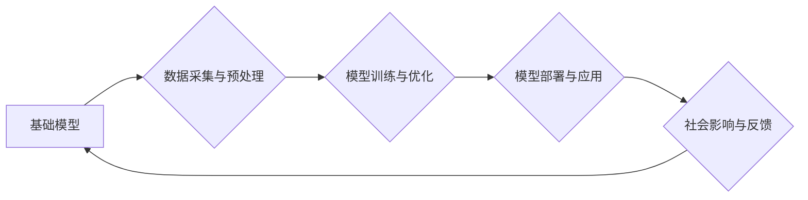

> 基础模型、社会技术融合、人工智能、深度学习、伦理、可解释性、公平性、可访问性

## 1. 背景介绍

基础模型（Foundation Models）是近年来人工智能领域最令人兴奋的突破之一。它们是规模庞大、训练数据丰富的人工智能模型，能够在广泛的任务中表现出惊人的泛化能力。从自然语言处理到计算机视觉，从代码生成到药物发现，基础模型正在改变着我们与技术的互动方式，并为解决人类面临的重大挑战提供新的可能性。

然而，基础模型的强大能力也带来了新的挑战和机遇。如何确保这些模型的可靠性、安全性、公平性和可解释性？如何将基础模型的益处惠及所有人，而不是只造福少数人？这些问题迫切需要我们认真思考和探讨。

本篇文章将深入探讨基础模型的社会技术融合，分析其核心概念、工作原理、应用场景以及面临的挑战，并展望其未来发展趋势。

## 2. 核心概念与联系

基础模型的核心概念在于其**通用性**和**可迁移性**。

* **通用性**：基础模型在训练过程中学习到丰富的知识和模式，能够应用于多种不同的任务，无需针对每个任务进行专门的训练。
* **可迁移性**：基础模型可以被微调到特定任务，只需使用少量的数据即可达到与专门训练模型相似的性能。

**基础模型与社会技术融合的联系**

基础模型的出现，标志着人工智能技术迈向一个新的阶段，它将深刻地影响着我们的社会和技术发展。

* **技术层面**: 基础模型推动了人工智能技术的进步，使其更加强大、灵活和高效。
* **社会层面**: 基础模型将改变我们的生活方式，带来新的机遇和挑战。例如，它可以帮助我们自动化工作、提高效率、个性化服务，但也可能导致失业、隐私泄露等问题。

**基础模型的社会技术融合架构**

## 3. 核心算法原理 & 具体操作步骤

### 3.1  算法原理概述

基础模型通常基于深度学习算法，例如Transformer网络。这些算法通过多层神经网络结构，学习输入数据之间的复杂关系，并生成相应的输出。

* **Transformer网络**: Transformer网络是一种新型的神经网络架构，其核心特点是利用注意力机制，能够有效地捕捉长距离依赖关系。

### 3.2  算法步骤详解

1. **数据收集与预处理**: 收集大量的数据，并进行清洗、格式化和编码等预处理操作。
2. **模型训练**: 使用深度学习算法，例如Transformer网络，对数据进行训练，学习模型参数。
3. **模型评估**: 使用测试数据评估模型的性能，并根据评估结果进行模型调优。
4. **模型部署**: 将训练好的模型部署到实际应用场景中。

### 3.3  算法优缺点

**优点**:

* **泛化能力强**: 基础模型能够在多种任务中表现出良好的性能。
* **可迁移性高**: 基础模型可以被微调到特定任务，无需大量的数据。
* **效率高**: 基础模型的训练和推理速度相对较快。

**缺点**:

* **训练成本高**: 基础模型的训练需要大量的计算资源和时间。
* **数据依赖性强**: 基础模型的性能取决于训练数据的质量和数量。
* **可解释性差**: 深度学习模型的决策过程难以理解。

### 3.4  算法应用领域

基础模型在各个领域都有广泛的应用，例如：

* **自然语言处理**: 文本生成、机器翻译、问答系统、情感分析等。
* **计算机视觉**: 图像识别、物体检测、图像分割、视频分析等。
* **代码生成**: 自动生成代码、代码修复、代码理解等。
* **药物发现**: 预测药物活性、发现新药靶点等。

## 4. 数学模型和公式 & 详细讲解 & 举例说明

### 4.1  数学模型构建

基础模型的数学模型通常基于神经网络，其核心是**激活函数**和**损失函数**。

* **激活函数**: 用于引入非线性，使神经网络能够学习复杂的模式。常见的激活函数包括ReLU、Sigmoid和Tanh等。
* **损失函数**: 用于衡量模型预测结果与真实值的差异，指导模型训练。常见的损失函数包括交叉熵损失和均方误差损失等。

### 4.2  公式推导过程

例如，对于一个简单的线性回归模型，其损失函数为均方误差损失：

$$
L = \frac{1}{n} \sum_{i=1}^{n} (y_i - \hat{y}_i)^2
$$

其中：

* $L$ 为损失函数
* $n$ 为样本数量
* $y_i$ 为真实值
* $\hat{y}_i$ 为模型预测值

通过梯度下降算法，不断更新模型参数，使得损失函数最小化。

### 4.3  案例分析与讲解

例如，在自然语言处理任务中，可以使用Transformer网络作为基础模型，其核心是**注意力机制**。注意力机制能够学习文本中不同词语之间的关系，从而更好地理解文本语义。

## 5. 项目实践：代码实例和详细解释说明

### 5.1  开发环境搭建

使用Python语言和相关的深度学习框架，例如TensorFlow或PyTorch，搭建开发环境。

### 5.2  源代码详细实现

使用代码实现基础模型的训练和部署，例如使用预训练的BERT模型进行文本分类任务。

### 5.3  代码解读与分析

详细解释代码的逻辑和功能，包括模型架构、数据处理、训练过程和评估指标等。

### 5.4  运行结果展示

展示模型的训练结果和测试结果，例如准确率、召回率和F1-score等指标。

## 6. 实际应用场景

### 6.1  自然语言处理

* **聊天机器人**: 基于基础模型的聊天机器人能够进行更自然、更流畅的对话。
* **机器翻译**: 基于基础模型的机器翻译系统能够提供更准确、更流畅的翻译结果。
* **文本摘要**: 基于基础模型的文本摘要系统能够自动生成文本的简洁摘要。

### 6.2  计算机视觉

* **图像识别**: 基于基础模型的图像识别系统能够识别各种物体、场景和人物。
* **物体检测**: 基于基础模型的物体检测系统能够定位图像中物体的边界框。
* **图像分割**: 基于基础模型的图像分割系统能够将图像分割成不同的区域。

### 6.3  其他领域

* **代码生成**: 基于基础模型的代码生成系统能够自动生成代码，提高开发效率。
* **药物发现**: 基于基础模型的药物发现系统能够预测药物活性，加速新药研发。

### 6.4  未来应用展望

基础模型的应用场景还在不断扩展，未来将有更多创新应用出现。例如，基础模型可以用于个性化教育、医疗诊断、金融风险评估等领域。

## 7. 工具和资源推荐

### 7.1  学习资源推荐

* **书籍**:
    * 《深度学习》
    * 《自然语言处理》
    * 《计算机视觉》
* **在线课程**:
    * Coursera
    * edX
    * Udacity

### 7.2  开发工具推荐

* **深度学习框架**: TensorFlow, PyTorch, Keras
* **编程语言**: Python
* **云计算平台**: AWS, Azure, Google Cloud

### 7.3  相关论文推荐

* **Attention Is All You Need**: https://arxiv.org/abs/1706.03762
* **BERT: Pre-training of Deep Bidirectional Transformers for Language Understanding**: https://arxiv.org/abs/1810.04805

## 8. 总结：未来发展趋势与挑战

### 8.1  研究成果总结

基础模型的出现，标志着人工智能技术取得了重大突破，为解决人类面临的挑战提供了新的可能性。

### 8.2  未来发展趋势

* **模型规模更大**: 未来基础模型的规模将进一步扩大，学习能力将更加强大。
* **多模态融合**: 基础模型将融合不同模态的数据，例如文本、图像、音频等，实现更全面的理解和交互。
* **可解释性增强**: 研究人员将致力于提高基础模型的可解释性，使模型的决策过程更加透明。

### 8.3  面临的挑战

* **数据安全和隐私**: 基础模型的训练需要大量数据，如何确保数据的安全和隐私是一个重要挑战。
* **公平性和偏见**: 基础模型可能存在公平性和偏见问题，需要采取措施确保其公平公正地应用。
* **伦理问题**: 基础模型的强大能力也带来了伦理问题，例如人工智能的责任和义务等，需要进行深入的探讨和规范。

### 8.4  研究展望

未来，基础模型的研究将继续深入，探索其更广泛的应用场景和潜在的价值。同时，也需要关注其带来的挑战和风险，并制定相应的应对措施，确保基础模型的健康发展和可持续应用。

## 9. 附录：常见问题与解答

### 9.1  基础模型和深度学习有什么区别？

基础模型是深度学习模型的一种，其特点是规模庞大、训练数据丰富，能够在多种任务中表现出良好的泛化能力。

### 9.2  如何训练一个基础模型？

训练一个基础模型需要大量的计算资源和时间，通常需要使用分布式训练技术。

### 9.3  基础模型的应用场景有哪些？

基础模型的应用场景非常广泛，包括自然语言处理、计算机视觉、代码生成、药物发现等领域。

### 9.4  基础模型的伦理问题有哪些？

基础模型的强大能力也带来了伦理问题，例如人工智能的责任和义务、公平性和偏见等，需要进行深入的探讨和规范。

作者：禅与计算机程序设计艺术 / Zen and the Art of Computer Programming 
<end_of_turn>