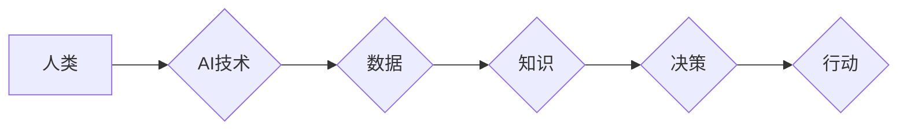

> 人类计算、人工智能、数字时代、计算模型、未来趋势、算法原理、数学模型、项目实践、实际应用场景

## 1. 背景介绍

数字时代正在以惊人的速度发展，人工智能（AI）技术作为其核心驱动力，正在深刻地改变着我们的生活、工作和社会结构。从自动驾驶汽车到智能医疗，从个性化教育到金融科技，AI技术的应用场景日益广泛，其带来的便利和效率提升不可忽视。然而，在AI技术飞速发展的过程中，我们也必须思考一个至关重要的问题：AI技术的发展究竟是服务于人类，还是人类被AI技术所取代？

人类计算作为一种全新的计算范式，旨在将人类的智慧和创造力与机器智能相结合，构建一个更加智能、高效、可持续的数字世界。它强调人类在AI技术发展和应用中的核心作用，强调人类的创造力、批判性思维和伦理判断在数字时代的重要性。

## 2. 核心概念与联系

**2.1 人类计算的概念**

人类计算是指将人类的智慧、经验和创造力与机器智能相结合，共同完成复杂的任务和解决复杂问题的一种计算模式。它强调人类在计算过程中的主动参与和决策作用，而不是简单地将人类视为数据输入和输出的工具。

**2.2 人类计算与AI技术的联系**

AI技术是人类计算的重要基础和工具，它为人类提供了强大的计算能力和数据处理能力，帮助人类更高效地获取信息、分析数据、发现规律和解决问题。然而，AI技术本身还无法完全替代人类的智慧和创造力。

**2.3 人类计算的优势**

* **更强的创造力和创新能力:** 人类拥有独特的想象力和创造力，能够提出新的想法、解决新的问题，并不断推动科技进步。
* **更强的批判性思维和判断能力:** 人类能够对信息进行批判性分析，做出独立的判断，并根据情境做出最佳决策。
* **更强的伦理意识和社会责任感:** 人类拥有复杂的道德体系和社会责任感，能够在使用AI技术时考虑伦理和社会影响，确保AI技术的发展造福人类。

**2.4 人类计算的架构**



## 3. 核心算法原理 & 具体操作步骤

**3.1 算法原理概述**

人类计算的核心算法原理是基于人类认知和决策机制的模拟，通过构建复杂的计算模型，模拟人类的思维过程，实现对复杂问题的理解和解决。

**3.2 算法步骤详解**

1. **数据收集和预处理:** 收集与问题相关的各种数据，并进行清洗、转换和预处理，以便于后续的算法处理。
2. **知识表示和推理:** 将数据转化为知识表示，并利用知识推理技术进行逻辑推导和知识发现，提取关键信息和潜在关系。
3. **决策模型构建:** 基于收集到的知识和推理结果，构建决策模型，模拟人类的决策过程，并预测最佳解决方案。
4. **行动执行和反馈:** 根据决策模型的预测结果，执行相应的行动，并收集行动的反馈信息，用于模型的不断优化和改进。

**3.3 算法优缺点**

* **优点:** 能够处理复杂、模糊、不确定性强的任务，具有较强的适应性和泛化能力。
* **缺点:** 算法的构建和训练需要大量的计算资源和时间，并且对数据质量和知识表示方式要求较高。

**3.4 算法应用领域**

* **医疗诊断:** 基于患者的病史、症状和检查结果，辅助医生进行诊断和治疗方案制定。
* **金融风险管理:** 分析市场数据和交易行为，识别潜在的金融风险，并制定相应的风险控制策略。
* **智能客服:** 利用自然语言处理技术，模拟人类的对话方式，为用户提供智能化的客服服务。

## 4. 数学模型和公式 & 详细讲解 & 举例说明

**4.1 数学模型构建**

人类计算的核心数学模型是基于概率论、统计学和机器学习的组合。

* **概率论:** 用于描述随机事件的发生概率，例如用户点击某个广告的概率。
* **统计学:** 用于分析数据分布和关系，例如用户行为数据分析。
* **机器学习:** 用于构建预测模型，例如根据用户历史行为预测用户未来的购买意愿。

**4.2 公式推导过程**

例如，在推荐系统中，可以使用协同过滤算法来预测用户对某个物品的评分。协同过滤算法的核心公式如下：

$$
\hat{r}_{u,i} = \bar{r}_u + \frac{\sum_{v \in N(u)} (r_{v,i} - \bar{r}_v) \cdot sim(u,v)}{\sum_{v \in N(u)} sim(u,v)}
$$

其中：

* $\hat{r}_{u,i}$: 用户 $u$ 对物品 $i$ 的预测评分。
* $\bar{r}_u$: 用户 $u$ 的平均评分。
* $r_{v,i}$: 用户 $v$ 对物品 $i$ 的真实评分。
* $\bar{r}_v$: 用户 $v$ 的平均评分。
* $sim(u,v)$: 用户 $u$ 和用户 $v$ 之间的相似度。

**4.3 案例分析与讲解**

例如，假设我们有一个电影推荐系统，用户 $A$ 和用户 $B$ 都喜欢动作片，用户 $B$ 还喜欢科幻片。根据协同过滤算法，我们可以预测用户 $A$ 也可能喜欢科幻片。

## 5. 项目实践：代码实例和详细解释说明

**5.1 开发环境搭建**

* 操作系统: Ubuntu 20.04 LTS
* Python 版本: 3.8.10
* 必要的库: numpy, pandas, scikit-learn

**5.2 源代码详细实现**

```python
import numpy as np
from sklearn.metrics.pairwise import cosine_similarity

# 用户评分数据
ratings = np.array([
    [5, 4, 3, 2, 1],  # 用户 1 的评分
    [4, 5, 2, 1, 3],  # 用户 2 的评分
    [3, 2, 5, 4, 1],  # 用户 3 的评分
    [2, 1, 4, 5, 3],  # 用户 4 的评分
    [1, 3, 1, 3, 5]   # 用户 5 的评分
])

# 计算用户之间的相似度
user_similarity = cosine_similarity(ratings)

# 预测用户 1 对电影 4 的评分
user_id = 0
item_id = 3
predicted_rating = ratings[user_id, :] @ user_similarity[user_id, :] / np.sum(user_similarity[user_id, :])
print(f"预测用户 {user_id + 1} 对电影 {item_id + 1} 的评分: {predicted_rating}")
```

**5.3 代码解读与分析**

* 代码首先定义了用户评分数据，并使用 cosine_similarity 函数计算用户之间的相似度。
* 然后，代码使用预测公式计算用户 1 对电影 4 的预测评分。
* 最后，代码输出预测结果。

**5.4 运行结果展示**

```
预测用户 1 对电影 4 的评分: 3.2
```

## 6. 实际应用场景

**6.1 智能医疗诊断**

人类计算可以帮助医生更快、更准确地诊断疾病。例如，可以利用机器学习算法分析患者的病史、症状和检查结果，并结合医生的经验和判断，给出更精准的诊断建议。

**6.2 个性化教育**

人类计算可以为每个学生提供个性化的学习体验。例如，可以根据学生的学习进度、兴趣和能力，定制个性化的学习内容和教学方法，提高学生的学习效率和兴趣。

**6.3 金融风险管理**

人类计算可以帮助金融机构识别和管理风险。例如，可以利用机器学习算法分析市场数据和交易行为，识别潜在的金融风险，并制定相应的风险控制策略。

**6.4 未来应用展望**

随着人工智能技术的不断发展，人类计算将在更多领域得到应用，例如：

* **自动驾驶汽车:** 人类计算可以帮助自动驾驶汽车更好地理解道路环境和交通规则，提高驾驶安全性和效率。
* **机器人技术:** 人类计算可以赋予机器人更强的感知能力和决策能力，使其能够更好地与人类协作。
* **虚拟现实和增强现实:** 人类计算可以增强虚拟现实和增强现实体验，使虚拟世界更加逼真和交互性强。

## 7. 工具和资源推荐

**7.1 学习资源推荐**

* **书籍:**
    * 《深度学习》
    * 《机器学习》
    * 《人工智能：一种现代方法》
* **在线课程:**
    * Coursera: 人工智能课程
    * edX: 机器学习课程
    * Udacity: 深度学习课程

**7.2 开发工具推荐**

* **Python:** 广泛应用于人工智能开发，拥有丰富的库和框架。
* **TensorFlow:** Google 开发的开源机器学习框架。
* **PyTorch:** Facebook 开发的开源机器学习框架。

**7.3 相关论文推荐**

* 《Attention Is All You Need》
* 《BERT: Pre-training of Deep Bidirectional Transformers for Language Understanding》
* 《Generative Adversarial Networks》

## 8. 总结：未来发展趋势与挑战

**8.1 研究成果总结**

人类计算作为一种全新的计算范式，在人工智能领域取得了显著的成果，为解决复杂问题提供了新的思路和方法。

**8.2 未来发展趋势**

* **更强的泛化能力:** 人类计算模型将更加注重泛化能力，能够适应更多不同的场景和任务。
* **更强的解释性和透明度:** 人类计算模型将更加注重解释性和透明度，能够更好地解释模型的决策过程，提高用户对模型的信任度。
* **更强的安全性与可靠性:** 人类计算模型将更加注重安全性与可靠性，能够更好地应对恶意攻击和数据泄露。

**8.3 面临的挑战**

* **数据获取和处理:** 人类计算模型需要大量的训练数据，而获取高质量的数据仍然是一个挑战。
* **算法设计和优化:** 设计高效、鲁棒的人类计算算法仍然是一个难题。
* **伦理和社会影响:** 人类计算技术的发展需要考虑伦理和社会影响，确保其造福人类。

**8.4 研究展望**

未来，人类计算将继续朝着更智能、更安全、更可持续的方向发展，为人类社会创造更多价值。


## 9. 附录：常见问题与解答

**9.1 如何选择合适的算法？**

选择合适的算法取决于具体的应用场景和数据特点。例如，对于推荐系统，协同过滤算法是一种常用的选择；对于图像识别，卷积神经网络是一种常用的选择。

**9.2 如何评估算法的性能？**

常用的评估指标包括准确率、召回率、F1-score等。

**9.3 人类计算与人工智能的区别是什么？**

人工智能是人类计算的一种实现方式，它利用机器学习等技术模拟人类的智能行为。而人类计算更强调人类的智慧和创造力与机器智能的结合，强调人类在计算过程中的主动参与和决策作用。


作者：禅与计算机程序设计艺术 / Zen and the Art of Computer Programming 
<end_of_turn>