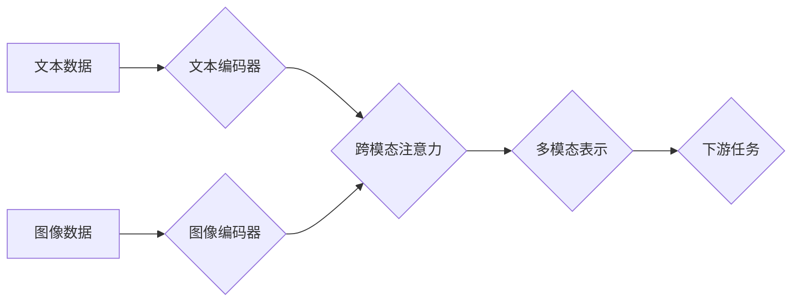

> 多模态大模型，Transformer，预训练语言模型，多模态学习，计算机视觉，自然语言处理，深度学习

## 1. 背景介绍

近年来，人工智能领域取得了令人瞩目的进展，其中深度学习技术扮演着至关重要的角色。特别是预训练语言模型（Pre-trained Language Models，PLMs）的出现，为自然语言处理（NLP）任务带来了革命性的变革。这些模型通过在海量文本数据上进行预训练，学习了丰富的语言表示和语法结构，从而在各种下游任务中表现出优异的性能。

然而，现实世界的信息并非仅仅是文本形式，还包含图像、音频、视频等多模态数据。如何有效地融合这些多模态信息，构建能够理解和生成多模态内容的大模型，成为了人工智能领域的新挑战和热点研究方向。

多模态大模型（Multimodal Large Models，MLMs）应运而生，旨在学习跨模态的表示和关系，从而实现更全面、更深入的理解和生成多模态内容。

## 2. 核心概念与联系

多模态大模型的核心概念是将不同模态的数据融合在一起，学习跨模态的表示和关系。

**2.1  多模态数据**

多模态数据是指包含多种不同类型信息的集合，例如文本、图像、音频、视频等。

**2.2  跨模态表示学习**

跨模态表示学习是指学习能够捕捉不同模态之间关系的统一表示。

**2.3  多模态融合策略**

多模态融合策略是指将不同模态的数据融合在一起的方法，常见的策略包括：

* **早期融合:** 在特征提取阶段将不同模态的数据融合在一起。
* **晚期融合:** 在决策阶段将不同模态的特征融合在一起。
* **跨模态注意力机制:** 学习不同模态之间的权重，动态地融合信息。

**2.4  Transformer架构**

Transformer是一种强大的深度学习架构，其自注意力机制能够有效地捕捉序列数据之间的长距离依赖关系。Transformer架构在NLP领域取得了巨大成功，也逐渐被应用于多模态学习领域。

**2.5  预训练语言模型**

预训练语言模型（PLMs）是在海量文本数据上进行预训练的语言模型，例如BERT、GPT等。PLMs已经证明了其在NLP任务中的强大能力，也为多模态大模型的开发提供了宝贵的资源。

**2.6  多模态预训练语言模型**

多模态预训练语言模型（MMLMs）是在多模态数据上进行预训练的语言模型，例如CLIP、FLAN等。MMLMs能够学习跨模态的表示和关系，在多模态理解和生成任务中表现出优异的性能。

**Mermaid 流程图**



## 3. 核心算法原理 & 具体操作步骤

### 3.1  算法原理概述

多模态大模型的核心算法原理是基于Transformer架构，结合跨模态注意力机制和多模态预训练策略。

* **Transformer架构:** Transformer架构能够有效地捕捉序列数据之间的长距离依赖关系，适用于处理文本和图像等序列数据。
* **跨模态注意力机制:** 跨模态注意力机制能够学习不同模态之间的权重，动态地融合信息，从而捕捉跨模态的表示和关系。
* **多模态预训练策略:** 多模态预训练策略是指在多模态数据上进行预训练，学习跨模态的表示和关系。

### 3.2  算法步骤详解

1. **数据预处理:** 将文本数据和图像数据进行预处理，例如文本分词、图像裁剪等。
2. **特征提取:** 使用文本编码器和图像编码器分别提取文本和图像的特征表示。
3. **跨模态注意力:** 使用跨模态注意力机制融合文本和图像的特征表示，学习跨模态的表示。
4. **多模态预训练:** 在多模态数据上进行预训练，例如图像文本对分类、图像描述生成等任务。
5. **下游任务微调:** 将预训练好的多模态大模型微调到具体的下游任务，例如图像问答、视觉检索等。

### 3.3  算法优缺点

**优点:**

* 能够学习跨模态的表示和关系，实现更全面、更深入的理解和生成多模态内容。
* 预训练策略能够有效地利用海量数据，提高模型性能。
* Transformer架构能够有效地捕捉序列数据之间的长距离依赖关系。

**缺点:**

* 训练成本高，需要大量的计算资源和数据。
* 模型复杂度高，难以解释和调试。
* 跨模态融合策略的选择对模型性能有重要影响。

### 3.4  算法应用领域

多模态大模型在以下领域具有广泛的应用前景：

* **计算机视觉:** 图像分类、目标检测、图像分割、图像 Captioning 等。
* **自然语言处理:** 文本摘要、机器翻译、问答系统、对话系统等。
* **多媒体检索:** 基于文本和图像的多媒体检索。
* **人机交互:** 基于多模态交互的人机交互系统。

## 4. 数学模型和公式 & 详细讲解 & 举例说明

### 4.1  数学模型构建

多模态大模型的数学模型通常基于Transformer架构，并结合跨模态注意力机制。

**4.1.1  Transformer架构**

Transformer架构由编码器和解码器组成，每个编码器和解码器层包含多层自注意力机制和前馈神经网络。

**4.1.2  跨模态注意力机制**

跨模态注意力机制学习不同模态之间的权重，动态地融合信息。

**4.1.3  多模态表示学习**

多模态表示学习是指学习能够捕捉不同模态之间关系的统一表示。

### 4.2  公式推导过程

跨模态注意力机制的公式推导过程如下：

$$
\text{Attention}(Q, K, V) = \text{softmax}\left(\frac{Q K^T}{\sqrt{d_k}}\right) V
$$

其中：

* $Q$：查询矩阵
* $K$：键矩阵
* $V$：值矩阵
* $d_k$：键向量的维度

### 4.3  案例分析与讲解

假设我们有一个图像和文本对，我们需要学习图像和文本之间的关系。

* 将图像输入图像编码器，得到图像特征向量。
* 将文本输入文本编码器，得到文本特征向量。
* 使用跨模态注意力机制融合图像特征向量和文本特征向量，得到跨模态表示。
* 将跨模态表示输入分类器，预测图像和文本之间的关系。

## 5. 项目实践：代码实例和详细解释说明

### 5.1  开发环境搭建

* Python 3.7+
* PyTorch 1.7+
* CUDA 10.2+

### 5.2  源代码详细实现

```python
import torch
import torch.nn as nn

class MultimodalEncoder(nn.Module):
    def __init__(self, text_dim, image_dim):
        super(MultimodalEncoder, self).__init__()
        self.text_encoder = nn.Linear(text_dim, 512)
        self.image_encoder = nn.Linear(image_dim, 512)
        self.attention = nn.MultiheadAttention(512, 8)

    def forward(self, text, image):
        text_embedding = self.text_encoder(text)
        image_embedding = self.image_encoder(image)
        
        # 跨模态注意力
        text_image_attn = self.attention(text_embedding, image_embedding, image_embedding)
        
        # 融合特征
        fused_embedding = text_image_attn + text_embedding
        return fused_embedding

# 实例化模型
model = MultimodalEncoder(text_dim=1024, image_dim=2048)

# 输入数据
text = torch.randn(1, 1024)
image = torch.randn(1, 2048)

# 前向传播
output = model(text, image)

print(output.shape)
```

### 5.3  代码解读与分析

* `MultimodalEncoder`类定义了多模态编码器，包含文本编码器、图像编码器和跨模态注意力机制。
* `forward`方法实现了多模态编码器的前向传播过程，首先将文本和图像分别编码，然后使用跨模态注意力机制融合特征，最后输出融合后的特征向量。
* 代码实例演示了如何实例化模型、输入数据和进行前向传播。

### 5.4  运行结果展示

运行代码后，输出的`output`是一个形状为`(1, 512)`的张量，表示融合后的多模态特征向量。

## 6. 实际应用场景

### 6.1  图像问答

多模态大模型可以理解图像内容和自然语言问题，并给出准确的答案。例如，给定一张图片和一个关于图片内容的问题，多模态大模型可以结合图像信息和语言知识，回答问题。

### 6.2  视觉检索

多模态大模型可以根据文本查询，从图像数据库中检索出相关的图像。例如，用户输入“猫”，多模态大模型可以检索出所有与“猫”相关的图像。

### 6.3  图像描述生成

多模态大模型可以根据图像内容生成描述性文本。例如，给定一张图片，多模态大模型可以生成描述图片内容的句子。

### 6.4  未来应用展望

多模态大模型在未来将有更广泛的应用场景，例如：

* **增强现实 (AR) 和虚拟现实 (VR):** 为AR和VR体验提供更丰富的交互和内容。
* **机器人感知和决策:** 帮助机器人理解周围环境和做出更智能的决策。
* **医疗诊断和辅助:** 辅助医生进行诊断和治疗，提高医疗效率。

## 7. 工具和资源推荐

### 7.1  学习资源推荐

* **书籍:**
    * 《深度学习》
    * 《Transformer进阶指南》
* **在线课程:**
    * Coursera: 深度学习
    * fast.ai: 深度学习课程
* **博客和网站:**
    * The Gradient
    * Towards Data Science

### 7.2  开发工具推荐

* **PyTorch:** 深度学习框架
* **TensorFlow:** 深度学习框架
* **Hugging Face Transformers:** 预训练模型库

### 7.3  相关论文推荐

* **BERT: Pre-training of Deep Bidirectional Transformers for Language Understanding**
* **GPT-3: Language Models are Few-Shot Learners**
* **CLIP: Contrastive Language-Image Pre-training**

## 8. 总结：未来发展趋势与挑战

### 8.1  研究成果总结

多模态大模型在理解和生成多模态内容方面取得了显著进展，为人工智能的未来发展提供了新的方向。

### 8.2  未来发展趋势

* **模型规模和能力的提升:** 未来多模态大模型将拥有更大的规模和更强的能力，能够处理更复杂的多模态任务。
* **跨模态知识的融合:** 未来多模态大模型将能够更好地融合跨模态知识，实现更深入的理解和生成。
* **个性化和可解释性:** 未来多模态大模型将更加个性化和可解释，能够更好地满足用户的需求。

### 8.3  面临的挑战

* **数据获取和标注:** 多模