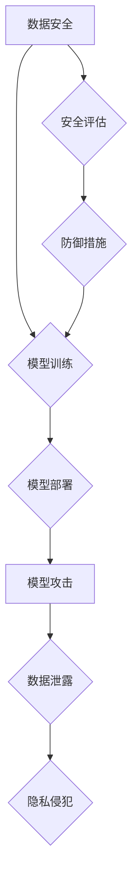

> 大模型、防御壁垒、知识蒸馏、模型压缩、对抗攻击、数据安全、隐私保护、安全评估、模型可解释性

## 1. 背景介绍

近年来，大模型技术蓬勃发展，其强大的泛化能力和应用潜力吸引了各界关注。然而，大模型也面临着诸多安全风险，例如模型攻击、数据泄露、隐私侵犯等。对于大模型公司而言，维护防御壁垒至关重要，以保障模型安全、数据安全和用户隐私。

大模型的复杂性和规模性使得其安全防御更加复杂。传统的安全防御方法难以有效应对大模型的独特挑战。因此，大模型公司需要探索新的安全防御策略和技术，构建更加完善的防御体系。

## 2. 核心概念与联系

**2.1 大模型安全风险**

大模型安全风险主要包括以下几个方面：

* **模型攻击:** 攻击者可以利用对抗样本、模型中毒等方法，攻击大模型，使其产生错误的预测结果或执行恶意指令。
* **数据泄露:** 大模型的训练数据可能包含敏感信息，攻击者可以通过攻击模型或数据存储系统，窃取这些敏感信息。
* **隐私侵犯:** 大模型的训练和推理过程可能泄露用户隐私信息，例如用户身份、行为模式等。

**2.2 防御壁垒**

防御壁垒是指大模型公司采取的一系列安全措施，以抵御各种安全风险。防御壁垒需要涵盖多个方面，包括模型安全、数据安全、隐私保护、安全评估等。

**2.3 防御策略**

大模型公司可以采用以下策略来构建防御壁垒：

* **模型安全:** 使用安全的模型训练方法，防止模型中毒攻击；采用模型压缩和知识蒸馏等技术，降低模型的攻击面；使用模型可解释性技术，帮助识别和防御模型攻击。
* **数据安全:** 加密敏感数据，限制数据访问权限；采用数据脱敏技术，保护用户隐私；定期进行数据安全评估，发现和修复安全漏洞。
* **隐私保护:** 使用联邦学习等隐私保护技术，保护用户数据隐私；采用差分隐私等技术，对模型训练过程进行隐私保护。
* **安全评估:** 定期进行安全评估，识别和修复安全漏洞；进行安全测试，验证防御措施的有效性。

**2.4 Mermaid 流程图**



## 3. 核心算法原理 & 具体操作步骤

### 3.1  算法原理概述

知识蒸馏是一种模型压缩技术，它通过将一个大型模型（教师模型）的知识迁移到一个小型模型（学生模型）中，从而实现模型压缩和性能提升。

### 3.2  算法步骤详解

1. **训练教师模型:** 使用大量数据训练一个大型模型，使其达到较高的准确率。
2. **生成教师模型的软标签:** 使用教师模型对训练数据进行预测，并将其预测概率作为软标签。
3. **训练学生模型:** 使用教师模型的软标签和原始标签训练一个小型模型，例如通过交叉熵损失函数。
4. **评估学生模型:** 使用测试数据评估学生模型的性能，并与教师模型进行比较。

### 3.3  算法优缺点

**优点:**

* 可以有效压缩模型大小，降低模型部署成本。
* 可以提升模型的泛化能力，提高模型在未知数据上的预测准确率。

**缺点:**

* 需要一个大型的教师模型作为基础，训练成本较高。
* 学生模型的性能可能无法完全达到教师模型的水平。

### 3.4  算法应用领域

知识蒸馏技术广泛应用于以下领域:

* **图像识别:** 将大型图像识别模型压缩到更小的模型，用于移动设备上的图像识别。
* **自然语言处理:** 将大型语言模型压缩到更小的模型，用于文本分类、机器翻译等任务。
* **语音识别:** 将大型语音识别模型压缩到更小的模型，用于语音助手、语音搜索等应用。

## 4. 数学模型和公式 & 详细讲解 & 举例说明

### 4.1  数学模型构建

知识蒸馏的目标是将教师模型的知识迁移到学生模型中。我们可以使用交叉熵损失函数来度量教师模型和学生模型之间的差异。

假设教师模型的输出为 $p_t$, 学生模型的输出为 $p_s$, 则交叉熵损失函数为:

$$
L = -\sum_{i=1}^{N} y_i \log p_{t_i} - \lambda \sum_{i=1}^{N} y_i \log p_{s_i}
$$

其中:

* $N$ 是样本数量
* $y_i$ 是真实标签
* $p_{t_i}$ 是教师模型对样本 $i$ 的预测概率
* $p_{s_i}$ 是学生模型对样本 $i$ 的预测概率
* $\lambda$ 是权重参数，用于控制教师模型和学生模型的权重

### 4.2  公式推导过程

交叉熵损失函数的目的是最小化教师模型和学生模型之间的差异。

* 第一个项 $-\sum_{i=1}^{N} y_i \log p_{t_i}$ 是教师模型的损失，它衡量了教师模型预测的概率与真实标签之间的差异。
* 第二项 $-\lambda \sum_{i=1}^{N} y_i \log p_{s_i}$ 是学生模型的损失，它衡量了学生模型预测的概率与真实标签之间的差异。

$\lambda$ 参数用于控制教师模型和学生模型的权重。当 $\lambda$ 值较大时，学生模型的损失会占更大的比重，从而使得学生模型更倾向于模仿教师模型的预测结果。

### 4.3  案例分析与讲解

假设我们有一个大型图像识别模型作为教师模型，我们希望将其压缩到一个更小的模型作为学生模型。

我们可以使用知识蒸馏技术将教师模型的知识迁移到学生模型中。

1. 首先，我们使用教师模型对图像数据集进行训练，并获得教师模型的权重参数。
2. 然后，我们使用教师模型对图像数据集进行预测，并生成教师模型的软标签。
3. 最后，我们使用学生模型的权重参数和教师模型的软标签进行训练，从而将教师模型的知识迁移到学生模型中。

通过知识蒸馏技术，我们可以将大型图像识别模型压缩到更小的模型，同时保持较高的准确率。

## 5. 项目实践：代码实例和详细解释说明

### 5.1  开发环境搭建

* Python 3.7+
* PyTorch 1.7+
* CUDA 10.2+

### 5.2  源代码详细实现

```python
import torch
import torch.nn as nn

# 定义教师模型
class TeacherModel(nn.Module):
    # ...

# 定义学生模型
class StudentModel(nn.Module):
    # ...

# 加载教师模型的权重参数
teacher_model = TeacherModel()
teacher_model.load_state_dict(torch.load('teacher_model.pth'))

# 设置教师模型为评估模式
teacher_model.eval()

# 训练学生模型
optimizer = torch.optim.Adam(student_model.parameters(), lr=0.001)
criterion = nn.CrossEntropyLoss()

for epoch in range(num_epochs):
    for batch_idx, (data, target) in enumerate(train_loader):
        # 前向传播
        output_teacher = teacher_model(data)
        output_student = student_model(data)

        # 计算损失
        loss = criterion(output_student, target) + 0.5 * criterion(output_student, output_teacher)

        # 反向传播
        optimizer.zero_grad()
        loss.backward()
        optimizer.step()

# 保存学生模型的权重参数
torch.save(student_model.state_dict(), 'student_model.pth')
```

### 5.3  代码解读与分析

* 代码首先定义了教师模型和学生模型。
* 然后，加载教师模型的权重参数，并将其设置为评估模式。
* 接着，使用Adam优化器和交叉熵损失函数训练学生模型。
* 损失函数包含两个部分：学生模型的损失和教师模型的损失。
* 学生模型的损失是学生模型的预测结果与真实标签之间的差异。
* 教师模型的损失是学生模型的预测结果与教师模型的预测结果之间的差异。
* 通过训练，学生模型可以学习到教师模型的知识，并达到较高的准确率。

### 5.4  运行结果展示

训练完成后，可以将学生模型的权重参数保存到文件，并使用该模型进行预测。

## 6. 实际应用场景

知识蒸馏技术在实际应用场景中具有广泛的应用前景，例如：

* **移动设备上的图像识别:** 将大型图像识别模型压缩到更小的模型，用于移动设备上的图像识别，例如人脸识别、物体识别等。
* **语音助手:** 将大型语音识别模型压缩到更小的模型，用于语音助手，例如语音控制、语音翻译等。
* **嵌入式系统:** 将大型模型压缩到更小的模型，用于嵌入式系统，例如智能家居、工业自动化等。

### 6.4  未来应用展望

随着大模型技术的不断发展，知识蒸馏技术将发挥越来越重要的作用。未来，知识蒸馏技术可能会应用于以下领域:

* **个性化模型:** 使用知识蒸馏技术生成个性化模型，例如根据用户的偏好生成个性化的推荐模型。
* **跨模态学习:** 使用知识蒸馏技术将不同模态的知识迁移到同一个模型中，例如将图像和文本的知识迁移到同一个模型中。
* **联邦学习:** 使用知识蒸馏技术在联邦学习中加速模型训练和压缩。

## 7. 工具和资源推荐

### 7.1  学习资源推荐

* **论文:**
    * Hinton, G., Vinyals, O., & Dean, J. (2015). Distilling the knowledge in a neural network. arXiv preprint arXiv:1503.02531.
* **博客:**
    * https://blog.openai.com/distilling-knowledge-in-neural-networks/
    * https://towardsdatascience.com/knowledge-distillation-a-powerful-technique-for-model-compression-a3999999999

### 7.2  开发工具推荐

* **PyTorch:** https://pytorch.org/
* **TensorFlow:** https://www.tensorflow.org/

### 7.3  相关论文推荐

* **知识蒸馏:**
    * Hinton, G., Vinyals, O., & Dean, J. (2015). Distilling the knowledge in a neural network. arXiv preprint arXiv:1503.02531.
* **模型压缩:**
    * Han, S., Pool, J., Tran, J., & Dally, W. (2015). Learning both weights and connections for efficient neural networks. In Advances in neural information processing systems (pp. 1137-1145).
* **模型攻击:**
    * Goodfellow, I., Shlens, J., & Szegedy, C. (2014). Explaining and harnessing adversarial examples. In International conference on learning representations (ICLR).

## 8. 总结：未来发展趋势与挑战

### 8.1  研究成果总结

知识蒸馏技术是一种有效的模型压缩技术，它可以将大型模型压缩到更小的模型，同时保持较高的准确率。

### 8.2  未来发展趋势

未来，知识蒸馏技术将朝着以下方向发展:

* **更有效的知识蒸馏方法:** 研究更有效的知识蒸馏方法，例如使用自监督学习、迁移学习等技术。
* **跨模态知识蒸馏:** 研究跨模态知识蒸馏方法，例如将图像和文本的知识迁移