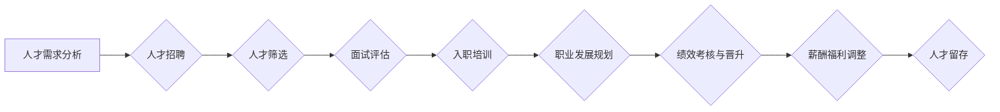

> 大模型、人才招聘、人才留存、企业文化、薪酬福利、职业发展、技术社区、学习机会

## 1. 背景介绍

近年来，大模型技术蓬勃发展，成为人工智能领域最热门的研究方向之一。从文本生成、图像识别到代码编写，大模型展现出强大的应用潜力，推动着各行各业的数字化转型。然而，大模型的开发和应用离不开优秀的人才。大模型公司如何吸引和留住人才，成为制胜的关键。

## 2. 核心概念与联系

**2.1 大模型人才需求**

大模型公司需要具备以下技能的人才：

* **深度学习专家:** 能够设计、训练和优化大模型，并理解其工作原理。
* **机器学习工程师:** 负责大模型的部署、监控和维护，并进行数据预处理和特征工程。
* **数据科学家:** 负责收集、清洗和分析大模型训练数据，并评估模型性能。
* **软件工程师:** 负责大模型的软件开发和系统集成，并构建大模型的应用平台。
* **产品经理:** 负责大模型产品的规划和设计，并与用户进行沟通和反馈。

**2.2 人才吸引与留存的挑战**

大模型公司面临着以下人才吸引和留存的挑战：

* **人才竞争激烈:** 大模型技术发展迅速，吸引了众多科技巨头的关注，人才竞争日益激烈。
* **薪酬福利压力:** 高水平人才对薪酬福利有较高期望，大模型公司需要提供具有竞争力的薪酬福利待遇。
* **职业发展空间:** 人才希望在公司获得持续的职业发展机会，大模型公司需要提供清晰的职业发展路径。
* **企业文化建设:** 大模型公司需要打造积极向上的企业文化，吸引和留住优秀人才。

**2.3  人才吸引与留存的策略**

大模型公司可以通过以下策略吸引和留住人才：

* **提供具有竞争力的薪酬福利待遇:** 包括高薪、股票期权、带薪休假等。
* **打造积极向上的企业文化:** 鼓励创新、尊重人才、注重团队合作。
* **提供丰富的职业发展机会:** 包括培训、晋升、跨部门交流等。
* **建立完善的人才管理体系:** 包括招聘、培训、绩效考核、薪酬管理等。

**2.4  人才吸引与留存的流程图**



## 3. 核心算法原理 & 具体操作步骤

### 3.1  算法原理概述

大模型的训练主要基于深度学习算法，例如Transformer模型。Transformer模型利用注意力机制，能够捕捉文本序列中的长距离依赖关系，从而实现更准确的文本理解和生成。

### 3.2  算法步骤详解

大模型的训练步骤如下：

1. **数据预处理:** 收集和清洗训练数据，并进行文本分词、词向量化等预处理操作。
2. **模型构建:** 根据预定的模型架构，搭建大模型的网络结构。
3. **模型训练:** 使用训练数据，通过反向传播算法，调整模型参数，使模型的预测结果与真实值尽可能接近。
4. **模型评估:** 使用测试数据，评估模型的性能，例如准确率、召回率、F1-score等。
5. **模型调优:** 根据评估结果，调整模型参数或架构，进一步提高模型性能。
6. **模型部署:** 将训练好的模型部署到生产环境，用于实际应用。

### 3.3  算法优缺点

**优点:**

* 能够处理海量文本数据，并捕捉文本序列中的复杂关系。
* 性能优于传统机器学习算法，能够实现更准确的文本理解和生成。

**缺点:**

* 训练成本高，需要大量的计算资源和时间。
* 模型参数量大，部署和推理效率较低。
* 对训练数据的质量要求高，数据偏差会导致模型性能下降。

### 3.4  算法应用领域

大模型在以下领域有广泛的应用:

* **自然语言处理:** 文本分类、情感分析、机器翻译、文本摘要等。
* **计算机视觉:** 图像识别、目标检测、图像生成等。
* **语音识别:** 语音转文本、语音合成等。
* **代码生成:** 代码自动完成、代码翻译等。

## 4. 数学模型和公式 & 详细讲解 & 举例说明

### 4.1  数学模型构建

大模型的训练基于深度学习算法，其数学模型主要包括以下几个部分:

* **神经网络:** 由多个层级的神经元组成，每个神经元接收输入信号，并通过激活函数进行处理，输出信号。
* **损失函数:** 用于衡量模型预测结果与真实值的差距，目标是通过优化损失函数，使模型预测结果与真实值尽可能接近。
* **优化算法:** 用于更新模型参数，使其能够最小化损失函数。常见的优化算法包括梯度下降法、Adam算法等。

### 4.2  公式推导过程

损失函数的计算公式如下:

$$
L = \frac{1}{N} \sum_{i=1}^{N} loss(y_i, \hat{y}_i)
$$

其中:

* $L$ 为损失函数值
* $N$ 为样本数量
* $y_i$ 为真实值
* $\hat{y}_i$ 为模型预测值
* $loss(y_i, \hat{y}_i)$ 为单个样本的损失函数值

### 4.3  案例分析与讲解

假设我们训练一个文本分类模型，目标是将文本分类为正类或负类。我们可以使用交叉熵损失函数来衡量模型性能。

交叉熵损失函数的公式如下:

$$
loss(y, \hat{y}) = -y \log(\hat{y}) - (1-y) \log(1-\hat{y})
$$

其中:

* $y$ 为真实标签 (0 或 1)
* $\hat{y}$ 为模型预测的概率

如果模型预测的概率为0.8，真实标签为1，则损失函数值为:

$$
loss(1, 0.8) = -1 \log(0.8) - (1-1) \log(1-0.8) = -0.223
$$

## 5. 项目实践：代码实例和详细解释说明

### 5.1  开发环境搭建

大模型开发通常需要强大的计算资源，可以使用云平台提供的GPU实例进行开发。

### 5.2  源代码详细实现

由于大模型的代码实现非常复杂，这里只提供一个简单的文本分类模型的代码示例:

```python
import tensorflow as tf

# 定义模型结构
model = tf.keras.models.Sequential([
    tf.keras.layers.Embedding(input_dim=10000, output_dim=128),
    tf.keras.layers.LSTM(units=64),
    tf.keras.layers.Dense(units=1, activation='sigmoid')
])

# 编译模型
model.compile(optimizer='adam', loss='binary_crossentropy', metrics=['accuracy'])

# 训练模型
model.fit(x_train, y_train, epochs=10)

# 评估模型
loss, accuracy = model.evaluate(x_test, y_test)
print('Loss:', loss)
print('Accuracy:', accuracy)
```

### 5.3  代码解读与分析

* **Embedding层:** 将文本词向量化，将每个词映射到一个低维向量空间。
* **LSTM层:** 用于处理文本序列数据，捕捉文本中的长距离依赖关系。
* **Dense层:** 全连接层，用于将LSTM层的输出映射到分类结果。
* **编译模型:** 指定优化算法、损失函数和评估指标。
* **训练模型:** 使用训练数据训练模型，更新模型参数。
* **评估模型:** 使用测试数据评估模型性能。

### 5.4  运行结果展示

训练完成后，可以查看模型的损失值和准确率，评估模型的性能。

## 6. 实际应用场景

大模型在各个领域都有广泛的应用场景:

### 6.1  自然语言处理

* **聊天机器人:** 大模型可以训练出能够进行自然对话的聊天机器人，例如客服机器人、陪伴机器人等。
* **文本摘要:** 大模型可以自动生成文本摘要，例如新闻摘要、会议纪要等。
* **机器翻译:** 大模型可以实现高质量的机器翻译，例如将中文翻译成英文、英文翻译成中文等。

### 6.2  计算机视觉

* **图像识别:** 大模型可以识别图像中的物体、场景、人物等，例如用于自动驾驶、安防监控等。
* **目标检测:** 大模型可以检测图像中多个目标的位置和类别，例如用于无人零售、医疗影像分析等。

### 6.3  语音识别

* **语音转文本:** 大模型可以将语音转换为文本，例如用于语音助手、语音输入等。
* **语音合成:** 大模型可以将文本转换为语音，例如用于语音播报、语音助手等。

### 6.4  未来应用展望

随着大模型技术的不断发展，其应用场景将更加广泛，例如:

* **个性化推荐:** 根据用户的兴趣爱好，推荐个性化的商品、服务等。
* **自动写作:** 大模型可以辅助人类进行写作，例如生成新闻稿、小说等。
* **科学研究:** 大模型可以辅助科学家进行科学研究，例如分析实验数据、预测实验结果等。

## 7. 工具和资源推荐

### 7.1  学习资源推荐

* **书籍:**
    * 《深度学习》
    * 《自然语言处理》
    * 《机器学习》
* **在线课程:**
    * Coursera
    * edX
    * Udacity

### 7.2  开发工具推荐

* **TensorFlow:** 开源深度学习框架
* **PyTorch:** 开源深度学习框架
* **HuggingFace:** 大模型库和工具平台

### 7.3  相关论文推荐

* **Attention Is All You Need:** https://arxiv.org/abs/1706.03762
* **BERT: Pre-training of Deep Bidirectional Transformers for Language Understanding:** https://arxiv.org/abs/1810.04805

## 8. 总结：未来发展趋势与挑战

### 8.1  研究成果总结

大模型技术取得了显著的进展，在自然语言处理、计算机视觉等领域取得了突破性成果。

### 8.2  未来发展趋势

* **模型规模继续扩大:** 大模型的规模将继续扩大，模型参数量将达到数千亿甚至万亿级别。
* **模型效率提升:** 研究人员将致力于提高大模型的训练效率和推理效率。
* **多模态大模型:** 将融合文本、图像、音频等多种模态数据，构建更强大的多模态大模型。
* **可解释性增强:** 研究人员将致力于提高大模型的可解释性，使模型的决策过程更加透明。

### 8.3  面临的挑战

* **计算资源需求:** 大模型的训练需要大量的计算资源，成本较高。
* **数据安全与隐私:** 大模型的训练需要大量数据，如何保证数据安全和隐私是一个重要挑战。
* **模型偏见:** 大模型可能存在偏见问题，需要进行针对性的缓解措施。

### 8.4  研究展望

未来，大模型技术将继续发展，在更多领域发挥重要作用。研究人员将继续探索大模型的潜力，解决其面临的挑战，推动人工智能技术的发展。

## 9. 附录：常见问题与解答

### 9.1  常见问题

* **大模型的训练需要多长时间?**

大模型的训练时间取决于模型规模、数据量和计算资源等因素，通常需要数天甚至数周