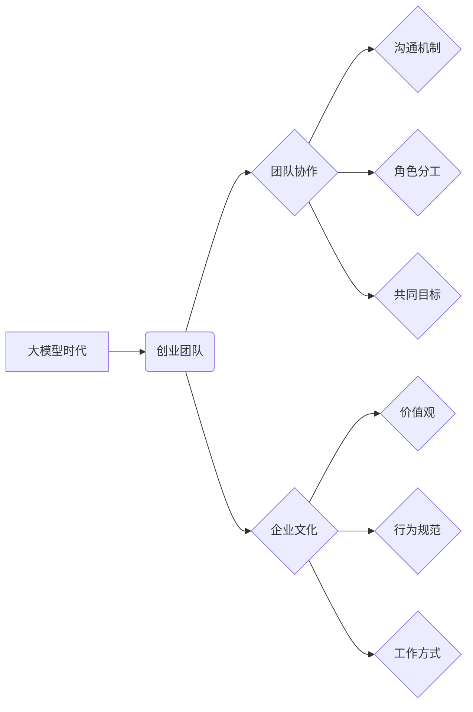

> 大模型、创业团队、团队管理、协作、文化建设、人工智能、技术发展

## 1. 背景介绍

大模型时代已经到来，其强大的计算能力和泛化能力正在深刻地改变着各行各业。对于创业者来说，大模型技术带来了前所未有的机遇，但也带来了新的挑战。如何组建一支高效、协作的创业团队，并构建一个能够适应大模型时代发展需求的企业文化，成为了创业者需要认真思考的问题。

传统的创业团队管理模式在面对大模型技术时显得力不从心。大模型的开发和应用需要跨学科的专业人才，包括人工智能专家、数据科学家、软件工程师、产品经理等。传统的团队管理模式往往难以有效地整合这些不同领域的专业人才，导致团队协作效率低下，项目进展缓慢。

此外，大模型技术的快速发展也对企业文化提出了新的要求。大模型时代强调创新、迭代和快速学习，企业文化需要能够适应这种快速变化的环境，鼓励团队成员不断学习和成长。

## 2. 核心概念与联系

### 2.1 大模型时代创业团队

大模型时代创业团队是指在利用大模型技术进行创业的团队。这类团队通常由以下成员组成：

* **人工智能专家:** 负责大模型的训练、调优和应用开发。
* **数据科学家:** 负责数据收集、清洗、分析和建模。
* **软件工程师:** 负责大模型的部署、维护和系统集成。
* **产品经理:** 负责产品规划、市场调研和用户需求分析。
* **商业运营人员:** 负责市场推广、销售和客户服务。

### 2.2 团队协作与文化建设

团队协作是创业团队成功的关键因素之一。高效的团队协作需要建立良好的沟通机制、明确的角色分工和共同的目标。

企业文化则是指企业内部形成的价值观、行为规范和工作方式。良好的企业文化能够凝聚团队成员，提高团队士气，促进团队协作。

### 2.3 核心概念关系图



## 3. 核心算法原理 & 具体操作步骤

### 3.1 算法原理概述

大模型的训练主要基于深度学习算法，其中Transformer模型是目前最流行的大模型架构之一。Transformer模型利用注意力机制来捕捉文本序列中的长距离依赖关系，从而能够更好地理解和生成文本。

### 3.2 算法步骤详解

1. **数据预处理:** 将原始文本数据进行清洗、分词、标记等预处理操作，使其能够被模型理解。
2. **模型训练:** 使用深度学习框架（如TensorFlow或PyTorch）训练Transformer模型，通过调整模型参数，使其能够准确地预测文本序列的下一个词。
3. **模型评估:** 使用测试集评估模型的性能，并根据评估结果进行模型调优。
4. **模型部署:** 将训练好的模型部署到服务器或云平台，使其能够对外提供服务。

### 3.3 算法优缺点

**优点:**

* 能够捕捉文本序列中的长距离依赖关系，提高文本理解和生成能力。
* 训练数据量越大，模型性能越好。
* 可用于多种自然语言处理任务，如文本分类、机器翻译、问答系统等。

**缺点:**

* 训练成本高，需要大量的计算资源和训练数据。
* 模型参数量大，部署成本较高。
* 对训练数据的质量要求较高，训练数据不干净或不完整会导致模型性能下降。

### 3.4 算法应用领域

大模型技术在各个领域都有广泛的应用，例如：

* **自然语言处理:** 文本分类、机器翻译、问答系统、聊天机器人等。
* **计算机视觉:** 图像识别、物体检测、图像生成等。
* **语音识别:** 语音转文本、语音合成等。
* **推荐系统:** 商品推荐、内容推荐等。

## 4. 数学模型和公式 & 详细讲解 & 举例说明

### 4.1 数学模型构建

Transformer模型的核心是注意力机制，其数学模型可以表示为：

$$
Attention(Q, K, V) = softmax(\frac{QK^T}{\sqrt{d_k}})V
$$

其中：

* $Q$：查询矩阵
* $K$：键矩阵
* $V$：值矩阵
* $d_k$：键向量的维度
* $softmax$：softmax函数

### 4.2 公式推导过程

注意力机制的目的是计算查询向量与键向量的相关性，并根据相关性对值向量进行加权求和。

* $QK^T$：计算查询向量与键向量的点积，得到一个得分矩阵。
* $\frac{QK^T}{\sqrt{d_k}}$：对得分矩阵进行归一化，使得每个元素的范围在0到1之间。
* $softmax$：对归一化后的得分矩阵进行softmax操作，得到每个键向量的权重。
* $V$：将权重与值向量相乘，得到最终的输出。

### 4.3 案例分析与讲解

假设我们有一个句子“我爱学习编程”，我们需要计算“学习”这个词与整个句子的相关性。

* $Q$：查询向量为“学习”对应的词向量。
* $K$：键向量为每个词对应的词向量。
* $V$：值向量为每个词对应的词向量。

通过计算注意力机制，我们可以得到“学习”与整个句子的相关性得分，从而更好地理解这句话的含义。

## 5. 项目实践：代码实例和详细解释说明

### 5.1 开发环境搭建

* 安装Python3.x
* 安装深度学习框架TensorFlow或PyTorch
* 安装必要的库，如numpy、pandas、transformers等

### 5.2 源代码详细实现

```python
from transformers import AutoModelForSequenceClassification, AutoTokenizer

# 加载预训练模型和词典
model_name = "bert-base-uncased"
tokenizer = AutoTokenizer.from_pretrained(model_name)
model = AutoModelForSequenceClassification.from_pretrained(model_name)

# 输入文本
text = "我爱学习编程"

# 对文本进行编码
inputs = tokenizer(text, return_tensors="pt")

# 进行模型预测
outputs = model(**inputs)

# 获取预测结果
predicted_class = outputs.logits.argmax().item()

# 打印预测结果
print(f"预测结果: {predicted_class}")
```

### 5.3 代码解读与分析

* 代码首先加载预训练的BERT模型和词典。
* 然后对输入文本进行编码，将文本转换为模型能够理解的格式。
* 最后，将编码后的文本输入模型进行预测，并获取预测结果。

### 5.4 运行结果展示

运行上述代码，可以得到模型对输入文本的预测结果。例如，如果模型预测结果为0，则表示文本属于“正面”类别。

## 6. 实际应用场景

### 6.1 文本分类

大模型可以用于对文本进行分类，例如判断文本的 sentiment（情感倾向）、主题、类别等。

### 6.2 机器翻译

大模型可以用于机器翻译，将一种语言的文本翻译成另一种语言。

### 6.3 问答系统

大模型可以用于构建问答系统，能够回答用户提出的问题。

### 6.4 未来应用展望

大模型技术还在不断发展，未来将有更多新的应用场景出现，例如：

* **个性化教育:** 根据学生的学习情况，提供个性化的学习内容和辅导。
* **医疗诊断:** 辅助医生进行疾病诊断，提高诊断准确率。
* **法律服务:** 自动分析法律文件，提供法律建议。

## 7. 工具和资源推荐

### 7.1 学习资源推荐

* **课程:**
    * 深度学习 Specialization (Coursera)
    * 自然语言处理 Specialization (Coursera)
* **书籍:**
    * 深度学习 (Ian Goodfellow)
    * 自然语言处理 (Jurafsky & Martin)
* **博客:**
    * The Gradient
    * Towards Data Science

### 7.2 开发工具推荐

* **深度学习框架:** TensorFlow, PyTorch
* **自然语言处理库:** NLTK, spaCy, transformers
* **云平台:** AWS, Google Cloud, Azure

### 7.3 相关论文推荐

* Attention Is All You Need (Vaswani et al., 2017)
* BERT: Pre-training of Deep Bidirectional Transformers for Language Understanding (Devlin et al., 2018)
* GPT-3: Language Models are Few-Shot Learners (Brown et al., 2020)

## 8. 总结：未来发展趋势与挑战

### 8.1 研究成果总结

大模型技术取得了显著的进展，在自然语言处理、计算机视觉等领域取得了突破性成果。

### 8.2 未来发展趋势

* 模型规模继续扩大，模型能力将进一步提升。
* 多模态大模型的开发将成为新的研究热点。
* 大模型的应用场景将更加广泛，渗透到各个领域。

### 8.3 面临的挑战

* 训练成本高，需要大量的计算资源和训练数据。
* 模型参数量大，部署成本较高。
* 模型的可解释性和安全性需要进一步研究。

### 8.4 研究展望

未来，大模型技术将继续发展，并对社会产生更深远的影响。我们需要加强对大模型技术的研究，并积极探索其应用场景，以更好地利用大模型技术，推动社会进步。

## 9. 附录：常见问题与解答

### 9.1 什么是大模型？

大模型是指参数量超过10亿的深度学习模型。

### 9.2 大模型的训练需要哪些资源？

大模型的训练需要大量的计算资源和训练数据。

### 9.3 大模型的应用场景有哪些？

大模型的应用场景非常广泛，例如文本分类、机器翻译、问答系统等。

### 9.4 如何评估大模型的性能？

大模型的性能可以通过准确率、召回率、F1-score等指标进行评估。

### 9.5 大模型有哪些伦理问题？

大模型的伦理问题包括数据隐私、算法偏见、模型可解释性等。


作者：禅与计算机程序设计艺术 / Zen and the Art of Computer Programming 
<end_of_turn>