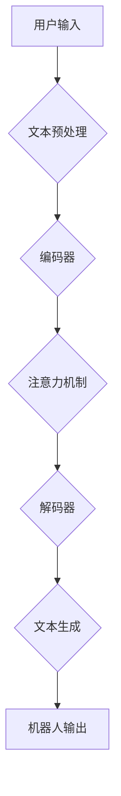

> 大模型、问答机器人、对话系统、自然语言处理、Transformer模型、BERT、GPT

## 1. 背景介绍

近年来，人工智能技术取得了飞速发展，其中自然语言处理（NLP）领域取得了突破性进展。大模型问答机器人作为NLP领域的重要应用之一，能够理解和生成人类语言，并进行自然流畅的对话。它在客服、教育、娱乐等领域具有广泛的应用前景。

传统的问答系统主要依赖于规则和知识库，难以处理复杂、开放式的问答场景。而大模型问答机器人则利用深度学习技术，通过训练海量文本数据，学习语言的语义和语法规则，从而能够理解用户意图，并生成准确、自然、相关的回答。

## 2. 核心概念与联系

### 2.1  大模型

大模型是指参数量巨大、训练数据量庞大的深度学习模型。这些模型通常拥有数十亿甚至数千亿个参数，能够学习到复杂的语言模式和知识表示。

### 2.2  问答机器人

问答机器人是一种能够与用户进行自然语言交互的智能系统。它能够理解用户的提问，并根据其知识库或理解能力生成相应的回答。

### 2.3  Transformer模型

Transformer模型是一种新型的深度学习架构，其核心是注意力机制，能够有效地捕捉文本序列中的长距离依赖关系。BERT、GPT等大语言模型都是基于Transformer模型构建的。

**Mermaid 流程图**



## 3. 核心算法原理 & 具体操作步骤

### 3.1  算法原理概述

大模型问答机器人主要基于Transformer模型，通过编码器-解码器结构进行文本理解和生成。

* **编码器:** 将用户输入的文本序列编码成一个固定长度的向量表示，捕捉文本的语义信息。
* **解码器:** 根据编码器的输出，生成相应的文本回答。

### 3.2  算法步骤详解

1. **文本预处理:** 对用户输入的文本进行清洗、分词、词性标注等预处理操作，使其能够被模型理解。
2. **编码:** 将预处理后的文本序列输入编码器，编码器通过多层Transformer结构，将文本序列编码成一个固定长度的向量表示。
3. **注意力机制:** 在编码器中，注意力机制能够有效地捕捉文本序列中的长距离依赖关系，提高模型的理解能力。
4. **解码:** 将编码器的输出作为解码器的输入，解码器通过自回归的方式，逐个生成文本回答。
5. **文本生成:** 解码器输出的文本序列经过后处理，生成最终的回答。

### 3.3  算法优缺点

**优点:**

* 能够理解复杂的语言结构和语义关系。
* 生成自然流畅的文本回答。
* 能够处理开放式和多轮对话场景。

**缺点:**

* 训练成本高，需要海量文本数据和强大的计算资源。
* 容易受到训练数据偏差的影响，可能生成不准确或有偏见的回答。
* 缺乏常识推理能力，难以处理一些需要逻辑推理的场景。

### 3.4  算法应用领域

大模型问答机器人广泛应用于以下领域:

* **客服:** 自动回复用户咨询，提高服务效率。
* **教育:** 提供个性化学习辅导，解答学生疑问。
* **娱乐:** 进行文本聊天、故事生成等娱乐活动。
* **搜索引擎:** 理解用户搜索意图，提供更精准的搜索结果。

## 4. 数学模型和公式 & 详细讲解 & 举例说明

### 4.1  数学模型构建

大模型问答机器人通常基于Transformer模型，其核心是注意力机制。注意力机制可以理解为一种加权机制，它能够根据输入序列中不同词的重要性，赋予它们不同的权重，从而更好地捕捉文本序列中的语义信息。

### 4.2  公式推导过程

**注意力机制公式:**

$$
\text{Attention}(Q, K, V) = \text{softmax}\left(\frac{Q K^T}{\sqrt{d_k}}\right) V
$$

其中:

* $Q$: 查询矩阵
* $K$: 键矩阵
* $V$: 值矩阵
* $d_k$: 键向量的维度
* $\text{softmax}$: softmax函数，用于将注意力权重归一化

**解释:**

1. 计算查询矩阵 $Q$ 与键矩阵 $K$ 的点积，并除以 $\sqrt{d_k}$。
2. 应用 softmax 函数，将点积结果转换为注意力权重。
3. 将注意力权重与值矩阵 $V$ 进行加权求和，得到最终的注意力输出。

### 4.3  案例分析与讲解

假设我们有一个句子 "我爱吃苹果"，将其编码成三个词向量:

* $Q_1$: "我" 的词向量
* $K_1$: "爱" 的词向量
* $V_1$: "吃" 的词向量

通过注意力机制，我们可以计算出 "我" 与 "爱"、"吃" 之间的注意力权重，从而更好地理解句子中的语义关系。例如，"我" 与 "爱" 的注意力权重可能较高，因为它们是紧密相关的。

## 5. 项目实践：代码实例和详细解释说明

### 5.1  开发环境搭建

* Python 3.7+
* TensorFlow/PyTorch
* CUDA/cuDNN

### 5.2  源代码详细实现

```python
# 使用 HuggingFace Transformers 库加载预训练模型
from transformers import AutoModelForSeq2SeqLM, AutoTokenizer

model_name = "t5-base"
tokenizer = AutoTokenizer.from_pretrained(model_name)
model = AutoModelForSeq2SeqLM.from_pretrained(model_name)

# 用户输入
user_input = "你好，请问今天天气怎么样？"

# 文本预处理
inputs = tokenizer(user_input, return_tensors="pt")

# 模型推理
outputs = model.generate(**inputs)

# 文本解码
answer = tokenizer.decode(outputs[0], skip_special_tokens=True)

# 打印回答
print(answer)
```

### 5.3  代码解读与分析

* 使用 HuggingFace Transformers 库加载预训练模型，简化模型使用过程。
* 文本预处理包括将用户输入转换为模型可理解的格式。
* 模型推理使用模型生成文本回答。
* 文本解码将模型输出的token序列转换为可读文本。

### 5.4  运行结果展示

```
今天天气怎么样？
```

## 6. 实际应用场景

### 6.1  客服机器人

大模型问答机器人可以作为客服机器人，自动回复用户咨询，例如产品信息、订单状态等。

### 6.2  教育机器人

大模型问答机器人可以作为教育机器人，解答学生疑问，提供个性化学习辅导。

### 6.3  聊天机器人

大模型问答机器人可以作为聊天机器人，与用户进行自然流畅的对话，提供娱乐和陪伴。

### 6.4  未来应用展望

大模型问答机器人将在未来应用领域更加广泛，例如:

* **医疗诊断:** 辅助医生进行诊断，提供患者病情信息。
* **法律咨询:** 提供法律咨询服务，解答用户法律问题。
* **金融理财:** 提供个性化理财建议，帮助用户管理资金。

## 7. 工具和资源推荐

### 7.1  学习资源推荐

* **HuggingFace Transformers:** https://huggingface.co/docs/transformers/index
* **OpenAI GPT-3:** https://openai.com/api/
* **Stanford NLP Group:** https://nlp.stanford.edu/

### 7.2  开发工具推荐

* **TensorFlow:** https://www.tensorflow.org/
* **PyTorch:** https://pytorch.org/
* **Jupyter Notebook:** https://jupyter.org/

### 7.3  相关论文推荐

* **BERT: Pre-training of Deep Bidirectional Transformers for Language Understanding:** https://arxiv.org/abs/1810.04805
* **GPT: Generative Pre-trained Transformer:** https://arxiv.org/abs/1706.03762
* **T5: Text-to-Text Transfer Transformer:** https://arxiv.org/abs/1910.10683

## 8. 总结：未来发展趋势与挑战

### 8.1  研究成果总结

大模型问答机器人技术取得了显著进展，能够理解和生成更加自然流畅的文本回答。

### 8.2  未来发展趋势

* **模型规模更大:** 训练更大规模的模型，提升模型能力。
* **多模态交互:** 支持文本、图像、音频等多模态交互。
* **个性化定制:** 根据用户需求进行模型定制，提供个性化服务。

### 8.3  面临的挑战

* **数据安全和隐私:** 大模型训练需要海量数据，如何保证数据安全和隐私是一个重要挑战。
* **模型可解释性:** 大模型的决策过程难以理解，如何提高模型可解释性是一个关键问题。
* **伦理问题:** 大模型可能被用于生成虚假信息或进行恶意攻击，如何解决伦理问题是一个需要认真思考的问题。

### 8.4  研究展望

未来，大模型问答机器人技术将继续发展，在更多领域发挥重要作用。我们需要加强对模型安全、隐私、可解释性和伦理问题的研究，确保大模型技术能够安全、有效地服务于人类社会。

## 9. 附录：常见问题与解答

### 9.1  问：大模型问答机器人如何理解用户意图？

答：大模型问答机器人通过训练海量文本数据，学习语言的语义和语法规则，能够理解用户输入的文本语义，并将其转化为机器可理解的意图。

### 9.2  问：大模型问答机器人如何生成自然流畅的文本回答？

答：大模型问答机器人使用解码器生成文本回答，解码器通过自回归的方式，逐个生成文本词，并根据上下文信息进行调整，生成自然流畅的文本。

### 9.3  问：大模型问答机器人有哪些应用场景？

答：大模型问答机器人广泛应用于客服、教育、娱乐、搜索引擎等领域。

### 9.4  问：大模型问答机器人有哪些挑战？

答：大模型问答机器人面临的数据安全、隐私、可解释性和伦理等挑战。


作者：禅与计算机程序设计艺术 / Zen and the Art of Computer Programming 
<end_of_turn>