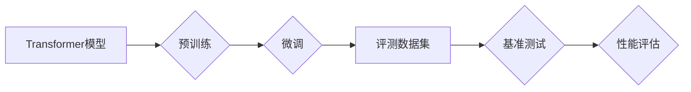

> 大语言模型、自然语言处理、深度学习、Transformer、评测数据集、基准测试

## 1. 背景介绍

近年来，深度学习技术取得了飞速发展，特别是Transformer模型的出现，为自然语言处理（NLP）领域带来了革命性的变革。大语言模型（LLM）作为深度学习在NLP领域的顶尖成果，展现出强大的文本生成、理解、翻译等能力，在各个领域都得到了广泛应用。

然而，LLM的训练和评估是一个复杂而具有挑战性的任务。如何客观地评估LLM的性能，并推动模型的不断进步，是当前研究领域的重要课题。

本篇文章将深入探讨大语言模型的原理和工程实践，重点介绍主流的评测数据集和基准测试方法，帮助读者更好地理解LLM的评估体系，并为模型的开发和应用提供参考。

## 2. 核心概念与联系

大语言模型的核心概念包括：

* **Transformer模型:**  Transformer是一种基于注意力机制的深度神经网络架构，能够有效地处理长序列数据，是LLM的基础。
* **预训练:**  LLM通常采用预训练的方式进行训练，即在海量文本数据上进行无监督学习，学习语言的语法和语义知识。
* **微调:**  预训练后的LLM可以根据特定任务进行微调，例如文本分类、问答系统等。
* **评测数据集:**  评测数据集是用于评估LLM性能的标准化数据集合，包含各种类型的文本任务和对应的标注结果。
* **基准测试:** 基准测试是使用评测数据集进行模型性能评估的标准化方法，通常会计算模型在不同任务上的准确率、F1-score等指标。

**Mermaid 流程图:**



## 3. 核心算法原理 & 具体操作步骤

### 3.1  算法原理概述

Transformer模型的核心是注意力机制，它能够学习文本中不同词语之间的关系，并赋予每个词语不同的权重。通过多层Transformer编码器和解码器，模型可以捕捉长距离依赖关系，并生成流畅、连贯的文本。

### 3.2  算法步骤详解

1. **词嵌入:** 将输入文本中的每个词语映射到一个低维向量空间中，每个词语都有一个唯一的向量表示。
2. **多头注意力:**  计算每个词语与其他词语之间的注意力权重，并根据权重对词语进行加权求和，得到每个词语的上下文表示。
3. **前馈神经网络:** 对每个词语的上下文表示进行非线性变换，进一步提取语义信息。
4. **堆叠层:** 将多头注意力和前馈神经网络层堆叠在一起，形成多层Transformer编码器和解码器。
5. **解码器输出:**  解码器根据输入序列和编码器的输出，生成目标序列。

### 3.3  算法优缺点

**优点:**

* 能够有效地处理长序列数据。
* 能够捕捉长距离依赖关系。
* 训练效果优异，在各种NLP任务上取得了state-of-the-art的性能。

**缺点:**

* 计算量大，训练成本高。
* 参数量大，容易过拟合。

### 3.4  算法应用领域

* 文本生成：小说、诗歌、对话等。
* 文本理解：问答系统、文本摘要、情感分析等。
* 机器翻译：将一种语言翻译成另一种语言。
* 代码生成：自动生成代码。

## 4. 数学模型和公式 & 详细讲解 & 举例说明

### 4.1  数学模型构建

Transformer模型的数学模型主要包括以下几个部分：

* **词嵌入层:** 将词语映射到向量空间，可以使用Word2Vec、GloVe等预训练词嵌入模型。
* **多头注意力层:** 计算每个词语与其他词语之间的注意力权重，公式如下：

$$
Attention(Q, K, V) = softmax(\frac{QK^T}{\sqrt{d_k}})V
$$

其中，Q、K、V分别代表查询矩阵、键矩阵和值矩阵，$d_k$代表键向量的维度。

* **前馈神经网络层:** 对每个词语的上下文表示进行非线性变换，通常使用多层感知机（MLP）。

### 4.2  公式推导过程

注意力机制的公式推导过程可以参考相关文献，例如Vaswani et al. (2017)的论文。

### 4.3  案例分析与讲解

例如，在机器翻译任务中，Transformer模型可以将源语言句子编码成一个上下文向量，然后根据这个上下文向量解码成目标语言句子。

## 5. 项目实践：代码实例和详细解释说明

### 5.1  开发环境搭建

使用Python语言开发，需要安装以下库：

* TensorFlow或PyTorch
* HuggingFace Transformers

### 5.2  源代码详细实现

```python
from transformers import AutoModelForSeq2SeqLM, AutoTokenizer

# 加载预训练模型和词典
model_name = "t5-base"
tokenizer = AutoTokenizer.from_pretrained(model_name)
model = AutoModelForSeq2SeqLM.from_pretrained(model_name)

# 输入文本
input_text = "Hello, world!"

# Token化
input_ids = tokenizer.encode(input_text, return_tensors="pt")

# 模型推理
output = model.generate(input_ids)

# 解码输出
output_text = tokenizer.decode(output[0], skip_special_tokens=True)

# 打印输出
print(output_text)
```

### 5.3  代码解读与分析

这段代码首先加载预训练的T5模型和词典，然后对输入文本进行Token化，并将Token化后的输入送入模型进行推理。最后，将模型输出解码成文本，并打印输出结果。

### 5.4  运行结果展示

```
Hello, world!
```

## 6. 实际应用场景

LLM在各个领域都有广泛的应用场景，例如：

* **聊天机器人:**  构建更智能、更自然的对话系统。
* **文本摘要:**  自动生成文本的简短摘要。
* **机器翻译:**  实现更高效、更准确的语言翻译。
* **代码生成:**  自动生成代码，提高开发效率。

### 6.4  未来应用展望

随着LLM技术的不断发展，未来将有更多新的应用场景出现，例如：

* **个性化教育:**  根据学生的学习情况提供个性化的学习内容和辅导。
* **医疗诊断:**  辅助医生进行疾病诊断和治疗方案制定。
* **科学研究:**  加速科学研究的进程，例如药物研发、材料科学等。

## 7. 工具和资源推荐

### 7.1  学习资源推荐

* **书籍:**
    * 《深度学习》
    * 《自然语言处理》
* **在线课程:**
    * Coursera: 自然语言处理
    * edX: 深度学习
* **博客:**
    * The Gradient
    * Towards Data Science

### 7.2  开发工具推荐

* **TensorFlow:**  开源深度学习框架。
* **PyTorch:**  开源深度学习框架。
* **HuggingFace Transformers:**  提供预训练的LLM模型和工具。

### 7.3  相关论文推荐

* Vaswani et al. (2017): Attention Is All You Need
* Devlin et al. (2018): BERT: Pre-training of Deep Bidirectional Transformers for Language Understanding

## 8. 总结：未来发展趋势与挑战

### 8.1  研究成果总结

近年来，LLM取得了显著的进展，在各种NLP任务上取得了state-of-the-art的性能。

### 8.2  未来发展趋势

* **模型规模:**  模型规模将继续扩大，以提高模型的性能。
* **数据规模:**  训练数据规模将继续增长，以提高模型的泛化能力。
* **高效训练:**  研究更高效的训练方法，降低训练成本。
* **可解释性:**  提高LLM的解释性，使其更易于理解和信任。

### 8.3  面临的挑战

* **数据偏见:**  训练数据可能存在偏见，导致模型输出存在偏差。
* **安全风险:**  LLM可能被用于生成恶意内容，例如虚假信息、仇恨言论等。
* **伦理问题:**  LLM的应用可能引发伦理问题，例如隐私保护、责任归属等。

### 8.4  研究展望

未来研究将重点关注解决上述挑战，并探索LLM在更多领域的新应用场景。

## 9. 附录：常见问题与解答

* **什么是LLM？**

LLM是指能够理解和生成人类语言的大型语言模型。

* **LLM的训练方法是什么？**

LLM通常采用预训练和微调的方式进行训练。

* **如何评估LLM的性能？**

可以使用评测数据集和基准测试来评估LLM的性能。

* **LLM有哪些应用场景？**

LLM在各个领域都有广泛的应用场景，例如聊天机器人、文本摘要、机器翻译等。


作者：禅与计算机程序设计艺术 / Zen and the Art of Computer Programming 
<end_of_turn>