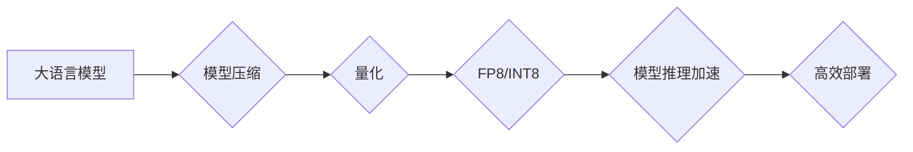

> 大语言模型，FP8，INT8，量化，模型压缩，推理加速，深度学习

## 1. 背景介绍

近年来，深度学习技术取得了飞速发展，大语言模型（LLM）作为深度学习领域的重要分支，展现出强大的文本生成、理解和翻译能力，在自然语言处理、机器翻译、对话系统等领域取得了突破性进展。然而，LLM通常拥有庞大的参数量和复杂的模型结构，导致其训练和部署成本高昂，推理速度慢，难以在资源有限的设备上运行。为了解决这些问题，模型压缩和量化技术成为LLM高效部署的关键技术之一。

FP8和INT8量化技术是模型压缩领域的重要发展方向，通过将模型参数和激活值量化为更低精度的数据类型，可以有效减少模型存储空间和计算量，从而提高模型推理速度和降低部署成本。本文将深入探讨FP8和INT8量化技术原理、算法、应用场景以及未来发展趋势。

## 2. 核心概念与联系

**2.1 大语言模型 (LLM)**

大语言模型是指参数量巨大、训练数据海量的人工智能模型，能够理解和生成人类语言。LLM通常基于Transformer架构，通过自注意力机制学习语言的上下文关系，从而实现强大的文本生成、理解和翻译能力。

**2.2 模型压缩**

模型压缩是指通过各种技术手段减少模型参数量和模型大小，从而降低模型存储空间和计算量，提高模型推理速度和部署效率的技术。

**2.3 量化**

量化是指将模型参数和激活值从高精度数据类型（如浮点数）转换为低精度数据类型（如整数）的技术。量化可以有效减少模型存储空间和计算量，从而提高模型推理速度和降低部署成本。

**2.4 FP8和INT8**

FP8和INT8是两种常见的低精度数据类型，分别表示8位浮点数和8位整数。FP8和INT8量化技术将模型参数和激活值量化为FP8或INT8数据类型，可以有效减少模型存储空间和计算量。

**2.5 Mermaid 流程图**



## 3. 核心算法原理 & 具体操作步骤

### 3.1 算法原理概述

FP8和INT8量化技术的基本原理是将模型参数和激活值从高精度数据类型（如浮点数）转换为低精度数据类型（如整数）。

**3.1.1 权重量化**

权重量化是指将模型参数（权重）转换为低精度数据类型。常用的权重量化方法包括：

* **均匀量化:** 将权重值映射到一个有限的整数范围，每个整数区间代表一个权重值。
* **非均匀量化:** 将权重值映射到一个非均匀的整数范围，每个整数区间代表一个权重值，可以根据权重分布的特性进行调整。

**3.1.2 激活量化**

激活量化是指将模型激活值（如ReLU、Sigmoid等）转换为低精度数据类型。常用的激活量化方法包括：

* **线性量化:** 将激活值映射到一个有限的整数范围。
* **非线性量化:** 使用非线性函数将激活值映射到一个有限的整数范围，可以更好地保留激活值的细节信息。

### 3.2 算法步骤详解

**3.2.1 数据预处理**

首先需要对模型参数和激活值进行预处理，例如归一化、标准化等，以提高量化效果。

**3.2.2 量化范围确定**

根据模型参数和激活值的分布特性，确定量化范围，即整数区间的大小。

**3.2.3 量化映射**

将模型参数和激活值映射到确定的量化范围，得到低精度数据类型。

**3.2.4 反量化**

在推理过程中，需要将量化后的数据反量化回高精度数据类型，以保证模型的准确性。

### 3.3 算法优缺点

**优点:**

* **模型压缩:** 可以有效减少模型存储空间和计算量。
* **推理加速:** 可以提高模型推理速度。
* **部署效率:** 可以降低模型部署成本。

**缺点:**

* **精度损失:** 量化过程可能会导致模型精度损失。
* **复杂性增加:** 量化过程需要额外的计算和存储开销。

### 3.4 算法应用领域

FP8和INT8量化技术广泛应用于以下领域：

* **移动设备:** 在资源有限的移动设备上部署大模型。
* **边缘计算:** 在边缘设备上进行实时推理。
* **云计算:** 提高云端大模型的推理效率。

## 4. 数学模型和公式 & 详细讲解 & 举例说明

### 4.1 数学模型构建

**4.1.1 权重量化模型**

假设模型参数为浮点数 $w_i$，量化范围为 $[min_w, max_w]$，则权重量化后的值 $w_i'$ 可以表示为：

$$w_i' = round(\frac{w_i - min_w}{max_w - min_w} \cdot 2^b)$$

其中，$b$ 为量化位数。

**4.1.2 激活量化模型**

假设模型激活值为浮点数 $a_i$，量化范围为 $[min_a, max_a]$，则激活量化后的值 $a_i'$ 可以表示为：

$$a_i' = round(\frac{a_i - min_a}{max_a - min_a} \cdot 2^b)$$

其中，$b$ 为量化位数。

### 4.2 公式推导过程

**4.2.1 权重量化精度损失分析**

权重量化会导致精度损失，主要原因是将浮点数映射到有限的整数区间。精度损失可以通过量化位数 $b$ 来控制，$b$ 越大，精度损失越小。

**4.2.2 激活量化精度损失分析**

激活量化也会导致精度损失，主要原因是将浮点数映射到有限的整数区间。精度损失可以通过量化位数 $b$ 和激活值分布特性来控制。

### 4.3 案例分析与讲解

**4.3.1 BERT模型FP8量化**

BERT模型是一个常用的自然语言处理模型，其参数量较大，部署成本高。通过将BERT模型参数量化为FP8数据类型，可以有效减少模型存储空间和计算量，从而提高模型推理速度和降低部署成本。

**4.3.2 MobileNetV2模型INT8量化**

MobileNetV2模型是一个专门设计用于移动设备的深度学习模型，其参数量较小，但仍然需要进行量化优化以提高推理效率。通过将MobileNetV2模型参数和激活值量化为INT8数据类型，可以有效提高模型推理速度。

## 5. 项目实践：代码实例和详细解释说明

### 5.1 开发环境搭建

* 操作系统：Ubuntu 20.04
* 深度学习框架：TensorFlow 2.x
* 量化工具：TensorFlow Lite Converter

### 5.2 源代码详细实现

```python
import tensorflow as tf

# 定义一个简单的模型
model = tf.keras.Sequential([
    tf.keras.layers.Dense(10, activation='relu', input_shape=(10,)),
    tf.keras.layers.Dense(1)
])

# 编译模型
model.compile(optimizer='adam', loss='mse')

# 训练模型
model.fit(x_train, y_train, epochs=10)

# 保存模型
model.save('my_model.h5')

# 使用TensorFlow Lite Converter将模型量化为FP8
converter = tf.lite.TFLiteConverter.from_keras_model(model)
converter.optimizations = [tf.lite.Optimize.DEFAULT]
tflite_model = converter.convert()

# 保存量化模型
with open('my_model_fp8.tflite', 'wb') as f:
    f.write(tflite_model)
```

### 5.3 代码解读与分析

* 代码首先定义了一个简单的深度学习模型。
* 然后使用TensorFlow Lite Converter将模型量化为FP8数据类型。
* 最后将量化后的模型保存为.tflite文件。

### 5.4 运行结果展示

量化后的模型可以部署到资源有限的设备上，例如移动设备和嵌入式设备，以实现高效的推理。

## 6. 实际应用场景

### 6.1 语音识别

在移动设备上部署语音识别模型，实现实时语音转文本功能。

### 6.2 图像分类

在嵌入式设备上部署图像分类模型，实现实时物体识别功能。

### 6.3 自然语言处理

在云端部署大语言模型，实现文本生成、翻译、问答等功能。

### 6.4 未来应用展望

随着硬件设备性能的提升和量化技术的不断发展，FP8和INT8量化技术将在更多领域得到应用，例如：

* **自动驾驶:** 在自动驾驶系统中部署模型，实现实时感知和决策。
* **医疗诊断:** 在医疗诊断系统中部署模型，辅助医生进行疾病诊断。
* **工业自动化:** 在工业自动化系统中部署模型，实现智能控制和优化。

## 7. 工具和资源推荐

### 7.1 学习资源推荐

* TensorFlow Lite: https://www.tensorflow.org/lite
* PyTorch Mobile: https://pytorch.org/mobile/

### 7.2 开发工具推荐

* TensorFlow Lite Converter: https://www.tensorflow.org/lite/convert
* PyTorch Mobile: https://pytorch.org/mobile/

### 7.3 相关论文推荐

* "Quantization-aware Training"
* "Mixed Precision Training"
* "Post-Training Quantization"

## 8. 总结：未来发展趋势与挑战

### 8.1 研究成果总结

FP8和INT8量化技术取得了显著的成果，有效提高了大语言模型的推理效率和部署效率。

### 8.2 未来发展趋势

* **更低精度量化:** 研究更低精度的量化技术，例如4位量化，以进一步降低模型存储空间和计算量。
* **自适应量化:** 研究自适应量化技术，根据模型和硬件平台的特点动态调整量化精度，以平衡精度和效率。
* **混合精度训练:** 研究混合精度训练技术，在训练过程中使用不同精度的数据类型，以提高训练效率和模型精度。

### 8.3 面临的挑战

* **精度损失:** 量化过程可能会导致精度损失，需要进一步研究如何减小精度损失。
* **硬件支持:** 需要硬件平台对低精度计算提供更好的支持。
* **模型兼容性:** 需要确保量化后的模型能够兼容不同的硬件平台和软件框架。

### 8.4 研究展望

未来，FP8和INT8量化技术将继续发展，并与其他模型压缩技术相结合，为大语言模型的部署和应用提供更有效的解决方案。

## 9. 附录：常见问题与解答

**9.1 量化后模型精度会损失吗？**

是的，量化过程可能会导致精度损失，但可以通过调整量化位数和使用更先进的量化算法来减小精度损失。

**9.2 FP8和INT8量化技术有什么区别？**

FP8和INT8都是低精度数据类型，但FP8表示8位浮点数，INT8表示8位整数。FP8可以保留更多的浮点数信息，但INT8的计算量更小。

**9.3 如何选择合适的量化技术？**

选择合适的量化技术需要根据模型的特性、硬件平台和应用场景进行综合考虑。

作者：禅与计算机程序设计艺术 / Zen and the Art of Computer Programming


<end_of_turn>