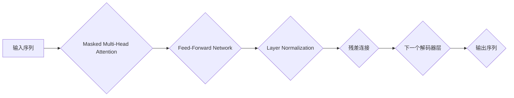

> Transformer, 解码器, 大语言模型, 自然语言处理, 序列生成, Attention机制, BERT, GPT

## 1. 背景介绍

近年来，深度学习在自然语言处理（NLP）领域取得了突破性进展，其中大语言模型（LLM）作为其重要组成部分，展现出强大的文本理解和生成能力。LLM的训练通常基于Transformer架构，而Transformer解码器是其核心组成部分，负责将输入序列转换为目标序列，例如文本生成、机器翻译等任务。

传统的循环神经网络（RNN）在处理长序列文本时存在梯度消失和爆炸问题，难以捕捉长距离依赖关系。Transformer的出现则彻底改变了NLP领域，其基于注意力机制（Attention）的结构能够有效解决上述问题，并实现更准确、更高效的文本处理。

## 2. 核心概念与联系

Transformer解码器是基于Transformer架构的解码器部分，其主要功能是根据输入序列生成目标序列。

**2.1 Transformer架构概述**

Transformer架构由编码器和解码器两部分组成。编码器负责将输入序列转换为固定长度的隐藏表示，解码器则根据编码器的输出和自身状态生成目标序列。

**2.2 解码器结构**

解码器由多个编码器层组成，每个编码器层包含以下组件：

* **Masked Multi-Head Attention:** 允许解码器关注输入序列中的前一部分信息，防止泄露未来信息。
* **Feed-Forward Network:** 对每个单词的隐藏表示进行非线性变换。
* **Layer Normalization:** 对每个层的输出进行归一化，提高训练稳定性。

**2.3 解码器流程图**



## 3. 核心算法原理 & 具体操作步骤

### 3.1 算法原理概述

Transformer解码器的核心算法是基于注意力机制的序列生成模型。注意力机制允许模型关注输入序列中与当前生成词语相关的部分信息，从而提高生成质量。

### 3.2 算法步骤详解

1. **输入处理:** 将输入序列转换为词嵌入向量。
2. **Masked Multi-Head Attention:** 使用掩码多头注意力机制计算每个词语与输入序列中所有词语之间的注意力权重，并生成上下文信息。
3. **Feed-Forward Network:** 对每个词语的上下文信息进行非线性变换，生成新的隐藏表示。
4. **Layer Normalization:** 对每个层的输出进行归一化，提高训练稳定性。
5. **残差连接:** 将当前层的输出与前一层输出相加，防止梯度消失。
6. **重复步骤2-5:** 对解码器中的所有层进行上述操作，直到生成目标序列的最后一个词语。
7. **输出生成:** 根据解码器最后层的输出，使用softmax函数预测下一个词语。

### 3.3 算法优缺点

**优点:**

* 能够有效捕捉长距离依赖关系。
* 并行计算能力强，训练速度快。
* 生成结果质量高。

**缺点:**

* 计算复杂度高，参数量大。
* 训练数据量大，需要大量计算资源。

### 3.4 算法应用领域

Transformer解码器广泛应用于以下领域：

* 文本生成：例如机器翻译、文本摘要、对话系统等。
* 代码生成：例如自动代码补全、代码翻译等。
* 语音合成：例如文本转语音、语音增强等。

## 4. 数学模型和公式 & 详细讲解 & 举例说明

### 4.1 数学模型构建

Transformer解码器的数学模型主要包括以下部分：

* 词嵌入层：将词语转换为向量表示。
* 多头注意力层：计算每个词语与输入序列中所有词语之间的注意力权重。
* Feed-Forward Network：对每个词语的上下文信息进行非线性变换。
* 归一化层：对每个层的输出进行归一化。

### 4.2 公式推导过程

**4.2.1 词嵌入层**

词嵌入层将每个词语映射到一个低维向量空间中。假设词典大小为V，每个词语的嵌入向量维度为d，则词嵌入层的输出可以表示为：

$$
E = W_e x
$$

其中，$x$是词语的索引，$W_e$是词嵌入矩阵。

**4.2.2 多头注意力层**

多头注意力层可以并行计算多个注意力头，并融合它们的输出，从而捕捉不同类型的依赖关系。

注意力权重计算公式：

$$
Attention(Q, K, V) = softmax(\frac{QK^T}{\sqrt{d_k}})V
$$

其中，$Q$, $K$, $V$分别代表查询矩阵、键矩阵和值矩阵，$d_k$是键向量的维度。

**4.2.3 Feed-Forward Network**

Feed-Forward Network是一个两层全连接神经网络，其输出可以表示为：

$$
FFN(x) = \sigma(W_1 x + b_1)
$$

$$
FFN(x) = W_2 FFN(x) + b_2
$$

其中，$\sigma$是激活函数，$W_1$, $W_2$, $b_1$, $b_2$分别是权重和偏置项。

### 4.3 案例分析与讲解

**4.3.1 机器翻译**

在机器翻译任务中，Transformer解码器可以将源语言文本转换为目标语言文本。

**4.3.2 文本摘要**

在文本摘要任务中，Transformer解码器可以根据输入文本生成一个较短的摘要。

## 5. 项目实践：代码实例和详细解释说明

### 5.1 开发环境搭建

* Python 3.6+
* PyTorch 1.0+
* CUDA 10.0+

### 5.2 源代码详细实现

```python
import torch
import torch.nn as nn

class Decoder(nn.Module):
    def __init__(self, vocab_size, embedding_dim, hidden_dim, num_heads):
        super(Decoder, self).__init__()
        self.embedding = nn.Embedding(vocab_size, embedding_dim)
        self.multi_head_attention = nn.MultiheadAttention(embedding_dim, num_heads)
        self.feed_forward_network = nn.Sequential(
            nn.Linear(embedding_dim, hidden_dim),
            nn.ReLU(),
            nn.Linear(hidden_dim, embedding_dim)
        )
        self.layer_norm = nn.LayerNorm(embedding_dim)

    def forward(self, input, encoder_output, mask):
        embedded = self.embedding(input)
        attention_output, _ = self.multi_head_attention(embedded, encoder_output, encoder_output, attn_mask=mask)
        output = self.layer_norm(attention_output + embedded)
        output = self.feed_forward_network(output)
        return output
```

### 5.3 代码解读与分析

* `__init__`方法初始化解码器模型参数，包括词嵌入层、多头注意力层、前馈网络和层归一化层。
* `forward`方法定义解码器的前向传播过程，输入包括当前词语的索引、编码器输出和掩码。
* 词嵌入层将词语索引转换为向量表示。
* 多头注意力层计算每个词语与编码器输出之间的注意力权重，并生成上下文信息。
* 前馈网络对每个词语的上下文信息进行非线性变换。
* 层归一化层对每个层的输出进行归一化，提高训练稳定性。

### 5.4 运行结果展示

运行解码器模型可以生成目标序列，例如机器翻译、文本摘要等任务。

## 6. 实际应用场景

### 6.1 机器翻译

Transformer解码器在机器翻译领域取得了显著成果，例如Google Translate、DeepL等翻译工具都采用了Transformer架构。

### 6.2 文本摘要

Transformer解码器可以自动生成文本摘要，例如新闻摘要、会议记录摘要等。

### 6.3 对话系统

Transformer解码器可以用于构建更自然、更流畅的对话系统，例如聊天机器人、虚拟助手等。

### 6.4 未来应用展望

Transformer解码器在未来将有更广泛的应用场景，例如：

* 代码生成：自动生成代码，提高开发效率。
* 语音合成：生成更自然、更逼真的语音。
* 药物研发：预测药物的活性，加速药物研发过程。

## 7. 工具和资源推荐

### 7.1 学习资源推荐

* **论文:**
    * Vaswani, A., Shazeer, N., Parmar, N., Uszkoreit, J., Jones, L., Gomez, A. N., ... & Polosukhin, I. (2017). Attention is all you need. In Advances in neural information processing systems (pp. 5998-6008).
* **书籍:**
    * Deep Learning with PyTorch (2nd Edition) by Eli Stevens, Luca Antiga, Thomas Viehmann
* **在线课程:**
    * Stanford CS224N: Natural Language Processing with Deep Learning
    * fast.ai: Practical Deep Learning for Coders

### 7.2 开发工具推荐

* **PyTorch:** 深度学习框架
* **TensorFlow:** 深度学习框架
* **Hugging Face Transformers:** 预训练 Transformer 模型库

### 7.3 相关论文推荐

* BERT: Pre-training of Deep Bidirectional Transformers for Language Understanding
* GPT-3: Language Models are Few-Shot Learners
* T5: Text-to-Text Transfer Transformer

## 8. 总结：未来发展趋势与挑战

### 8.1 研究成果总结

Transformer解码器在自然语言处理领域取得了突破性进展，其强大的文本理解和生成能力推动了NLP技术的快速发展。

### 8.2 未来发展趋势

* **模型规模扩大:** 未来Transformer模型规模将进一步扩大，从而提升模型性能。
* **高效训练方法:** 研究更有效的训练方法，降低模型训练成本。
* **多模态理解:** 将Transformer解码器与其他模态数据（例如图像、音频）结合，实现多模态理解。

### 8.3 面临的挑战

* **数据依赖性:** Transformer模型对训练数据依赖性强，数据质量和数量直接影响模型性能。
* **计算资源:** 训练大型Transformer模型需要大量的计算资源，成本较高。
* **可解释性:** Transformer模型的内部机制复杂，难以解释模型的决策过程。

### 8.4 研究展望

未来研究将重点关注以下方面：

* 开发更有效的训练方法，降低模型训练成本。
* 提升模型的泛化能力，使其能够适应更多场景。
* 研究Transformer模型的内部机制，提高模型的可解释性。

## 9. 附录：常见问题与解答

**9.1 Transformer解码器与RNN的区别？**

Transformer解码器与RNN相比，具有以下优势：

* 能够有效捕捉长距离依赖关系。
* 并行计算能力强，训练速度快。
* 生成结果质量高。

**9.2 如何训练Transformer解码器？**

训练Transformer解码器需要大量的文本数据和计算资源。常用的训练方法包括：

* 监督学习：使用标注数据训练模型。
* 自监督学习：使用无标注数据训练模型。
* 强化学习：使用奖励机制训练模型。

**9.3 Transformer解码器有哪些应用场景？**

Transformer解码器广泛应用于以下领域：

* 文本生成：例如机器翻译、文本摘要、对话系统等。
* 代码生成：例如自动代码补全、代码翻译等。
* 语音合成：例如文本转语音、语音增强等。


作者：禅与计算机程序设计艺术 / Zen and the Art of Computer Programming 
<end_of_turn>