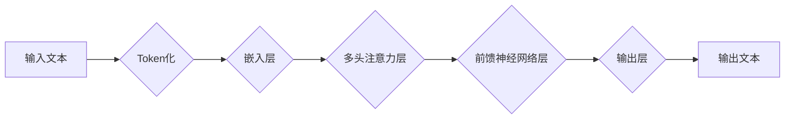

> 大语言模型、Transformer、自然语言处理、深度学习、文本生成、机器翻译、问答系统

## 1. 背景介绍

近年来，深度学习技术取得了飞速发展，特别是Transformer模型的出现，为自然语言处理（NLP）领域带来了革命性的变革。大语言模型（LLM）作为Transformer模型的升级版，拥有海量参数和强大的文本理解和生成能力，在文本分类、机器翻译、问答系统、代码生成等领域展现出令人瞩目的应用潜力。

然而，LLM的应用并非一帆风顺，其训练成本高昂、模型规模庞大、潜在的偏见和安全风险等问题也亟待解决。因此，深入理解LLM的原理、架构和应用场景，以及如何有效地利用其优势，规避其潜在风险，对于推动LLM技术的发展和应用至关重要。

## 2. 核心概念与联系

### 2.1  Transformer模型

Transformer模型是一种基于注意力机制的深度学习模型，其核心思想是通过计算不同词语之间的相关性，捕捉文本中的语义信息。与传统的循环神经网络（RNN）相比，Transformer模型具有以下优势：

* **并行计算能力强:** Transformer模型可以并行处理整个句子，而RNN模型只能顺序处理每个词语，因此Transformer模型训练速度更快。
* **长距离依赖关系处理能力强:** Transformer模型通过多头注意力机制，可以有效地捕捉长距离词语之间的依赖关系，而RNN模型在处理长文本时容易出现梯度消失问题。

### 2.2  大语言模型

大语言模型（LLM）是指参数量巨大、训练数据海量、具备强大文本理解和生成能力的深度学习模型。LLM通常基于Transformer模型架构，通过预训练的方式学习大量的文本数据，从而掌握丰富的语言知识和语法规则。

### 2.3  LLM应用场景

LLM在NLP领域拥有广泛的应用场景，包括：

* **文本生成:**  例如，小说、诗歌、剧本、代码等。
* **机器翻译:** 将一种语言翻译成另一种语言。
* **问答系统:**  根据给定的问题，从文本数据中找到答案。
* **文本摘要:**  将长篇文本压缩成简短的摘要。
* **对话系统:**  与人类进行自然流畅的对话。

**Mermaid 流程图**



## 3. 核心算法原理 & 具体操作步骤

### 3.1  算法原理概述

LLM的核心算法原理是基于Transformer模型的预训练和微调技术。预训练阶段，LLM模型在海量文本数据上进行无监督学习，学习语言的语法规则、语义关系和上下文信息。微调阶段，将预训练好的LLM模型应用于特定任务，通过在任务相关的少量数据上进行训练，进一步提升模型在该任务上的性能。

### 3.2  算法步骤详解

1. **数据预处理:** 将原始文本数据进行清洗、分词、标记等预处理操作，使其能够被模型理解和处理。
2. **模型预训练:** 使用预训练数据集，训练Transformer模型，学习语言的表示和关系。
3. **模型微调:** 根据具体任务，选择合适的微调数据集，对预训练好的模型进行微调，使其能够更好地完成目标任务。
4. **模型评估:** 使用测试数据集评估模型的性能，并根据评估结果进行模型调优。

### 3.3  算法优缺点

**优点:**

* **强大的文本理解和生成能力:** LLM能够捕捉文本中的复杂语义关系，生成流畅自然的文本。
* **可迁移性强:** 预训练好的LLM模型可以应用于多种不同的任务，无需从头开始训练。
* **持续学习能力:** LLM可以通过不断学习新的数据，不断提升其性能。

**缺点:**

* **训练成本高昂:** LLM的训练需要大量的计算资源和时间。
* **模型规模庞大:** LLM的参数量巨大，部署和使用需要较强的硬件支持。
* **潜在的偏见和安全风险:** LLM的训练数据可能包含偏见，导致模型输出结果存在偏差。

### 3.4  算法应用领域

LLM在以下领域具有广泛的应用前景：

* **自然语言理解:** 文本分类、情感分析、问答系统、文本摘要等。
* **自然语言生成:** 文本创作、机器翻译、对话系统、代码生成等。
* **多模态理解:** 将文本、图像、音频等多种模态信息融合，实现更全面的理解。

## 4. 数学模型和公式 & 详细讲解 & 举例说明

### 4.1  数学模型构建

LLM的核心数学模型是基于Transformer架构的，其主要包括以下几个模块：

* **嵌入层:** 将文本中的词语映射到低维向量空间，以便模型进行处理。
* **多头注意力层:** 计算不同词语之间的相关性，捕捉文本中的语义信息。
* **前馈神经网络层:** 对每个词语的嵌入向量进行非线性变换，提取更深层的语义特征。
* **输出层:** 将模型的输出向量映射到目标输出空间，例如预测下一个词语或分类文本内容。

### 4.2  公式推导过程

**多头注意力机制:**

$$
Attention(Q, K, V) = \text{softmax}\left(\frac{QK^T}{\sqrt{d_k}}\right)V
$$

其中，Q、K、V分别代表查询矩阵、键矩阵和值矩阵，$d_k$代表键向量的维度。

**Transformer Encoder:**

$$
Encoder(X) = \text{LayerNorm}(X + \text{MultiHeadAttention}(X, X, X))
$$

其中，LayerNorm代表层归一化操作，MultiHeadAttention代表多头注意力层。

### 4.3  案例分析与讲解

**机器翻译:**

LLM可以用于机器翻译任务，将一种语言的文本翻译成另一种语言。例如，可以使用预训练好的LLM模型，在英语和中文之间进行机器翻译。

**代码生成:**

LLM也可以用于代码生成任务，根据自然语言描述生成相应的代码。例如，可以使用LLM模型，根据用户输入的描述，生成Python代码实现某个功能。

## 5. 项目实践：代码实例和详细解释说明

### 5.1  开发环境搭建

* Python 3.7+
* PyTorch 1.7+
* Transformers 4.0+

### 5.2  源代码详细实现

```python
from transformers import AutoModelForCausalLM, AutoTokenizer

# 加载预训练模型和词典
model_name = "gpt2"
tokenizer = AutoTokenizer.from_pretrained(model_name)
model = AutoModelForCausalLM.from_pretrained(model_name)

# 输入文本
input_text = "今天天气真好"

# Token化文本
input_ids = tokenizer.encode(input_text, return_tensors="pt")

# 生成文本
output = model.generate(input_ids, max_length=50)

# 解码文本
generated_text = tokenizer.decode(output[0], skip_special_tokens=True)

# 打印结果
print(generated_text)
```

### 5.3  代码解读与分析

* 使用`transformers`库加载预训练模型和词典。
* 使用`tokenizer`将输入文本转换为模型可理解的token序列。
* 使用`model.generate()`函数生成文本，`max_length`参数控制生成的文本长度。
* 使用`tokenizer.decode()`函数将生成的token序列解码回文本。

### 5.4  运行结果展示

```
今天天气真好，阳光明媚，鸟儿歌唱。
```

## 6. 实际应用场景

### 6.1  文本生成

LLM可以用于生成各种类型的文本，例如：

* **小说、诗歌、剧本:** LLM可以根据给定的主题或情节，生成富有创意和情感的文本。
* **新闻报道、文章:** LLM可以根据事件信息，自动生成新闻报道或文章。
* **广告文案、营销语料:** LLM可以根据目标受众和产品特点，生成吸引人的广告文案。

### 6.2  机器翻译

LLM可以用于将一种语言翻译成另一种语言，例如：

* **网页翻译:** 将网页内容翻译成用户选择的语言。
* **文档翻译:** 将文档内容翻译成目标语言。
* **实时翻译:** 将语音或文字实时翻译成目标语言。

### 6.3  问答系统

LLM可以用于构建问答系统，根据用户的问题，从文本数据中找到答案。例如：

* **客服机器人:** 使用LLM构建客服机器人，自动回答用户常见问题。
* **搜索引擎:** 使用LLM改进搜索引擎的查询理解和结果排序。
* **教育系统:** 使用LLM构建智能问答系统，帮助学生学习和理解知识。

### 6.4  未来应用展望

LLM在未来将有更广泛的应用场景，例如：

* **个性化教育:** 根据学生的学习情况，提供个性化的学习内容和辅导。
* **医疗诊断:** 辅助医生进行疾病诊断和治疗方案制定。
* **法律服务:** 帮助律师进行法律研究和案件分析。

## 7. 工具和资源推荐

### 7.1  学习资源推荐

* **Hugging Face Transformers:** https://huggingface.co/docs/transformers/index
* **OpenAI GPT-3 API:** https://openai.com/api/
* **DeepMind Blog:** https://deepmind.com/blog/

### 7.2  开发工具推荐

* **PyTorch:** https://pytorch.org/
* **TensorFlow:** https://www.tensorflow.org/
* **Jupyter Notebook:** https://jupyter.org/

### 7.3  相关论文推荐

* **Attention Is All You Need:** https://arxiv.org/abs/1706.03762
* **BERT: Pre-training of Deep Bidirectional Transformers for Language Understanding:** https://arxiv.org/abs/1810.04805
* **GPT-3: Language Models are Few-Shot Learners:** https://arxiv.org/abs/2005.14165

## 8. 总结：未来发展趋势与挑战

### 8.1  研究成果总结

近年来，LLM技术取得了显著进展，模型规模不断扩大，性能不断提升，应用场景也越来越广泛。

### 8.2  未来发展趋势

* **模型规模进一步扩大:** 随着计算资源的不断发展，LLM模型规模将继续扩大，模型能力将进一步提升。
* **多模态理解:** LLM将与其他模态信息融合，实现更全面的理解。
* **可解释性增强:** 研究如何提高LLM的透明度和可解释性，使其决策过程更加可理解。

### 8.3  面临的挑战

* **训练成本高昂:** LLM的训练需要大量的计算资源和时间，成本较高。
* **模型规模庞大:** LLM的模型规模庞大，部署和使用需要较强的硬件支持。
* **潜在的偏见和安全风险:** LLM的训练数据可能包含偏见，导致模型输出结果存在偏差。

### 8.4  研究展望

未来，LLM研究将继续朝着更强大、更安全、更可解释的方向发展，并将在更多领域发挥重要作用。

## 9. 附录：常见问题与解答

**Q1: 如何选择合适的LLM模型？**

**A1:** 选择合适的LLM模型需要根据具体的应用场景和需求进行选择。例如，对于文本生成任务，可以选择GPT-3等生成式模型；对于问答系统，可以选择BERT等理解式模型。

**Q2: 如何解决LLM训练成本高昂的问题？**

**A2:** 可以采用模型压缩、知识蒸馏等技术，降低模型规模和训练成本。也可以利用云计算平台，共享计算资源，降低成本。

**Q3: 如何避免LLM模型输出