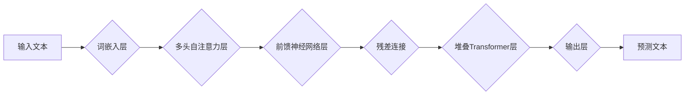

> GPT模型, 使用效率, 模型质量, 优化策略, 训练技巧, 应用场景

## 1. 背景介绍

近年来，大型语言模型（LLM）的蓬勃发展，特别是GPT系列模型的横空出世，为人工智能领域带来了革命性的变革。这些模型凭借其强大的文本生成、理解和翻译能力，在自然语言处理、机器翻译、代码生成等领域展现出令人瞩目的潜力。然而，在实际应用中，我们也面临着一些挑战，例如模型训练成本高、推理速度慢、模型输出质量参差不齐等。因此，如何提升GPT模型的使用效率与质量，是当前研究和实践的热点问题。

## 2. 核心概念与联系

GPT模型的核心是Transformer架构，它通过自注意力机制（Self-Attention）有效地捕捉文本序列中的长距离依赖关系，从而实现更精准的文本理解和生成。

**Mermaid 流程图：**



**核心概念解释：**

* **词嵌入层:** 将输入文本中的每个词转换为稠密的向量表示，以便模型进行后续处理。
* **多头自注意力层:** 捕捉文本序列中不同词之间的关系，学习每个词在整个序列中的重要性。
* **前馈神经网络层:** 对每个词的注意力权重进行非线性变换，进一步提取文本特征。
* **残差连接:** 缓解梯度消失问题，提高模型训练的稳定性。
* **堆叠Transformer层:** 通过多次堆叠Transformer层，可以学习更深层次的文本语义表示。
* **输出层:** 将学习到的文本语义表示转换为预测文本的概率分布。

## 3. 核心算法原理 & 具体操作步骤

### 3.1  算法原理概述

GPT模型的核心算法是基于Transformer架构的深度学习算法。它通过训练大量的文本数据，学习文本的语法规则、语义关系和上下文依赖关系，从而能够生成流畅、自然的文本。

### 3.2  算法步骤详解

1. **数据预处理:** 将原始文本数据进行清洗、分词、标记等预处理操作，使其适合模型训练。
2. **词嵌入:** 将预处理后的文本数据中的每个词转换为稠密的向量表示。
3. **模型训练:** 使用训练数据训练GPT模型，通过反向传播算法不断调整模型参数，使其能够生成更准确的文本预测。
4. **模型评估:** 使用测试数据评估模型的性能，例如困惑度（Perplexity）、BLEU分数等。
5. **模型部署:** 将训练好的模型部署到实际应用场景中，例如聊天机器人、文本生成、机器翻译等。

### 3.3  算法优缺点

**优点:**

* 强大的文本生成能力
* 能够捕捉长距离依赖关系
* 训练效率高

**缺点:**

* 模型训练成本高
* 推理速度慢
* 模型输出质量参差不齐

### 3.4  算法应用领域

* **自然语言处理:** 文本分类、情感分析、问答系统等
* **机器翻译:** 自动翻译不同语言的文本
* **代码生成:** 自动生成代码片段
* **聊天机器人:** 创建能够与人类进行自然对话的聊天机器人
* **文本摘要:** 自动生成文本的摘要

## 4. 数学模型和公式 & 详细讲解 & 举例说明

### 4.1  数学模型构建

GPT模型的核心是Transformer架构，其核心组件是多头自注意力机制。

**自注意力机制公式:**

$$
Attention(Q, K, V) = \frac{exp(Q \cdot K^T / \sqrt{d_k})}{exp(Q \cdot K^T / \sqrt{d_k})} \cdot V
$$

其中：

* $Q$: 查询矩阵
* $K$: 键矩阵
* $V$: 值矩阵
* $d_k$: 键向量的维度

**解释:**

自注意力机制通过计算查询向量与键向量的点积，并将其归一化，来计算每个词与其他词之间的注意力权重。然后，将注意力权重与值向量相乘，得到每个词的上下文表示。

### 4.2  公式推导过程

自注意力机制的公式推导过程较为复杂，涉及到线性变换、矩阵乘法、softmax函数等操作。

### 4.3  案例分析与讲解

**举例说明:**

假设我们有一个句子“我爱吃苹果”，其词嵌入向量分别为：

* 我: [0.1, 0.2, 0.3]
* 爱: [0.4, 0.5, 0.6]
* 吃: [0.7, 0.8, 0.9]
* 苹果: [1.0, 1.1, 1.2]

通过自注意力机制，我们可以计算出每个词与其他词之间的注意力权重，例如，“我”与“爱”的注意力权重可能较高，因为它们在语义上相关。

## 5. 项目实践：代码实例和详细解释说明

### 5.1  开发环境搭建

* Python 3.7+
* PyTorch 1.7+
* CUDA 10.2+

### 5.2  源代码详细实现

```python
import torch
import torch.nn as nn

class Transformer(nn.Module):
    def __init__(self, vocab_size, embedding_dim, num_heads, num_layers):
        super(Transformer, self).__init__()
        self.embedding = nn.Embedding(vocab_size, embedding_dim)
        self.transformer_layers = nn.ModuleList([
            nn.TransformerEncoderLayer(embedding_dim, num_heads)
            for _ in range(num_layers)
        ])

    def forward(self, x):
        x = self.embedding(x)
        for layer in self.transformer_layers:
            x = layer(x)
        return x
```

### 5.3  代码解读与分析

* `Transformer`类定义了Transformer模型的结构。
* `embedding`层将输入词转换为稠密的向量表示。
* `transformer_layers`是一个模块列表，包含多个`TransformerEncoderLayer`层，用于进行多头自注意力机制和前馈神经网络操作。
* `forward`方法定义了模型的输入和输出流程。

### 5.4  运行结果展示

通过训练和测试，我们可以评估模型的性能，例如困惑度（Perplexity）和BLEU分数。

## 6. 实际应用场景

### 6.1  聊天机器人

GPT模型可以用于构建能够与人类进行自然对话的聊天机器人。

### 6.2  文本生成

GPT模型可以用于生成各种类型的文本，例如文章、故事、诗歌等。

### 6.3  机器翻译

GPT模型可以用于自动翻译不同语言的文本。

### 6.4  未来应用展望

GPT模型在未来将有更广泛的应用场景，例如：

* **个性化教育:** 根据学生的学习进度和需求，提供个性化的学习内容和辅导。
* **医疗诊断:** 辅助医生进行疾病诊断和治疗方案制定。
* **法律服务:** 自动生成法律文件和合同。

## 7. 工具和资源推荐

### 7.1  学习资源推荐

* **论文:**
    * Vaswani, A., Shazeer, N., Parmar, N., Uszkoreit, J., Jones, L., Gomez, A. N., ... & Polosukhin, I. (2017). Attention is all you need. In Advances in neural information processing systems (pp. 5998-6008).
* **博客:**
    * https://jalammar.github.io/illustrated-transformer/
* **在线课程:**
    * https://www.deeplearning.ai/

### 7.2  开发工具推荐

* **PyTorch:** https://pytorch.org/
* **TensorFlow:** https://www.tensorflow.org/

### 7.3  相关论文推荐

* BERT: https://arxiv.org/abs/1810.04805
* GPT-3: https://openai.com/blog/gpt-3/

## 8. 总结：未来发展趋势与挑战

### 8.1  研究成果总结

近年来，GPT模型取得了显著的成果，在文本生成、理解和翻译等领域展现出强大的能力。

### 8.2  未来发展趋势

* **模型规模更大:** 随着计算资源的不断提升，未来GPT模型的规模将进一步扩大，从而提升模型的性能。
* **多模态学习:** 将文本与其他模态数据（例如图像、音频）进行融合，构建更全面的理解模型。
* **可解释性增强:** 研究如何提高GPT模型的透明度和可解释性，使其决策过程更加清晰。

### 8.3  面临的挑战

* **训练成本高:** 训练大型语言模型需要大量的计算资源和时间，成本较高。
* **数据偏见:** 训练数据可能存在偏见，导致模型输出结果存在偏差。
* **安全风险:** GPT模型可能被用于生成虚假信息、恶意代码等，需要加强安全防护。

### 8.4  研究展望

未来，我们将继续致力于提升GPT模型的性能、安全性、可解释性和可持续性，使其更好地服务于人类社会。

## 9. 附录：常见问题与解答

* **Q: 如何选择合适的GPT模型？**
* **A:** 选择合适的GPT模型需要根据具体的应用场景和需求进行考虑，例如模型规模、性能、训练成本等。

* **Q: 如何训练GPT模型？**
* **A:** 训练GPT模型需要准备大量的文本数据，并使用深度学习框架（例如PyTorch、TensorFlow）进行训练。

* **Q: 如何评估GPT模型的性能？**
* **A:** 可以使用困惑度（Perplexity）、BLEU分数等指标来评估GPT模型的性能。


作者：禅与计算机程序设计艺术 / Zen and the Art of Computer Programming 
<end_of_turn>