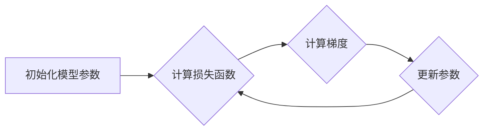

> 学习率、梯度下降、优化算法、深度学习、机器学习、神经网络、代码实例

## 1. 背景介绍

在深度学习领域，模型的训练过程本质上是一个参数优化过程。目标是找到一组参数，使得模型在给定数据集上的预测性能达到最佳。学习率作为深度学习训练过程中一个至关重要的超参数，直接影响着模型的收敛速度和最终性能。

学习率的本质是调整模型参数更新幅度的系数。在梯度下降算法中，学习率决定了沿着梯度方向更新参数的步长。如果学习率过大，模型可能会“跳过”最优解，导致训练不稳定甚至发散；如果学习率过小，模型更新速度缓慢，训练过程会变得非常耗时。

因此，选择合适的学习率对于深度学习模型的训练至关重要。

## 2. 核心概念与联系

### 2.1 梯度下降

梯度下降算法是深度学习中常用的优化算法，其核心思想是通过不断迭代更新模型参数，使得模型的损失函数逐渐减小。

梯度下降算法的步骤如下：

1. 初始化模型参数。
2. 计算模型在当前参数下的损失函数值。
3. 计算损失函数对每个参数的梯度。
4. 根据梯度方向和学习率更新每个参数的值。
5. 重复步骤2-4，直到损失函数达到最小值或满足其他停止条件。

### 2.2 学习率

学习率是梯度下降算法中的一个超参数，它控制着参数更新的步长。学习率过大可能会导致模型震荡甚至发散，而学习率过小会导致训练速度过慢。

### 2.3 优化算法

除了梯度下降算法，还有许多其他的优化算法，例如：

* **动量法 (Momentum)**：动量法通过引入动量项来加速梯度下降的收敛速度。
* **自适应学习率算法 (Adaptive Learning Rate)**：例如 Adam、RMSprop 等算法，可以根据每个参数的梯度信息自适应地调整学习率。

**Mermaid 流程图**



## 3. 核心算法原理 & 具体操作步骤

### 3.1 算法原理概述

梯度下降算法的核心原理是利用损失函数的梯度信息来更新模型参数，使得损失函数逐渐减小。

### 3.2 算法步骤详解

1. **初始化模型参数:** 随机初始化模型参数。
2. **计算损失函数:** 计算模型在当前参数下对训练数据的预测结果与真实值的误差，即损失函数值。
3. **计算梯度:** 计算损失函数对每个参数的偏导数，即梯度。梯度方向指示损失函数下降最快的方向。
4. **更新参数:** 根据梯度方向和学习率更新每个参数的值。更新公式如下：

```
参数 = 参数 - 学习率 * 梯度
```

5. **重复步骤2-4:** 重复以上步骤，直到损失函数达到最小值或满足其他停止条件。

### 3.3 算法优缺点

**优点:**

* 算法简单易懂，易于实现。
* 能够找到全局最优解，前提是损失函数是凸函数。

**缺点:**

* 训练速度较慢，尤其是在高维空间中。
* 容易陷入局部最优解。

### 3.4 算法应用领域

梯度下降算法广泛应用于深度学习、机器学习等领域，例如：

* **图像分类:** 使用卷积神经网络对图像进行分类。
* **自然语言处理:** 使用循环神经网络对文本进行分析和生成。
* **推荐系统:** 使用协同过滤算法对用户进行推荐。

## 4. 数学模型和公式 & 详细讲解 & 举例说明

### 4.1 数学模型构建

假设我们有一个模型 f(x; θ) ，其中 x 是输入数据， θ 是模型参数， f(x; θ) 是模型的输出。我们的目标是找到一组参数 θ，使得模型在给定数据集上的损失函数最小。

损失函数通常定义为模型预测值与真实值的误差。例如，对于回归问题，损失函数可以定义为均方误差 (MSE)：

$$
L(\theta) = \frac{1}{n} \sum_{i=1}^{n} (f(x_i; \theta) - y_i)^2
$$

其中 n 是训练样本的数量， x_i 是第 i 个样本的输入， y_i 是第 i 个样本的真实值。

### 4.2 公式推导过程

梯度下降算法的目标是找到损失函数的最小值，即找到 θ 的值，使得 L(θ) 最小。

为了找到最小值，我们需要计算损失函数对每个参数的梯度，并沿着梯度负方向更新参数。

梯度的计算公式如下：

$$
\frac{\partial L(\theta)}{\partial \theta_j} = \frac{1}{n} \sum_{i=1}^{n} 2(f(x_i; \theta) - y_i) \frac{\partial f(x_i; \theta)}{\partial \theta_j}
$$

其中 θ_j 是模型参数的第 j 个元素。

根据梯度信息，我们可以更新参数的值：

$$
\theta_j = \theta_j - \eta \frac{\partial L(\theta)}{\partial \theta_j}
$$

其中 η 是学习率。

### 4.3 案例分析与讲解

假设我们有一个简单的线性回归模型，模型的输出为：

$$
f(x; \theta) = \theta_0 + \theta_1 x
$$

其中 θ_0 和 θ_1 是模型参数。

我们的目标是找到 θ_0 和 θ_1 的值，使得模型在给定数据集上的损失函数最小。

我们可以使用梯度下降算法来实现这个目标。

首先，我们需要计算损失函数对 θ_0 和 θ_1 的梯度：

$$
\frac{\partial L(\theta)}{\partial \theta_0} = \frac{1}{n} \sum_{i=1}^{n} 2(f(x_i; \theta) - y_i)
$$

$$
\frac{\partial L(\theta)}{\partial \theta_1} = \frac{1}{n} \sum_{i=1}^{n} 2(f(x_i; \theta) - y_i) x_i
$$

然后，我们可以根据梯度信息更新 θ_0 和 θ_1 的值：

$$
\theta_0 = \theta_0 - \eta \frac{\partial L(\theta)}{\partial \theta_0}
$$

$$
\theta_1 = \theta_1 - \eta \frac{\partial L(\theta)}{\partial \theta_1}
$$

重复以上步骤，直到损失函数达到最小值。

## 5. 项目实践：代码实例和详细解释说明

### 5.1 开发环境搭建

* Python 3.6+
* TensorFlow 2.0+
* Jupyter Notebook

### 5.2 源代码详细实现

```python
import tensorflow as tf

# 定义模型
model = tf.keras.models.Sequential([
    tf.keras.layers.Dense(10, activation='relu', input_shape=(10,)),
    tf.keras.layers.Dense(1)
])

# 定义损失函数和优化器
loss_fn = tf.keras.losses.MeanSquaredError()
optimizer = tf.keras.optimizers.Adam(learning_rate=0.01)

# 训练模型
for epoch in range(100):
    for batch in dataset:
        with tf.GradientTape() as tape:
            predictions = model(batch)
            loss = loss_fn(batch, predictions)
        gradients = tape.gradient(loss, model.trainable_variables)
        optimizer.apply_gradients(zip(gradients, model.trainable_variables))
    print(f'Epoch {epoch+1}, Loss: {loss.numpy()}')
```

### 5.3 代码解读与分析

* **模型定义:** 使用 TensorFlow 的 Keras API 定义了一个简单的多层感知机模型。
* **损失函数和优化器:** 使用均方误差 (MSE) 作为损失函数，使用 Adam 优化器进行训练。
* **训练循环:** 训练模型 100 个 epoch，每个 epoch 遍历整个数据集。
* **梯度计算和参数更新:** 使用 TensorFlow 的 GradientTape 自动计算梯度，并使用 Adam 优化器更新模型参数。

### 5.4 运行结果展示

训练完成后，我们可以观察模型在测试数据集上的性能，例如准确率、损失值等。

## 6. 实际应用场景

学习率在深度学习的实际应用场景中扮演着至关重要的角色。

### 6.1 图像分类

在图像分类任务中，学习率的选择会直接影响模型的训练速度和准确率。

如果学习率过大，模型可能会过拟合训练数据，导致在测试数据上的性能下降。

如果学习率过小，模型的训练速度会变得非常缓慢。

### 6.2 自然语言处理

在自然语言处理任务中，例如机器翻译、文本摘要等，学习率的选择也会影响模型的性能。

对于大型语言模型，学习率通常需要进行更细致的调优。

### 6.3 其他应用场景

学习率在其他深度学习应用场景中也至关重要，例如推荐系统、语音识别、强化学习等。

### 6.4 未来应用展望

随着深度学习技术的不断发展，学习率的优化方法也会不断改进。

例如，自适应学习率算法可以根据每个参数的梯度信息自适应地调整学习率，从而提高训练效率和模型性能。

## 7. 工具和资源推荐

### 7.1 学习资源推荐

* **深度学习书籍:**
    * 《深度学习》 by Ian Goodfellow, Yoshua Bengio, and Aaron Courville
    * 《动手学深度学习》 by Aurélien Géron
* **在线课程:**
    * Coursera: Deep Learning Specialization
    * Udacity: Deep Learning Nanodegree

### 7.2 开发工具推荐

* **TensorFlow:** https://www.tensorflow.org/
* **PyTorch:** https://pytorch.org/
* **Keras:** https://keras.io/

### 7.3 相关论文推荐

* **Adam: A Method for Stochastic Optimization** by Diederik P. Kingma and Jimmy Ba
* **Momentum** by Paul S. R. D.

## 8. 总结：未来发展趋势与挑战

### 8.1 研究成果总结

学习率是深度学习训练中一个重要的超参数，其选择直接影响着模型的训练速度和性能。

梯度下降算法是深度学习中常用的优化算法，学习率是梯度下降算法中的一个关键参数。

### 8.2 未来发展趋势

未来，学习率优化方法将会更加智能化和自动化。

例如，基于强化学习的学习率优化算法，可以自动调整学习率，从而提高训练效率和模型性能。

### 8.3 面临的挑战

* 如何设计更有效的学习率优化算法，以适应不同类型的深度学习模型和数据集。
* 如何将学习率优化与其他深度学习技术，例如模型剪枝、知识蒸馏等，进行结合，以进一步提高模型性能。

### 8.4 研究展望

未来，学习率优化将是一个重要的研究方向，其研究成果将推动深度学习技术的进一步发展。

## 9. 附录：常见问题与解答

### 9.1 如何选择合适的学习率？

学习率的选择是一个经验性的过程，通常需要通过实验来确定。

一些常用的方法包括：

* **网格搜索:** 在一个预定义的范围内搜索学习率，并选择性能最好的学习率。
* **学习率衰减:** 在训练过程中逐渐减小学习率，以防止模型过拟合。
* **学习率调度:** 根据训练过程中的损失函数变化，动态调整学习率。

### 9.2 学习率