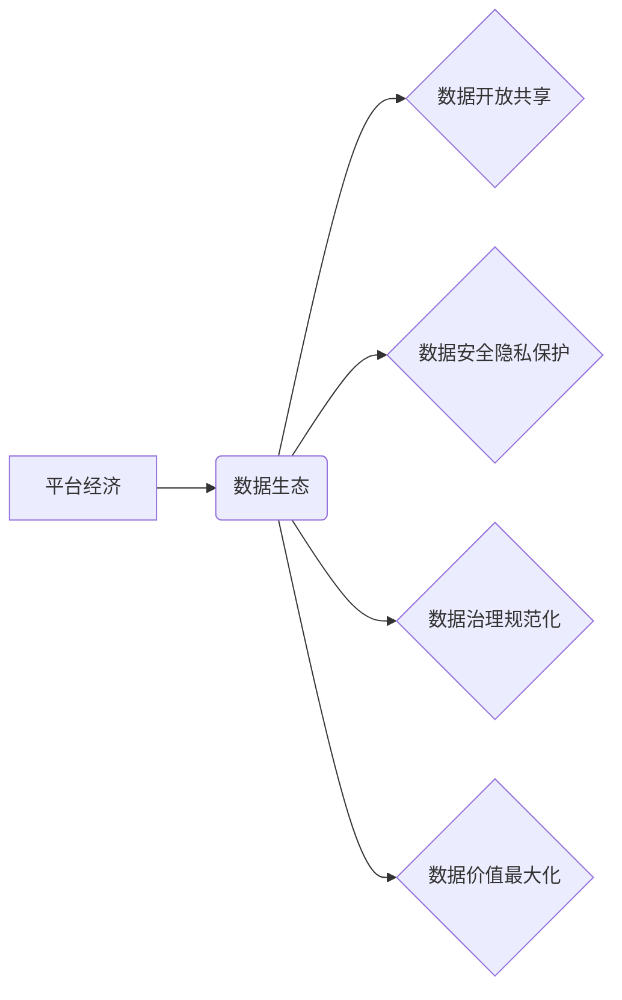

> 平台经济、数据生态、发展趋势、预测模型、机器学习、网络分析、数据治理

## 1. 背景介绍

平台经济作为一种新型的经济模式，以其连接用户、提供商和平台自身之间的价值交换而迅速崛起。其核心在于构建庞大的数据生态系统，通过数据收集、分析和应用，为平台和参与者创造价值。随着平台经济的蓬勃发展，数据生态的构建和管理已成为平台竞争的关键要素。

然而，数据生态的演进并非一帆风顺，其发展趋势受到多种因素的影响，包括技术进步、政策法规、用户行为等。准确预测数据生态的发展趋势对于平台方制定战略、优化运营和应对风险至关重要。

## 2. 核心概念与联系

**2.1 平台经济**

平台经济是指通过搭建线上平台，连接用户和提供商，并通过撮合交易、数据分析等方式创造价值的经济模式。

**2.2 数据生态**

数据生态是指围绕平台构建的，由数据主体、数据资源、数据服务和数据应用等要素组成的复杂系统。

**2.3 数据生态发展趋势**

* **数据开放共享:** 平台将逐步开放数据资源，鼓励第三方参与数据生态建设，促进数据价值的挖掘和应用。
* **数据安全隐私保护:** 数据安全和隐私保护将成为数据生态发展的关键保障，平台需要加强数据安全技术和管理体系建设。
* **数据治理规范化:** 数据治理标准和规范将逐步完善，推动数据生态的健康发展。
* **数据价值最大化:** 平台将通过数据分析和应用，挖掘数据价值，为用户和提供商创造更多价值。

**2.4 核心概念关系图**



## 3. 核心算法原理 & 具体操作步骤

**3.1 算法原理概述**

预测数据生态发展趋势需要结合多种算法和技术，例如机器学习、网络分析、时间序列分析等。

* **机器学习:** 可以用于分析历史数据，识别数据生态发展趋势的特征，并构建预测模型。
* **网络分析:** 可以用于分析数据生态中的节点和关系，识别关键节点和影响力，预测数据流向和生态演变。
* **时间序列分析:** 可以用于分析数据生态中时间序列数据，识别趋势、季节性变化和异常波动，预测未来发展趋势。

**3.2 算法步骤详解**

1. **数据收集:** 收集平台经济数据生态中的各种数据，包括用户行为数据、交易数据、平台运营数据等。
2. **数据预处理:** 对收集到的数据进行清洗、转换和格式化，使其适合算法模型的训练和预测。
3. **特征工程:** 从原始数据中提取特征，例如用户活跃度、交易频率、数据类型等，这些特征可以帮助算法模型更好地理解数据生态的结构和发展趋势。
4. **模型选择:** 根据数据特点和预测目标，选择合适的算法模型，例如回归模型、分类模型、聚类模型等。
5. **模型训练:** 使用训练数据训练选择的算法模型，调整模型参数，使其能够准确预测数据生态发展趋势。
6. **模型评估:** 使用测试数据评估模型的预测精度，并根据评估结果进行模型优化和调整。
7. **模型部署:** 将训练好的模型部署到生产环境中，实时预测数据生态发展趋势，并为平台方提供决策支持。

**3.3 算法优缺点**

* **优点:** 能够准确预测数据生态发展趋势，为平台方提供决策支持。
* **缺点:** 需要大量的数据和计算资源，模型训练和部署需要专业技术人员。

**3.4 算法应用领域**

* **平台运营优化:** 预测用户行为、交易趋势，优化平台运营策略。
* **数据产品开发:** 预测数据需求，开发符合市场需求的数据产品。
* **风险控制:** 预测数据安全风险，采取相应的防范措施。

## 4. 数学模型和公式 & 详细讲解 & 举例说明

**4.1 数学模型构建**

数据生态发展趋势预测模型可以构建为一个复杂系统，其中包含多个相互影响的因素。可以使用数学模型来描述这些因素之间的关系，并预测数据生态的未来发展趋势。

例如，可以构建一个基于用户行为和交易数据的预测模型，其中用户行为和交易数据作为输入变量，预测模型输出为未来数据生态发展趋势。

**4.2 公式推导过程**

具体的数学模型和公式推导过程取决于所选择的算法模型和数据特征。

例如，如果使用线性回归模型，则可以推导出以下公式：

$$
y = \beta_0 + \beta_1x_1 + \beta_2x_2 + ... + \beta_nx_n + \epsilon
$$

其中：

* $y$ 为预测变量，例如未来数据生态规模。
* $x_1, x_2, ..., x_n$ 为输入变量，例如用户活跃度、交易频率等。
* $\beta_0, \beta_1, ..., \beta_n$ 为模型参数，需要通过训练数据进行估计。
* $\epsilon$ 为随机误差项。

**4.3 案例分析与讲解**

假设我们想要预测电商平台的数据生态规模，可以构建一个基于用户活跃度和交易频率的线性回归模型。

通过训练数据，我们可以估计模型参数 $\beta_0, \beta_1, \beta_2$，然后使用这些参数和新的用户活跃度和交易频率数据，预测未来电商平台的数据生态规模。

## 5. 项目实践：代码实例和详细解释说明

**5.1 开发环境搭建**

* 操作系统：Windows/macOS/Linux
* Python 版本：3.6+
* 必要的库：pandas, numpy, scikit-learn, matplotlib

**5.2 源代码详细实现**

```python
import pandas as pd
from sklearn.linear_model import LinearRegression
from sklearn.model_selection import train_test_split
import matplotlib.pyplot as plt

# 加载数据
data = pd.read_csv('data.csv')

# 选择特征和目标变量
X = data[['user_active', 'transaction_frequency']]
y = data['data_scale']

# 将数据分为训练集和测试集
X_train, X_test, y_train, y_test = train_test_split(X, y, test_size=0.2, random_state=42)

# 创建线性回归模型
model = LinearRegression()

# 训练模型
model.fit(X_train, y_train)

# 预测测试集数据
y_pred = model.predict(X_test)

# 评估模型性能
from sklearn.metrics import mean_squared_error
mse = mean_squared_error(y_test, y_pred)
print(f'Mean Squared Error: {mse}')

# 可视化预测结果
plt.scatter(y_test, y_pred)
plt.xlabel('Actual Data Scale')
plt.ylabel('Predicted Data Scale')
plt.title('Data Scale Prediction')
plt.show()
```

**5.3 代码解读与分析**

* 代码首先加载数据，选择特征和目标变量。
* 然后将数据分为训练集和测试集，用于训练和评估模型。
* 创建线性回归模型，并使用训练数据进行训练。
* 使用训练好的模型预测测试集数据，并评估模型性能。
* 最后，可视化预测结果，观察模型的预测效果。

**5.4 运行结果展示**

运行代码后，会输出模型的均方误差值，以及预测结果的可视化图。

## 6. 实际应用场景

**6.1 用户行为预测**

平台可以利用数据生态发展趋势预测模型，预测用户的行为模式，例如用户购买倾向、浏览习惯等，从而提供个性化推荐和服务。

**6.2 交易趋势分析**

平台可以利用数据生态发展趋势预测模型，预测未来的交易趋势，例如商品热销程度、交易高峰期等，从而优化平台运营策略和资源配置。

**6.3 风险控制与预警**

平台可以利用数据生态发展趋势预测模型，预测潜在的风险，例如数据安全风险、用户投诉风险等，从而采取相应的防范措施和预警机制。

**6.4 未来应用展望**

随着数据生态的不断发展，数据生态发展趋势预测模型将应用于更广泛的领域，例如：

* **智能客服:** 利用用户行为预测模型，提供更智能、更精准的客服服务。
* **精准营销:** 利用用户画像和行为预测模型，进行精准营销，提高营销效果。
* **数据驱动决策:** 利用数据生态发展趋势预测模型，为平台决策提供数据支持。

## 7. 工具和资源推荐

**7.1 学习资源推荐**

* **书籍:**
    * 《数据挖掘：概念与技术》
    * 《机器学习》
    * 《Python数据科学手册》
* **在线课程:**
    * Coursera: 数据科学
    * edX: 机器学习
    * Udemy: Python数据分析

**7.2 开发工具推荐**

* **Python:** 强大的数据分析和机器学习编程语言。
* **pandas:** 数据分析和处理库。
* **scikit-learn:** 机器学习库。
* **matplotlib:** 数据可视化库。

**7.3 相关论文推荐**

* 《数据生态系统：概念、特征和发展趋势》
* 《基于机器学习的平台经济数据生态发展趋势预测模型》
* 《数据治理在平台经济中的作用》

## 8. 总结：未来发展趋势与挑战

**8.1 研究成果总结**

本文介绍了平台经济数据生态发展趋势预测模型的构建方法和应用场景，并提供了具体的代码实例和工具资源推荐。

**8.2 未来发展趋势**

* **模型精度提升:** 随着算法和数据量的不断提升，数据生态发展趋势预测模型的精度将不断提高。
* **模型应用场景扩展:** 数据生态发展趋势预测模型将应用于更多领域，例如智能客服、精准营销等。
* **数据治理加强:** 数据安全和隐私保护将成为数据生态发展的重要保障，数据治理标准和规范将逐步完善。

**8.3 面临的挑战**

* **数据质量问题:** 数据生态发展趋势预测模型的准确性依赖于数据质量，数据不完整、不准确等问题会影响模型的预测精度。
* **算法模型复杂性:** 一些数据生态发展趋势预测模型的算法模型比较复杂，需要专业的技术人员进行开发和维护。
* **伦理道德问题:** 数据生态发展趋势预测模型的应用可能会涉及到用户隐私和数据安全等伦理道德问题，需要谨慎对待。

**8.4 研究展望**

未来，我们将继续研究数据生态发展趋势预测模型的算法优化、应用场景拓展和伦理道德问题，推动数据生态的健康发展。

## 9. 附录：常见问题与解答

**9.1 如何选择合适的算法模型？**

选择合适的算法模型取决于数据特点和预测目标。例如，如果数据呈线性关系，可以使用线性回归模型；如果数据呈非线性关系，可以使用决策树模型或神经网络模型。

**9.2 如何处理数据质量问题？**

可以采用数据清洗、数据转换和数据填充等方法处理数据质量问题。

**9.3 如何评估模型性能？**

可以使用均方误差、R-squared等指标评估模型性能。

**9.4 数据生态发展趋势预测模型的应用有哪些伦理道德问题？**

数据生态发展趋势预测模型的应用可能会涉及到用户隐私和数据安全等伦理道德问题，例如：

* **数据泄露风险:** 如果模型训练数据包含敏感信息，可能会导致数据泄露风险。
* **算法偏见:** 如果模型训练数据存在偏见，可能会导致模型输出结果存在偏见。
* **用户隐私侵犯:** 如果模型用于预测用户行为，可能会侵犯用户的隐私。

因此，在应用数据生态发展趋势预测模型时，需要谨慎对待，并采取相应的措施保障用户隐私和