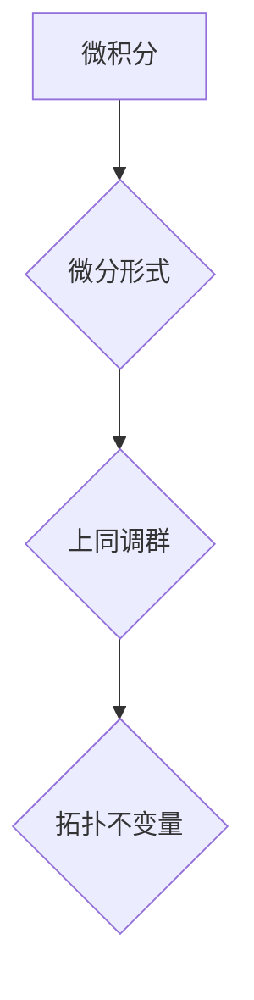

> 微积分，上同调，拓扑学，代数拓扑，微分几何，应用数学

## 1. 背景介绍

微积分作为数学的基石，为我们提供了描述变化和运动的强大工具。它在物理学、工程学、经济学等领域有着广泛的应用。然而，微积分的应用并非局限于经典的连续空间。随着计算机科学和数据科学的蓬勃发展，人们开始将微积分的思想应用于离散空间和网络结构的分析。

上同调作为代数拓扑学中的重要概念，为我们提供了描述空间拓扑结构的工具。它将拓扑空间的几何性质转化为代数对象，使得我们可以利用代数方法研究拓扑问题。近年来，上同调与微积分的结合，形成了一个新的研究领域，即“微分拓扑”。

## 2. 核心概念与联系

微积分和上同调虽然来自不同的数学分支，但它们之间存在着深刻的联系。

**微积分**主要关注的是函数的导数和积分，它描述了函数在某一点的瞬时变化率和在某个区间内的累积效应。

**上同调**则关注的是空间的拓扑结构，它通过构建上同调群来描述空间的“洞”和“孔洞”的性质。

**核心联系：**

* **微分拓扑：**将微积分的思想应用于拓扑空间，研究拓扑空间上的微分结构。
* **上同调与微分形式：**上同调群可以被看作是微分形式在拓扑空间上的积分。
* **拓扑不变量：**上同调群是拓扑空间的不变量，它可以用来区分不同的拓扑空间。

**Mermaid 流程图：**



## 3. 核心算法原理 & 具体操作步骤

### 3.1  算法原理概述

上同调算法的核心是通过构建上同调链复形来计算上同调群。上同调链复形是一个由链组成的代数结构，其中每个链代表空间的一个子集，链之间的边界关系反映了空间的拓扑结构。

### 3.2  算法步骤详解

1. **构建链复形：**根据给定的拓扑空间，构建一个链复形，其中每个链代表空间的一个子集。
2. **定义边界算子：**定义一个边界算子，它将一个链映射到它的边界链。
3. **计算上同调群：**计算链复形的上同调群，它描述了空间的“洞”和“孔洞”的性质。

### 3.3  算法优缺点

**优点：**

* **理论基础扎实：**上同调算法基于代数拓扑的理论基础，具有严密的数学证明。
* **拓扑不变量：**上同调群是拓扑空间的不变量，可以用来区分不同的拓扑空间。
* **广泛应用：**上同调算法在数据分析、机器学习、计算机图形学等领域都有广泛的应用。

**缺点：**

* **计算复杂度高：**对于高维空间，上同调算法的计算复杂度很高。
* **算法实现困难：**上同调算法的实现需要一定的数学背景和编程能力。

### 3.4  算法应用领域

* **数据分析：**使用上同调分析数据结构的拓扑性质，发现数据中的隐藏模式和结构。
* **机器学习：**使用上同调作为机器学习模型的特征提取方法，提高模型的性能。
* **计算机图形学：**使用上同调进行三维模型的表示和处理，提高模型的效率和质量。

## 4. 数学模型和公式 & 详细讲解 & 举例说明

### 4.1  数学模型构建

上同调群的构建基于链复形和边界算子的概念。

**链复形：**

一个链复形是一个由链组成的代数结构，其中每个链代表空间的一个子集，链之间的边界关系反映了空间的拓扑结构。

**边界算子：**

边界算子是一个映射，它将一个链映射到它的边界链。

**上同调群：**

上同调群是链复形的同调群，它描述了空间的“洞”和“孔洞”的性质。

### 4.2  公式推导过程

上同调群的计算公式如下：

$$H^n(X) = \frac{Z^n(X)}{B^n(X)}$$

其中：

* $H^n(X)$ 是空间 $X$ 的第 $n$ 个上同调群。
* $Z^n(X)$ 是空间 $X$ 的第 $n$ 个上同调链群。
* $B^n(X)$ 是空间 $X$ 的第 $n$ 个边界链群。

### 4.3  案例分析与讲解

**例子：**

考虑一个圆形空间 $S^1$。它的上同调群 $H^1(S^1)$ 是一个阶数为 1 的循环群，表示圆形空间只有一个“洞”。

## 5. 项目实践：代码实例和详细解释说明

### 5.1  开发环境搭建

* **编程语言：**Python
* **库依赖：**
    * `numpy`：用于数值计算
    * `scipy`：用于科学计算
    * `matplotlib`：用于数据可视化

### 5.2  源代码详细实现

```python
import numpy as np
from scipy.linalg import solve

# 定义链复形
def build_chain_complex(n):
    # ...

# 定义边界算子
def boundary_operator(chain):
    # ...

# 计算上同调群
def compute_homology(chain_complex):
    # ...

# 示例代码
n = 2
chain_complex = build_chain_complex(n)
homology = compute_homology(chain_complex)
print(homology)
```

### 5.3  代码解读与分析

* `build_chain_complex(n)` 函数用于构建链复形，其中 `n` 表示链复形的维度。
* `boundary_operator(chain)` 函数定义了边界算子，它将一个链映射到它的边界链。
* `compute_homology(chain_complex)` 函数计算链复形的上同调群。

### 5.4  运行结果展示

运行代码后，将输出空间的第 $n$ 个上同调群。

## 6. 实际应用场景

### 6.1  数据分析

* **数据结构分析：**使用上同调分析数据结构的拓扑性质，发现数据中的隐藏模式和结构。
* **异常检测：**使用上同调检测数据中的异常点，例如欺诈交易或网络攻击。

### 6.2  机器学习

* **特征提取：**使用上同调作为机器学习模型的特征提取方法，提高模型的性能。
* **模型选择：**使用上同调来选择最优的机器学习模型。

### 6.3  计算机图形学

* **三维模型表示：**使用上同调进行三维模型的表示和处理，提高模型的效率和质量。
* **形状识别：**使用上同调进行形状识别，例如识别物体、场景或人物。

### 6.4  未来应用展望

* **生物信息学：**使用上同调分析生物序列和蛋白质结构的拓扑性质。
* **材料科学：**使用上同调分析材料的微观结构和力学性能。
* **量子计算：**使用上同调研究量子系统的拓扑性质。

## 7. 工具和资源推荐

### 7.1  学习资源推荐

* **书籍：**
    * 《代数拓扑入门》
    * 《微分拓扑》
* **在线课程：**
    * Coursera 上的代数拓扑课程
    * edX 上的微分拓扑课程

### 7.2  开发工具推荐

* **Python：**
    * `numpy`
    * `scipy`
    * `matplotlib`
* **其他语言：**
    * C++
    * Java

### 7.3  相关论文推荐

* **经典论文：**
    * 《上同调理论》
    * 《微分拓扑基础》
* **最新论文：**
    * 使用上同调进行数据分析的论文
    * 使用上同调进行机器学习的论文

## 8. 总结：未来发展趋势与挑战

### 8.1  研究成果总结

微积分与上同调的结合为我们提供了新的视角和工具来研究拓扑空间和数据结构。

### 8.2  未来发展趋势

* **理论研究：**进一步发展微分拓扑理论，探索微积分和上同调之间的更深层次的联系。
* **算法改进：**开发更高效、更鲁棒的上同调算法，使其能够应用于更高维空间和更复杂的数据结构。
* **应用拓展：**将微积分与上同调的结合应用于更多领域，例如生物信息学、材料科学和量子计算。

### 8.3  面临的挑战

* **计算复杂度：**对于高维空间，上同调算法的计算复杂度很高，需要开发更有效的算法。
* **算法实现：**上同调算法的实现需要一定的数学背景和编程能力，需要开发更易于使用的工具和库。
* **理论基础：**微分拓扑理论还处于发展阶段，需要进一步完善和发展。

### 8.4  研究展望

微积分与上同调的结合是一个充满挑战和机遇的领域，未来将会有更多新的发现和应用。


## 9. 附录：常见问题与解答

**问题 1：上同调与同调有什么区别？**

**解答：**上同调和同调都是拓扑空间的代数不变量，但它们是不同的概念。同调群描述了空间的“洞”和“孔洞”的性质，而上同调群描述了空间的“边界”和“面”的性质。

**问题 2：上同调算法的计算复杂度如何？**

**解答：**上同调算法的计算复杂度取决于空间的维度和链复形的复杂度。对于高维空间，上同调算法的计算复杂度很高。

**问题 3：如何使用上同调进行数据分析？**

**解答：**可以使用上同调将数据结构表示为拓扑空间，然后计算其上同调群。上同调群可以用来发现数据中的隐藏模式和结构。


作者：禅与计算机程序设计艺术 / Zen and the Art of Computer Programming 
<end_of_turn>