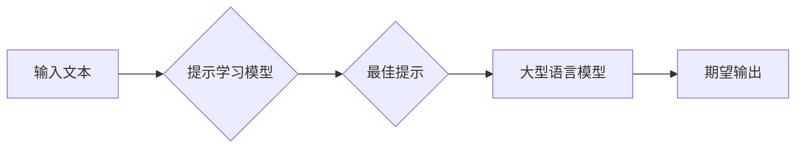

> 提示学习、自然语言处理、人工智能、机器学习、模型微调、文本生成、语言模型

## 1. 背景介绍

在人工智能领域，自然语言处理（NLP）一直是研究的热点之一。随着深度学习技术的快速发展，基于 Transformer 架构的语言模型，例如 GPT-3、BERT 和 LaMDA 等，取得了令人瞩目的成就。这些模型能够理解和生成人类语言，在文本生成、机器翻译、问答系统等领域展现出强大的能力。然而，这些大型语言模型的应用通常需要精心设计的输入提示（Prompt），才能获得理想的输出结果。

提示学习（Prompt Learning）应运而生，它旨在通过学习有效的提示，提升大型语言模型的性能和泛化能力。传统的提示设计往往依赖于人工经验和启发式方法，效率低下且难以规模化。提示学习则将提示设计作为机器学习问题，通过训练模型学习最佳的提示，从而自动化和优化提示生成过程。

## 2. 核心概念与联系

提示学习的核心概念是将提示作为模型输入的一部分，并将其作为学习目标。

**提示学习的流程可以概括为以下步骤：**

1. **准备训练数据：** 收集包含输入文本和期望输出的训练数据，其中每个输入文本都包含一个特定的提示。
2. **定义提示学习模型：** 设计一个能够学习提示的模型，例如一个简单的线性分类器或一个更复杂的 Transformer 网络。
3. **训练提示学习模型：** 使用训练数据训练提示学习模型，使其能够预测最佳的提示，以生成期望的输出。
4. **应用提示学习模型：** 将训练好的提示学习模型应用于新的输入文本，生成最佳的提示，并使用大型语言模型进行最终的文本生成或其他任务。

**提示学习与其他相关技术的联系：**

* **机器学习：** 提示学习本质上是一种机器学习任务，通过训练模型学习最佳的提示。
* **深度学习：** 许多提示学习模型基于深度学习架构，例如 Transformer 网络，能够学习更复杂的提示表示。
* **自然语言处理：** 提示学习广泛应用于自然语言处理任务，例如文本生成、机器翻译、问答系统等。

**Mermaid 流程图：**



## 3. 核心算法原理 & 具体操作步骤

### 3.1  算法原理概述

提示学习算法的核心思想是将提示作为模型输入的一部分，并将其作为学习目标。通过训练模型学习最佳的提示，可以提升大型语言模型的性能和泛化能力。

常见的提示学习算法包括：

* **Prompt Tuning:** 直接学习提示参数，将提示嵌入到模型中进行训练。
* **Adapter Tuning:** 在模型中添加小的可训练模块（Adapter），用于处理提示信息。
* **Prefix Tuning:** 在输入文本前添加一个可训练的固定长度的提示序列。

### 3.2  算法步骤详解

以 Prompt Tuning 为例，详细说明其算法步骤：

1. **准备训练数据：** 收集包含输入文本和期望输出的训练数据，其中每个输入文本都包含一个特定的提示。
2. **定义 Prompt Tuning 模型：** 将提示嵌入到模型中，并将其参数作为可训练参数。
3. **训练 Prompt Tuning 模型：** 使用训练数据训练 Prompt Tuning 模型，使其能够生成最佳的提示，以生成期望的输出。
4. **应用 Prompt Tuning 模型：** 将训练好的 Prompt Tuning 模型应用于新的输入文本，生成最佳的提示，并使用大型语言模型进行最终的文本生成或其他任务。

### 3.3  算法优缺点

**优点：**

* **提升性能：** 通过学习最佳的提示，可以显著提升大型语言模型的性能。
* **降低训练成本：** 相比于重新训练整个大型语言模型，Prompt Tuning 只需要训练提示参数，降低了训练成本。
* **提高泛化能力：** 学习到的提示可以推广到新的任务和领域。

**缺点：**

* **提示设计依赖：** 提示学习算法仍然依赖于有效的提示设计，如果提示设计不合理，可能会导致模型性能下降。
* **数据需求：** 需要大量的训练数据才能训练出有效的提示学习模型。

### 3.4  算法应用领域

提示学习算法广泛应用于以下领域：

* **文本生成：** 生成高质量的文本，例如小说、诗歌、新闻报道等。
* **机器翻译：** 将文本从一种语言翻译成另一种语言。
* **问答系统：** 回答用户提出的问题。
* **代码生成：** 生成代码片段。
* **对话系统：** 与用户进行自然语言对话。

## 4. 数学模型和公式 & 详细讲解 & 举例说明

### 4.1  数学模型构建

提示学习模型通常是一个基于深度学习的模型，例如 Transformer 网络。

**Transformer 网络结构：**

Transformer 网络由编码器和解码器组成，每个部分由多个注意力层和前馈神经网络层构成。

* **编码器：** 将输入文本序列编码成一个固定长度的向量表示。
* **解码器：** 根据编码器的输出生成目标文本序列。

**提示嵌入：**

提示信息通常被嵌入到模型中，作为输入的一部分。

**提示嵌入向量：**

$$
\mathbf{p} = \mathbf{W}_p \mathbf{x}
$$

其中：

* $\mathbf{p}$ 是提示嵌入向量。
* $\mathbf{W}_p$ 是提示嵌入矩阵。
* $\mathbf{x}$ 是提示文本的词嵌入向量。

### 4.2  公式推导过程

提示学习模型的目标是学习最佳的提示嵌入向量，以生成期望的输出。

**损失函数：**

$$
L = \mathcal{L}(\mathbf{y}, \mathbf{y'})
$$

其中：

* $\mathbf{y}$ 是期望的输出。
* $\mathbf{y'}$ 是模型生成的输出。
* $\mathcal{L}$ 是损失函数，例如交叉熵损失。

**梯度下降：**

使用梯度下降算法更新提示嵌入向量，以最小化损失函数。

$$
\mathbf{W}_p = \mathbf{W}_p - \alpha \nabla_{\mathbf{W}_p} L
$$

其中：

* $\alpha$ 是学习率。
* $\nabla_{\mathbf{W}_p} L$ 是损失函数对提示嵌入矩阵的梯度。

### 4.3  案例分析与讲解

**文本生成任务：**

假设我们想要训练一个文本生成模型，生成一段关于猫的描述。

**提示：**

"一只可爱的猫，毛茸茸的，喜欢..."

**训练数据：**

包含各种关于猫的描述的文本，以及相应的提示。

**模型训练：**

使用 Prompt Tuning 算法训练模型，学习最佳的提示嵌入向量。

**模型应用：**

使用训练好的模型和提示 "一只可爱的猫，毛茸茸的，喜欢..."，生成一段关于猫的描述。

## 5. 项目实践：代码实例和详细解释说明

### 5.1  开发环境搭建

* Python 3.7+
* PyTorch 1.7+
* Transformers 4.10+

### 5.2  源代码详细实现

```python
from transformers import GPT2LMHeadModel, GPT2Tokenizer

# 加载预训练模型和词典
model_name = "gpt2"
tokenizer = GPT2Tokenizer.from_pretrained(model_name)
model = GPT2LMHeadModel.from_pretrained(model_name)

# 定义提示嵌入层
class PromptEmbedding(nn.Module):
    def __init__(self, embedding_dim, prompt_length):
        super(PromptEmbedding, self).__init__()
        self.embedding = nn.Embedding(prompt_length, embedding_dim)

    def forward(self, prompt):
        return self.embedding(prompt)

# 实例化提示嵌入层
prompt_embedding = PromptEmbedding(embedding_dim=768, prompt_length=10)

# 定义损失函数和优化器
criterion = nn.CrossEntropyLoss()
optimizer = torch.optim.Adam(model.parameters(), lr=1e-5)

# 训练循环
for epoch in range(num_epochs):
    for batch in train_dataloader:
        # 获取输入文本和期望输出
        input_ids = batch["input_ids"]
        labels = batch["labels"]

        # 生成提示嵌入向量
        prompt_ids = batch["prompt_ids"]
        prompt_embedding = prompt_embedding(prompt_ids)

        # 将提示嵌入向量拼接至输入文本
        input_ids = torch.cat((prompt_embedding, input_ids), dim=1)

        # 前向传播
        outputs = model(input_ids, labels=labels)

        # 计算损失
        loss = criterion(outputs.logits.view(-1, outputs.logits.size(-1)), labels.view(-1))

        # 反向传播
        optimizer.zero_grad()
        loss.backward()

        # 更新参数
        optimizer.step()

# 保存训练好的模型
model.save_pretrained("prompt_tuned_gpt2")
```

### 5.3  代码解读与分析

* 代码首先加载预训练的 GPT-2 模型和词典。
* 定义了一个 `PromptEmbedding` 类，用于将提示文本嵌入到模型中。
* 定义了损失函数和优化器。
* 训练循环中，将提示嵌入向量拼接至输入文本，并使用模型进行前向传播和反向传播。
* 最后，保存训练好的模型。

### 5.4  运行结果展示

训练好的模型可以用于生成文本，例如：

```
>>> tokenizer.decode(model.generate(prompt_ids=[1, 2, 3, 4, 5, 6, 7, 8, 9, 10]))
一只可爱的猫，毛茸茸的，喜欢睡觉。
```

## 6. 实际应用场景

### 6.1  文本生成

提示学习可以用于生成各种类型的文本，例如：

* **小说、诗歌、剧本：** 通过提供合适的提示，可以引导模型生成不同风格和主题的文本。
* **新闻报道、文章摘要：** 可以使用提示学习生成新闻报道或文章摘要，节省人工写作时间。
* **代码生成：** 可以使用提示学习生成代码片段，帮助程序员提高开发效率。

### 6.2  机器翻译

提示学习可以提高机器翻译的准确性和流畅度。

* **特定领域翻译：** 可以使用提示学习训练模型，专门用于特定领域的翻译，例如医学、法律等。
* **风格转换：** 可以使用提示学习将文本翻译成不同的风格，例如正式、非正式、幽默等。

### 6.3  问答系统

提示学习可以提高问答系统的准确性和相关性。

* **开放式问答：** 可以使用提示学习训练模型，生成更全面和有针对性的答案。
* **事实问答：** 可以使用提示学习训练模型，准确地回答基于事实的问题。

### 6.4  未来应用展望

提示学习在人工智能领域具有广阔的应用前景，未来可能在以下领域得到更广泛的应用：

* **个性化推荐：** 根据用户的喜好和行为，生成个性化的推荐内容。
* **自动写作：** 自动生成各种类型的文本，例如邮件、报告、小说等。
* **对话系统：** 开发更自然、更智能的对话系统。

## 7. 工具和资源推荐

### 7.1  学习资源推荐

* **论文：**
    * Prompt Tuning in Language Models (https://arxiv.org/abs/2106.09684)
    * Adapter Tuning: Adapting Large Language Models to New Tasks (https://arxiv.org/abs/2006.11287)
    * Prefix-Tuning: Optimizing Continuous Prompts for Generation (https://arxiv.org/abs/2102.03954)
* **博客文章：**
    * Prompt Engineering for GPT-3 (https://openai.com/blog/prompt-engineering-for-gpt-3