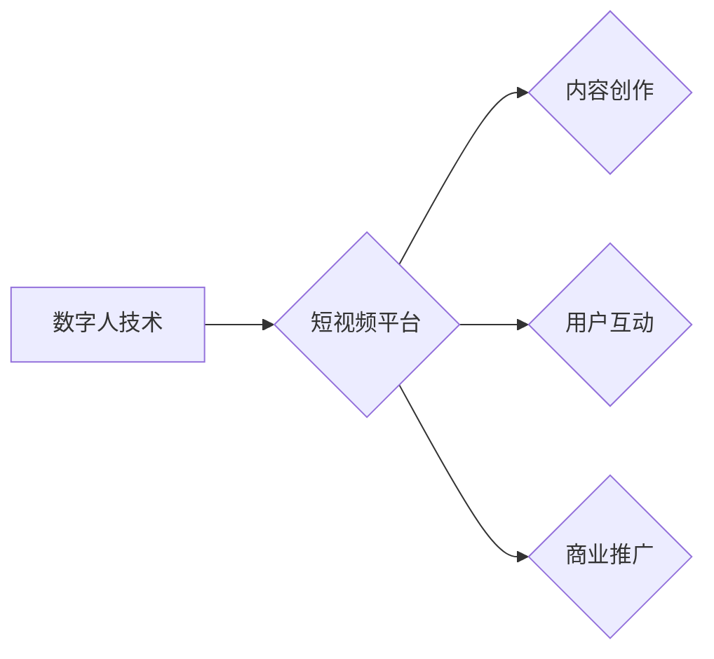

> 数字人、短视频、人工智能、计算机视觉、自然语言处理、虚拟主播、内容创作

## 1. 背景介绍

短视频作为一种新兴的传播媒介，其内容形式丰富、传播速度快、用户粘性强，已成为当今互联网领域最热门的应用之一。随着技术的不断发展，数字人技术逐渐成熟，并开始在短视频领域得到广泛应用。数字人是指利用计算机技术模拟真实人类形象和行为的虚拟角色，其具备逼真的外形、流畅的肢体动作和自然的语言表达能力。

数字人技术在短视频领域的应用，能够为内容创作、用户互动和商业推广等方面带来诸多创新和突破。例如，数字人可以作为虚拟主播，进行实时直播和互动；可以扮演各种角色，创作不同类型的短视频内容；还可以与用户进行个性化互动，提升用户体验。

## 2. 核心概念与联系

### 2.1 数字人技术

数字人技术是将计算机图形学、人工智能、虚拟现实等多项技术融合在一起，构建出逼真、交互式的虚拟角色。其核心包含以下几个方面：

* **3D建模:** 利用3D建模软件，构建数字人的外形模型，包括面部、身体、服装等。
* **动画制作:** 为数字人赋予动作和表情，使其能够自然地进行肢体运动和情感表达。
* **语音合成:** 利用语音合成技术，为数字人生成逼真的语音，使其能够进行对话和表达情感。
* **自然语言处理:** 赋予数字人理解和响应用户语言的能力，使其能够进行自然流畅的对话。

### 2.2 短视频平台

短视频平台是指专门用于发布、分享和观看短视频的互联网平台。其特点是内容短小精悍、传播速度快、用户粘性强。常见的短视频平台包括抖音、快手、B站等。

### 2.3 数字人与短视频的联系

数字人技术与短视频平台的结合，能够为短视频内容创作、用户互动和商业推广等方面带来新的可能性。

**Mermaid 流程图**



## 3. 核心算法原理 & 具体操作步骤

### 3.1 算法原理概述

数字人技术在短视频中的应用，主要依赖于以下核心算法：

* **3D建模算法:** 用于构建数字人的外形模型，常用的算法包括 polygon mesh modeling、subdivision surface modeling 等。
* **动画生成算法:** 用于赋予数字人动作和表情，常用的算法包括 motion capture、keyframe animation、physics-based animation 等。
* **语音合成算法:** 用于生成数字人的语音，常用的算法包括 text-to-speech (TTS) 和 voice cloning。
* **自然语言处理算法:** 用于理解和响应用户的语言输入，常用的算法包括 intent recognition、entity extraction、dialogue management 等。

### 3.2 算法步骤详解

**数字人建模步骤:**

1. **数据采集:** 收集真人面部、身体等数据，包括照片、视频、3D扫描等。
2. **特征提取:** 从采集的数据中提取关键特征，例如面部轮廓、身体比例、纹理细节等。
3. **模型构建:** 利用提取的特征，构建数字人的3D模型，可以使用 polygon mesh modeling、subdivision surface modeling 等算法。
4. **纹理贴图:** 为数字人的模型添加纹理贴图，使其更加逼真。

**数字人动画生成步骤:**

1. **动作捕捉:** 利用动作捕捉设备，记录真人动作数据。
2. **动作编辑:** 对动作捕捉数据进行编辑和优化，使其更加流畅自然。
3. **动画渲染:** 将编辑后的动作数据应用于数字人的模型，生成动画效果。

**语音合成步骤:**

1. **文本预处理:** 对输入的文本进行预处理，例如分词、词性标注等。
2. **语音合成:** 利用语音合成模型，将预处理后的文本转换为语音。
3. **语音后处理:** 对合成语音进行后处理，例如去噪、均衡等，使其更加自然流畅。

### 3.3 算法优缺点

**优点:**

* **逼真度高:** 数字人技术能够模拟出逼真的外形、动作和语音，能够更好地与用户互动。
* **可定制性强:** 数字人的外形、性格、技能等都可以根据需求进行定制，能够满足不同的应用场景。
* **成本效益高:** 相比于真人演员，数字人能够节省人力成本和时间成本。

**缺点:**

* **技术难度高:** 数字人技术涉及多个领域，技术难度较高，需要专业的技术团队进行开发。
* **成本投入大:** 数字人建模、动画制作、语音合成等环节都需要投入大量的资金和资源。
* **伦理问题:** 数字人技术的应用可能会引发一些伦理问题，例如虚假信息传播、隐私泄露等。

### 3.4 算法应用领域

数字人技术在短视频领域的应用，主要包括以下几个方面：

* **虚拟主播:** 数字人可以作为虚拟主播，进行实时直播和互动，例如游戏直播、音乐直播、知识分享等。
* **角色扮演:** 数字人可以扮演各种角色，创作不同类型的短视频内容，例如剧情类、搞笑类、教育类等。
* **个性化互动:** 数字人可以根据用户的喜好和行为，进行个性化互动，例如推荐视频、提供咨询服务等。

## 4. 数学模型和公式 & 详细讲解 & 举例说明

### 4.1 数学模型构建

数字人技术的核心算法中，涉及到大量的数学模型，例如3D建模、动画生成、语音合成等。

**3D建模:**

* **B-样条曲线:** 用于描述曲线的形状，其数学表达式为：

$$
P(t) = \sum_{i=0}^{n} B_i(t) * P_i
$$

其中，$P(t)$ 是曲线上的点，$B_i(t)$ 是 B-样条基函数，$P_i$ 是控制点。

* **NURBS曲面:** 用于描述曲面的形状，其数学表达式为：

$$
S(u,v) = \frac{\sum_{i=0}^{n} \sum_{j=0}^{m} N_i(u) * N_j(v) * P_{ij}}{\sum_{i=0}^{n} \sum_{j=0}^{m} N_i(u) * N_j(v)}
$$

其中，$S(u,v)$ 是曲面上的点，$N_i(u)$ 和 $N_j(v)$ 是 NURBS 基函数，$P_{ij}$ 是控制点。

**动画生成:**

* **关键帧动画:** 利用关键帧来控制角色的动作，关键帧之间可以通过插值算法进行平滑。

**语音合成:**

* **声学模型:** 用于预测语音信号的声学特征，常用的模型包括隐马尔可夫模型 (HMM) 和深度神经网络 (DNN)。

### 4.2 公式推导过程

由于篇幅限制，这里只列举了部分数学模型的表达式，详细的推导过程可以参考相关文献。

### 4.3 案例分析与讲解

可以结合具体的案例，例如数字人虚拟主播的语音合成，讲解数学模型在实际应用中的作用。

## 5. 项目实践：代码实例和详细解释说明

### 5.1 开发环境搭建

* 操作系统: Windows/macOS/Linux
* 编程语言: Python
* 必要的库: TensorFlow/PyTorch、OpenCV、PyAudio等

### 5.2 源代码详细实现

由于篇幅限制，这里只提供部分代码示例，完整的代码可以参考开源项目或相关文献。

**数字人语音合成代码示例 (使用 TensorFlow)**

```python
import tensorflow as tf

# 加载预训练的语音合成模型
model = tf.keras.models.load_model('voice_synthesis_model.h5')

# 输入文本
text = "你好，世界！"

# 将文本转换为语音信号
audio_signal = model.predict(text)

# 保存语音信号
tf.io.write_file('output.wav', audio_signal)
```

### 5.3 代码解读与分析

* 代码首先加载预训练的语音合成模型。
* 然后输入需要合成的文本。
* 模型将文本转换为语音信号。
* 最后将语音信号保存为 WAV 文件。

### 5.4 运行结果展示

运行代码后，将生成一个名为 "output.wav" 的语音文件，包含输入文本的语音合成结果。

## 6. 实际应用场景

### 6.1 数字人虚拟主播

数字人虚拟主播可以用于直播游戏、音乐、知识分享等内容，其优势在于：

* **24小时在线:** 数字人可以随时随地进行直播，不受时间和地域限制。
* **个性化定制:** 数字人的外形、性格、技能等都可以根据需求进行定制，满足不同的直播场景。
* **成本效益高:** 相比于真人主播，数字人能够节省人力成本和时间成本。

### 6.2 数字人角色扮演

数字人可以扮演各种角色，创作不同类型的短视频内容，例如剧情类、搞笑类、教育类等。其优势在于：

* **创意无限:** 数字人可以扮演各种角色，创作出更加丰富多彩的短视频内容。
* **成本低廉:** 数字人不需要真人演员，可以节省制作成本。
* **可重复利用:** 数字人角色可以重复利用，提高内容生产效率。

### 6.3 数字人互动营销

数字人可以与用户进行互动，例如回答问题、提供咨询服务、进行游戏互动等，其优势在于：

* **提升用户粘性:** 数字人可以与用户进行个性化互动，提升用户粘性。
* **提高品牌知名度:** 数字人可以作为品牌代言人，提升品牌知名度。
* **促进产品销售:** 数字人可以与用户进行互动营销，促进产品销售。

### 6.4 未来应用展望

数字人技术在短视频领域的应用前景广阔，未来可能会出现以下应用场景：

* **沉浸式体验:** 数字人可以与用户进行更加沉浸式的互动，例如虚拟旅游、虚拟购物等。
* **个性化内容推荐:** 数字人可以根据用户的喜好和行为，推荐更加个性化的短视频内容。
* **虚拟社交:** 数字人可以作为虚拟社交伙伴，与用户进行交流和互动。

## 7. 工具和资源推荐

### 7.1 学习资源推荐

* **书籍:**
    * 《数字人技术》
    * 《人工智能》
    * 《计算机图形学》
* **在线课程:**
    * Coursera: 人工智能、计算机视觉、自然语言处理
    * edX: 数字人技术、虚拟现实

### 7.2 开发工具推荐

* **3D建模软件:** Blender、Maya、3ds Max
* **动画制作软件:** Adobe After Effects、Autodesk MotionBuilder
* **语音合成工具:** Google Cloud Text-to-Speech、Amazon Polly
* **自然语言处理库:** NLTK、spaCy、Hugging Face Transformers

### 7.3 相关论文推荐

* **数字人技术:**
    * "A Survey of Digital Human Technologies"
    * "Towards Realistic Digital Humans: A Review of Recent Advances"
* **短视频技术:**
    * "Short Video Content Analysis: A Survey"
    * "Deep Learning for Short Video Understanding"

## 8. 总结：未来发展趋势与挑战

### 8.1 研究成果总结

数字人技术在短视频领域的应用取得了显著的成果，例如虚拟主播、角色扮演、互动营销等应用场景已经得到广泛应用。

### 8.2 未来发展趋势

* **更加逼真的数字人:** 未来数字人技术将会更加逼真，能够更好地模拟人类的外形、动作和语音。
* **更加智能的数字人:** 未来数字人将会更加智能，能够更好地理解和响应用户的需求。
* **更加广泛的应用场景:** 未来数字人技术将会应用于更加广泛的场景，例如教育、医疗、娱乐等。

### 8.3 面临的挑战

* **技术难题:** 数字人技术的开发仍然面临着一些