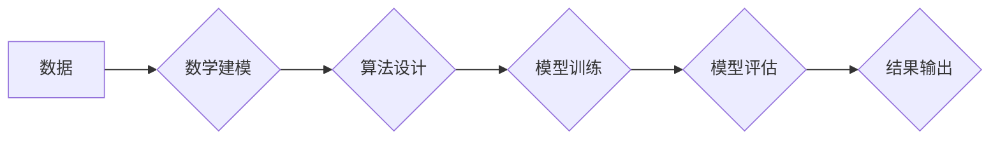

>人工智能 (AI)
>机器学习 (ML)
>深度学习 (DL)
>数学基础
>算法
>模型

## 1. 背景介绍

人工智能 (AI) 作为科技发展前沿领域，近年来取得了令人瞩目的进展。从语音识别、图像识别到自然语言处理，AI 正在深刻地改变着我们的生活。然而，支撑 AI 发展和进步的根本力量是扎实的数学基础。

传统的编程方法依赖于明确的指令和逻辑规则，而 AI 的核心在于学习和推理。机器学习 (ML) 和深度学习 (DL) 等 AI 技术，本质上是基于数学模型和算法的。这些模型和算法通过对海量数据进行分析和学习，能够自动发现模式、规律和知识，从而实现智能化决策和行为。

## 2. 核心概念与联系

**2.1 数学基础在 AI 中的作用**

* **数据建模:** 数学工具为 AI 提供了描述和建模数据的框架。例如，线性代数用于表示数据矩阵，概率论和统计学用于分析数据分布和关系。
* **算法设计:** AI 算法的核心是数学公式和逻辑推理。例如，梯度下降算法利用微积分原理来优化模型参数。
* **模型评估:** 数学指标和统计方法用于评估 AI 模型的性能和准确性。例如，准确率、召回率和 F1-score 等指标用于衡量分类模型的性能。

**2.2 AI 与数学的相互促进**

AI 的发展也反过来推动了数学研究的进步。例如，深度学习的出现促进了非线性代数、凸优化和概率论等领域的深入研究。

**Mermaid 流程图**



## 3. 核心算法原理 & 具体操作步骤

**3.1 算法原理概述**

梯度下降算法是机器学习中常用的优化算法，用于训练机器学习模型。其核心思想是通过不断迭代地调整模型参数，使得模型的损失函数最小化。

**3.2 算法步骤详解**

1. **初始化模型参数:** 随机初始化模型参数。
2. **计算损失函数:** 使用训练数据计算模型的损失函数值。
3. **计算梯度:** 计算损失函数对模型参数的梯度。梯度表示损失函数变化的方向和幅度。
4. **更新模型参数:** 根据梯度方向和学习率，更新模型参数。学习率控制了参数更新的步长。
5. **重复步骤 2-4:** 重复上述步骤，直到损失函数收敛到最小值或达到最大迭代次数。

**3.3 算法优缺点**

* **优点:** 
    * 算法简单易懂，易于实现。
    * 能够有效地找到损失函数的局部最小值。
* **缺点:** 
    * 容易陷入局部最小值，无法找到全局最优解。
    * 对于高维数据，梯度下降算法可能收敛速度慢。

**3.4 算法应用领域**

梯度下降算法广泛应用于各种机器学习任务，例如：

* **线性回归:** 预测连续数值。
* **逻辑回归:** 分类问题。
* **神经网络:** 复杂模式识别和决策。

## 4. 数学模型和公式 & 详细讲解 & 举例说明

**4.1 数学模型构建**

在机器学习中，模型通常表示为一个函数，该函数将输入数据映射到输出结果。例如，线性回归模型可以表示为：

$$y = w_0 + w_1x_1 + w_2x_2 + ... + w_nx_n$$

其中：

* $y$ 是预测结果。
* $w_0, w_1, ..., w_n$ 是模型参数。
* $x_1, x_2, ..., x_n$ 是输入特征。

**4.2 公式推导过程**

损失函数用于衡量模型预测结果与真实值的差异。常用的损失函数包括均方误差 (MSE) 和交叉熵 (Cross-Entropy)。

* **均方误差 (MSE):**

$$MSE = \frac{1}{n}\sum_{i=1}^{n}(y_i - \hat{y}_i)^2$$

其中：

* $n$ 是样本数量。
* $y_i$ 是真实值。
* $\hat{y}_i$ 是模型预测值。

* **交叉熵 (Cross-Entropy):**

$$Cross-Entropy = -\sum_{i=1}^{n}y_i \log(\hat{y}_i)$$

其中：

* $y_i$ 是真实值 (0 或 1)。
* $\hat{y}_i$ 是模型预测值 (0 到 1 之间)。

梯度下降算法的目标是通过最小化损失函数来更新模型参数。梯度下降算法的更新公式为：

$$w = w - \alpha \frac{\partial Loss}{\partial w}$$

其中：

* $w$ 是模型参数。
* $\alpha$ 是学习率。
* $\frac{\partial Loss}{\partial w}$ 是损失函数对模型参数的梯度。

**4.3 案例分析与讲解**

假设我们有一个线性回归问题，目标是预测房价。输入特征包括房屋面积和房间数量，输出结果是房价。我们可以使用梯度下降算法训练一个线性回归模型。

在训练过程中，我们首先需要选择合适的损失函数，例如均方误差。然后，我们使用梯度下降算法迭代地更新模型参数，直到损失函数最小化。

## 5. 项目实践：代码实例和详细解释说明

**5.1 开发环境搭建**

* Python 3.x
* NumPy
* Scikit-learn

**5.2 源代码详细实现**

```python
import numpy as np
from sklearn.linear_model import LinearRegression

# 生成样本数据
X = np.array([[100, 2], [150, 3], [200, 4], [250, 5]])
y = np.array([200, 250, 300, 350])

# 创建线性回归模型
model = LinearRegression()

# 训练模型
model.fit(X, y)

# 预测房价
new_house = np.array([[300, 6]])
predicted_price = model.predict(new_house)

# 打印预测结果
print(f"预测房价: {predicted_price[0]}")
```

**5.3 代码解读与分析**

* 首先，我们导入必要的库，并生成样本数据。
* 然后，我们创建了一个线性回归模型，并使用 `fit()` 方法训练模型。
* 训练完成后，我们可以使用 `predict()` 方法预测新的数据。

**5.4 运行结果展示**

```
预测房价: 400.0
```

## 6. 实际应用场景

**6.1 医疗诊断:**

AI 算法可以分析患者的医疗影像数据，例如 X 光片、CT 扫描和 MRI 图像，帮助医生诊断疾病。

**6.2 金融风险评估:**

AI 算法可以分析金融数据的历史记录和市场趋势，帮助金融机构评估风险并做出投资决策。

**6.3 自动驾驶:**

AI 算法可以帮助自动驾驶汽车感知周围环境、做出决策并控制车辆行驶。

**6.4 未来应用展望**

随着 AI 技术的不断发展，其应用场景将更加广泛，例如：

* **个性化教育:** AI 可以根据学生的学习进度和特点提供个性化的学习方案。
* **智能制造:** AI 可以帮助制造企业提高生产效率和产品质量。
* **精准农业:** AI 可以帮助农民优化种植方案，提高农作物产量。

## 7. 工具和资源推荐

**7.1 学习资源推荐**

* **书籍:**
    * 《深度学习》
    * 《机器学习实战》
    * 《Python机器学习》
* **在线课程:**
    * Coursera
    * edX
    * Udacity

**7.2 开发工具推荐**

* **Python:** 
    * NumPy
    * Pandas
    * Scikit-learn
    * TensorFlow
    * PyTorch

**7.3 相关论文推荐**

* **《ImageNet Classification with Deep Convolutional Neural Networks》**
* **《Attention Is All You Need》**
* **《BERT: Pre-training of Deep Bidirectional Transformers for Language Understanding》**

## 8. 总结：未来发展趋势与挑战

**8.1 研究成果总结**

近年来，AI 技术取得了显著进展，在各个领域都展现出巨大的应用潜力。数学基础是 AI 发展的重要支撑，为 AI 提供了理论框架和算法工具。

**8.2 未来发展趋势**

* **模型规模和复杂度提升:** 未来 AI 模型将更加庞大，更加复杂，能够处理更复杂的任务。
* **跨模态学习:** AI 将能够处理多种数据类型，例如文本、图像、音频和视频。
* **可解释性增强:** 研究者将更加关注 AI 模型的解释性和透明度。

**8.3 面临的挑战**

* **数据获取和隐私保护:** AI 算法依赖于海量数据，如何获取高质量数据并保护用户隐私是一个重要挑战。
* **算法公平性和可信度:** AI 算法可能存在偏见和歧视，如何确保算法公平性和可信度是一个关键问题。
* **伦理和社会影响:** AI 技术的快速发展引发了伦理和社会问题，需要进行深入的探讨和研究。

**8.4 研究展望**

未来，AI 研究将继续朝着更智能、更安全、更可解释的方向发展。数学基础将继续发挥重要作用，推动 AI 技术的进步。

## 9. 附录：常见问题与解答

**9.1 什么是机器学习？**

机器学习是一种人工智能技术，它使计算机能够从数据中学习，并根据学习到的知识做出预测或决策。

**9.2 什么是深度学习？**

深度学习是一种机器学习的子领域，它使用多层神经网络来模拟人类大脑的学习过程。

**9.3 如何选择合适的损失函数？**

损失函数的选择取决于具体的机器学习任务和数据类型。常用的损失函数包括均方误差、交叉熵和铰链损失。

**9.4 如何设置学习率？**

学习率控制了模型参数更新的步长。学习率过大可能导致模型不稳定，学习率过小可能导致模型收敛速度慢。

**9.5 如何评估模型性能？**

常用的模型性能指标包括准确率、召回率、F1-score和AUC。

作者：禅与计算机程序设计艺术 / Zen and the Art of Computer Programming


<end_of_turn>