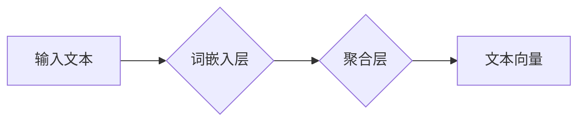

> 文本向量化，词嵌入，Word2Vec，GloVe，BERT，Transformer，自然语言处理，深度学习

## 1. 背景介绍

在当今数据爆炸的时代，文本数据已成为信息的主要来源。如何有效地处理和理解这些文本数据对于人工智能的发展至关重要。传统的文本处理方法通常依赖于手工设计的特征，但这些特征往往难以捕捉文本数据的复杂语义关系。

文本向量模型（Text Embedding Models）应运而生，它将文本映射到低维稠密的向量空间中，使得文本数据能够被机器学习算法更好地理解和处理。文本向量模型的出现，为自然语言处理（NLP）领域带来了革命性的变革，推动了机器翻译、文本分类、情感分析等众多应用的快速发展。

## 2. 核心概念与联系

文本向量模型的核心概念是将每个单词或句子映射到一个唯一的向量表示。这些向量不仅能够捕捉单词的语义信息，还能反映单词之间的语义关系。例如，"国王" 和 "皇后" 两个词语在语义上相关，因此它们在向量空间中的位置会比较接近。

**文本向量模型的架构**



**核心概念：**

* **词嵌入（Word Embedding）：** 将每个单词映射到一个低维向量空间中的过程。
* **聚合层（Aggregation Layer）：** 将多个词向量聚合在一起，得到句子或文档的向量表示。

## 3. 核心算法原理 & 具体操作步骤

### 3.1  算法原理概述

文本向量模型的训练主要基于无监督学习的原理，通过大量的文本数据，学习到单词之间的语义关系。常见的文本向量模型算法包括：

* **Word2Vec:** 由Google开发，通过训练神经网络预测上下文词，学习到单词的语义表示。
* **GloVe:** 由斯坦福大学开发，通过统计单词共现关系，学习到单词的语义表示。

### 3.2  算法步骤详解

**Word2Vec 算法步骤：**

1. **构建词袋模型（Bag-of-Words）：** 将文本数据分解成单词序列，每个单词作为独立的特征。
2. **训练神经网络：** 使用神经网络模型，预测上下文词。
3. **更新词向量：** 通过反向传播算法，更新每个单词的词向量。

**GloVe 算法步骤：**

1. **统计单词共现矩阵：** 计算每个单词对出现的频率。
2. **构建损失函数：** 使用最大似然估计，构建损失函数，衡量模型预测的单词共现关系与实际共现关系的差异。
3. **训练模型：** 使用梯度下降算法，最小化损失函数，更新每个单词的词向量。

### 3.3  算法优缺点

**Word2Vec:**

* **优点:** 能够学习到高质量的词向量，并能捕捉单词之间的语义关系。
* **缺点:** 训练时间较长，对大规模文本数据处理效率较低。

**GloVe:**

* **优点:** 训练时间较短，对大规模文本数据处理效率较高。
* **缺点:** 学习到的词向量质量可能不如 Word2Vec。

### 3.4  算法应用领域

文本向量模型在自然语言处理领域有着广泛的应用，例如：

* **机器翻译:** 将文本从一种语言翻译成另一种语言。
* **文本分类:** 将文本分类到不同的类别。
* **情感分析:** 分析文本表达的情感倾向。
* **问答系统:** 回答用户提出的问题。

## 4. 数学模型和公式 & 详细讲解 & 举例说明

### 4.1  数学模型构建

Word2Vec 算法的核心是利用神经网络模型预测上下文词。模型结构通常包括输入层、隐藏层和输出层。

* **输入层:** 接收单词的one-hot编码表示。
* **隐藏层:** 使用神经元进行非线性变换，学习单词的语义表示。
* **输出层:** 使用softmax函数将隐藏层的输出映射到所有上下文词的概率分布。

### 4.2  公式推导过程

Word2Vec 算法的目标是最大化上下文词的预测概率。可以使用交叉熵损失函数来衡量模型的预测结果与实际结果之间的差异。

$$
L = -\sum_{i=1}^{N} \log p(w_i | w_c)
$$

其中：

* $L$ 是损失函数。
* $N$ 是上下文词的数量。
* $w_i$ 是上下文词。
* $w_c$ 是中心词。
* $p(w_i | w_c)$ 是模型预测上下文词 $w_i$ 的概率。

### 4.3  案例分析与讲解

假设我们有一个句子 "The cat sat on the mat"，我们想要学习 "cat" 的词向量表示。

我们可以将 "cat" 作为中心词，将其上下文词设置为 "The"、"sat"、"on"、"the"、"mat"。然后，使用 Word2Vec 算法训练模型，学习到 "cat" 的词向量表示。

## 5. 项目实践：代码实例和详细解释说明

### 5.1  开发环境搭建

* Python 3.6+
* TensorFlow 或 PyTorch

### 5.2  源代码详细实现

```python
import tensorflow as tf

# 定义 Word2Vec 模型
class Word2Vec(tf.keras.Model):
    def __init__(self, embedding_dim, vocab_size):
        super(Word2Vec, self).__init__()
        self.embedding = tf.keras.layers.Embedding(vocab_size, embedding_dim)
        self.output = tf.keras.layers.Dense(vocab_size)

    def call(self, inputs):
        embeddings = self.embedding(inputs)
        outputs = self.output(embeddings)
        return outputs

# 训练 Word2Vec 模型
model = Word2Vec(embedding_dim=128, vocab_size=10000)
model.compile(optimizer='adam', loss='categorical_crossentropy')
model.fit(x_train, y_train, epochs=10)

```

### 5.3  代码解读与分析

* **模型定义:** 定义了一个 Word2Vec 模型，包含嵌入层和全连接层。
* **训练模型:** 使用 Adam 优化器和交叉熵损失函数训练模型。

### 5.4  运行结果展示

训练完成后，模型会学习到每个单词的词向量表示。我们可以使用这些词向量来进行各种 NLP 任务，例如：

* **相似度计算:** 计算两个单词之间的语义相似度。
* **词义消歧:** 根据上下文判断单词的含义。
* **文本聚类:** 将文本数据聚类到不同的主题。

## 6. 实际应用场景

文本向量模型在各个领域都有着广泛的应用，例如：

* **搜索引擎:** 使用文本向量模型来理解用户搜索意图，并返回更相关的搜索结果。
* **推荐系统:** 使用文本向量模型来推荐用户可能感兴趣的内容。
* **聊天机器人:** 使用文本向量模型来理解用户输入，并生成自然流畅的回复。

### 6.4  未来应用展望

随着深度学习技术的不断发展，文本向量模型的应用场景将会更加广泛。例如：

* **多模态理解:** 将文本向量模型与图像、音频等其他模态数据结合，实现多模态理解。
* **个性化推荐:** 使用用户行为数据训练个性化文本向量模型，提供更精准的推荐。
* **自动代码生成:** 使用文本向量模型来理解代码需求，并自动生成代码。

## 7. 工具和资源推荐

### 7.1  学习资源推荐

* **斯坦福大学 NLP课程:** https://web.stanford.edu/class/cs224n/
* **FastText 文档:** https://fasttext.cc/docs/en/index.html
* **Gensim 文档:** https://radimrehurek.com/gensim/

### 7.2  开发工具推荐

* **TensorFlow:** https://www.tensorflow.org/
* **PyTorch:** https://pytorch.org/
* **Gensim:** https://radimrehurek.com/gensim/

### 7.3  相关论文推荐

* **Word2Vec:** https://arxiv.org/abs/1301.3781
* **GloVe:** https://nlp.stanford.edu/projects/glove/
* **BERT:** https://arxiv.org/abs/1810.04805

## 8. 总结：未来发展趋势与挑战

### 8.1  研究成果总结

文本向量模型的发展取得了显著的成果，为自然语言处理领域带来了革命性的变革。

### 8.2  未来发展趋势

未来，文本向量模型的发展趋势包括：

* **更深层次的模型:** 使用更深层次的网络结构，学习到更复杂的语义关系。
* **多模态融合:** 将文本向量模型与其他模态数据结合，实现多模态理解。
* **个性化模型:** 使用用户行为数据训练个性化文本向量模型，提供更精准的推荐。

### 8.3  面临的挑战

文本向量模型也面临着一些挑战，例如：

* **数据稀疏性:** 许多单词只在少量文本中出现，导致词向量训练效果不佳。
* **语义歧义:** 同一个单词在不同的语境下可能具有不同的含义。
* **可解释性:** 文本向量模型的决策过程难以解释，这限制了其在一些应用场景中的使用。

### 8.4  研究展望

未来，研究人员将继续探索新的文本向量模型算法，并解决现有模型面临的挑战，以推动文本向量模型在更多领域得到应用。

## 9. 附录：常见问题与解答

**Q1: 文本向量模型的训练需要大量的数据吗？**

**A1:** 是的，文本向量模型的训练需要大量的文本数据才能学习到高质量的词向量表示。

**Q2: 文本向量模型的训练时间很长吗？**

**A2:** 文本向量模型的训练时间取决于模型的复杂度和数据的规模。对于大型模型和大型数据集，训练时间可能需要几天甚至几周。

**Q3: 文本向量模型的应用场景有哪些？**

**A3:** 文本向量模型在自然语言处理领域有着广泛的应用，例如机器翻译、文本分类、情感分析、问答系统等。


作者：禅与计算机程序设计艺术 / Zen and the Art of Computer Programming 
<end_of_turn>